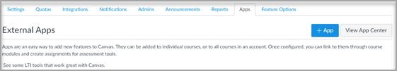

# Usar Microsoft Teams classes com Canvas

> [!IMPORTANT]
> Algumas informações estão relacionadas a produtos pré-lançados que podem ser substancialmente modificados antes de seu lançamento comercial. A Microsoft não faz garantias, expressas ou implícitas, quanto às informações fornecidas aqui.

Microsoft Teams é um aplicativo de interoperabilidade de ferramentas (LTI) do Learning que ajuda educadores e alunos a navegar facilmente entre seu Learning Management System (LMS) e Teams. Os usuários podem acessar suas equipes de classe associadas ao curso diretamente de dentro do LMS.

## Microsoft Office 365 Admin

Antes de gerenciar a integração do Microsoft Teams no Instructure Canvas, é importante que o aplicativo **microsoft-Teams-Sync-for-Canvas** do Canvas do Canvas seja aprovado pelo administrador do Microsoft Office 365 da sua instituição em seu locatário do Microsoft Azure antes de concluir a configuração do administrador do Canvas.

1. Entre no Canvas.
 
2. Selecione o link **Administrador** na navegação global e selecione sua conta.

3. Na navegação do administrador, selecione o link **Configurações** e, em seguida, a **guia** Integrações. 

4. Habilita Microsoft Teams Sincronização ativando a alternância.

   

5. Insira seu atributo de logon e nome de locatário da Microsoft. 

   O atributo login será usado para associar o usuário do Canvas a um Azure Active Directory usuário. 

6. Selecione **Atualizar Configurações** uma vez feito.

7. Para aprovar o acesso ao **aplicativo Microsoft-Teams-Sync-for-Canvas** do Canvas do Canvas, selecione o link Conceder acesso **ao** locatário. Você será redirecionado para o Ponto de Extremidade de Consentimento de Administrador da Plataforma de Identidade da Microsoft.

   

8. Selecione **Aceitar**.
 
## Administrador do Canvas

Configurar a integração Microsoft Teams LTI 1.3.

Como administrador do Canvas, você precisará adicionar o aplicativo LTI de classes Microsoft Teams no seu ambiente. Anote a ID do Cliente LTI para o aplicativo.

 - Microsoft Teams classes - 17000000000570

1. Configurações **do Administrador do** Access  >  **Aplicativos**.

2. Selecione **+ Aplicativo** para adicionar os aplicativos Teams LTI. 
 
   

3. Selecione **Por ID do Cliente para** o tipo de configuração.

   

4. Insira a ID do Cliente fornecida e selecione **Enviar**.
   
   Você notará o nome do aplicativo LTI Microsoft Teams classes para a ID do Cliente para confirmação. 

5. Selecione **Instalar**.

   O Microsoft Teams de classes LTI será adicionado à lista de aplicativos externos.
