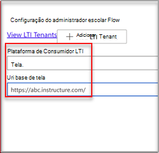

# Usar Microsoft OneDrive LTI com CanvasUse Microsoft OneDrive LTI with Canvas

> [!IMPORTANT]
> Algumas informações estão relacionadas a produtos pré-lançados que podem ser substancialmente modificados antes de seu lançamento comercial.Some information relates to prereleased product which may be substantially modified before it's commercially released. A Microsoft não faz garantias, expressas ou implícitas, quanto às informações fornecidas aqui.Microsoft makes no warranties, express or implied, with respect to the information provided here.

## Integrar-se ao CanvasIntegrate with Canvas

A pessoa que executa essa integração deve ser um administrador do Canvas e um administrador do Microsoft 365 locatário.The person who performs this integration should be an admin of Canvas and an admin of the Microsoft 365 tenant.

1. Entre no portal Microsoft Azure com a conta de administrador do locatário.Sign in to the Microsoft Azure portal with the tenant admin account. O administrador de locatários do Azure também deve ter a função de administrador de grupo.The Azure tenant administrator should also have the Group administrator role.

    

2. Entre no portal do Microsoft [OneDrive LTI](https://odltiappnl.azurewebsites.net/admin).Sign in to the Microsoft [OneDrive LTI portal](https://odltiappnl.azurewebsites.net/admin).

3. Aceite as permissões para concluir a assinatura.Accept the permissions to complete the sign-in.

    

4. Selecione **Adicionar Locatário LTI**.Select **Add LTI Tenant**.

     

5. Selecione **Plataforma de Consumidor LTI** como **Canvas** no menu suspenso.Select **LTI Consumer Platform** as **Canvas** from the dropdown.

6. Selecione **URL da Base de Tela** e selecione **Next**.Select **Canvas Base URL** and then select **Next**.

    

   A próxima tela mostra campos que são confidenciais para você.The next screen shows fields that are confidential to you.

7. Selecione **Próximo** em ??Select **Next** from ?? page.page. OS REVISADORES PODEM PREENCHER O ESPAÇO EM BRANCO AQUI?CAN REVIEWERS FILL IN THE BLANK HERE?

8. Selecione **Next** na tela que mostra informações confidenciais para você.Select **Next** in the screen that shows information that's confidential to you.

   A tela final do portal do Azure mostra as próximas etapas para adicionar sua instância do Canvas.The final screen of the Azure portal shows the next steps for adding your Canvas instance.

9. Copie as Chaves do Desenvolvedor desta tela.Copy the Developer Keys from this screen. Você usará ao criar a instância canvas.You'll use when you create the Canvas instance.

## Adicionar a instância do CanvasAdd the Canvas instance

1. Em sua instância do Canvas, desmarque **As Chaves** do Desenvolvedor de  >  **Administrador.**In your Canvas instance, deselect **Admin** > **Developer Keys**.

2. Escolha **LTI Key** no menu suspenso em **Chave do Desenvolvedor.**Choose **LTI Key** in the dropdown on **Developer Key**.

   

3. Colar as chaves do desenvolvedor aqui.Paste the developer keys here.

     

   A chave é criada no **modo** OFFThe key gets created in **OFF** mode

   

4. Copie o texto realçado.Copy the highlighted text.
    Isso serve como ID do Cliente no Microsoft OneDrive lti portal.This serves as Client ID in Microsoft OneDrive LTI portal.

5. Colar o texto no campo **ID do** Cliente Microsoft OneDrive portal LTI e selecione **Next**.Paste the text into the **Client ID** field in Microsoft OneDrive LTI portal, and then select **Next**.

6. Selecione **Salvar**.Select **Save**.

7. Exibir as configurações selecionando **Exibir Locatários LTI**.View the settings by selecting **View LTI Tenants**.
