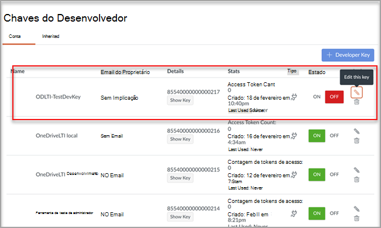

# Usar o Microsoft OneDrive com seu Sistema de Gerenciamento de AprendizagemUse Microsoft OneDrive with your Learning Management System

> [!IMPORTANT]
> Algumas informações estão relacionadas a produtos pré-lançados que podem ser substancialmente modificados antes de seu lançamento comercial.Some information relates to prereleased product which may be substantially modified before it's commercially released. A Microsoft não faz garantias, expressas ou implícitas, quanto às informações fornecidas aqui.Microsoft makes no warranties, express or implied, with respect to the information provided here.

Saiba os benefícios de usar o Microsoft OneDrive com seu Sistema de Gerenciamento de Aprendizagem (LMS).Learn the benefits of using Microsoft OneDrive with your Learning Management System (LMS).

**Traz Microsoft Office 365 diretamente para seus fluxos de trabalho****Brings Microsoft Office 365 directly into your workflows**

O aplicativo Microsoft OneDrive Learning Tools Interoperability (LTI) integra-se com seu LMS para trazer o Microsoft OneDrive e o Microsoft Office 365 diretamente para seus fluxos de trabalho mais importantes que incluem:The Microsoft OneDrive Learning Tools Interoperability (LTI) App integrates with your LMS to bring Microsoft OneDrive and Microsoft Office 365 directly into your most important workflows that include:

- Anexando recursos e organizando conteúdo.Attaching resources and organizing content.
- Iniciando documentos colaborativos.Starting collaborative documents.
- Criação e classificação de atribuições.Creating and grading assignments.

**Seguro e totalmente em conformidade com os padrões LTI mais recentes****Secure and fully compliant with latest LTI standards**

O Microsoft OneDrive LTI App é compatível com LTI 1.3 e LTI Advantage.The Microsoft OneDrive LTI App is compatible with LTI 1.3 and LTI Advantage. Essa vantagem permite uma experiência de usuário altamente segura e integrada.This advantage allows for a highly secure and tightly integrated user experience.

**Experiência do usuário moderna e rica****Modern and Rich User Experience**

O Aplicativo LTI do Microsoft OneDrive traz o melhor da Microsoft para sua experiência LMS.The Microsoft OneDrive LTI App brings the best of Microsoft right into your LMS experience. Estamos melhorando a integração existente do Office 365 em seu LMS, fornecendo uma experiência de usuário mais moderna, completa com um selador de arquivos do Microsoft OneDrive novo e expandido e experiências de edição mais ricas para arquivos do Office.We're improving upon the existing Office 365 integration in your LMS by delivering a more modern user experience, complete with a new and expanded Microsoft OneDrive file picker and richer editing experiences for Office files. A Microsoft também será totalmente a propriedade do Microsoft OneDrive LTI App daqui para frente, o que significa que você sempre receberá o mais recente e o melhor da Microsoft automaticamente.Microsoft will also fully own the Microsoft OneDrive LTI App going forward, which means you’ll always get the latest and greatest from Microsoft automatically.

O Aplicativo LTI do Microsoft OneDrive permite que você:The Microsoft OneDrive LTI App allows you to:

- Anexe arquivos do Office 365, incluindo documentos do Word, apresentações do PowerPoint e o Excel do Editor de Conteúdo Avançado.Attach Office 365 files including Word documents, PowerPoint presentations, and Excel from the Rich Content Editor.

- Distribuir atribuições de nuvem do Office 365.Distribute Office 365 cloud assignments.

- Exibir e organizar seus arquivos pessoais e claros do Microsoft OneDrive.View and organize your personal and course Microsoft OneDrive files.

- Crie colaborações nas quais os membros do curso possam trabalhar juntos em documentos compartilhados em tempo real.Create collaborations where course members can work together on shared documents in real time.

- Acesse várias contas do Microsoft OneDrive, incluindo contas pessoais e de estudante.Access multiple Microsoft OneDrive accounts, including personal and school accounts.

- Integre arquivos do Office 365 aos módulos do curso.Integrate Office 365 files with your course modules.

- Use sua conta da Microsoft para fazer o login único com seu LMS.Use your Microsoft account for single sign-on with your LMS.

## Integrar-se ao CanvasIntegrate with Canvas

A pessoa que realiza essa integração deve ser um administrador do Canvas e um administrador do locatário do Microsoft 365.The person who performs this integration should be an admin of Canvas and an admin of the Microsoft 365 tenant.

1. Entre no portal do Microsoft Azure com a conta de administrador do locatário.Sign in to the Microsoft Azure portal with the tenant admin account. O administrador de locatários do Azure também deve ter a função de administrador de grupo.The Azure tenant administrator should also have the Group administrator role.

    

2. Entre no portal do Microsoft [OneDrive LTI](https://odltiappnl.azurewebsites.net/admin).Sign in to the Microsoft [OneDrive LTI portal](https://odltiappnl.azurewebsites.net/admin).

3. Aceite as permissões para concluir a assinatura.Accept the permissions to complete the sign-in.

    

4. Selecione **Adicionar Locatário LTI**.Select **Add LTI Tenant**.

     

5. Selecione **Plataforma de Consumidor LTI** como **Canvas** no menu suspenso.Select **LTI Consumer Platform** as **Canvas** from the dropdown.

6. Selecione **URL da Base de Tela** e selecione **Next**.Select **Canvas Base URL** and then select **Next**.

    

   A próxima tela mostra campos que são confidenciais para você.The next screen shows fields that are confidential to you.

7. Selecione **Próximo** em ??Select **Next** from ?? page.page. OS REVISADORES PODEM PREENCHER O ESPAÇO EM BRANCO AQUI?CAN REVIEWERS FILL IN THE BLANK HERE?

8. Selecione **Next** na tela que mostra informações confidenciais para você.Select **Next** in the screen that shows information that's confidential to you.

   A tela final do portal do Azure mostra as próximas etapas para adicionar sua instância do Canvas.The final screen of the Azure portal shows the next steps for adding your Canvas instance.

9. Copie as Chaves do Desenvolvedor desta tela.Copy the Developer Keys from this screen. Você usará ao criar a instância canvas.You'll use when you create the Canvas instance.

## Adicionar a instância do CanvasAdd the Canvas instance

1. Em sua instância do Canvas, desmarque **As Chaves** do Desenvolvedor de  >  **Administrador.**In your Canvas instance, deselect **Admin** > **Developer Keys**.

2. Escolha **LTI Key** no menu suspenso em **Chave do Desenvolvedor.**Choose **LTI Key** in the dropdown on **Developer Key**.

   

3. Colar as chaves do desenvolvedor aqui.Paste the developer keys here.

     

   A chave é criada no **modo** OFFThe key gets created in **OFF** mode

   

4. Copie o texto realçado.Copy the highlighted text.
    Isso serve como ID do Cliente no portal LTI do Microsoft OneDrive.This serves as Client ID in Microsoft OneDrive LTI portal.

5. Colar o texto no campo **ID do** Cliente no portal LTI do Microsoft OneDrive e selecione **Next**.Paste the text into the **Client ID** field in Microsoft OneDrive LTI portal, and then select **Next**.

6. Selecione **Salvar**.Select **Save**.

7. Exibir as configurações selecionando **Exibir Locatários LTI**.View the settings by selecting **View LTI Tenants**.
