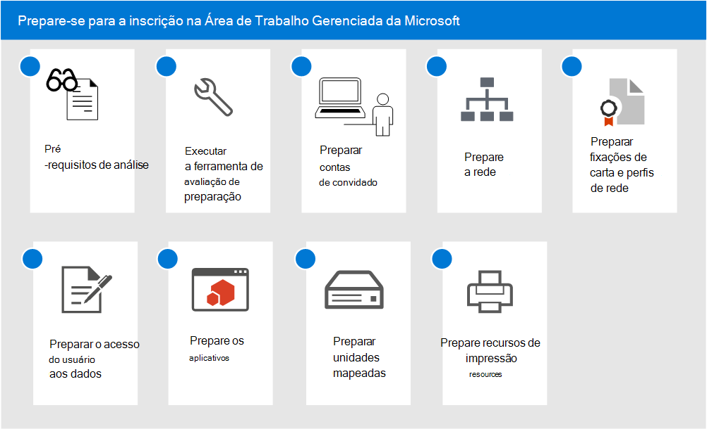

# Prepare-se para a inscrição na Área de Trabalho Gerenciada da Microsoft

Esses tópicos descrevem as etapas necessárias para a sua organização se preparar para o registro, incluindo a verificação de que seu ambiente atende aos principais pré-requisitos, configuração de redes, configuração de certificados e a preparação de aplicativos para inclusão no serviço. Depois de executar as ferramentas de avaliação de preparação, você pode concluir as outras etapas em qualquer ordem ou em paralelo. Dependendo do ambiente, algumas etapas podem não ser relevantes para você.

1. Revise [pré-requisitos da Área de Trabalho Gerenciada da Microsoft](prerequisites.md).
2. Use [de avaliação de preparação](readiness-assessment-tool.md).
3. [Pré-requisitos para contas de convidado](guest-accounts.md)
4. [Configuração de rede na Área de Trabalho Gerenciada da Microsoft](network.md)
5. [Preparar certificados e perfis de rede da Área de Trabalho Gerenciada da Microsoft](certs-wifi-lan.md)
6. [Preparar o acesso aos recursos locais da Área de Trabalho Gerenciada da Microsoft](authentication.md)
7. [Aplicativos na Área de Trabalho Gerenciada da Microsoft](apps.md)
8. [Preparar unidades mapeadas da Área de Trabalho Gerenciada da Microsoft](mapped-drives.md)
9. [Preparar recursos de impressão da Área de Trabalho Gerenciada da Microsoft](printing.md)
