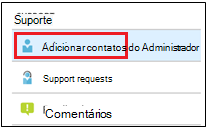
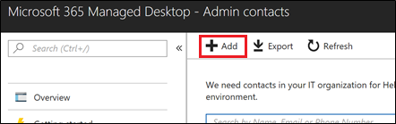

# Adicione e verifique contatos do administrador no portal do Administrador

Há várias maneiras de o serviço da Área de Trabalho Gerenciada da Microsoft se comunicar com os clientes. Para simplificar a comunicação e garantir que estamos verificando com as pessoas certas, você precisa fornecer um conjunto de contatos de administrador. As Operações de IT da Área de Trabalho Gerenciada da Microsoft entrarão em contato com essas pessoas para problemas de solução de problemas de assistência para seu locatário.

> [!IMPORTANT]
> Você pode já ter adicionado esses contatos no portal de administração. Em caso afirmado, verifique se a lista de contatos está  precisa, pois a Área de Trabalho Gerenciada da Microsoft deve ser capaz de alcançá-los se ocorrer um incidente grave.

## Acesso do Azure Active Directory para o portal de Administração da Área de Trabalho Gerenciada da Microsoft

O portal de Administração da Área de Trabalho Gerenciada da Microsoft exige que as pessoas que acessam o portal tenham uma dessas funções do Azure Active Directory (AD):
- Administrador Global
- Administrador de Serviço do Intune
- Leitor Global
- Administrador de Suporte ao Serviço

O Administrador Global deve ser o único a registrar sua organização na Área de Trabalho Gerenciada da Microsoft. Todas as cinco funções têm o mesmo acesso no portal administrador para iniciar e exibir tarefas. Para obter mais informações sobre como atribuir essas funções no Azure AD, consulte Permissões de função de administrador [no Azure Active Directory](/azure/active-directory/users-groups-roles/directory-assign-admin-roles). 

## Áreas de foco de contato do administrador

Os contatos do administrador devem ser a melhor pessoa ou grupo que pode responder a perguntas e tomar decisões para diferentes áreas de foco. **As Operações de Área de Trabalho Gerenciada da Microsoft entrarão em contato com esses contatos do Administrador para perguntas envolvendo solicitações de suporte arquivadas pelo cliente.** Esses contatos do Administrador receberão notificações para atualizações de solicitação de suporte e novas mensagens. Essas áreas incluem:

Área de foco | Para perguntas sobre
--- | ---
Empacotamento de aplicativos | Solução de problemas de empacotamento de aplicativos
Dispositivos | Saúde do dispositivo, solução de problemas com dispositivos da Área de Trabalho Gerenciada da Microsoft
Segurança | Solução de problemas de segurança com dispositivos da Área de Trabalho Gerenciada da Microsoft
Help Desk de IT | nos casos em que nossa equipe de Suporte entrega tíquetes de usuário fora das áreas de suporte da Área de Trabalho Gerenciada da Microsoft 
Outros | Para problemas não abordados por outras áreas

**Quem você escolher para esses contatos precisa ter o conhecimento e a autoridade para tomar decisões para seu ambiente de Área de Trabalho Gerenciada da Microsoft.** Quando você integra seu ambiente de Área de Trabalho Gerenciada da Microsoft, você é solicitado a adicionar contatos para seu Helpdesk e Security local. 

Os contatos do administrador são necessários ao [enviar uma solicitação de Suporte.](../service-description/support.md) Você precisará ter um contato de administrador para a área de foco da solicitação de Suporte. 

**Para adicionar contatos de administrador**

1.  Entre no portal de [administração da Área de Trabalho Gerenciada da Microsoft](https://aka.ms/mwaasportal). 

2.  Em **Suporte,** selecione **Contatos de administrador.** 

    

3. Selecione **Adicionar**.

    

4.  Selecione uma **Área de foco** e insira as informações do contato. 

    

5. Repita para cada área de foco. 

## Etapas para começar com a Área de Trabalho Gerenciada da Microsoft

1. Adicionar e verificar contatos de administrador no portal de administração (este tópico)
2. [Ajustar o acesso condicional](conditional-access.md)
3. [Atribuir licenças](assign-licenses.md)
4. [Instalar o Portal da Empresa do Intune em dispositivos](company-portal.md)
5. [Habilitar Enterprise State Roaming](enterprise-state-roaming.md)
6. [Configurar dispositivos de Área de Trabalho Gerenciada da Microsoft](set-up-devices.md)
7. [Preparar usuários para o uso dos dispositivos](get-started-devices.md)
8. [Implantar aplicativos em dispositivos](deploy-apps.md)