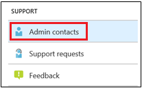

# Adicione e verifique contatos do administrador no portal do AdministradorAdd and verify admin contacts in the Admin portal

Há várias maneiras de o serviço da Área de Trabalho Gerenciada da Microsoft se comunicar com os clientes.There are several ways that Microsoft Managed Desktop service communicates with customers. Para simplificar a comunicação e garantir que estamos verificando com as pessoas certas, você precisa fornecer um conjunto de contatos de administrador.To streamline communication and ensure we’re checking with the right people, you need to provide a set of admin contacts. As Operações de IT da Área de Trabalho Gerenciada da Microsoft entrarão em contato com essas pessoas para problemas de solução de problemas de assistência para seu locatário.Microsoft Managed Desktop IT Operations will contact these people for assistance troubleshooting issues for your tenant.

> [!IMPORTANT]
> Você pode já ter adicionado esses contatos no portal de administração.You might have already added these contacts in the Admin portal. Em caso afirmado, verifique se a lista de contatos está  precisa, pois a Área de Trabalho Gerenciada da Microsoft deve ser capaz de alcançá-los se ocorrer um incidente grave.If so, take a moment now to double-check that the contact list is accurate, since Microsoft Managed Desktop **must** be able to reach them if a severe incident occurs.

## Acesso do Azure Active Directory para o portal de Administração da Área de Trabalho Gerenciada da MicrosoftAzure Active Directory access for Microsoft Managed Desktop Admin portal

O portal de Administração da Área de Trabalho Gerenciada da Microsoft exige que as pessoas que acessam o portal tenham uma dessas funções do Azure Active Directory (AD):Microsoft Managed Desktop Admin portal requires that people accessing the portal have one of these Azure Active Directory (AD) roles:
- Administrador GlobalGlobal Administrator
- Administrador de Serviço do IntuneIntune Service Administrator
- Leitor GlobalGlobal Reader
- Administrador de Suporte ao ServiçoService Support Administrator

O Administrador Global deve ser o único a registrar sua organização na Área de Trabalho Gerenciada da Microsoft.The Global Administrator must be the one to enroll your organization in Microsoft Managed Desktop. Todas as cinco funções têm o mesmo acesso no portal administrador para iniciar e exibir tarefas.All five roles have the same access within the Admin portal to initiate and view tasks. Para obter mais informações sobre como atribuir essas funções no Azure AD, consulte Permissões de função de administrador [no Azure Active Directory](/azure/active-directory/users-groups-roles/directory-assign-admin-roles).For more information on assigning these roles in Azure AD, see [Administrator role permissions in Azure Active Directory](/azure/active-directory/users-groups-roles/directory-assign-admin-roles). 

## Áreas de foco de contato do administradorAdmin contact areas of focus

Os contatos do administrador devem ser a melhor pessoa ou grupo que pode responder a perguntas e tomar decisões para diferentes áreas de foco.Admin contacts should be the best person or group that can answer questions and make decisions for different areas of focus. **As Operações de Área de Trabalho Gerenciada da Microsoft entrarão em contato com esses contatos do Administrador para perguntas envolvendo solicitações de suporte arquivadas pelo cliente.****Microsoft Managed Desktop Operations will contact these Admin contacts for questions involving support requests filed by the customer.** Esses contatos do Administrador receberão notificações para atualizações de solicitação de suporte e novas mensagens.These Admin contacts will receive notifications for support request updates and new messages. Essas áreas incluem:These areas include:

Área de focoArea of focus | Para perguntas sobreFor questions about
--- | ---
Empacotamento de aplicativosApp packaging | Solução de problemas de empacotamento de aplicativosTroubleshooting app packaging
DispositivosDevices | Saúde do dispositivo, solução de problemas com dispositivos da Área de Trabalho Gerenciada da MicrosoftDevice health, troubleshooting with Microsoft Managed Desktop devices
SegurançaSecurity | Solução de problemas de segurança com dispositivos da Área de Trabalho Gerenciada da MicrosoftTroubleshooting security issues with Microsoft Managed Desktop devices
Help Desk de ITIT help desk | nos casos em que nossa equipe de Suporte entrega tíquetes de usuário fora das áreas de suporte da Área de Trabalho Gerenciada da Microsoftin cases where our Support staff hands over user tickets outside of Microsoft Managed Desktop support areas 
OutrosOther | Para problemas não abordados por outras áreasFor issues not covered by other areas

**Quem você escolher para esses contatos precisa ter o conhecimento e a autoridade para tomar decisões para seu ambiente de Área de Trabalho Gerenciada da Microsoft.****Whoever you choose for these contacts needs to have the knowledge and authority to make decisions for your Microsoft Managed Desktop environment.** Quando você integra seu ambiente de Área de Trabalho Gerenciada da Microsoft, você é solicitado a adicionar contatos para seu Helpdesk e Security local.When you onboard your Microsoft Managed Desktop environment, you’re prompted to add contacts for your local Helpdesk and Security. 

Os contatos do administrador são necessários ao [enviar uma solicitação de Suporte.](../service-description/support.md)Admin contacts are required when you [submit a Support request](../service-description/support.md). Você precisará ter um contato de administrador para a área de foco da solicitação de Suporte.You’ll need to have an admin contact for the focus area of the Support request. 

**Para adicionar contatos de administrador****To add admin contacts**

1.  Entre no portal de [administração da Área de Trabalho Gerenciada da Microsoft](https://aka.ms/mwaasportal).Sign in to [Microsoft Managed Desktop admin portal](https://aka.ms/mwaasportal). 

2.  Em **Suporte,** selecione **Contatos de administrador.**Under **Support**, select **Admin contacts**. 

    

3. Selecione **Adicionar**.Select **Add**.

    

4.  Selecione uma **Área de foco** e insira as informações do contato.Select an **Area of focus** and enter the info for the contact. 

    

5. Repita para cada área de foco.Repeat for each area of focus. 

## Etapas para começar com a Área de Trabalho Gerenciada da MicrosoftSteps to get started with Microsoft Managed Desktop

1. Adicionar e verificar contatos de administrador no portal de administração (este tópico)Add and verify admin contacts in the Admin portal (this topic)
2. [Ajustar o acesso condicionalAdjust conditional access](conditional-access.md)
3. [Atribuir licençasAssign licenses](assign-licenses.md)
4. [Instalar o Portal da Empresa do Intune em dispositivosInstall Intune Company Portal on on devices](company-portal.md)
5. [Habilitar Enterprise State RoamingEnable Enterprise State Roaming](enterprise-state-roaming.md)
6. [Configurar dispositivos de Área de Trabalho Gerenciada da MicrosoftSet up Microsoft Managed Desktop devices](set-up-devices.md)
7. [Preparar usuários para o uso dos dispositivosGet your users ready to use devices](get-started-devices.md)
8. [Implantar aplicativos em dispositivosDeploy apps to devices](deploy-apps.md)