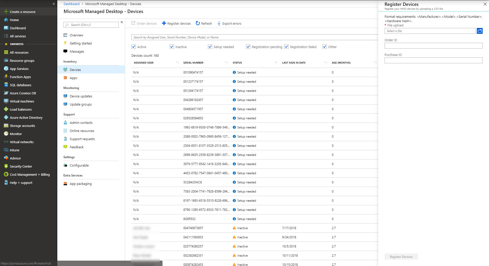

# <a name="register-new-devices-yourself"></a><span data-ttu-id="5b9af-103">Registrar novos dispositivos sozinho</span><span class="sxs-lookup"><span data-stu-id="5b9af-103">Register new devices yourself</span></span>

<span data-ttu-id="5b9af-104">A área de trabalho gerenciada da Microsoft pode funcionar com dispositivos novos ou você pode reutilizar os dispositivos que você já tem (o que exigirá que você os Insira novamente).</span><span class="sxs-lookup"><span data-stu-id="5b9af-104">Microsoft Managed Desktop can work with brand-new devices or you can re-use devices you might already have (which will require that you re-image them).</span></span> <span data-ttu-id="5b9af-105">Você pode registrar dispositivos usando a área de trabalho gerenciada da Microsoft no portal do Azure.</span><span class="sxs-lookup"><span data-stu-id="5b9af-105">You can register devices by using Microsoft Managed Desktop on the Azure Portal.</span></span>

> [!NOTE]
> <span data-ttu-id="5b9af-106">Trabalhar com um parceiro para obter dispositivos?</span><span class="sxs-lookup"><span data-stu-id="5b9af-106">Working with a partner to obtain devices?</span></span> <span data-ttu-id="5b9af-107">Em caso afirmativo, você não precisa se preocupar em obter os hashes de hardware; Eles cuidarão disso para você.</span><span class="sxs-lookup"><span data-stu-id="5b9af-107">If so, you don't need to worry about getting the hardware hashes; they'll take care of that for you.</span></span> <span data-ttu-id="5b9af-108">Certifique-se de que seu parceiro estabelece uma relação com você no [Partner Center](https://partner.microsoft.com/dashboard) e que inclui privilégios de administração delegada para o Active Directory do Azure e o Office 365.</span><span class="sxs-lookup"><span data-stu-id="5b9af-108">Make sure your partner establishes a relationship with you at the [Partner Center](https://partner.microsoft.com/dashboard) and that they include delegated administration privileges for Azure Active Directory and Office 365.</span></span> <span data-ttu-id="5b9af-109">Seu parceiro pode saber mais na [ajuda da central de parceiros](https://docs.microsoft.com/partner-center/request-a-relationship-with-a-customer).</span><span class="sxs-lookup"><span data-stu-id="5b9af-109">Your partner can learn more at [Partner Center help](https://docs.microsoft.com/partner-center/request-a-relationship-with-a-customer).</span></span> <span data-ttu-id="5b9af-110">Depois que esse relacionamento for estabelecido, o seu parceiro simplesmente registrará dispositivos em seu nome, e nenhuma ação será necessária.</span><span class="sxs-lookup"><span data-stu-id="5b9af-110">Once this relationship established, your partner will simply register devices on your behalf – no further action required from you.</span></span> <span data-ttu-id="5b9af-111">Se você quiser ver os detalhes ou se o seu parceiro tiver dúvidas, confira [as etapas dos parceiros para registrar dispositivos](register-devices-partner.md).</span><span class="sxs-lookup"><span data-stu-id="5b9af-111">If you want to see the details, or your partner has questions, see [Steps for Partners to register devices](register-devices-partner.md).</span></span> <span data-ttu-id="5b9af-112">Depois que os dispositivos são registrados, você pode prosseguir com [a verificação da imagem](#check-the-image) e de [fornecer os dispositivos](#deliver-the-device) aos seus usuários.</span><span class="sxs-lookup"><span data-stu-id="5b9af-112">Once the devices are registered, you can proceed with [checking the image](#check-the-image) and [delivering the devices](#deliver-the-device) to your users.</span></span>

## <a name="prepare-to-register-brand-new-devices"></a><span data-ttu-id="5b9af-113">Preparar-se para registrar dispositivos novos</span><span class="sxs-lookup"><span data-stu-id="5b9af-113">Prepare to register brand-new devices</span></span>


<span data-ttu-id="5b9af-114">Após ter os novos dispositivos em mãos, siga estas etapas:</span><span class="sxs-lookup"><span data-stu-id="5b9af-114">Once you have the new devices in hand, you'll follow these steps:</span></span>

1. [<span data-ttu-id="5b9af-115">Obtenha o hash de hardware para cada dispositivo.</span><span class="sxs-lookup"><span data-stu-id="5b9af-115">Obtain the hardware hash for each device.</span></span>](#obtain-the-hardware-hash)
2. [<span data-ttu-id="5b9af-116">Mesclar os dados de hash</span><span class="sxs-lookup"><span data-stu-id="5b9af-116">Merge the hash data</span></span>](#merge-hash-data)
3. <span data-ttu-id="5b9af-117">[Registre os dispositivos na área de trabalho gerenciada da Microsoft](#register-devices).</span><span class="sxs-lookup"><span data-stu-id="5b9af-117">[Register the devices in Microsoft Managed Desktop](#register-devices).</span></span>
4. [<span data-ttu-id="5b9af-118">Verifique se a imagem está correta.</span><span class="sxs-lookup"><span data-stu-id="5b9af-118">Double-check that the image is correct.</span></span>](#check-the-image)
5. [<span data-ttu-id="5b9af-119">Entregar o dispositivo</span><span class="sxs-lookup"><span data-stu-id="5b9af-119">Deliver the device</span></span>](#deliver-the-device)

### <a name="obtain-the-hardware-hash"></a><span data-ttu-id="5b9af-120">Obter o hash de hardware</span><span class="sxs-lookup"><span data-stu-id="5b9af-120">Obtain the hardware hash</span></span>

<span data-ttu-id="5b9af-121">A área de trabalho gerenciada da Microsoft identifica cada dispositivo exclusivamente fazendo referência a seu hash de hardware.</span><span class="sxs-lookup"><span data-stu-id="5b9af-121">Microsoft Managed Desktop identifies each device uniquely by referencing its hardware hash.</span></span> <span data-ttu-id="5b9af-122">Você tem três opções para obter essas informações:</span><span class="sxs-lookup"><span data-stu-id="5b9af-122">You have three options for getting this information:</span></span>

- <span data-ttu-id="5b9af-123">Pergunte ao seu fornecedor de OEM o arquivo de registro do piloto automático, que inclui os hashes de hardware.</span><span class="sxs-lookup"><span data-stu-id="5b9af-123">Ask your OEM supplier for the AutoPilot registration file, which will include the hardware hashes.</span></span>
- <span data-ttu-id="5b9af-124">Executar um [script do Windows PowerShell](#powershell-script-method) em cada dispositivo e coletar os resultados em um arquivo.</span><span class="sxs-lookup"><span data-stu-id="5b9af-124">Run a [Windows PowerShell script](#powershell-script-method) on each device and collect the results in a file.</span></span>
- <span data-ttu-id="5b9af-125">Inicie cada dispositivo, mas não conclua a experiência de instalação do Windows, e [colete os hashes em uma unidade flash removível](#flash-drive-method).</span><span class="sxs-lookup"><span data-stu-id="5b9af-125">Start each device--but don't complete the Windows setup experience--and [collect the hashes on a removable flash drive](#flash-drive-method).</span></span>

#### <a name="powershell-script-method"></a><span data-ttu-id="5b9af-126">Método de script do PowerShell</span><span class="sxs-lookup"><span data-stu-id="5b9af-126">PowerShell script method</span></span>

1.  <span data-ttu-id="5b9af-127">Abra um prompt do PowerShell com direitos administrativos.</span><span class="sxs-lookup"><span data-stu-id="5b9af-127">Open a PowerShell prompt with administrative rights.</span></span>
2.  <span data-ttu-id="5b9af-128">Sejam`Install-Script -Name Get-MMDRegistrationInfo`</span><span class="sxs-lookup"><span data-stu-id="5b9af-128">Run `Install-Script -Name Get-MMDRegistrationInfo`</span></span>
3.  <span data-ttu-id="5b9af-129">Sejam`powershell -ExecutionPolicy Unrestricted Get-MMDRegistrationInfo -OutputFile <path>\hardwarehash.csv`</span><span class="sxs-lookup"><span data-stu-id="5b9af-129">Run `powershell -ExecutionPolicy Unrestricted Get-MMDRegistrationInfo -OutputFile <path>\hardwarehash.csv`</span></span>

#### <a name="flash-drive-method"></a><span data-ttu-id="5b9af-130">Método de unidade flash</span><span class="sxs-lookup"><span data-stu-id="5b9af-130">Flash drive method</span></span>

1. <span data-ttu-id="5b9af-131">Em um dispositivo diferente daquele que você está registrando, insira uma unidade USB.</span><span class="sxs-lookup"><span data-stu-id="5b9af-131">On a device other than the one you're registering, insert a USB drive.</span></span>
2. <span data-ttu-id="5b9af-132">Abra um prompt do PowerShell com direitos administrativos.</span><span class="sxs-lookup"><span data-stu-id="5b9af-132">Open a PowerShell prompt with administrative rights.</span></span>
3. <span data-ttu-id="5b9af-133">Sejam`Save-Script -Name Get-MMDRegistrationInfo -Path <pathToUsb>`</span><span class="sxs-lookup"><span data-stu-id="5b9af-133">Run `Save-Script -Name Get-MMDRegistrationInfo -Path <pathToUsb>`</span></span>
4. <span data-ttu-id="5b9af-134">Ative o dispositivo que você está registrando, mas *não inicie a experiência de instalação*.</span><span class="sxs-lookup"><span data-stu-id="5b9af-134">Turn on the device you are registering, but *do not start the setup experience*.</span></span> <span data-ttu-id="5b9af-135">Se você iniciar acidentalmente a experiência de instalação, será necessário redefinir ou recriar a imagem do dispositivo.</span><span class="sxs-lookup"><span data-stu-id="5b9af-135">If you accidentally start the setup experience, you'll have to reset or reimage the device.</span></span>
5. <span data-ttu-id="5b9af-136">Insira a unidade USB e, em seguida, pressione SHIFT + F10.</span><span class="sxs-lookup"><span data-stu-id="5b9af-136">Insert the USB drive, and then press SHIFT + F10.</span></span>
6. <span data-ttu-id="5b9af-137">Abra um prompt do PowerShell com direitos administrativos e, em `cd <pathToUsb>`seguida, execute.</span><span class="sxs-lookup"><span data-stu-id="5b9af-137">Open a PowerShell prompt with administrative rights, and then run `cd <pathToUsb>`.</span></span>
7. <span data-ttu-id="5b9af-138">Sejam`Set-ExecutionPolicy -ExecutionPolicy Unrestricted`</span><span class="sxs-lookup"><span data-stu-id="5b9af-138">Run `Set-ExecutionPolicy -ExecutionPolicy Unrestricted`</span></span>
8. <span data-ttu-id="5b9af-139">Sejam`.\Get-MMDRegistrationInfo -OutputFile <path>\hardwarehash.csv`</span><span class="sxs-lookup"><span data-stu-id="5b9af-139">Run `.\Get-MMDRegistrationInfo -OutputFile <path>\hardwarehash.csv`</span></span>
9. <span data-ttu-id="5b9af-140">Remova a unidade USB e desligue o dispositivo executando`shutdown -s -t 0`</span><span class="sxs-lookup"><span data-stu-id="5b9af-140">Remove the USB drive, and then shut down the device by running `shutdown -s -t 0`</span></span>

>[!IMPORTANT]
><span data-ttu-id="5b9af-141">Não ligue o dispositivo que você está registrando novamente até concluir o registro.</span><span class="sxs-lookup"><span data-stu-id="5b9af-141">Do not power on the device you are registering again until you've completed registration for it.</span></span> 


### <a name="merge-hash-data"></a><span data-ttu-id="5b9af-142">Mesclar dados de hash</span><span class="sxs-lookup"><span data-stu-id="5b9af-142">Merge hash data</span></span>

<span data-ttu-id="5b9af-143">Você precisará ter os dados nos arquivos CSV combinados em um único arquivo para concluir o registro.</span><span class="sxs-lookup"><span data-stu-id="5b9af-143">You'll need to have the data in the CSV files combined into a single file to complete registration.</span></span> <span data-ttu-id="5b9af-144">Veja um exemplo de script do PowerShell para facilitar:</span><span class="sxs-lookup"><span data-stu-id="5b9af-144">Here's a sample PowerShell script to make this easy:</span></span>

`Import-CSV -Path (Get-ChildItem -Filter *.csv) | ConvertTo-Csv -NoTypeInformation | % {$_.Replace('"', '')} | Out-File .\aggregatedDevices.csv`

### <a name="register-devices"></a><span data-ttu-id="5b9af-145">Registrar dispositivos</span><span class="sxs-lookup"><span data-stu-id="5b9af-145">Register devices</span></span>

<span data-ttu-id="5b9af-146">O arquivo CSV deve estar em um formato específico para o registro.</span><span class="sxs-lookup"><span data-stu-id="5b9af-146">The CSV file must be in a particular format for registration.</span></span> <span data-ttu-id="5b9af-147">Se você coletou os dados nas etapas anteriores, o arquivo já deve estar no formato correto; Se você obtiver o arquivo de um fornecedor, talvez seja necessário ajustar o formato.</span><span class="sxs-lookup"><span data-stu-id="5b9af-147">If you collected the data yourself in the previous steps, the file should already be in the right format; if you obtain the file from a supplier, you might need to adjust the format.</span></span>

>[!NOTE]
><span data-ttu-id="5b9af-148">Para sua conveniência, é possível baixar um [modelo](https://github.com/MicrosoftDocs/microsoft-365-docs/raw/public/microsoft-365/managed-desktop/get-started/downloads/device-registration-sample-partner.xlsx) para esse arquivo CSV.</span><span class="sxs-lookup"><span data-stu-id="5b9af-148">For your convenience, you can download a [template](https://github.com/MicrosoftDocs/microsoft-365-docs/raw/public/microsoft-365/managed-desktop/get-started/downloads/device-registration-sample-partner.xlsx) for this CSV file.</span></span>

<span data-ttu-id="5b9af-149">O arquivo precisa incluir exatamente os **mesmos títulos de coluna** do exemplo um (fabricante, modelo, etc.), mas seus próprios dados para as outras linhas.</span><span class="sxs-lookup"><span data-stu-id="5b9af-149">Your file needs to include the **exact same column headings** as the sample one (Manufacturer, Model, etc.), but your own data for the other rows.</span></span> <span data-ttu-id="5b9af-150">Se você usar o modelo, abra-o em uma ferramenta de edição de texto, como o bloco de notas, e considere a possibilidade de deixar todos os dados na linha 1 apenas inserindo dados nas linhas 2 e abaixo.</span><span class="sxs-lookup"><span data-stu-id="5b9af-150">If you use the template, open it in a text editing tool such as Notepad, and consider leaving all the data in row 1 alone, only entering data in rows 2 and below.</span></span> 
    
  ```
 Manufacturer,Model,Serial Number,Hardware Hash
  SpiralOrbit,ContosoABC,000000000000,dGhpc2RldmljZWlzYW5tbWRkZXZpY2U
  
  
  ```

>[!NOTE]
><span data-ttu-id="5b9af-151">Se você esquecer de alterar qualquer um dos dados de exemplo, o registro falhará.</span><span class="sxs-lookup"><span data-stu-id="5b9af-151">If you forget to change any of the sample data, registration will fail.</span></span>

#### <a name="register-devices-by-using-the-azure-portal"></a><span data-ttu-id="5b9af-152">Registrar dispositivos usando o portal do Azure</span><span class="sxs-lookup"><span data-stu-id="5b9af-152">Register devices by using the Azure Portal</span></span>

<span data-ttu-id="5b9af-153">No [portal do Azure](https://aka.ms/mmdportal)de área de trabalho gerenciada da Microsoft, selecione **dispositivos** no painel de navegação esquerdo.</span><span class="sxs-lookup"><span data-stu-id="5b9af-153">From the Microsoft Managed Desktop [Azure Portal](https://aka.ms/mmdportal), select **Devices** in the left navigation pane.</span></span> <span data-ttu-id="5b9af-154">Selecione **+ registrar dispositivos**; o funcionamento é aberto:</span><span class="sxs-lookup"><span data-stu-id="5b9af-154">Select **+ Register devices**; the fly-in opens:</span></span>

<span data-ttu-id="5b9af-155">[](images/register-devices-flyin-sterile.png)</span><span class="sxs-lookup"><span data-stu-id="5b9af-155">[](images/register-devices-flyin-sterile.png)</span></span>


[//]: # (Infelizmente, isso não é verdadeiro. Podemos remover esta anotação, mas deixá-la agora até que haja uma oportunidade de conversar sobre ela.)

<!--Registering any existing devices with Managed Desktop will completely re-image them; make sure you've backed up any important data prior to starting the registration process.-->


<span data-ttu-id="5b9af-157">Siga estas etapas:</span><span class="sxs-lookup"><span data-stu-id="5b9af-157">Follow these steps:</span></span>

1. <span data-ttu-id="5b9af-158">Em **upload de arquivo**, forneça um caminho para o arquivo CSV que você criou anteriormente.</span><span class="sxs-lookup"><span data-stu-id="5b9af-158">In **File upload**, provide a path to the CSV file you created previously.</span></span>
2. <span data-ttu-id="5b9af-159">Opcionalmente, você pode adicionar uma ID de **pedido** ou de **compra** para seus próprios fins de controle.</span><span class="sxs-lookup"><span data-stu-id="5b9af-159">Optionally, you can add an **Order ID** or **Purchase ID** for your own tracking purposes.</span></span> <span data-ttu-id="5b9af-160">Não há requisitos de formato para esses valores.</span><span class="sxs-lookup"><span data-stu-id="5b9af-160">There are no format requirements for these values.</span></span>
3. <span data-ttu-id="5b9af-161">Selecione **registrar dispositivos**.</span><span class="sxs-lookup"><span data-stu-id="5b9af-161">Select **Register devices**.</span></span> <span data-ttu-id="5b9af-162">O sistema adicionará os dispositivos à sua lista de dispositivos na **lâmina de dispositivos**, marcada como **registro pendente**.</span><span class="sxs-lookup"><span data-stu-id="5b9af-162">The system will add the devices to your list of devices on the **Devices blade**, marked as **Registration Pending**.</span></span> <span data-ttu-id="5b9af-163">O registro geralmente leva menos de 10 minutos e, quando bem-sucedido, o dispositivo aparecerá como **pronto para o usuário** , o que significa que ele está pronto e esperando que um usuário final comece a usá-lo.</span><span class="sxs-lookup"><span data-stu-id="5b9af-163">Registration typically takes less than 10 minutes, and when successful the device will show as **Ready for user** meaning it's ready and waiting for an end-user to start using.</span></span>


<span data-ttu-id="5b9af-164">Você pode monitorar o progresso do registro de dispositivo na página principal **de dispositivos de área de trabalho gerenciados da Microsoft** .</span><span class="sxs-lookup"><span data-stu-id="5b9af-164">You can monitor the progress of device registration on the main **Microsoft Managed Desktop - Devices** page.</span></span> <span data-ttu-id="5b9af-165">Os Estados possíveis relatados incluem:</span><span class="sxs-lookup"><span data-stu-id="5b9af-165">Possible states reported there include:</span></span>

| <span data-ttu-id="5b9af-166">Estado</span><span class="sxs-lookup"><span data-stu-id="5b9af-166">State</span></span> | <span data-ttu-id="5b9af-167">Descrição</span><span class="sxs-lookup"><span data-stu-id="5b9af-167">Description</span></span> |
|---------------|-------------|
| <span data-ttu-id="5b9af-168">Registro pendente</span><span class="sxs-lookup"><span data-stu-id="5b9af-168">Registration pending</span></span> | <span data-ttu-id="5b9af-169">O registro ainda não foi feito.</span><span class="sxs-lookup"><span data-stu-id="5b9af-169">Registration is not done yet.</span></span> <span data-ttu-id="5b9af-170">Verifique novamente mais tarde.</span><span class="sxs-lookup"><span data-stu-id="5b9af-170">Check back later.</span></span> |
| <span data-ttu-id="5b9af-171">Falha no registro</span><span class="sxs-lookup"><span data-stu-id="5b9af-171">Registration failed</span></span> | <span data-ttu-id="5b9af-172">Não foi possível concluir o registro.</span><span class="sxs-lookup"><span data-stu-id="5b9af-172">Registration could not be completed.</span></span> <span data-ttu-id="5b9af-173">Consulte [Solucionando problemas de registro de dispositivo](#troubleshooting-device-registration) para obter mais informações.</span><span class="sxs-lookup"><span data-stu-id="5b9af-173">Refer to [Troubleshooting device registration](#troubleshooting-device-registration) for more information.</span></span> |
| <span data-ttu-id="5b9af-174">Pronto para o usuário</span><span class="sxs-lookup"><span data-stu-id="5b9af-174">Ready for user</span></span> | <span data-ttu-id="5b9af-175">O registro foi bem-sucedido e o dispositivo agora está pronto para ser entregue ao usuário final.</span><span class="sxs-lookup"><span data-stu-id="5b9af-175">Registration succeeded and the device is now ready to be delivered to the end user.</span></span> <span data-ttu-id="5b9af-176">A área de trabalho gerenciada da Microsoft irá orientá-lo pela primeira vez na configuração, portanto, não é necessário fazer mais preparativos.</span><span class="sxs-lookup"><span data-stu-id="5b9af-176">Microsoft Managed Desktop will guide them through first time set-up, so there’s no need for you to do any further preparations.</span></span> |
| <span data-ttu-id="5b9af-177">Ativo</span><span class="sxs-lookup"><span data-stu-id="5b9af-177">Active</span></span> | <span data-ttu-id="5b9af-178">O dispositivo foi entregue ao usuário final e foi registrado com seu locatário.</span><span class="sxs-lookup"><span data-stu-id="5b9af-178">The device has been delivered to the end user and they have registered with your tenant.</span></span> <span data-ttu-id="5b9af-179">Isso também indica que eles estão usando o dispositivo regularmente.</span><span class="sxs-lookup"><span data-stu-id="5b9af-179">This also indicates that they are regularly using the device.</span></span> |
| <span data-ttu-id="5b9af-180">Inativa</span><span class="sxs-lookup"><span data-stu-id="5b9af-180">Inactive</span></span> | <span data-ttu-id="5b9af-181">O dispositivo foi entregue ao usuário final e foi registrado com seu locatário.</span><span class="sxs-lookup"><span data-stu-id="5b9af-181">The device has been delivered to the end user and they have registered with your tenant.</span></span> <span data-ttu-id="5b9af-182">No entanto, eles não usaram o dispositivo recentemente (nos últimos 7 dias).</span><span class="sxs-lookup"><span data-stu-id="5b9af-182">However, they have not used the device recently (in the last 7 days).</span></span>  | 

#### <a name="troubleshooting-device-registration"></a><span data-ttu-id="5b9af-183">Solucionando problemas de registro do dispositivo</span><span class="sxs-lookup"><span data-stu-id="5b9af-183">Troubleshooting device registration</span></span>

| <span data-ttu-id="5b9af-184">Mensagem de erro</span><span class="sxs-lookup"><span data-stu-id="5b9af-184">Error message</span></span> | <span data-ttu-id="5b9af-185">Detalhes</span><span class="sxs-lookup"><span data-stu-id="5b9af-185">Details</span></span> |
|---------------|-------------|
| <span data-ttu-id="5b9af-186">Dispositivo não encontrado</span><span class="sxs-lookup"><span data-stu-id="5b9af-186">Device not found</span></span> | <span data-ttu-id="5b9af-187">Não foi possível registrar este dispositivo porque não foi possível encontrar uma correspondência para o fabricante, modelo ou número de série fornecido.</span><span class="sxs-lookup"><span data-stu-id="5b9af-187">We couldn’t register this device because we could not find a match for the provided manufacturer, model, or serial number.</span></span> <span data-ttu-id="5b9af-188">Confirme esses valores com seu fornecedor de dispositivos.</span><span class="sxs-lookup"><span data-stu-id="5b9af-188">Confirm these values with your device supplier.</span></span> |
| <span data-ttu-id="5b9af-189">Hash de hardware inválido</span><span class="sxs-lookup"><span data-stu-id="5b9af-189">Hardware hash not valid</span></span> | <span data-ttu-id="5b9af-190">O hash de hardware fornecido para este dispositivo não foi formatado corretamente.</span><span class="sxs-lookup"><span data-stu-id="5b9af-190">The hardware hash you provided for this device was not formatted correctly.</span></span> <span data-ttu-id="5b9af-191">Verifique novamente o hash de hardware e envie novamente.</span><span class="sxs-lookup"><span data-stu-id="5b9af-191">Double-check the hardware hash and then resubmit.</span></span> |
| <span data-ttu-id="5b9af-192">Dispositivo já registrado</span><span class="sxs-lookup"><span data-stu-id="5b9af-192">Device already registered</span></span> | <span data-ttu-id="5b9af-193">Este dispositivo já está registrado na sua organização.</span><span class="sxs-lookup"><span data-stu-id="5b9af-193">This device is already registered to your organization.</span></span> <span data-ttu-id="5b9af-194">Nenhuma ação adicional é necessária.</span><span class="sxs-lookup"><span data-stu-id="5b9af-194">No further action required.</span></span> |
| <span data-ttu-id="5b9af-195">Dispositivo solicitado por outra organização</span><span class="sxs-lookup"><span data-stu-id="5b9af-195">Device claimed by another organization</span></span> | <span data-ttu-id="5b9af-196">Este dispositivo já foi reivindicado por outra organização.</span><span class="sxs-lookup"><span data-stu-id="5b9af-196">This device has already been claimed by another organization.</span></span> <span data-ttu-id="5b9af-197">Consulte seu fornecedor de dispositivos.</span><span class="sxs-lookup"><span data-stu-id="5b9af-197">Check with your device supplier.</span></span> |
| <span data-ttu-id="5b9af-198">Erro inesperado</span><span class="sxs-lookup"><span data-stu-id="5b9af-198">Unexpected error</span></span> | <span data-ttu-id="5b9af-199">Sua solicitação não pôde ser processada automaticamente.</span><span class="sxs-lookup"><span data-stu-id="5b9af-199">Your request could not be automatically processed.</span></span> <span data-ttu-id="5b9af-200">Entre em contato com o suporte e forneça a ID da solicitação:<requestId></span><span class="sxs-lookup"><span data-stu-id="5b9af-200">Contact Support and provide the Request ID: <requestId></span></span> |

### <a name="check-the-image"></a><span data-ttu-id="5b9af-201">Verificar a imagem</span><span class="sxs-lookup"><span data-stu-id="5b9af-201">Check the image</span></span>

<span data-ttu-id="5b9af-202">Se o seu dispositivo vier de um fornecedor de parceiros de área de trabalho gerenciada da Microsoft, a imagem deve estar correta.</span><span class="sxs-lookup"><span data-stu-id="5b9af-202">If your device has come from a Microsoft Managed Desktop partner supplier, the image should be correct.</span></span>

<span data-ttu-id="5b9af-203">Você também poderá aplicar a imagem sozinho, se preferir.</span><span class="sxs-lookup"><span data-stu-id="5b9af-203">You’re also welcome to apply the image on your own if you prefer.</span></span> <span data-ttu-id="5b9af-204">Para começar, entre em contato com o representante da Microsoft com o qual você está trabalhando e forneça o local e as etapas para a aplicação da imagem.</span><span class="sxs-lookup"><span data-stu-id="5b9af-204">To get started, contact the Microsoft representative you’re working with and they will provide you the location and steps for applying the image.</span></span>

### <a name="deliver-the-device"></a><span data-ttu-id="5b9af-205">Entregar o dispositivo</span><span class="sxs-lookup"><span data-stu-id="5b9af-205">Deliver the device</span></span>

> [!IMPORTANT]
> <span data-ttu-id="5b9af-206">Antes de entregar o dispositivo ao usuário, verifique se você obteve e aplicou as [licenças apropriadas](../get-ready/prerequisites.md) para esse usuário.</span><span class="sxs-lookup"><span data-stu-id="5b9af-206">Before you hand off the device to your user, make sure you have obtained and applied the [appropriate licenses](../get-ready/prerequisites.md) for that user.</span></span>

<span data-ttu-id="5b9af-207">Se todas as licenças forem aplicadas, você poderá preparar [seus usuários para usar dispositivos](get-started-devices.md)e o usuário poderá iniciar o dispositivo e prosseguir com a experiência de instalação do Windows.</span><span class="sxs-lookup"><span data-stu-id="5b9af-207">If all the licenses are applied, you can [get your users ready to use devices](get-started-devices.md), and then your user can start up the device and proceed through the Windows setup experience.</span></span>


