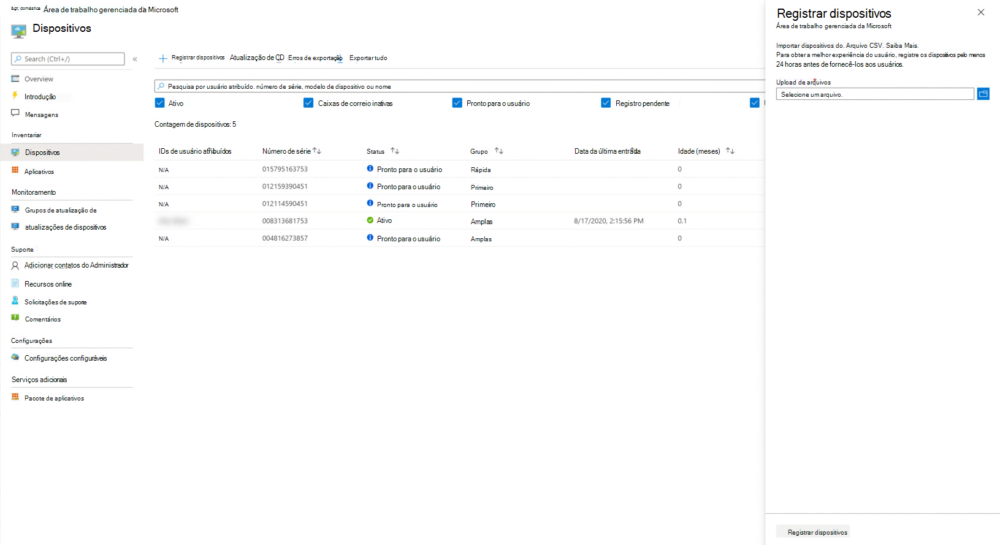

# Registre novos dispositivos por conta própriaRegister new devices yourself

A área de trabalho gerenciada da Microsoft pode funcionar com dispositivos novos ou você pode reutilizar os dispositivos que você já tem (o que exigirá que você os Insira novamente).Microsoft Managed Desktop can work with brand-new devices or you can re-use devices you might already have (which will require that you re-image them). Você pode registrar dispositivos com a área de trabalho gerenciada da Microsoft no portal do Microsoft Endpoint Manager.You can register devices with Microsoft Managed Desktop in the Microsoft Endpoint Manager portal.

> [!NOTE]
> Trabalhar com um parceiro para obter dispositivos?Working with a partner to obtain devices? Em caso afirmativo, você não precisa se preocupar em obter os hashes de hardware; Eles cuidarão disso para você.If so, you don't need to worry about getting the hardware hashes; they'll take care of that for you. Certifique-se de que seu parceiro estabelece uma relação com você no [Partner Center](https://partner.microsoft.com/dashboard).Make sure your partner establishes a relationship with you at the [Partner Center](https://partner.microsoft.com/dashboard). Seu parceiro pode saber mais na [ajuda da central de parceiros](https://docs.microsoft.com/partner-center/request-a-relationship-with-a-customer).Your partner can learn more at [Partner Center help](https://docs.microsoft.com/partner-center/request-a-relationship-with-a-customer). Depois que esse relacionamento for estabelecido, o seu parceiro simplesmente registrará dispositivos em seu nome, e nenhuma ação será necessária.Once this relationship established, your partner will simply register devices on your behalf – no further action required from you. Se você quiser ver os detalhes ou se o seu parceiro tiver dúvidas, confira [as etapas dos parceiros para registrar dispositivos](register-devices-partner.md).If you want to see the details, or your partner has questions, see [Steps for Partners to register devices](register-devices-partner.md). Depois que os dispositivos são registrados, você pode prosseguir com [a verificação da imagem](#check-the-image) e de [fornecer os dispositivos](#deliver-the-device) aos seus usuários.Once the devices are registered, you can proceed with [checking the image](#check-the-image) and [delivering the devices](#deliver-the-device) to your users.

## Preparar-se para registrar dispositivos novosPrepare to register brand-new devices

Após ter os novos dispositivos em mãos, siga estas etapas:Once you have the new devices in hand, you'll follow these steps:

1. [Obtenha o hash de hardware para cada dispositivo.Obtain the hardware hash for each device.](#obtain-the-hardware-hash)
2. [Mesclar os dados de hashMerge the hash data](#merge-hash-data)
3. [Registre os dispositivos na área de trabalho gerenciada da Microsoft](#register-devices-by-using-the-admin-portal).[Register the devices in Microsoft Managed Desktop](#register-devices-by-using-the-admin-portal).
4. [Verifique se a imagem está correta.Double-check that the image is correct.](#check-the-image)
5. [Entregar o dispositivoDeliver the device](#deliver-the-device)

### Obter o hash de hardwareObtain the hardware hash

A área de trabalho gerenciada da Microsoft identifica cada dispositivo exclusivamente fazendo referência a seu hash de hardware.Microsoft Managed Desktop identifies each device uniquely by referencing its hardware hash. Você tem três opções para obter essas informações:You have three options for getting this information:

- Pergunte ao seu fornecedor de OEM o arquivo de registro do piloto automático, que inclui os hashes de hardware.Ask your OEM supplier for the AutoPilot registration file, which will include the hardware hashes.
- Executar um [script do Windows PowerShell](#powershell-script-method) em cada dispositivo e coletar os resultados em um arquivo.Run a [Windows PowerShell script](#powershell-script-method) on each device and collect the results in a file.
- Inicie cada dispositivo, mas não conclua a experiência de instalação do Windows, e [colete os hashes em uma unidade flash removível](#flash-drive-method).Start each device--but don't complete the Windows setup experience--and [collect the hashes on a removable flash drive](#flash-drive-method).

#### Método de script do PowerShellPowerShell script method

Você pode usar o script [Get-WindowsAutoPilotInfo.ps1](https://www.powershellgallery.com/packages/Get-WindowsAutoPilotInfo) PowerShell no site da galeria do PowerShell.You can use the [Get-WindowsAutoPilotInfo.ps1](https://www.powershellgallery.com/packages/Get-WindowsAutoPilotInfo) PowerShell script on the PowerShell Gallery website. Para obter mais informações sobre a identificação de dispositivo e o hash de hardware, consulte [adicionando dispositivos ao Windows AutoPilot](https://docs.microsoft.com/mem/autopilot/add-devices#device-identification).For more information about device identification and hardware hash, see [Adding devices to Windows Autopilot](https://docs.microsoft.com/mem/autopilot/add-devices#device-identification).

1.  Abra um prompt do PowerShell com direitos administrativos.Open a PowerShell prompt with administrative rights.
2.  Sejam `Install-Script -Name Get-WindowsAutoPilotInfo`Run `Install-Script -Name Get-WindowsAutoPilotInfo`
3.  Sejam `powershell -ExecutionPolicy Unrestricted Get-WindowsAutoPilotInfo -OutputFile <path>\hardwarehash.csv`Run `powershell -ExecutionPolicy Unrestricted Get-WindowsAutoPilotInfo -OutputFile <path>\hardwarehash.csv`

#### Método de unidade flashFlash drive method

1. Em um dispositivo diferente daquele que você está registrando, insira uma unidade USB.On a device other than the one you're registering, insert a USB drive.
2. Abra um prompt do PowerShell com direitos administrativos.Open a PowerShell prompt with administrative rights.
3. Sejam `Save-Script -Name Get-WindowsAutoPilotInfo -Path <pathToUsb>`Run `Save-Script -Name Get-WindowsAutoPilotInfo -Path <pathToUsb>`
4. Ative o dispositivo que você está registrando, mas *não inicie a experiência de instalação*.Turn on the device you are registering, but *do not start the setup experience*. Se você iniciar acidentalmente a experiência de instalação, será necessário redefinir ou recriar a imagem do dispositivo.If you accidentally start the setup experience, you'll have to reset or reimage the device.
5. Insira a unidade USB e, em seguida, pressione SHIFT + F10.Insert the USB drive, and then press SHIFT + F10.
6. Abra um prompt do PowerShell com direitos administrativos e, em seguida, execute `cd <pathToUsb>` .Open a PowerShell prompt with administrative rights, and then run `cd <pathToUsb>`.
7. Sejam `Set-ExecutionPolicy -ExecutionPolicy Unrestricted`Run `Set-ExecutionPolicy -ExecutionPolicy Unrestricted`
8. Sejam `.\Get-WindowsAutoPilotInfo -OutputFile <path>\hardwarehash.csv`Run `.\Get-WindowsAutoPilotInfo -OutputFile <path>\hardwarehash.csv`
9. Remova a unidade USB e desligue o dispositivo executando `shutdown -s -t 0`Remove the USB drive, and then shut down the device by running `shutdown -s -t 0`

>[!IMPORTANT]
>Não ligue o dispositivo que você está registrando novamente até concluir o registro.Do not power on the device you are registering again until you've completed registration for it. 

### Mesclar dados de hashMerge hash data

Você precisará ter os dados nos arquivos CSV combinados em um único arquivo para concluir o registro.You'll need to have the data in the CSV files combined into a single file to complete registration. Veja um exemplo de script do PowerShell para facilitar:Here's a sample PowerShell script to make this easy:

`Import-CSV -Path (Get-ChildItem -Filter *.csv) | ConvertTo-Csv -NoTypeInformation | % {$_.Replace('"', '')} | Out-File .\aggregatedDevices.csv`

#### Registrar dispositivos usando o portal de administraçãoRegister devices by using the Admin Portal

No [Microsoft Endpoint Manager](https://endpoint.microsoft.com/), selecione **dispositivos** no painel de navegação esquerdo.In [Microsoft Endpoint Manager](https://endpoint.microsoft.com/), select **Devices** in the left navigation pane. Procure a seção área de trabalho gerenciada da Microsoft do menu e selecione **dispositivos**.Look for the Microsoft Managed Desktop section of the menu and select **Devices**. No espaço de trabalho dispositivos de área de trabalho gerenciada da Microsoft, selecione **+ registrar dispositivos** que abrem um surgimento para registrar novos dispositivos.In the Microsoft Managed Desktop Devices workspace, Select **+ Register devices** which opens a fly-in to register new devices.

<!--  -->

<!--Registering any existing devices with Managed Desktop will completely re-image them; make sure you've backed up any important data prior to starting the registration process.-->

Siga estas etapas:Follow these steps:

1. Em **upload de arquivo**, forneça um caminho para o arquivo CSV que você criou anteriormente.In **File upload**, provide a path to the CSV file you created previously.
3. Selecione **registrar dispositivos**.Select **Register devices**. O sistema adicionará os dispositivos à sua lista de dispositivos na **lâmina de dispositivos**, marcada como **registro pendente**.The system will add the devices to your list of devices on the **Devices blade**, marked as **Registration Pending**. O registro geralmente leva menos de 10 minutos e, quando bem-sucedido, o dispositivo aparecerá como **pronto para o usuário** , o que significa que ele está pronto e esperando que um usuário comece a usar o.Registration typically takes less than 10 minutes, and when successful the device will show as **Ready for user** meaning it's ready and waiting for a user to start using.

Você pode monitorar o progresso do registro de dispositivo na página principal.You can monitor the progress of device registration on the main page. Os Estados possíveis relatados incluem:Possible states reported there include:

| EstadoState | DescriçãoDescription |
|---------------|-------------|
| Registro pendenteRegistration Pending | O registro ainda não foi feito.Registration is not done yet. Verifique novamente mais tarde.Check back later. |
| Falha no registroRegistration failed | Não foi possível concluir o registro.Registration could not be completed. Consulte [Solucionando problemas de registro de dispositivo](#troubleshooting-device-registration) para obter mais informações.Refer to [Troubleshooting device registration](#troubleshooting-device-registration) for more information. |
| Pronto para o usuárioReady for user | O registro foi bem-sucedido e o dispositivo agora está pronto para ser entregue ao usuário.Registration succeeded and the device is now ready to be delivered to the user. A área de trabalho gerenciada da Microsoft irá orientá-lo pela primeira vez na configuração, portanto, não é necessário fazer mais preparativos.Microsoft Managed Desktop will guide them through first time set-up, so there’s no need for you to do any further preparations. |
| AtivoActive | O dispositivo foi entregue ao usuário e foi registrado com seu locatário.The device has been delivered to the user and they have registered with your tenant. Isso também indica que eles estão usando o dispositivo regularmente.This also indicates that they are regularly using the device. |
| InativaInactive | O dispositivo foi entregue ao usuário e foi registrado com seu locatário.The device has been delivered to the user and they have registered with your tenant. No entanto, eles não usaram o dispositivo recentemente (nos últimos 7 dias).However, they have not used the device recently (in the last 7 days).  | 

#### Solucionando problemas de registro do dispositivoTroubleshooting device registration

| Mensagem de erroError message | DetalhesDetails |
|---------------|-------------|
| Dispositivo não encontradoDevice not found | Não foi possível registrar este dispositivo porque não foi possível encontrar uma correspondência para o fabricante, modelo ou número de série fornecido.We couldn’t register this device because we could not find a match for the provided manufacturer, model, or serial number. Confirme esses valores com seu fornecedor de dispositivos.Confirm these values with your device supplier. |
| Hash de hardware inválidoHardware hash not valid | O hash de hardware fornecido para este dispositivo não foi formatado corretamente.The hardware hash you provided for this device was not formatted correctly. Verifique novamente o hash de hardware e envie novamente.Double-check the hardware hash and then resubmit. |
| Dispositivo já registradoDevice already registered | Este dispositivo já está registrado na sua organização.This device is already registered to your organization. Nenhuma ação adicional é necessária.No further action required. |
| Dispositivo solicitado por outra organizaçãoDevice claimed by another organization | Este dispositivo já foi reivindicado por outra organização.This device has already been claimed by another organization. Consulte seu fornecedor de dispositivos.Check with your device supplier. |
| Erro inesperadoUnexpected error | Sua solicitação não pôde ser processada automaticamente.Your request could not be automatically processed. Entre em contato com o suporte e forneça a ID da solicitação: <requestId>Contact Support and provide the Request ID: <requestId> |

### Verificar a imagemCheck the image

Se o seu dispositivo vier de um fornecedor de parceiros de área de trabalho gerenciada da Microsoft, a imagem deve estar correta.If your device has come from a Microsoft Managed Desktop partner supplier, the image should be correct.

Você também poderá aplicar a imagem sozinho, se preferir.You’re also welcome to apply the image on your own if you prefer. Para começar, entre em contato com o representante da Microsoft com o qual você está trabalhando e forneça o local e as etapas para a aplicação da imagem.To get started, contact the Microsoft representative you’re working with and they will provide you the location and steps for applying the image.

### Entregar o dispositivoDeliver the device

> [!IMPORTANT]
> Antes de entregar o dispositivo ao usuário, verifique se você obteve e aplicou as [licenças apropriadas](../get-ready/prerequisites.md) para esse usuário.Before you hand off the device to your user, make sure you have obtained and applied the [appropriate licenses](../get-ready/prerequisites.md) for that user.

Se todas as licenças forem aplicadas, você poderá preparar [seus usuários para usar dispositivos](get-started-devices.md)e o usuário poderá iniciar o dispositivo e prosseguir com a experiência de instalação do Windows.If all the licenses are applied, you can [get your users ready to use devices](get-started-devices.md), and then your user can start up the device and proceed through the Windows setup experience.

