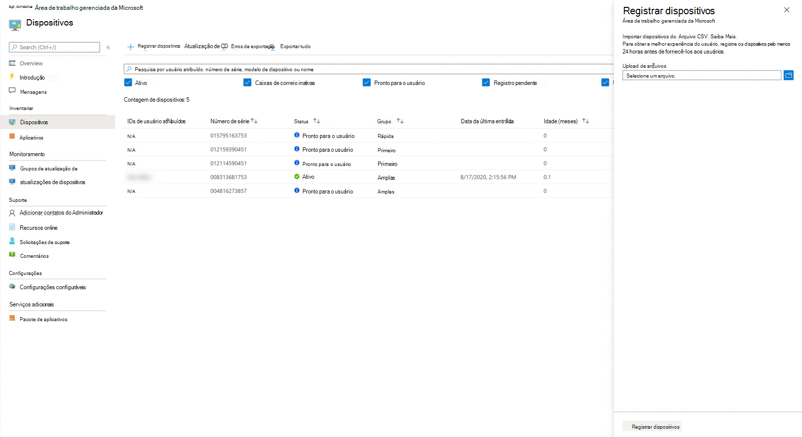

# <a name="register-existing-devices-yourself"></a>Registre dispositivos existentes por conta própria

>[!NOTE]
>Este tópico descreve as etapas para você reutilizar dispositivos que você já tem e registrá-los na Área de Trabalho Gerenciada da Microsoft. Se você estiver trabalhando com dispositivos novos, siga as etapas em Registrar novos dispositivos na Área de [Trabalho Gerenciada da Microsoft.](register-devices-self.md)

O processo para Parceiros está documentado em [Etapas para parceiros registrarem dispositivos](register-devices-partner.md).

A Área de Trabalho Gerenciada da Microsoft pode trabalhar com dispositivos novos ou você pode reutilizar dispositivos que você já tenha (o que exigirá que você os reimage). Você pode registrar dispositivos com a Área de Trabalho Gerenciada da Microsoft no portal do Microsoft Endpoint Manager.

## <a name="prepare-to-register-existing-devices"></a>Preparar para registrar dispositivos existentes


Para registrar dispositivos existentes, siga estas etapas:

1. [Obtenha o hash de hardware para cada dispositivo.](#obtain-the-hardware-hash)
2. [Mesclar os dados de hash](#merge-hash-data)
3. [Registre os dispositivos na Área de Trabalho Gerenciada da Microsoft.](#register-devices-by-using-the-admin-portal)
4. [Verifique se a imagem está correta.](#check-the-image)
5. [Entregar o dispositivo](#deliver-the-device)

### <a name="obtain-the-hardware-hash"></a>Obter o hash de hardware

A Área de Trabalho Gerenciada da Microsoft identifica cada dispositivo exclusivamente fazendo referência ao hash de hardware. Você tem quatro opções para obter essas informações de dispositivos que já está usando:

- Peça ao fornecedor OEM para o arquivo de registro do AutoPilot, que incluirá os hashes de hardware.
- Coletar informações no [Microsoft Endpoint Configuration Manager](#microsoft-endpoint-configuration-manager).
- Execute um Windows PowerShell de Windows PowerShell usando o [Active Directory](#active-directory-powershell-script-method) ou [manualmente](#manual-powershell-script-method) em cada dispositivo e colete os resultados em um arquivo.
- Inicie cada dispositivo, mas não conclua a experiência de instalação do Windows e colete [os hashes em uma unidade flash removível.](#flash-drive-method)

#### <a name="microsoft-endpoint-configuration-manager"></a>Gerenciador de Configuração do Microsoft Endpoint

Você pode usar o Microsoft Endpoint Configuration Manager para coletar os hashes de hardware de dispositivos existentes que deseja registrar na Área de Trabalho Gerenciada da Microsoft.

> [!IMPORTANT]
> Todos os dispositivos para os que você deseja obter essas informações devem estar executando o Windows 10, versão 1703 ou posterior. 

Se você tiver atendido a todos esses pré-requisitos, estará pronto para coletar as informações seguindo estas etapas:

1. No console do Configuration Manager, selecione **Monitoramento**. 
2. No espaço de trabalho Monitoramento, expanda o nó **Relatórios,** **expanda Relatórios** e selecione **o nó Hardware - Geral.** 
3. Execute o relatório, **Informações do Dispositivo do Windows Autopilot** e veja os resultados.
4. No visualizador de relatório, selecione o ícone **Exportar** e escolha a opção **CSV (delimitado** por vírgula).
5. Depois de salvar o arquivo, você precisará filtrar os resultados para apenas os dispositivos que você planeja registrar na Área de Trabalho Gerenciada da Microsoft e carregar os dados para a Área de Trabalho Gerenciada da Microsoft. Abra o Microsoft Endpoint Manager e navegue até o menu **Dispositivos,** procure a seção Área de Trabalho Gerenciada da Microsoft e selecione **Dispositivos**. Selecione **+ Registrar dispositivos**, que abre um fly-in para registrar novos dispositivos.


Consulte [Registrar dispositivos usando o Portal de Administração](#register-devices-by-using-the-admin-portal) para obter mais informações.


#### <a name="active-directory-powershell-script-method"></a>Método de script do PowerShell do Active Directory

Em um ambiente do Active Directory, você pode usar o cmdlet do PowerShell para coletar remotamente as informações de dispositivos em Grupos do `Get-WindowsAutoPilotInfo` Active Directory usando o WinRM. Você também pode usar o `Get-AD Computer` cmdlet e obter resultados filtrados para um nome de modelo de hardware específico incluído no catálogo. Antes de prosseguir, primeiro confirme esses pré-requisitos e prossiga com as etapas:

- O WinRM está habilitado.
- Os dispositivos que você deseja registrar estão ativos na rede (ou seja, eles não estão desconectados ou desativados).
- Certifique-se de que você tenha um parâmetro de credencial de domínio que tenha permissão para ser executado remotamente nos dispositivos.
- Certifique-se de que o Firewall do Windows permita o acesso ao WMI. Para fazer isso, siga estas etapas:

    1. Abra o **painel Windows Defender de controle firewall** e selecione Permitir um aplicativo ou recurso por meio Windows Defender **Firewall**.
    
    2. Encontre a Instrumentação de Gerenciamento **do Windows (WMI)** na lista, habilita para Particular e **Público** e selecione **OK**.

1.  Abra um prompt do PowerShell com direitos administrativos.

2.  Execute *um desses* scripts:

    ```powershell
    Install-script -name Get-WindowsAutoPilotInfo 
    #example one – leverage Get-ADComputer to enumerate devices 
    Get-ADComputer -filter * | powershell -ExecutionPolicy Unrestricted Get-WindowsAutoPilotInfo.ps1 -credential Domainname\<accountname>
    ```

    ```powershell 
    #example two – target specific devices: 
    Set-ExecutionPolicy powershell -ExecutionPolicy Unrestricted Get-WindowsAutoPilotInfo.ps1 -credential Domainname\<accountname> -Name Machine1,Machine2,Machine3
    ```

3. Acesse quaisquer diretórios onde possam haver entradas para os dispositivos. Remova as entradas de cada dispositivo de todos *os* diretórios, incluindo os Serviços de Domínio do Windows Server Active Directory e o Azure Active Directory. Esteja ciente de que a remoção pode levar algumas horas para ser processda completamente.

4. Acessar serviços de gerenciamento onde pode haver entradas para os dispositivos. Remova as entradas de cada dispositivo de *todos* os serviços de gerenciamento, incluindo o Microsoft Endpoint Configuration Manager, o Microsoft Intune e o Windows Autopilot. Esteja ciente de que a remoção pode levar algumas horas para ser processda completamente.

Agora você pode continuar a registrar [dispositivos](#register-devices-by-using-the-admin-portal).

#### <a name="manual-powershell-script-method"></a>Método de script manual do PowerShell

1.  Abra um prompt do PowerShell com direitos administrativos.
2.  Executar `Install-Script -Name Get-WindowsAutoPilotInfo`
3.  Executar `powershell -ExecutionPolicy Unrestricted Get-WindowsAutoPilotInfo -OutputFile <path>\hardwarehash.csv`
4. [Mesclar os dados de hash.](#merge-hash-data)

#### <a name="flash-drive-method"></a>Método de unidade flash

1. Em um dispositivo diferente do que você está registrando, insira uma unidade USB.
2. Abra um prompt do PowerShell com direitos administrativos.
3. Executar `Save-Script -Name Get-WindowsAutoPilotInfo -Path <pathToUsb>`
4. A turn on the device you are registering, *but do not start the setup experience*. Se você iniciar acidentalmente a experiência de instalação, você terá que redefinir ou reajustar o dispositivo.
5. Insira a unidade USB e pressione SHIFT + F10.
6. Abra um prompt do PowerShell com direitos administrativos e execute `cd <pathToUsb>` .
7. Executar `Set-ExecutionPolicy -ExecutionPolicy Unrestricted`
8. Executar `.\Get-WindowsAutoPilotInfo -OutputFile <path>\hardwarehash.csv`
9. Remova a unidade USB e desligue o dispositivo executando `shutdown -s -t 0`
10. [Mesclar os dados de hash.](#merge-hash-data)

>[!IMPORTANT]
>Não a energia no dispositivo que você está registrando novamente até concluir o registro para ele. 


### <a name="merge-hash-data"></a>Mesclar dados de hash

Se você coletou os dados de hash de hardware pelos métodos manuais do PowerShell ou da unidade flash, agora precisa ter os dados nos arquivos CSV combinados em um único arquivo para concluir o registro. Veja um exemplo de script do PowerShell para facilitar:

```powershell
Import-CSV -Path (Get-ChildItem -Filter *.csv) | ConvertTo-Csv -NoTypeInformation | % {$_.Replace('"', '')} | Out-File .\aggregatedDevices.csv
```

Com os dados de hash mesclados em um arquivo CSV, agora você pode continuar a [registrar os dispositivos](#register-devices-by-using-the-admin-portal).


## <a name="register-devices-by-using-the-admin-portal"></a>Registrar dispositivos usando o Portal de Administração

No [Microsoft Endpoint Manager](https://endpoint.microsoft.com/), selecione **Dispositivos** no painel de navegação esquerdo. Procure a seção Área de Trabalho Gerenciada da Microsoft do menu e selecione **Dispositivos**. No espaço de trabalho Dispositivos de Área de Trabalho Gerenciados da Microsoft, Selecione **+ Registrar dispositivos**, que abre um fly-in para registrar novos dispositivos.

<!-- Update with new picture [](../../media/new-registration-ui.png) -->


<!--Registering any existing devices with Managed Desktop will completely re-image them; make sure you've backed up any important data prior to starting the registration process.-->


Siga estas etapas:

1. Em **Carregamento de arquivo,** forneça um caminho para o arquivo CSV que você criou anteriormente.
2. Selecione um [perfil de](../service-description/profiles.md) dispositivo no menu suspenso.
3. Selecione **Registrar dispositivos**. O sistema adicionará os dispositivos à sua lista de dispositivos na folha **Dispositivos**, marcada como **Registro Pendente**. O registro normalmente leva menos de 10 minutos e, quando bem-sucedido, o dispositivo será mostrar como **Pronto** para o usuário, o que significa que ele está pronto e aguardando que um usuário comece a usar.

> [!NOTE]
> Se você alterar manualmente a associação de grupo do Azure Active Directory (AAD) de um dispositivo, ele será automaticamente reatribuido ao grupo para seu perfil de dispositivo e removido de todos os grupos conflitantes.

Você pode monitorar o andamento do registro do dispositivo na página principal. Os estados possíveis relatados incluem:

| Estado | Descrição |
|---------------|-------------|
| Registro Pendente | O registro ainda não foi feito. Volte mais tarde. |
| Falha no registro | O registro não pôde ser concluído. Consulte [Troubleshooting device registration para](#troubleshooting-device-registration) obter mais informações. |
| Pronto para usuário | O registro foi bem-sucedido e o dispositivo agora está pronto para ser entregue ao usuário. A Área de Trabalho Gerenciada da Microsoft os orientará durante a configuração da primeira vez, portanto, não há necessidade de você fazer outras preparações. |
| Ativo | O dispositivo foi entregue ao usuário e ele se registrou com seu locatário. Isso também indica que eles estão usando regularmente o dispositivo. |
| Inativo | O dispositivo foi entregue ao usuário e ele se registrou com seu locatário. No entanto, eles não usaram o dispositivo recentemente (nos últimos 7 dias).  | 

### <a name="troubleshooting-device-registration"></a>Solução de problemas de registro de dispositivo

| Mensagem de erro | Detalhes |
|---------------|-------------|
| Dispositivo não encontrado | Não foi possível registrar esse dispositivo porque não foi possível encontrar uma combinação para o fabricante, modelo ou número de série fornecido. Confirme esses valores com o fornecedor do dispositivo. |
| Hash de hardware não válido | O hash de hardware fornecido para esse dispositivo não foi formatado corretamente. Verifique duas vezes o hash de hardware e, em seguida, reapresente. |
| Dispositivo já registrado | Esse dispositivo já está registrado em sua organização. Nenhuma ação mais necessária. |
| Dispositivo reivindicado por outra organização | Esse dispositivo já foi reivindicado por outra organização. Verifique com o fornecedor do dispositivo. |
| Erro inesperado | Sua solicitação não pôde ser processada automaticamente. Contate o Suporte e forneça a ID da Solicitação: <requestId> |

## <a name="check-the-image"></a>Verificar a imagem

Se o dispositivo tiver vindo de um fornecedor parceiro da Área de Trabalho Gerenciada da Microsoft, a imagem deverá estar correta.

Você também pode aplicar a imagem por conta própria, se preferir. Para começar, entre em contato com o representante da Microsoft com o que você está trabalhando e eles fornecerão o local e as etapas para aplicar a imagem.

## <a name="deliver-the-device"></a>Entregar o dispositivo

> [!IMPORTANT]
> Antes de entregar o dispositivo ao usuário, certifique-se de ter obtido e aplicado as [licenças apropriadas](../get-ready/prerequisites.md) para esse usuário.

Se todas as licenças são aplicadas, você pode preparar seus usuários para usar dispositivos [e,](get-started-devices.md)em seguida, o usuário pode iniciar o dispositivo e prosseguir com a experiência de configuração do Windows.


