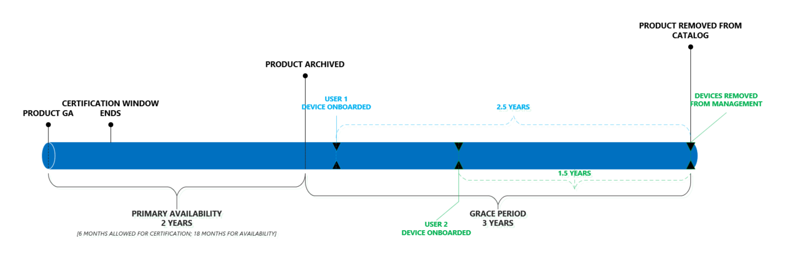

# Ciclo de vida do produto do Microsoft Managed desktopMicrosoft Managed Desktop product lifecycle

Benefícios do Microsoft Managed desktop os usuários finais garantem que eles sempre usem dispositivos que oferecem os melhores desempenho, confiabilidade, design e recursos de segurança (como suporte para recursos como o Windows Hello).Microsoft Managed Desktop benefits end-users assuring that they always use devices that offer the best performance, reliability, design, and security capabilities (such as support for features like Windows Hello). Para fazer isso, a área de trabalho gerenciada da Microsoft mantém um pequeno catálogo de [dispositivos aprovados](device-list.md)continuamente atualizados.To accomplish this, Microsoft Managed Desktop maintains a short catalog of continuously updated [approved devices](device-list.md). 
 
Este tópico detalha o ciclo de vida dos dispositivos à medida que são adicionados e removidos do catálogo aprovado.This topic details the lifecycle of devices as they are added and removed from the approved catalog. 

> [!NOTE]
> Neste tópico, faremos uma distinção entre um "dispositivo" e um "produto".In this topic, we'll make a distinction between a "device" and a "product." Por "dispositivo", queremos dizer um computador individual e específico.By “device,” we mean one individual, specific computer. Por exemplo, "número de série 1234", "laptop da Bill", "VM compartilhada XYZ" refere-se a dispositivos específicos.For example, “Serial number 1234”, “Bill’s laptop”, “Shared VM XYZ” refer to specific devices. Um "produto", no entanto, refere-se a uma coleção ou família de dispositivos.A “product”, however, refers to a collection or family of devices. Por exemplo, "fabrikam laptop", "adatum ZX450 laptop", etc. Isso é importante porque os produtos são adicionados à nossa [lista](device-list.md)ou catálogos aprovados, e os dispositivos são os que são registrados na área de trabalho gerenciada da Microsoft.For example, “Fabrikam Laptop”, “Adatum ZX450 Laptop”, etc. This is important because products are added to our [approved list](device-list.md), or catalog, and devices are what get enrolled into Microsoft Managed Desktop.

## Ciclo de vida do produtoProduct lifecycle

 Geralmente, os produtos passam por essas fases do ciclo de vida:Generally, products move through these lifecycle phases:

- [Versão e avaliação do produtoProduct release and evaluation](#product-release-and-evaluation)
- [Período de disponibilidade principal do produtoProduct primary availability period](#product-primary-availability-period)
- [Período de cortesia do produtoProduct grace period](#product-grace-period)
- [Descontinuação de produtoProduct retirement](#product-retirement)

A sequência inteira é descrita nesta ilustração:The entire sequence is depicted in this illustration:

Os produtos permanecem no catálogo por até 24 meses, mas os *dispositivos* permanecem sob gerenciamento por 3 anos com base em suas datas de registro individuais.Products remain on the catalog for up to 24 months, but *devices* remain under management for 3 years based on their individual enrollment dates. Efetivamente, cada produto tem três datas importantes, mas cada dispositivo tem apenas um.Effectively, each product has three important dates, but each device has only one. Para produtos, todas as três datas são calculadas com base na *data de aprovação*e, portanto, publicamos essas datas após a aprovação, de modo que você possa sempre olhar em frente e planejar adequadamente para o ciclo de vida inteiro do produto.For products, all three of these dates are calculated based on the *approval date*, and therefore we publish these dates upon approval so that you can always look ahead and plan appropriately for the product's entire lifecycle.

Esta tabela mostra as datas de exemplo de um produto teórico:This table shows example dates for a theoretical product:

|ProductProduct  |Data de aprovaçãoApproved date  |Fim da disponibilidade principalEnd of primary availability  |Fim da eligiblityEnd of eligiblity  |
|---------|---------|---------|---------|
|Laptop da FabrikamFabrikam Laptop    | 1/1/20171/1/2017 | 6/1/20196/1/2019 | 6/1/20226/1/2022 |
|Laptop adatumAdatum Laptop   | 1/1/20181/1/2018 | 6/1/20206/1/2020 | 6/1/20236/1/2023  |

Esta tabela mostra datas de exemplo para *dispositivos*teóricos:This table shows example dates for theoretical *devices*:

|ID do dispositivoDevice ID  |Data de registroEnrollment date  |Data de aposentadoriaRetirement date  |
|---------|---------|---------|
|#123412 de laptopLaptop #123412     |  2/3/20182/3/2018       |  2/3/20212/3/2021       |
|#321513 de área de trabalhoDesktop #321513     | 6/2/20186/2/2018        |  6/2/20216/2/2021       |

## Versão e avaliação do produtoProduct release and evaluation

O ciclo de vida do produto é iniciado quando um fabricante lança o produto publicamente:The product lifecycle starts when a manufacturer publicly releases the product:

Durante esse estágio, a equipe de engenharia de área de trabalho gerenciada da Microsoft faz a avaliação e a certificação de um produto.During this stage, the Microsoft Managed Desktop engineering team does their evaluation and certification of a product. A equipe avalia itens como confiabilidade e desempenho com o Windows, conformidade com uma linha de base de hardware, informações do mercado e disponibilidade de estoque e canal, entre outras coisas.The team evaluates things like reliability and performance with Windows, compliance with a hardware baseline, market sentiment, and inventory and channel readiness, among other things. Esse processo geralmente leva aproximadamente 6 semanas.This process typically takes approximately 6 weeks.
  
A área de trabalho gerenciada da Microsoft só avaliará dispositivos de certificação nos primeiros 6 meses de disponibilidade.Microsoft Managed Desktop will only evaluate devices for certification within their first 6 months of availability. Isso garante que estamos sempre concentrando nossos esforços na última geração de hardware.This ensures that we’re always focusing our efforts on the latest generation of hardware.
 
No final desta fase, a área de trabalho gerenciada da Microsoft adiciona o produto à [lista aprovada](device-list.md), liberando com eficiência o produto para as registradoras do cliente.At the end of this phase, Microsoft Managed Desktop adds the product to the [approved list](device-list.md), effectively releasing the product for customer enrollments. Independentemente da data em que um dispositivo é certificado, sua **data de aprovação** é de back-data para a data de disponibilidade geral dos produtos.Regardless of the date when a device is certified, its **approved date** is be back-dated to the products own general availability date. 

## Período de disponibilidade principal do produtoProduct primary availability period

Esse período é o principal da disponibilidade do produto:This period is the core of product availability:

Todos os dispositivos registrados durante esse período recebem o total de três anos de suporte da área de trabalho gerenciada da Microsoft (conforme mostrado na linha do tempo azul).Any device enrolled during this period receives the full three years of support from Microsoft Managed Desktop (as shown by the blue timeline). Este período dura até uma data de término definida como 24 meses a partir da data de disponibilidade geral.This period lasts until an end date set to 24 months from the general availability date.

Você pode pensar nesse período com o "registro aberto" efetivamente, para maximizar o valor da área de trabalho gerenciada da Microsoft, você deve direcionar os modelos de compras e os produtos selecionados para se enquadram neste período.You can think of this period as effectively “open enrollment”, so to maximize the value of Microsoft Managed Desktop, you should target your procurement models and selected products to fall within this period. Como um pequeno exemplo, um cliente deve evitar a liquidação em um período de distribuição de dois anos usando um produto que esteja em seu mês final de disponibilidade principal – a maioria desses dispositivos não receberá os três anos de gerenciamento de área de trabalho gerenciada da Microsoft (consulte [carência período](#product-grace-period) para obter mais informações).As a small example, a customer should avoid settling on a two-year roll-out period using a product that is in its final month of primary availability – most of those devices will not receive the full three years of Microsoft Managed Desktop management (see [grace period](#product-grace-period) for more information).  

## Período de cortesia do produtoProduct grace period

O período de cortesia do produto é um período de três anos após a disponibilidade principal.The product grace period is a three-year period following primary availability. Esta fase permite que você registre dispositivos que são de uma família de produtos com suporte, mas ainda confirmam as promessas da área de trabalho gerenciada da Microsoft sobre o desempenho moderno de hardware e dispositivos.This phase allows you to enroll devices that are from a supported product family, but still hold firm to the promises of Microsoft Managed Desktop regarding modern hardware and device performance. Esta fase é ideal para clientes que fizeram decisões de compras antes de saber sobre a área de trabalho gerenciada da Microsoft.This phase is ideal for customers who have made procurement decisions before knowing about Microsoft Managed Desktop. 

Se você comprou recentemente vários dispositivos aprovados antes de se inscrever com a área de trabalho gerenciada da Microsoft, ainda poderá registrá-los, mas não receberá um total de três anos de gerenciamento.If you've recently bought a number of approved devices prior to enrolling with Microsoft Managed Desktop, you can still enroll them, but you won’t receive a full three years of management. Em vez disso, eles ficarão fora de conformidade na data de aposentadoria, independentemente de quando eles estiverem registrados.Instead, they’ll fall out of compliance on the retirement date, regardless of when they were enrolled. Nos bastidores, a área de trabalho gerenciada da Microsoft tratará esses dispositivos como se estivessem registrados no último dia da disponibilidade principal.Behind the scenes, Microsoft Managed Desktop will treat these devices as if they were enrolled on the last day of primary availability. Nesta ilustração, você pode ver esse cenário observando que o dispositivo azul e verde termina no mesmo dia, apesar da diferença de um ano no registro:In this illustration, you can see this scenario by noting that both the blue and green device end on the same day, despite their one-year difference in enrollment:

O exemplo de laptop da Fabrikam da tabela anterior ilustra essa situação:The Fabrikam Laptop example from the previous table illustrates this situation: 

|ProductProduct  |Data de aprovaçãoApproved date  |Fim da disponibilidade principalEnd of primary availability  |Fim da eligiblityEnd of eligiblity  |
|---------|---------|---------|---------|
|Laptop da FabrikamFabrikam Laptop    | 6/1/20176/1/2017 | 6/1/20196/1/2019 | 6/1/20226/1/2022 |

Como cliente, você pode registrar os laptops da Fabrikam o caminho até 6/1/2022 – no entanto, eles serão tratados como se você os tivesse registrado no 6/1/2019.As a customer, you can enroll Fabrikam Laptops all the way until 6/1/2022 – however they will all be treated as though you enrolled them on 6/1/2019. Se você inscrever um laptop da Fabrikam em 6/1/2021, obterá apenas um ano de gerenciamento.If you enroll a Fabrikam Laptop on 6/1/2021 you'll only get one year of management. Essa política permite extrair ciclos de vida parciais de produtos que tinham suporte anteriormente, em vez de ter que adquirir novos dispositivos prematuramente.This policy allows you to extract partial lifecycles from products that were previously supported, rather than having to procure new devices prematurely. 

Por fim, durante esta fase, o dispositivo é removido da [lista de dispositivos](device-list.md) e movido para a lista de [dispositivos arquivados](archived-device-list.md).Finally, during this phase the device is removed from the [device list](device-list.md) and moved to the [archived device list](archived-device-list.md).

## Descontinuação de produtoProduct retirement

A aposentadoria do produto é a fase final do ciclo de vida.Product retirement is the final phase of the lifecycle. Nesta fase, nenhum dispositivo novo desse tipo de produto pode ser inscrito na área de trabalho gerenciada da Microsoft e, por definição, todos os dispositivos existentes agora estão fora do termo de três anos permitido.In this phase, no new devices of that product type can be enrolled in Microsoft Managed Desktop and, by definition, all existing devices are now outside their allowed three-year term. Durante esse período, a área de trabalho gerenciada da Microsoft removerá totalmente o dispositivo da lista pública.During this time, Microsoft Managed Desktop will remove the device from the public list entirely. Também é durante esta fase, em que, se você ainda não tiver adquirido as substituições, começará a ver os serviços reduzidos à medida que o Microsoft Managed desktop começar a aumentar a velocidade dos dispositivos que estão fora de conformidade.It’s also during this phase where, if you haven't already procured replacements, you'll start to see diminished services as Microsoft Managed Desktop starts to ramp down on the devices which are out of compliance. 

## Dispositivos que estão fora de conformidadeDevices that are out of compliance

Um dispositivo está fora de conformidade quando a janela permitida para o gerenciamento de área de trabalho gerenciada da Microsoft tiver decorrido.A device is out of compliance when its allowed window for Microsoft Managed Desktop management has elapsed. Isso ocorre quando o dispositivo alcança três anos de gerenciamento ou quando esse tipo de produto é removido do catálogo de dispositivos, o que ocorrer primeiro.This occurs when the device has reached three years of management or when that product type is removed from the device catalog, whichever occurs first. Você deve sempre direcionar seus ciclos de compras de forma que novos dispositivos sejam implantados antes de os dispositivos atuais ficar fora de conformidade.You should always target your procurement cycles such that new devices are deployed prior to current devices going out of compliance.

A equipe de área de trabalho gerenciada da Microsoft sabe que os ciclos de compras são longos e planejados em relação aos orçamentos de longa duração.The Microsoft Managed Desktop team knows that procurement cycles are long and planned around long-running budgets. Para garantir que você esteja sempre ciente do estado de sua população de dispositivos, fornecemos um [site](https://aka.ms/mmdportal) que lista todos os dispositivos sob gerenciamento, sua data de aposentadoria futura e um status que indica sua conformidade.To ensure that you're always aware of the state of your device population, we provide a [website](https://aka.ms/mmdportal) that lists every device under management, its future retirement date, and a status indicating its compliance. Isso significa que você sempre tem as últimas informações sobre a idade do dispositivo e pode aproveitar o relatório em qualquer ciclo de planejamento de compras.This means you always have the latest information regarding device age and can leverage the report in any procurement planning cycle. 

Além disso, também executaremos as seguintes ações automatizadas para garantir que novos dispositivos sejam implantados no momento:In addition, the we will also take the following automated actions to ensure that new devices are deployed on time:

|Linha do tempoTimeline  |AçãoAction  |
|---------|---------|
|T-90T-90     | Sinalizaremos este dispositivo como expirar em **breve**, com um marcador amarelo no site de inventário de dispositivos.We'll flag this device as **expiring soon**, with a yellow marker on the device inventory website.  |
|T-60T-60     | Sinalizaremos esse dispositivo como **expiração** com um marcador vermelho no site de inventário de dispositivos.We'll flag this device as **expiring** with a red marker on the device inventory website.       |
|T-30T-30     | Postaremos uma mensagem no portal de administração dizendo que os dispositivos estão saindo de acordo com a conformidade.We'll post a message to the Admin Portal saying that devices are imminently exiting compliance.       |
|,00     |  Ajustaremos o portal de administração para dizer que os dispositivos agora expiraram os administradores de redirecionar para a lista de dispositivos primeiro.We'll adjust the Admin Portal to say that devices are now expired redirect admins to land on the device list first.       |
|T + 30T+30     |  Reduziremos a funcionalidade do portal de Administração até que novos dispositivos sejam implantados.We'll reduce Admin Portal functionality until new devices are deployed.       |
|T + 60T+60     |  Reduziremos a funcionalidade do portal de Administração até que novos dispositivos sejam implantados.We'll reduce Admin Portal functionality until new devices are deployed.       |
|T + 90T+90     |  Removemos o dispositivo do gerenciamento.We remove the device from management. Neste ponto, o dispositivo é unicamente sua própria responsabilidade e você não deve mais considerá-lo seguro nem até hoje.At this point, the device is solely your own responsibility and you should no longer consider it secure nor up to date. Além disso, o dispositivo estará em um estado desconhecido, pois cada provedor de serviços de configuração controla suas próprias configurações.Also the device will be in an unknown state since each Configuration Service provider controls its own settings.|

