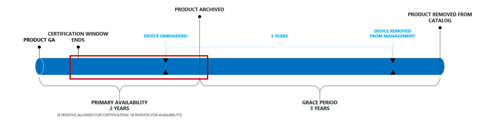

# Ciclo de vida do produto da Área de Trabalho Gerenciada da MicrosoftMicrosoft Managed Desktop product lifecycle

A Área de Trabalho Gerenciada da Microsoft beneficia os usuários, garantindo que eles sempre usem dispositivos que ofereçam os melhores recursos de desempenho, confiabilidade, design e segurança (como suporte para recursos como o Windows Hello).Microsoft Managed Desktop benefits users assuring that they always use devices that offer the best performance, reliability, design, and security capabilities (such as support for features like Windows Hello). Para fazer isso, a Área de Trabalho Gerenciada da Microsoft mantém um pequeno catálogo de dispositivos aprovados [continuamente atualizados.](device-list.md)To accomplish this, Microsoft Managed Desktop maintains a short catalog of continuously updated [approved devices](device-list.md). 
 
Este artigo detalha o ciclo de vida dos dispositivos à medida que eles são adicionados e removidos do catálogo aprovado.This article details the lifecycle of devices as they are added and removed from the approved catalog. 

> [!NOTE]
> Neste tópico, faremos uma distinção entre um "dispositivo" e um "produto".In this topic, we'll make a distinction between a "device" and a "product." Por "dispositivo", queremos dizer um computador específico e individual.By "device," we mean one individual, specific computer. Por exemplo, "Serial number 1234", "Bill's laptop", "Shared VM XYZ" referem-se a dispositivos específicos.For example, "Serial number 1234", "Bill's laptop", "Shared VM XYZ" refer to specific devices. Um "produto", no entanto, se refere a uma coleção ou família de dispositivos.A "product", however, refers to a collection or family of devices. Por exemplo, "Laptop Fabrikam", "Adatum ZX450 Laptop", etc. Isso é importante porque os produtos são adicionados à nossa lista aprovada [ou](device-list.md)catálogo, e os dispositivos são o que são inscritos na Área de Trabalho Gerenciada da Microsoft.For example, "Fabrikam Laptop", "Adatum ZX450 Laptop", etc. This is important because products are added to our [approved list](device-list.md), or catalog, and devices are what get enrolled into Microsoft Managed Desktop.

## Ciclo de vida do produtoProduct lifecycle

 Geralmente, os produtos passam por essas fases do ciclo de vida:Generally, products move through these lifecycle phases:

- [Versão e avaliação do produtoProduct release and evaluation](#product-release-and-evaluation)
- [Período de disponibilidade principal do produtoProduct primary availability period](#product-primary-availability-period)
- [Período de carência do produtoProduct grace period](#product-grace-period)
- [Baixa do produtoProduct retirement](#product-retirement)

Esta ilustração mostra toda a sequência:This illustration shows the entire sequence:

Os produtos permanecem no catálogo por até <em></em> 24 meses, mas os dispositivos permanecem sob gerenciamento por três anos com base em suas datas de registro individuais.Products remain on the catalog for up to 24 months, but <em>devices</em> remain under management for three years based on their individual enrollment dates. Efetivamente, cada produto tem três datas importantes, mas cada dispositivo tem apenas uma.Effectively, each product has three important dates, but each device has only one. Para produtos, todas essas três datas <em></em>são calculadas com base na data de aprovação e, portanto, publicamos essas datas após a aprovação para que você possa sempre olhar para frente e planejar adequadamente todo o ciclo de vida do produto.For products, all three of these dates are calculated based on the <em>approval date</em>, and therefore we publish these dates upon approval so that you can always look ahead and plan appropriately for the product's entire lifecycle.

Esta tabela mostra datas de exemplo para um produto bruto:This table shows example dates for a theoretical product:

|ProdutoProduct  |Data aprovadaApproved date  |Fim da disponibilidade principalEnd of primary availability  |Fim da qualificaçãoEnd of eligibility  |
|---------|---------|---------|---------|
|Fabrikam LaptopFabrikam Laptop    | 1/1/20171/1/2017 | 6/1/20196/1/2019 | 6/1/20226/1/2022 |
|Adatum LaptopAdatum Laptop   | 1/1/20181/1/2018 | 6/1/20206/1/2020 | 6/1/20236/1/2023  |

Esta tabela mostra datas de exemplo *para* dispositivos oficiais:This table shows example dates for theoretical *devices*:

|ID do dispositivoDevice ID  |Data do registroEnrollment date  |Data da reformaRetirement date  |
|---------|---------|---------|
|Laptop #123412Laptop #123412     |  2/3/20182/3/2018       |  2/3/20212/3/2021       |
|Área de #321513Desktop #321513     | 6/2/20186/2/2018        |  6/2/20216/2/2021       |

## Versão e avaliação do produtoProduct release and evaluation

O ciclo de vida do produto começa quando um fabricante lança publicamente o produto:The product lifecycle starts when a manufacturer publicly releases the product:

Durante esse estágio, a equipe de engenharia da Área de Trabalho Gerenciada da Microsoft faz sua avaliação e certificação de um produto.During this stage, the Microsoft Managed Desktop engineering team does their evaluation and certification of a product. A equipe avalia itens como confiabilidade e desempenho com o Windows, conformidade com uma linha de base de hardware, opiniões de mercado e preparação de estoque e canal, entre outras coisas.The team evaluates things like reliability and performance with Windows, compliance with a hardware baseline, market sentiment, and inventory and channel readiness, among other things. Esse processo normalmente leva aproximadamente seis semanas.This process typically takes approximately six weeks.
  
A Área de Trabalho Gerenciada da Microsoft avaliará apenas os dispositivos para certificação nos primeiros seis meses de disponibilidade.Microsoft Managed Desktop will only evaluate devices for certification within their first six months of availability. Essa política garante que estamos sempre concentrando nossos esforços na geração mais recente de hardware.This policy ensures that we're always focusing our efforts on the latest generation of hardware.
 
No final desta fase, a Área de Trabalho Gerenciada da Microsoft adiciona o produto à lista [aprovada,](device-list.md)liberando efetivamente o produto para as inscrições do cliente.At the end of this phase, Microsoft Managed Desktop adds the product to the [approved list](device-list.md), effectively releasing the product for customer enrollments. Independentemente da data em que  um dispositivo é certificado, sua data aprovada é aplicada novamente à data de disponibilidade geral do próprio produto.Regardless of the date when a device is certified, its **approved date** is back-dated to the product's own general availability date. 

## Período de disponibilidade principal do produtoProduct primary availability period

Esse período é o núcleo da disponibilidade do produto:This period is the core of product availability:

Qualquer dispositivo inscrito durante esse período recebe os três anos completos de suporte da Área de Trabalho Gerenciada da Microsoft (conforme mostrado pela linha do tempo azul).Any device enrolled during this period receives the full three years of support from Microsoft Managed Desktop (as shown by the blue timeline). Esse período dura até uma data de término definida como 24 meses a partir da data de disponibilidade geral.This period lasts until an end date set to 24 months from the general availability date.

Você pode pensar nesse período como efetivamente "abrir registro", portanto, para maximizar o valor da Área de Trabalho Gerenciada da Microsoft, você deve direcionar seus modelos de compra e produtos selecionados para ficar dentro desse período.You can think of this period as effectively "open enrollment", so to maximize the value of Microsoft Managed Desktop, you should target your procurement models and selected products to fall within this period. Como um pequeno exemplo, você deve evitar ficar em um período de distribuição de dois anos usando um produto que está em seu último  mês de disponibilidade principal – a maioria desses dispositivos não receberá os três anos completos de gerenciamento da Área de Trabalho Gerenciada da Microsoft (veja o período de carência para obter mais informações).As a small example, you should avoid settling on a two-year roll-out period using a product that is in its final month of primary availability – most of those devices will not receive the full three years of Microsoft Managed Desktop management (see [grace period](#product-grace-period) for more information).  

## Período de carência do produtoProduct grace period

O período de carência do produto é um período de três anos após a disponibilidade principal.The product grace period is a three-year period following primary availability. Esta fase permite que você inscreva dispositivos que são de uma família de produtos com suporte, mas ainda mantém a segurança das promessas da Área de Trabalho Gerenciada da Microsoft em relação ao desempenho moderno do hardware e do dispositivo.This phase allows you to enroll devices that are from a supported product family, but still hold firm to the promises of Microsoft Managed Desktop regarding modern hardware and device performance. Esta fase é ideal para clientes que tomaram decisões de compra antes de conhecer a Área de Trabalho Gerenciada da Microsoft.This phase is ideal for customers who have made procurement decisions before knowing about Microsoft Managed Desktop. 

Se você comprou recentemente dispositivos aprovados antes de se inscrever na Área de Trabalho Gerenciada da Microsoft, ainda poderá inscreveu-os, mas não receberá um gerenciamento completo de três anos.If you've recently bought approved devices prior to enrolling with Microsoft Managed Desktop, you can still enroll them, but you won't receive a full three years of management. Em vez disso, eles sairão da conformidade na data da baixa, independentemente de quando foram inscritos.Instead, they'll fall out of compliance on the retirement date, regardless of when they were enrolled. Nos bastidores, a Área de Trabalho Gerenciada da Microsoft tratará esses dispositivos como se fossem inscritos no último dia de disponibilidade principal.Behind the scenes, Microsoft Managed Desktop will treat these devices as if they were enrolled on the last day of primary availability. Nesta ilustração, você pode ver esse cenário, notando que os dispositivos azul e verde terminam no mesmo dia, apesar da diferença de um ano no registro:In this illustration, you can see this scenario by noting that both the blue and green device end on the same day, despite their one-year difference in enrollment:

O exemplo do Fabrikam Laptop da tabela anterior ilustra essa situação:The Fabrikam Laptop example from the previous table illustrates this situation: 

|ProdutoProduct  |Data aprovadaApproved date  |Fim da disponibilidade principalEnd of primary availability  |Fim da qualificaçãoEnd of eligibility  |
|---------|---------|---------|---------|
|Fabrikam LaptopFabrikam Laptop    | 6/1/20176/1/2017 | 6/1/20196/1/2019 | 6/1/20226/1/2022 |

Como cliente, você pode registrar laptops da Fabrikam até 01/06/2022– no entanto, todos eles serão tratados como se você os registrava em 01/06/2019.As a customer, you can enroll Fabrikam Laptops all the way until 6/1/2022 – however they will all be treated as though you enrolled them on 6/1/2019. Se você registrar um laptop Fabrikam em 1/6/2021, só terá um ano de gerenciamento.If you enroll a Fabrikam Laptop on 6/1/2021, you'll only get one year of management. Essa política permite extrair ciclos de vida parciais de produtos com suporte anteriormente, em vez de precisar adquirir novos dispositivos prematuramente.This policy allows you to extract partial lifecycles from products that were previously supported, rather than having to procure new devices prematurely. 

Por fim, durante essa fase, o dispositivo é removido da lista [de](device-list.md) dispositivos e movido para a lista [de dispositivos arquivados.](archived-device-list.md)Finally, during this phase the device is removed from the [device list](device-list.md) and moved to the [archived device list](archived-device-list.md).

## Baixa do produtoProduct retirement

A baixa do produto é a fase final do ciclo de vida.Product retirement is the final phase of the lifecycle. Nesta fase, nenhum dispositivo novo desse tipo de produto pode ser inscrito na Área de Trabalho Gerenciada da Microsoft e, por definição, todos os dispositivos existentes agora estão fora do período de três anos permitido.In this phase, no new devices of that product type can be enrolled in Microsoft Managed Desktop and, by definition, all existing devices are now outside their allowed three-year term. Durante esse tempo, a Área de Trabalho Gerenciada da Microsoft removerá totalmente o dispositivo da lista pública.During this time, Microsoft Managed Desktop will remove the device from the public list entirely. Também é durante essa fase em que, se você ainda não tiver adquirido substituições, começará a ver os serviços reduzidos conforme a Área de Trabalho Gerenciada da Microsoft começa a aumentar os dispositivos que estão fora de conformidade.It's also during this phase where, if you haven't already procured replacements, you'll start to see diminished services as Microsoft Managed Desktop starts to ramp down on the devices that are out of compliance. 

## Dispositivos que estão fora de conformidadeDevices that are out of compliance

Um dispositivo está fora de conformidade quando a janela permitida para o gerenciamento da Área de Trabalho Gerenciada da Microsoft decorrido.A device is out of compliance when its allowed window for Microsoft Managed Desktop management has elapsed. Essa situação ocorre quando o dispositivo atinge três anos de gerenciamento ou quando esse tipo de produto é removido do catálogo de dispositivos, o que ocorrer primeiro.This situation occurs when the device has reached three years of management or when that product type is removed from the device catalog, whichever occurs first. Você deve sempre direcionar seus ciclos de compras de forma que novos dispositivos sejam implantados antes dos dispositivos atuais sairem de conformidade.You should always target your procurement cycles such that new devices are deployed prior to current devices going out of compliance.

A equipe da Área de Trabalho Gerenciada da Microsoft sabe que os ciclos de compra são longos e planejados em torno de orçamentos de execução longa.The Microsoft Managed Desktop team knows that procurement cycles are long and planned around long-running budgets. Para garantir que você esteja sempre ciente do estado da população de dispositivos, fornecemos um [site](https://aka.ms/mmdportal) que lista todos os dispositivos sob gerenciamento, sua idade e um status indicando sua conformidade.To ensure that you're always aware of the state of your device population, we provide a [website](https://aka.ms/mmdportal) that lists every device under management, its age, and a status indicating its compliance. O site ajuda você a sempre ter as informações mais recentes sobre a idade do dispositivo e pode usar o relatório em qualquer ciclo de planejamento de compras.The website helps you always have the latest information regarding device age and can use the report in any procurement planning cycle. 

