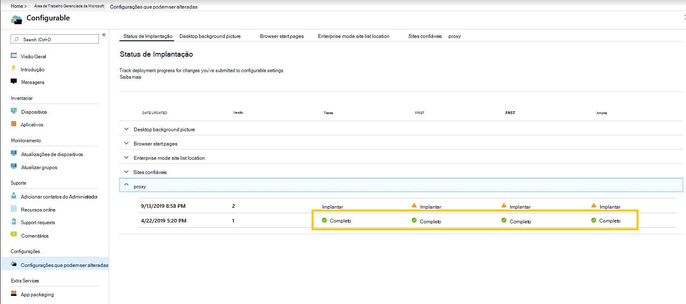
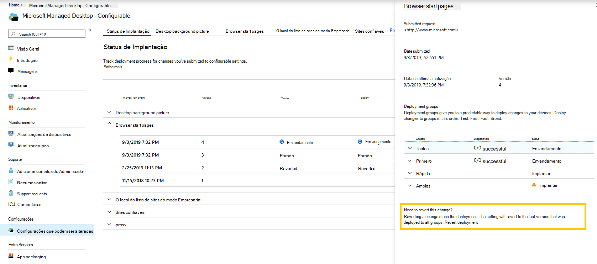

# Implantar e acompanhar configurações configuráveis-Microsoft Managed desktopDeploy and track configurable settings - Microsoft Managed Desktop

Depois de fazer alterações nas categorias de configuração e testar uma implantação, a página status da implantação permite que você comece a implantar suas configurações para grupos.After you make changes to your setting categories and stage a deployment, the Deployment status page allows you to begin deploying your settings to groups. Esta página mostra um resumo de cada configuração configurável.This page shows a summary of each configurable setting. Ao abrir uma categoria de configuração, você pode implantar configurações para agrupar e acompanhar o progresso dessas implantações.By opening a setting category you can deploy settings to groups and track the progress of these deployments.

## Status de implantaçãoDeployment statuses 

Estes são os status que você verá para cada implantação.These are the statuses you’ll see for each deployment.

StatusStatus  | ExplicaçãoExplanation 
--- | --- 
ImplantarDeploy | Sua alteração está aguardando para ser implantada nesse grupo.Your change is waiting to be deployed to this group.
Em andamentoIn progress | A alteração está sendo aplicada aos dispositivos ativos desse grupo.The change is being applied to active devices in this group. 
CompletoComplete | A alteração foi concluída em todos os dispositivos ativos desse grupo.The change completed on all active devices in this group. 
FalhouFailed | A alteração falhou em 10 por cento de dispositivos ativos no grupo, portanto, a implantação foi interrompida.The change failed on a 10 percent of active devices in the group, so the deployment was stopped.   Uma solicitação de suporte será aberta automaticamente com as operações de área de trabalho gerenciada da Microsoft para solucionar problemas de implantação.A support request will be automatically opened with Microsoft Managed Desktop operations to troubleshoot the deployment. 
RevertidosReverted | A alteração foi revertida para a última alteração implantada com êxito em todos os grupos de implantação.The change was reverted to the last change that was successfully deployed to all deployment groups.

## Implantar alteraçõesDeploy changes

Mostraremos a imagem de plano de fundo da área de trabalho nessas instruções.We’ll show Desktop background picture in these instructions. Depois de testar uma implantação, implante as alterações da página status da implantação.After you’ve staged a deployment, you deploy changes from the Deployment status page. 

**Para implantar alterações****To deploy changes**

1. Entre no [Microsoft Endpoint Manager](https://endpoint.microsoft.com/) e navegue até o menu **dispositivos**Sign in to [Microsoft Endpoint Manager](https://endpoint.microsoft.com/) and navigate to the **Devices** menu
2. Procure a seção área de trabalho gerenciada da Microsoft, selecione **configurações**.Look for the Microsoft Managed Desktop section, select **Settings**.
3. Em espaço de trabalho de **status da implantação** , selecione a configuração que você deseja implantar e, em seguida, selecione a implantação em estágios a ser implantada.In **Deployment status** workspace, select the setting you want to deploy, and then select the staged deployment to deploy.
4. Selecione **implantar** para implantar a alteração em um dos grupos de implantação.Select **Deploy** to deploy the change to one of the deployment groups.

> [!NOTE] 
> O ícone de cuidado laranja indica que há um grupo anterior disponível para implantação conforme recomendado para distribuição na ordem.The orange caution icon indicates there is a previous group available for deployment as it’s recommended to roll out in order. 

<!-- Needs picture updated to show MEM  -->

Recomendamos a implantação de grupos de implantação nesta ordem: Test, First, Fast e, em seguida, ampla.We recommend deploying to deployment groups in this order: Test, First, Fast, and then Broad. 

Quando as alterações são concluídas em cada grupo, o status é alterado para **concluído**.When changes complete in each group, the status changes to **Complete**.

<!-- Needs picture updated to show MEM  -->

## Reverter implantaçãoRevert deployment

Depois de implantar uma alteração, você pode reverter do **status de implantação**.After you’ve deployed a change, you can revert from **Deployment status**. Ao reverter uma alteração **em andamento** ou **concluída**, a implantação atual é interrompida.When you revert a change that is **In progress** or **Complete**, the current deployment stops. A configuração será revertida para a última versão implantada em todos os grupos.The setting will revert to the last version that was deployed to all groups. 

Mostraremos as etapas para reverter uma alteração usando a imagem de plano de fundo da área de trabalho como um exemplo.We’ll show the steps to revert a change using the Desktop background picture as an example. 

**Para reverter uma alteração****To revert a change**
1. Entre no [Microsoft Endpoint Manager](https://endpoint.microsoft.com/) e navegue até o menu **dispositivos**Sign in to [Microsoft Endpoint Manager](https://endpoint.microsoft.com/) and navigate to the **Devices** menu
2. Procure a seção área de trabalho gerenciada da Microsoft, selecione **configurações**.Look for the Microsoft Managed Desktop section, select **Settings**.
3. Em espaço de trabalho de **status da implantação** , selecione a configuração que você deseja reverter e selecione a implantação em estágios a ser revertida.In **Deployment status** workspace, select the setting you want to revert, and then select the staged deployment to revert.
4. Em **precisa reverter essa alteração?**, selecione **reverter implantação**.Under **Need to revert this change?**, select **Revert deployment**.

<!-- Needs picture updated to show MEM  -->

## Recursos adicionaisAdditional resources
- [Visão geral das configurações configuráveisConfigurable settings overview](config-setting-overview.md)
- [Referência de configurações que podem ser alteradasConfigurable settings reference](config-setting-ref.md) 
