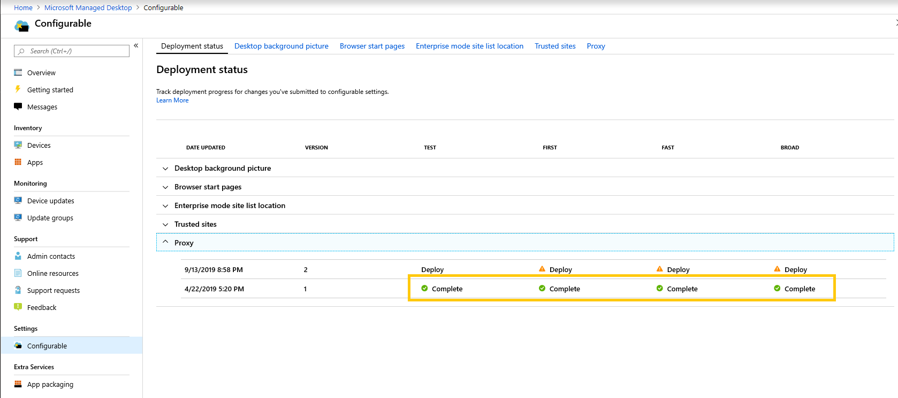

# Implantar e acompanhar configurações configuráveis-Microsoft Managed desktop

Depois de fazer alterações nas categorias de configuração e testar uma implantação, a página status da implantação permite que você comece a implantar suas configurações para grupos. Esta página mostra um resumo de cada configuração configurável. Ao abrir uma categoria de configuração, você pode implantar configurações para agrupar e acompanhar o progresso dessas implantações.

## Status de implantação 

Estes são os status que você verá para cada implantação.

Status  | Explicação 
--- | --- 
Implantar | Sua alteração está aguardando para ser implantada nesse grupo.
Em andamento | A alteração está sendo aplicada aos dispositivos ativos desse grupo. 
Completo | A alteração foi concluída em todos os dispositivos ativos desse grupo. 
Falhou | A alteração falhou em 10 por cento de dispositivos ativos no grupo, portanto, a implantação foi interrompida.   Uma solicitação de suporte será aberta automaticamente com as operações de área de trabalho gerenciada da Microsoft para solucionar problemas de implantação. 
Revertidos | A alteração foi revertida para a última alteração implantada com êxito em todos os grupos de implantação.

## Implantar alterações

Mostraremos a imagem de plano de fundo da área de trabalho nessas instruções. Depois de testar uma implantação, implante as alterações da página status da implantação. 

**Para implantar alterações**

1. Entrar no [portal de administração de área de trabalho gerenciada da Microsoft](https://aka.ms/mwaasportal)
2. Em **configurações**, selecione **configurável**.
3. Em espaço de trabalho de **status da implantação** , selecione a configuração que você deseja implantar e, em seguida, selecione a implantação em estágios a ser implantada.
4. Selecione **implantar** para implantar a alteração em um dos grupos de implantação.

 implantação visão geral da área de trabalho gerenciada da Microsoft recomenda a implantação de grupos de implantação nesta ordem: Test, First, Fast e, em seguida, ampla. 

Quando as alterações são concluídas em cada grupo, o status é alterado para **concluído**.

## Reverter implantação

Depois de implantar uma alteração, você pode reverter do **status de implantação**. Ao reverter uma alteração **em andamento** ou **concluída**, a implantação atual é interrompida. A configuração será revertida para a última versão implantada em todos os grupos. 

Mostraremos as etapas para reverter uma alteração usando a imagem de plano de fundo da área de trabalho como um exemplo. 

**Para reverter uma alteração**
1. Entrar no [portal de administração de área de trabalho gerenciada da Microsoft](https://aka.ms/mwaasportal)
2. Em **configurações**, selecione **configurável**.
3. Em espaço de trabalho de **status da implantação** , selecione a configuração que você deseja reverter e selecione a implantação em estágios a ser revertida.
4. Em **precisa reverter essa alteração**, selecione **reverter implantação**.

 

## Recursos adicionais
- [Visão geral das configurações configuráveis](config-setting-overview.md)
- [Referência de configurações que podem ser alteradas](config-setting-ref.md) 
