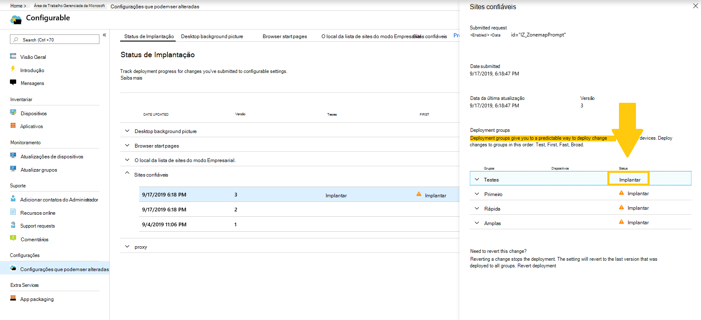

# Implantar e rastrear configurações configuráveis - Área de Trabalho Gerenciada da Microsoft

Depois de fazer alterações em suas categorias de configuração e preparar uma implantação, a página de status de implantação permite que você comece a implantar suas configurações em grupos. Esta página mostra um resumo de cada configuração configurável. Ao abrir uma categoria de configuração, você pode implantar configurações em grupos e acompanhar o andamento dessas implantações.

## Status da implantação

Esses são os status que você verá para cada implantação.

Status | Explicação
--- | ---
Implantar | Sua alteração está esperando para ser implantada nesse grupo.
Em andamento | A alteração está sendo aplicada a dispositivos ativos neste grupo.
Concluído | A alteração concluída em todos os dispositivos ativos neste grupo.
Falhou | A alteração falhou em 10% dos dispositivos ativos no grupo, portanto, a implantação foi interrompida.   Uma solicitação de suporte será aberta automaticamente com Área de Trabalho Gerenciada da Microsoft para solucionar problemas da implantação.
Revertido | A alteração foi revertida para a última alteração implantada com êxito em todos os grupos de implantação.

## Implantar alterações

Mostraremos a imagem de plano de fundo da área de trabalho nestas instruções. Depois de preparar uma implantação, você implanta alterações da página de status de implantação.

**Para implantar alterações**

1. Entre [no](https://endpoint.microsoft.com/) Microsoft Endpoint Manager e navegue até o menu **Dispositivos**
2. Procure a seção Área de Trabalho Gerenciada da Microsoft, selecione **Configurações**.
3. No espaço de trabalho **de status** de implantação, selecione a configuração que você deseja implantar e selecione a implantação em estágios a ser implantada.
4. Selecione **Implantar** para implantar a alteração em um dos grupos de implantação.

> [!NOTE]
> O ícone de cuidado laranja indica que há um grupo anterior disponível para implantação, pois é recomendável a distribuição em ordem.

<!-- Needs picture updated to show MEM  -->

Recomendamos a implantação em grupos de implantação nesta ordem: Test, First, Fast e, em seguida, Broad. 

Quando as alterações são concluídas em cada grupo, o status muda para **Complete**.

<!-- Needs picture updated to show MEM  -->

## Reverter implantação

Depois de ter implantado uma alteração, você pode reverter do **status de implantação.** Quando você reverter uma  alteração em andamento ou **Concluída,** a implantação atual será interrompida. A configuração será revertida para a última versão que foi implantada em todos os grupos.

Mostraremos as etapas para reverter uma alteração usando a imagem em segundo plano da Área de Trabalho como exemplo. 

**Para reverter uma alteração**

1. Entre [no](https://endpoint.microsoft.com/) Microsoft Endpoint Manager e navegue até o menu **Dispositivos**
2. Procure a seção Área de Trabalho Gerenciada da Microsoft, selecione **Configurações**.
3. No espaço de trabalho **de status** de implantação, selecione a configuração que você deseja reverter e selecione a implantação em estágios para reverter.
4. Em **Necessidade de reverter essa alteração?**, selecione Reverter **implantação**.

<!-- Needs picture updated to show MEM  -->

## Recursos adicionais

- [Visão geral das configurações configuráveis](config-setting-overview.md)
- [Referência de configurações que podem ser alteradas](config-setting-ref.md) 
