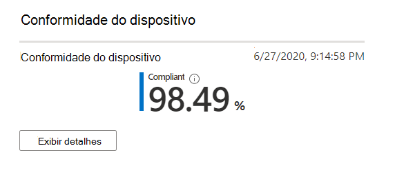

# Relatório de conformidade do dispositivoDevice compliance report

Este modo de exibição mostra a porcentagem de seus dispositivos de área de trabalho gerenciada da Microsoft que estão em conformidade com as políticas de conformidade definidas no Microsoft Intune.This view shows the percentage of your Microsoft Managed Desktop devices that conform to compliance policies set in Microsoft Intune.

Selecione **Exibir detalhes** para exibir informações específicas de todos os dispositivos de área de trabalho gerenciado da Microsoft ou apenas dispositivos que não estejam em conformidade com as políticas de conformidade.Select **View details** to view specific information for either all of your Microsoft Managed Desktop devices or only devices that do not conform to compliance policies. Use o menu suspenso para alternar entre esses modos de exibição.Use the pulldown menu to switch between these views. Para aparecer nesse modo de exibição, um dispositivo deve ser uma máquina física e sincronizado com o Intune nos últimos 30 dias.To appear in this view, a device must be a physical machine and have synced with Intune in the last 30 days.

Nesse modo de exibição, selecione **baixar dados completos** para exportar um arquivo delimitado por vírgula com as mesmas informações.From this view, select **Download full data** to export a comma-delimited file with the same information. No arquivo de exportação, as áreas exibidas como **esquema** aparecem como colunas.In the export file, the areas displayed as **Schema** appear as columns.