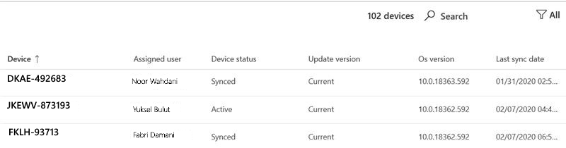

# Percepções de atualização da segurança do Windows
Esta exibição fornece uma visão geral do status das atualizações de segurança para seus dispositivos da Área de Trabalho Gerenciada da Microsoft. 

Para exibir dados de uso, selecione a <strong>guia Atualizações de segurança do Windows.</strong>

## Status do dispositivo

Para que os dispositivos sejam atualizados pelo Windows Update, eles devem estar conectados à Internet e não hibernar por no mínimo seis horas, dois dos quais devem ser contínuos. Embora seja possível que um dispositivo que não atender a esses requisitos seja atualizado, os dispositivos que atenderem a eles têm a maior probabilidade de serem atualizados. 

Categorizamos a atividade do dispositivo no contexto do Windows Update com estes termos:

- <strong>Ativo:</strong> Dispositivos que atendiam aos critérios mínimos de atividade (seis horas, duas horas contínuas) para o lançamento mais recente da atualização de segurança e fizeram check-in com o Microsoft Intune pelo menos a cada cinco dias
- <strong>Sincronizado:</strong> Dispositivos que entraram com o Intune nos últimos 28 dias
- <strong>Fora de sincronia:</strong> Dispositivos que <i>não</i> entraram com o Intune nos últimos 28 dias

## Atualizar status da versão

A Microsoft lança atualizações de segurança toda segunda terça-feira do mês. Cada versão adiciona atualizações importantes para vulnerabilidades de segurança conhecidas. A Área de Trabalho Gerenciada da Microsoft garante que 95% de seus dispositivos gerenciados sejam atualizados com a atualização de segurança mais recente disponível todos os meses. Às vezes, as atualizações de segurança são lançadas em outras ocasiões para tratar urgentemente de novas ameaças. A Área de Trabalho Gerenciada da Microsoft implanta essas atualizações de maneira semelhante.

Categorizamos o status das versões de atualização de segurança com estes termos:

- <strong>Atual:</strong> Dispositivos que estão executando a atualização lançada no mês atual
- <strong>Anterior:</strong> Dispositivos executando a atualização que foi lançada no mês anterior
- <strong>Mais antigo:</strong> Dispositivos executando qualquer atualização de segurança lançada antes do mês anterior

Você deve ver alguns <strong></strong> dispositivos na categoria Mais antiga – uma população grande ou crescente provavelmente indica um problema sério que você deve relatar à Área de Trabalho Gerenciada da Microsoft para que possamos investigar.

## Progresso da implantação

No início de cada ciclo de lançamento de atualização de segurança, a Área de Trabalho Gerenciada da Microsoft tira um instantâneo da população de dispositivos e define sua meta de implantação em 95% dessa população. A <strong>área de progresso</strong> de Implantação mostra uma tendência histórica, atualizada diariamente, acompanhando a proximidade com que a implantação de atualização atende a essa meta para cada versão. Este gráfico mostra apenas dispositivos com status Ativo.

Você pode exibir esses dados para ciclos de atualização anteriores usando o menu suspenso no canto superior direito. O período selecionado neste menu se aplica a todas as informações na página inteira.

Os <strong>dispositivos ativos atualizados</strong> pela área de grupo de implantação oferecem uma exibição diferente, mostrando o progresso da instalação da atualização para cada um dos grupos de implantação da Área de Trabalho Gerenciada da Microsoft.

The <strong>Days to reach target</strong> area displays how long it took for 95% of the total number of devices to be updated with the current security update. Enquanto a implantação está em andamento, essa área exibe <strong>Ainda</strong> atualizando até que o destino de 95% seja atingido para a atualização selecionada.

## Área de detalhes do dispositivo

A parte inferior do painel é uma tabela mostrando informações detalhadas para seus dispositivos, incluindo o status do dispositivo e o [status](#device-status) da [versão de atualização.](#update-version-status) Você pode pesquisar essa lista ou filtre-a por qualquer valor listado.

