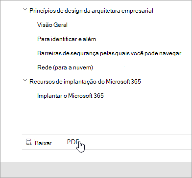
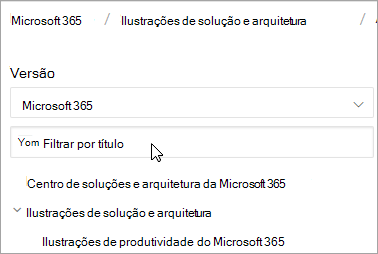
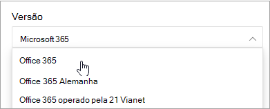
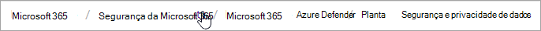
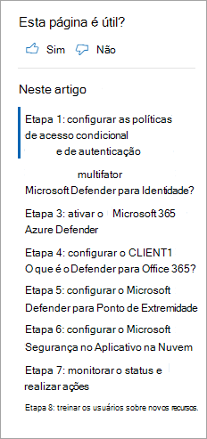
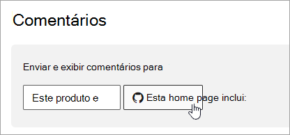

# Guia de navegação de documentos do Microsoft 365

Este tópico fornece algumas dicas e truques para navegar no espaço de documentação técnica do Microsoft 365.  

## Página hub

A página de hub do Microsoft 365 pode ser encontrada em e é o ponto de entrada para localizar conteúdo relevante do [https://aka.ms/microsoft365docs](./index.yml) Microsoft 365.

Você sempre pode navegar de volta para esta página selecionando **o Microsoft 365** no header na parte superior de cada página dentro do conjunto de documentação técnica do Microsoft 365:

## Documentação offline

Se quiser exibir a documentação do Microsoft 365 em um sistema offline, você pode criar um PDF onde quer que esteja na documentação técnica do Microsoft 365.

Se você quiser criar um PDF, selecione o link **Baixar PDF** encontrado na parte inferior de cada índice de conteúdo.

## Pesquisa TOC 
No docs.microsoft.com, você pode pesquisar o conteúdo no índice de conteúdo usando a caixa de pesquisa de filtro na parte superior:

## Filtro de versão
A documentação técnica do Microsoft 365 fornece conteúdo para produtos adicionais, incluindo o Office 365 Germany e o Office 365 operado pela 21 Vianet (China). Os recursos podem variar entre essas versões e, como tal, às vezes, o conteúdo em si pode variar.

Você pode usar o filtro de versão para garantir que você está vendo conteúdo para a versão apropriada do Microsoft 365:

## Breadcrumbs

As amplitudes podem ser encontradas abaixo do header e acima do índice de conteúdo e indicam onde o artigo atual está localizado no índice de conteúdo.  Isso não só ajuda a definir o contexto para qual tipo de conteúdo você está lendo, mas também permite que você navegue até a árvore de conteúdo de volta:

## Navegação de seção de artigo

O painel de navegação à direita permite que você navegue rapidamente até seções dentro de um artigo, bem como identifique sua localização no artigo.  

## Enviar comentários de documentos

Se você encontrar algo errado em um artigo, poderá enviar comentários para a equipe de conteúdo do SQL para esse artigo, rolando para baixo até a parte inferior da página e selecionando Comentários de **conteúdo.**

## Contribuir com a documentação do Microsoft 365

Você sabia que poderia editar o conteúdo em docs.microsoft.com você mesmo? Se você fizer isso, não só nossa documentação melhorará, mas também será creditado como colaborador da página. Para começar, consulte:

- [Guia do colaborador do Microsoft Docs](/contribute/)

## Próximas etapas

- Começar com a documentação técnica do [Microsoft 365](index.yml).