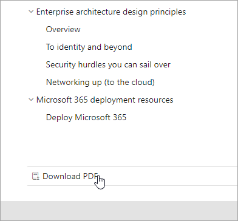

# Guia de navegação de documentos do Microsoft 365Microsoft 365 docs navigation guide

Este tópico fornece algumas dicas e truques para navegar no espaço de documentação técnica do Microsoft 365.This topic provides some tips and tricks for navigating the Microsoft 365 technical documentation space.  

## Página hubHub page

A página de hub do Microsoft 365 pode ser encontrada em e é o ponto de entrada para localizar conteúdo relevante do [https://aka.ms/microsoft365docs](./index.yml) Microsoft 365.The Microsoft 365 hub page can be found at [https://aka.ms/microsoft365docs](./index.yml) and is the entry point for finding relevant Microsoft 365 content.

Você sempre pode navegar de volta para esta página selecionando **o Microsoft 365** no header na parte superior de cada página dentro do conjunto de documentação técnica do Microsoft 365:You can always navigate back to this page by selecting **Microsoft 365** from the header at the top of every page within the Microsoft 365 technical documentation set:

## Documentação offlineOffline documentation

Se quiser exibir a documentação do Microsoft 365 em um sistema offline, você pode criar um PDF onde quer que esteja na documentação técnica do Microsoft 365.If you would like to view the Microsoft 365 documentation on an offline system, you can create a PDF wherever you are in the Microsoft 365 technical documentation.

Se você quiser criar um PDF, selecione o link **Baixar PDF** encontrado na parte inferior de cada índice de conteúdo.If you'd like to create a PDF, select the **Download PDF** link found at the bottom of every table of contents.

## Pesquisa TOCTOC search 
No docs.microsoft.com, você pode pesquisar o conteúdo no índice de conteúdo usando a caixa de pesquisa de filtro na parte superior:On docs.microsoft.com, you can search the content in the table of contents by using the filter search box at the top:

## Filtro de versãoVersion filter
A documentação técnica do Microsoft 365 fornece conteúdo para produtos adicionais, incluindo o Office 365 Germany e o Office 365 operado pela 21 Vianet (China).The Microsoft 365 technical documentation provides content for additional products, including Office 365 Germany and Office 365 operated by 21 Vianet (China). Os recursos podem variar entre essas versões e, como tal, às vezes, o conteúdo em si pode variar.Features can vary between these versions, and as such, sometimes the content itself can vary.

Você pode usar o filtro de versão para garantir que você está vendo conteúdo para a versão apropriada do Microsoft 365:You can use the version filter to ensure that you are seeing content for the appropriate version of Microsoft 365:

## BreadcrumbsBreadcrumbs

As amplitudes podem ser encontradas abaixo do header e acima do índice de conteúdo e indicam onde o artigo atual está localizado no índice de conteúdo.Breadcrumbs can be found below the header and above the table of contents, and indicate where the current article is located in the table of contents.  Isso não só ajuda a definir o contexto para qual tipo de conteúdo você está lendo, mas também permite que você navegue até a árvore de conteúdo de volta:Not only does this help set the context to what type of content you're reading, but it also allows you to navigate back up the table of contents tree:

## Navegação de seção de artigoArticle section navigation

O painel de navegação à direita permite que você navegue rapidamente até seções dentro de um artigo, bem como identifique sua localização no artigo.The right-hand navigation pane allows you to quickly navigate to sections within an article, as well as identify your location within the article.  

## Enviar comentários de documentosSubmit docs feedback

Se você encontrar algo errado em um artigo, poderá enviar comentários para a equipe de conteúdo do SQL para esse artigo, rolando para baixo até a parte inferior da página e selecionando Comentários de **conteúdo.**If you find something wrong within an article, you can submit feedback to the SQL Content team for that article by scrolling down to the bottom of the page and selecting **Content feedback**.

## Contribuir com a documentação do Microsoft 365Contribute to Microsoft 365 documentation

Você sabia que poderia editar o conteúdo em docs.microsoft.com você mesmo?Did you know that you could edit the content on docs.microsoft.com yourself? Se você fizer isso, não só nossa documentação melhorará, mas também será creditado como colaborador da página.If you do so, not only will our documentation improve, but you'll also be credited as a contributor to the page. Para começar, consulte:To get started, see:

- [Guia do colaborador do Microsoft DocsMicrosoft Docs contributor guide](/contribute/)

## Próximas etapasNext steps

- Começar com a documentação técnica do [Microsoft 365](index.yml).Get started with the [Microsoft 365 technical documentation](index.yml).