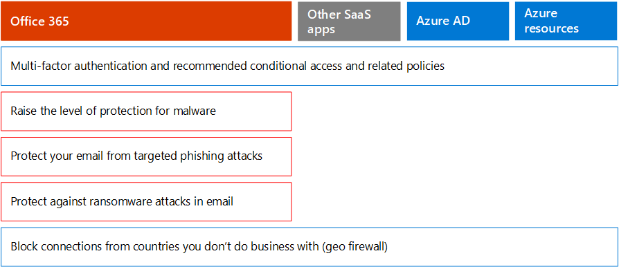

# Segurança da Microsoft 365 para responsáveis por decisões de negócios (BDMs)Microsoft 365 Security for Business Decision Makers (BDMs)

Este artigo discute alguns dos cenários mais comuns de ameaça e ataque enfrentados pelas organizações para seus ambientes Microsoft 365 e as ações recomendadas para a redução desses riscos.This article discusses some of the most common threat and attack scenarios currently faced by organizations for their Microsoft 365 environments, and recommended actions for mitigating these risks. Embora o Microsoft 365 seja fornecido com uma ampla variedade de recursos de segurança pré-configurados, ele também exige que o cliente realize a responsabilidade de proteger suas próprias identidades, dados e dispositivos usados para acessar os serviços de nuvem.While Microsoft 365 comes with a wide array of pre-configured security features, it also requires you as the customer to take responsibility to secure your own identities, data, and devices used to access cloud services. Esta orientação foi desenvolvida por Kozeta feixe (Microsoft Cloud Security Architect) e Thiagaraj Sundararajan (consultor sênior da Microsoft).This guidance was developed by Kozeta Beam (Microsoft Cloud Security Architect) and Thiagaraj Sundararajan (Microsoft Senior Consultant).

Este artigo é organizado por prioridade de trabalho, começando com a proteção dessas contas usadas para administrar os serviços e ativos mais importantes, como seu locatário, email e SharePoint.This article is organized by priority of work, starting with protecting those accounts used to administer the most critical services and assets, such as your tenant, e-mail, and SharePoint. Ele oferece uma maneira de método de abordagem de segurança e funciona em conjunto com a planilha a seguir para que você possa acompanhar o progresso dos participantes e das equipes em sua organização: [Microsoft 365 Security for BDMs](https://github.com/MicrosoftDocs/microsoft-365-docs/raw/public/microsoft-365/downloads/Microsoft-365-BDM-security-recommendations-spreadsheet.xlsx).It  provides a methodical way for approaching security and works together with the following spreadsheet so you can track your progress with stakeholders and teams across your organization: [Microsoft 365 security for BDMs spreadsheet](https://github.com/MicrosoftDocs/microsoft-365-docs/raw/public/microsoft-365/downloads/Microsoft-365-BDM-security-recommendations-spreadsheet.xlsx). 

A Microsoft fornece a ferramenta de Pontuação segura no seu locatário para analisar automaticamente a postura de segurança com base em suas atividades regulares, atribuir uma pontuação e fornecer recomendações de melhoria de segurança.Microsoft provides you with the Secure Score tool within your tenant to automatically analyze your security posture based on your regular activities, assign a score, and provide security improvement recommendations. Antes de executar as ações recomendadas neste artigo, anote sua pontuação e recomendações atuais.Before taking the actions recommended in this article, take note of your current score and recommendations. As ações recomendadas neste artigo aumentarão sua pontuação.The actions recommended in this article will increase your score. O objetivo não é atingir a pontuação máxima, mas ter em mente as oportunidades de proteger seu ambiente de uma maneira que não afete negativamente a produtividade dos seus usuários.The goal is not to achieve the max score, but to be aware of opportunities to protect your environment in a way that do not negatively affect productivity for your users. Confira a [Pontuação segura da Microsoft](mtp/microsoft-secure-score.md).See [Microsoft Secure Score](mtp/microsoft-secure-score.md).

Mais uma coisa antes de começarmos.One more thing before we get started . .. .. Certifique-se de [ativar o log de auditoria](../compliance/search-the-audit-log-in-security-and-compliance.md).be sure to [turn on the audit log](../compliance/search-the-audit-log-in-security-and-compliance.md). Você precisará desses dados mais tarde, no caso de você precisar investigar um incidente ou uma violação.You'll need this data later, in the event you need to investigate an incident or a breach. 

## Proteger contas privilegiadasProtect privileged accounts

Como primeira etapa, recomendamos garantir que as contas críticas no ambiente recebam uma camada adicional de proteção, pois essas contas têm acesso e permissões para gerenciar e alterar os serviços e recursos críticos que podem afetar negativamente a organização inteira, se forem comprometidos.As a first step, we recommend ensuring critical accounts in the environment are given an extra layer of protection as these accounts have access and permissions to manage and alter critical services and resources which can negatively impact the entire organization, if compromised. A proteção de contas privilegiadas é uma das maneiras mais eficazes de proteger-se contra um invasor que busca elevar as permissões de uma conta comprometida para um administrador.Protecting privileged accounts is one of the most effective ways to protect against an attacker who seeks to elevate the permissions of a compromised account to an administrative one. 

|RecomendaçãoRecommendation  |E3E3 |E5E5  |
|---------|---------|---------|
|Aplicar a MFA (autenticação multifator) para todas as contas administrativas.Enforce multi-factor authentication (MFA) for all administrative accounts.||| 
|Implemente o Azure Active Directory (Azure AD) de gerenciamento de identidade privilegiado (PIM) para aplicar acesso privilegiado just-in-time aos recursos do Azure AD e do Azure.Implement Azure Active Directory (Azure AD) Privileged Identity Management (PIM) to apply just-in-time privileged access to Azure AD and Azure resources. Você também pode descobrir quem tem acesso e examinar o acesso privilegiado.You can also discover who has access and review privileged access.|         | |
|Implemente o gerenciamento de acesso privilegiado para gerenciar o controle de acesso granular sobre tarefas administrativas privilegiadas no Office 365.Implement privileged access management to manage granular access control over privileged admin tasks in Office 365. |         | |
|Configurar e usar pata (estações de trabalho privilegiadas) para administrar serviços.Configure and use Privileged Access Workstations (PAW) to administer services. Não use as mesmas estações de trabalho para navegar na Internet e verificar emails não relacionados à sua conta administrativa.Do not use the same workstations for browsing the Internet and checking email not related to your administrative account.|  | | 

O diagrama a seguir ilustra esses recursos.The following diagram illustrates these capabilities.

Recomendações adicionais:Additional recommendations:
- Certifique-se de que as contas que estão sincronizadas no local não estão atribuídas a funções de administrador para serviços em nuvem.Ensure accounts that are synchronized from on-premises are not assigned admin roles for cloud services. Isso ajuda a evitar que um invasor Aproveite contas locais para obter acesso administrativo aos serviços em nuvem.This helps prevent an attacker from leveraging on-premises accounts to gain administrative access to cloud services. 
- Verifique se as contas de serviço não estão atribuídas a funções de administrador.Ensure service accounts are not assigned admin roles. Essas contas geralmente não são monitoradas e definidas com senhas que não expiram.These accounts are often not monitored and set with passwords that do not expire. Para começar, certifique-se de que as contas de serviços AADConnect e ADFS não sejam administradores globais por padrão.Start by ensuring the AADConnect and ADFS services accounts are not Global Admins by default.
- Remover licenças de contas de administrador.Remove licenses from admin accounts. A menos que haja um caso de uso específico para atribuir licenças a contas de administrador específicas, remova as licenças dessas contas.Unless there is a specific use case to assign licenses to specific admin accounts, remove licenses from these accounts. 

## Reduzir a superfície de ataqueReduce the surface of attack

A próxima área de foco está reduzindo a superfície de ataque.The next focus area is reducing the surface of attack. Isso pode ser feito com o mínimo de esforço e impacto para os seus usuários e serviços.This can be accomplished with minimal effort and impact to your users and services. Ao reduzir a área de superfície de ataque, os invasores têm menos meios de iniciar um ataque contra sua organização.By reducing the surface area of attack, attackers have fewer ways to launch an attack against your organization.

Aqui estão alguns exemplos:Here are some examples:
- Desabilite os protocolos POP3, IMAP e SMTP.Disable POP3, IMAP, and SMTP protocols. As organizações mais modernas não usam mais esses protocolos mais antigos.Most modern organizations no longer use these older protocols. Você pode desabilitá-los com segurança e permitir exceções apenas quando necessário.You can safely disable these and allow exceptions only as needed. 
- Reduza e mantenha o número de administradores globais no locatário para o mínimo necessário.Reduce and keep the number of Global Admins in the tenant to the absolute minimum required. Isso reduz diretamente a área de superfície de ataque para todos os aplicativos em nuvem.This directly reduces the surface area of attack for all Cloud applications. 
- Desative os servidores e aplicativos que não são mais usados em seu ambiente.Retire servers and applications that are no longer used in your environment. 
- Implemente um processo para desabilitar e excluir contas que não são mais usadas.Implement a process for disabling and deleting accounts that are no longer used. 

## Proteger contra ameaças conhecidasProtect against known threats

Ameaças conhecidas incluem malware, contas comprometidas e phishing.Known threats include malware, compromised accounts, and phishing. Algumas proteções contra essas ameaças podem ser implementadas rapidamente sem impacto direto nos seus usuários, enquanto outras exigem mais planejamento e treinamento do usuário.Some protections against these threats can be implemented quickly with no direct impact to your users, while others require more planning and user training. 

|RecomendaçãoRecommendation  |E3E3  |E5E5  |
|---------|---------|---------|
|**Configurar a autenticação multifator e usar políticas de acesso condicional recomendadas, incluindo políticas de risco de entrada**.**Setup multi-factor authentication and use recommended conditional access policies, including sign-in risk policies**. A Microsoft recomenda e testou um conjunto de políticas que trabalham em conjunto para proteger todos os aplicativos de nuvem, incluindo o Office 365 e os serviços do Microsoft 365.Microsoft recommends and has tested a set of policies that work together to protect all cloud apps, including Office 365 and Microsoft 365 services. Confira [configurações de acesso de dispositivo e identidade](./office-365-security/microsoft-365-policies-configurations.md).See [Identity and device access configurations](./office-365-security/microsoft-365-policies-configurations.md). | ||
|**Exija a autenticação multifator para todos os usuários**.**Require multi-factor authentication for all users**. Se você não tiver o licenciamento necessário para implementar as políticas de acesso condicional recomendadas, pelo menos exija autenticação multifator para todos os usuários.If you don't have the licensing required to implement the recommended conditional access policies, at a minimum require multi-factor authentication for all users.|||
|**Aumente o nível de proteção contra malware no email**.**Raise the level of protection against malware in mail**. O ambiente do Office 365 ou do Microsoft 365 inclui proteção contra malware, mas você pode aumentar essa proteção, bloqueando anexos com tipos de arquivo comumente usados para malware.Your Office 365 or Microsoft 365 environment includes protection against malware, but you can increase this protection by blocking attachments with file types that are commonly used for malware.|||
|**Proteger seu email contra ataques de phishing direcionados**.**Protect your email from targeted phishing attacks**. Se você configurou um ou mais domínios personalizados para o seu ambiente do Office 365 ou do Microsoft 365, é possível configurar a proteção antiphishing dirigida.If you've configured one or more custom domains for your Office 365 or Microsoft 365 environment, you can configure targeted anti-phishing protection. A proteção contra phishing, parte do defender para Office 365, pode ajudar a proteger sua organização contra ataques de phishing baseados em representação mal-intencionada e outros ataques de phishing.Anti-phishing protection, part of Defender for Office 365, can help protect your organization from malicious impersonation-based phishing attacks and other phishing attacks. Se você não configurou um domínio personalizado, não é necessário fazer isso.If you haven't configured a custom domain, you do not need to do this.| ||
|**Proteger contra ataques de ransomware no email**.**Protect against ransomware attacks in email**. O ransomware retira o acesso aos seus dados criptografando arquivos ou bloqueando telas de computador.Ransomware takes away access to your data by encrypting files or locking computer screens. Em seguida, tenta extort dinheiro de vítimas solicitando "resgate", geralmente na forma de cryptocurrencies como Bitcoin, no Exchange para retornar o acesso aos seus dados.It then attempts to extort money from victims by asking for "ransom," usually in form of cryptocurrencies like Bitcoin, in exchange for returning access to your data. Você pode ajudar a se defender contra o ransomware criando uma ou mais regras de fluxo de email para bloquear extensões de arquivo comumente usadas para ransomware ou avisar os usuários que recebem esses anexos por email.You can help defend against ransomware by creating one or more mail flow rules to block file extensions that are commonly used for ransomware, or to warn users who receive these attachments in email.|||
|**Bloquear conexões de países que você não faz negócios com**.**Block connections from countries that you don't do business with**. Crie uma política de acesso condicional do Azure AD para bloquear qualquer conexão proveniente desses países, criando efetivamente um firewall geográfico em torno do seu locatário.Create an Azure AD conditional access policy to block any connections coming from these countries, effectively creating a geo firewall around your tenant.| ||

O diagrama a seguir ilustra esses recursos.The following diagram illustrates these capabilities.

## Proteção contra ameaças desconhecidasProtect against unknown threats

Após adicionar proteções extras às suas contas privilegiadas e proteger contra ataques conhecidos, você deve mudar sua atenção para proteção contra ameaças desconhecidas.After adding extra protections to your privileged accounts and protecting against known attacks, shift your attention to protecting against unknown threats. Os adversários mais determinados e avançados usam métodos inovadores e novos e desconhecidos para organizações de ataques.The more determined and advanced adversaries use innovative and new, unknown methods to attack organizations. Com a grande telemetria de dados da Microsoft coletada em bilhões de dispositivos, aplicativos e serviços, podemos executar o defender para Office 365 no Windows, no Office 365 e no Azure para evitar ataques de dia zero, utilizando ambientes de caixa de areia e verificando a validade antes de permitir o acesso ao seu conteúdo.With Microsoft's vast telemetry of data gathered over billions of devices, applications, and services, we are able to perform Defender for Office 365 on Windows, Office 365, and Azure to prevent against Zero Day attacks, utilizing sand box environments, and checking validity before allowing access to your content. 

|RecomendaçãoRecommendation  |E3E3  |E5E5  |
|---------|---------|---------|
|**Configurar o Microsoft defender para Office 365** :**Configure Microsoft Defender for Office 365** : \* Anexos seguros\*    Safe Attachments \* Links seguros\*    Safe Links \* ATP para SharePoint, OneDrive e Microsoft Teams\*    ATP for SharePoint, OneDrive, and Microsoft Teams \* Anti-phishing no defender para proteção 365 do Office\*    Anti-phishing in Defender for Office 365 protection|         | |
|**Configurar os recursos do Microsoft defender para pontos de extremidade** :**Configure Microsoft Defender for Endpoint capabilities** : \* Windows Defender Antivirus\*    Windows Defender Antivirus  \* Proteção de exploração\*    Exploit protection   \* Redução da superfície de ataque\*    Attack surface reduction   \* Isolamento baseado em hardware\*    Hardware-based isolation  \* Acesso a pastas controladas\*    Controlled folder access     |         | |
|**Use o Microsoft Cloud app Security** para descobrir aplicativos SaaS e começar a usar análise de comportamento e detecção de anomalias.**Use Microsoft Cloud App Security** to discover SaaS apps and begin to use behavior analytics and anomaly detection. |         | |

O diagrama a seguir ilustra esses recursos.The following diagram illustrates these capabilities.

Recomendações adicionais:Additional recommendations:
- Comunicações de canal de parceiros seguros, como emails usando TLS.Secure partner channel communications like Emails using TLS.
- Abra a Federação do Microsoft Teams apenas para parceiros com os quais você se comunica.Open Teams Federation only to Partners you communicate with.
- Não adicione domínios de remetente, remetentes individuais ou IPs de origem à sua lista de permissões, pois isso permite que eles ignorem as verificações de spam e malware — uma prática comum com os clientes é adicionar seus próprios domínios aceitos ou vários outros domínios nos quais os problemas de fluxo de emails podem ter sido relatados à lista de permissões.Do not add sender domains, individual senders, or source IPs to your allow list as this allows these to bypass spam and malware checks — A common practice with customers is adding their own accepted domains or a number of other domains where email flow issues may have been reported to the allow list. Não adicione domínios na lista de filtragem de spam e de conexão, pois isso potencialmente ignora todas as verificações de spam.Do not add domains in the Spam and Connection Filtering list as this potentially bypasses all spam checks. 
- Habilitar notificações de spam de saída — habilitar notificações de spam de saída para uma lista de distribuição internamente para a equipe de assistência técnica ou administrador de ti para relatar se algum dos usuários internos estão enviando emails de spam externamente.Enable outbound spam notifications — Enable outbound spam notifications to a distribution list internally to the Helpdesk or IT Admin team to report if any of the internal users are sending out Spam emails externally. Pode ser um indicador de que a conta foi comprometida.This could be an indicator that the account has been compromised.
- Desabilitar o PowerShell remoto para todos os usuários – o PowerShell remoto é usado principalmente por administradores para acessar os serviços para fins administrativos ou acesso programático à API.Disable Remote PowerShell for all users — Remote PowerShell is mainly used by Admins to access services for administrative purposes or programmatic API access. Recomendamos desabilitar essa opção para usuários que não são administradores para evitar o reconhecimento, a menos que eles tenham uma necessidade de negócios para acessá-lo.We recommended disabling this option for non-Admin users to avoid reconnaissance unless they have a business requirement to access it. 
- Bloquear o acesso ao portal de gerenciamento do Microsoft Azure para todos os não administradores.Block access to the Microsoft Azure Management portal to all non-administrators. Você pode fazer isso criando uma regra de acesso condicional para bloquear todos os usuários, com exceção de administradores.You can accomplish this by creating a conditional access rule to block all users, with the exception of admins. 

## Assumir violaçãoAssume breach

Embora a Microsoft considere todas as medidas possíveis para evitar ameaças e ataques, recomendamos sempre trabalhar sob a mentalidade "supor a violação".While Microsoft takes every possible measure to prevent against threats and attacks, we recommend always working under the "Assume Breach" mindset. Mesmo que um invasor tenha sido gerenciado para invadir o ambiente, precisamos garantir que eles não consigam Exfiltrate dados ou informações de identidade do ambiente.Even if an Attacker has managed to intrude into the environment, we need to make sure they are unable to exfiltrate data or identity information from the environment. Por esse motivo, recomendamos habilitar a proteção contra vazamentos de dados confidenciais, como números de seguridade social, números de cartões de crédito, informações pessoais adicionais e outras informações confidenciais de nível organizacional.For this reason, we recommend enabling protection against sensitive data leaks such as Social Security numbers, credit cards numbers, additional personal information, and other organizational level confidential information. 

A mentalidade "supor violação" requer a implementação de uma estratégia de rede de confiança zero, o que significa que os usuários não são totalmente confiáveis apenas porque eles são internos da rede.The "Assume Breach" mindset requires implementing a zero trust network strategy, which means users are not fully trusted just because they are internal to the network. Em vez disso, como parte da autorização do que os usuários podem fazer, os conjuntos de condições são especificados e, quando essas condições forem atendidas, certos controles serão impostos.Instead, as part of authorization of what users can do, sets of conditions are specified, and when such conditions are met, certain controls are enforced. As condições podem incluir o status de integridade do dispositivo, o aplicativo que está sendo acessado, operações que estão sendo executadas e o riscoConditions may include device health status, application being accessed, operations being performed and user risk. Por exemplo, uma ação de registro de dispositivo sempre deve disparar a autenticação MFA para garantir que nenhum dispositivo Rouge seja adicionado ao seu ambiente.For example, a device enrollment action should always trigger MFA authentication to ensure no rouge devices are added to your environment. 

Uma estratégia de rede de confiança zero também exige que você saiba onde suas informações estão armazenadas e aplique os controles apropriados para classificação, proteção e retenção.A zero trust network strategy also requires that you know where your information is stored and apply appropriate controls for classification, protection, and retention. Para proteger efetivamente seus ativos mais importantes e confidenciais, você precisa primeiro identificar onde eles estão localizados e fazer o estoque, o que pode ser desafiador.To effectively protect your most critical and sensitive assets you need to first identify where these are located and take inventory, which can be challenging. Em seguida, trabalhe com sua organização para definir uma estratégia de governança.Next, work with your organization to define a governance strategy. A definição de um esquema de classificação para uma organização e a configuração de políticas, rótulos e condições exigem planejamento e preparação cuidadosos.Defining a classification schema for an organization and configuring policies, labels, and conditions requires careful planning and preparation. É importante perceber que esse não é um processo orientado por ti.It is important to realize that this is not an IT driven process. Certifique-se de trabalhar com sua equipe jurídica e de conformidade para desenvolver uma classificação apropriada e o esquema de rotulação para os dados da sua organização.Be sure to work with your legal and compliance team to develop an appropriate classification and labeling schema for your organization's data.

Os recursos de proteção de informações do Microsoft 365 podem ajudá-lo a descobrir quais informações você tem, onde elas estão armazenadas e quais informações exigem proteção adicional.Microsoft 365 information protection capabilities can help you discover what information you have, where it is stored, and which information requires additional protection. A proteção de informações é um processo contínuo e os recursos do Microsoft 365 fornecem visibilidade de como os usuários estão usando e distribuindo informações confidenciais, onde suas informações estão armazenadas no momento e onde elas fluem.Information protection is a continuous process and Microsoft 365 capabilities provide you with visibility into how users are using and distributing sensitive information, where your information is currently stored, and where it flows. Você também pode ver como os usuários manipulam informações regulamentadas para garantir que os rótulos e proteções apropriados sejam aplicados.You can also see how users handling information that is regulated to be sure the appropriate labels and protections are applied.

|RecomendaçãoRecommendation |E3E3|E5E5 |
|---------|---------|---------|
|**Revise e otimize o acesso condicional e as políticas relacionadas para alinhar seus objetivos para uma rede de confiança zero**.**Review and optimize your conditional access and related policies to align with your objectives for a zero trust network**. A proteção contra ameaças conhecidas inclui a implementação de um conjunto de [políticas recomendadas](./office-365-security/microsoft-365-policies-configurations.md).Protecting against known threats includes implementing a set of [recommended policies](./office-365-security/microsoft-365-policies-configurations.md). Revise sua implementação dessas políticas para garantir que você esteja protegendo seus aplicativos e dados contra hackers que obtiveram acesso à sua rede.Review your implementation of these policies to ensure you're protecting your apps and data against hackers who have gained access to your network. Observe que a política de proteção de aplicativos do Intune recomendada para o Windows 10 permite o WIP (proteção de informações do Windows).Note that the recommended Intune app protection policy for Windows 10 enables Windows Information Protection (WIP). O WIP protege contra vazas acidentais de seus dados da sua organização por meio de aplicativos e serviços, como email, mídia social e nuvem pública.WIP protects against accidental leaks of your organization data through apps and services, like email, social media, and the public cloud. |         ||
|**Desative o encaminhamento de email externo**.**Disable external email forwarding**. Hackers que obtêm acesso à caixa de correio de um usuário podem roubar seus emails Configurando a caixa de correio para encaminhar emails automaticamente.Hackers who gain access to a user's mailbox can steal your mail by setting the mailbox to automatically forward email. Isso pode acontecer mesmo sem a conscientização do usuário.This can happen even without the user's awareness. Você pode evitar que isso aconteça Configurando uma regra de fluxo de emails.You can prevent this from happening by configuring a mail flow rule.| ||
|**Desabilite o compartilhamento de calendário externo anônimo**.**Disable anonymous external calendar sharing**. Por padrão, o compartilhamento de calendário anônimo externo é permitido.By default external anonymous calendar sharing is allowed. [Desabilite o compartilhamento de calendário](https://docs.microsoft.com/exchange/sharing/sharing-policies/modify-a-sharing-policy) para reduzir possíveis vazamentos de informações confidenciais.[Disable calendar sharing](https://docs.microsoft.com/exchange/sharing/sharing-policies/modify-a-sharing-policy) to reduce potential leaks of sensitive information.| ||
|**Configure as políticas de prevenção contra perda de dados para dados confidenciais**.**Configure data loss prevention policies for sensitive data**. Crie uma política de prevenção de perda de dados no centro de conformidade de segurança &amp; para descobrir e proteger dados confidenciais, como números de cartão de crédito, números de seguridade social e números de contas bancárias.Create a Data Loss Prevention Policy in the Security &amp; Compliance center to discover and protect sensitive data such as credit card numbers, Social Security numbers and bank account numbers. O Microsoft 365 inclui vários tipos de informações confidenciais predefinidos que podem ser usados em políticas de prevenção contra perda de dados.Microsoft 365 includes many predefined sensitive information types you can use in data loss prevention policies. Você também pode criar seus próprios tipos de informações confidenciais para dados confidenciais personalizados para seu ambiente.You can also create your own sensitive information types for sensitive data that is custom to your environment. |||
|**Implementar políticas de classificação de dados e proteção de informações**.**Implement data classification and information protection policies**. Implementar rótulos de sensibilidade e usá-los para classificar e aplicar proteção a dados confidenciais.Implement sensitivity labels and use these to classify and apply protection to sensitive data. Você também pode usar esses rótulos em políticas de prevenção contra perda de dados.You can also use these labels in data loss prevention policies. Se você estiver usando os rótulos de proteção de informações do Azure, recomendamos que você evite criar novos rótulos em outros centros de administração.If you are using Azure Information Protection labels, we recommend that you avoid creating new labels in other admin centers.|         ||
|**Proteger dados em aplicativos e serviços de terceiros usando o Cloud app Security**.**Protect data in third-party apps and services by using Cloud App Security**. Configure as políticas de segurança de aplicativos de nuvem para proteger informações confidenciais entre aplicativos de nuvem de terceiros, como Salesforce, caixa ou dropbox.Configure Cloud App Security policies to protect sensitive information across third-party cloud apps, such as Salesforce, Box, or Dropbox. Você pode usar tipos de informações confidenciais e os rótulos de confidencialidade que você criou nas políticas de segurança do aplicativo de nuvem e aplicá-los em seus aplicativos SaaS.You can use sensitive information types and the sensitivity labels you created in Cloud App Security policies and apply these across your SaaS apps.   O Microsoft Cloud app Security permite que você aplique uma ampla variedade de processos automatizados.Microsoft Cloud App Security allow you to enforce a wide range of automated processes. As políticas podem ser definidas para fornecer varreduras de conformidade contínua, tarefas de eDiscovery legais, DLP para conteúdo confidencial compartilhado publicamente e muito mais.Policies can be set to provide continuous compliance scans, legal eDiscovery tasks, DLP for sensitive content shared publicly, and more. Cloud app Security pode monitorar qualquer tipo de arquivo com base em mais de 20 filtros de metadados (por exemplo, nível de acesso, tipo de arquivo).Cloud App Security can monitor any file type based on more than 20 metadata filters (for example, access level, file type). |         ||
|**Use [o Microsoft defender for Endpoint](https://docs.microsoft.com/windows/security/threat-protection/microsoft-defender-atp/information-protection-in-windows-overview) para identificar se os usuários armazenam informações confidenciais em seus dispositivos Windows**.**Use [Microsoft  Defender for Endpoint](https://docs.microsoft.com/windows/security/threat-protection/microsoft-defender-atp/information-protection-in-windows-overview) to identify if users store sensitive information on their Windows devices**. |         ||
|**Use o [scanner AIP](https://docs.microsoft.com/azure/information-protection/deploy-aip-scanner) para identificar e classificar informações entre servidores e compartilhamentos de arquivos**.**Use [AIP Scanner](https://docs.microsoft.com/azure/information-protection/deploy-aip-scanner) to identify and classify information across servers and file shares**. Use a ferramenta de relatório do AIP para exibir os resultados e tomar as ações apropriadas.Use the AIP reporting tool to view the results and take appropriate actions.|         ||

O diagrama a seguir ilustra esses recursos.The following diagram illustrates these capabilities.

## Monitoramento e auditoria contínuosContinuous monitoring and auditing

Por fim, mas não a monitoração e a auditoria menos contínuas do ambiente do Microsoft 365 junto com as janelas e dispositivos são fundamentais para garantir que você possa detectar e corrigir rapidamente qualquer invasão.Last, but not least Continuous Monitoring and Auditing of the Microsoft 365 environment along with the Windows and Devices is critical to making sure you are able to quickly detect and remediate any intrusions. Ferramentas como Pontuação segura, central de segurança e análises avançadas do Microsoft Intelligent Graph fornecem informações valiosas para seu locatário e vinculam enormes quantidades de dados de inteligência e segurança de ameaças para fornecer proteção e detecção de ameaças sem paralelo.Tools such as Secure Score, Security Center, and Microsoft Intelligent Graph's advanced analytics provide invaluable information into your tenant and link massive amounts of threat intelligence and security data to provide you unparalleled threat protection and detection.

|RecomendaçãoRecommendation |E3E3 |E5E5 |
|---------|---------|---------|
|Verifique se o **log de auditoria** está ativado.Ensure the **audit log** is turned on.|||
|**Revisar Pontuação segura semanalmente** , a pontuação segura é um local central para acessar o status de segurança da sua empresa e realizar ações com base nas recomendações de Pontuação segura.**Review Secure Score weekly** — Secure score is a central location to access the Security status of your company and take actions based on Secure score recommendations. É recomendável executar essa verificação semanal.It is recommended to perform this check weekly.|||
|Usar **o Microsoft defender para Office 365** Tools:Use **Microsoft Defender for Office 365** tools: \* Recursos de investigação e resposta contra ameaças\*    Threat investigation and response capabilities  \* Investigação e resposta automatizadas\*    Automated investigation and response |         ||
|Usar **o Microsoft defender para ponto de extremidade** :Use **Microsoft  Defender for Endpoint** :  \*    [Detecção de pontos de extremidade e resposta](https://docs.microsoft.com/windows/security/threat-protection/microsoft-defender-atp/overview-endpoint-detection-response)\*    [Endpoint detection and response](https://docs.microsoft.com/windows/security/threat-protection/microsoft-defender-atp/overview-endpoint-detection-response)   \* Pontuação segura de investigação e correção automatizada\*    Automated investigation and remediation Secure score  \*    [Caça avançada](https://docs.microsoft.com/windows/security/threat-protection/microsoft-defender-atp/advanced-hunting-overview)\*    [Advanced hunting](https://docs.microsoft.com/windows/security/threat-protection/microsoft-defender-atp/advanced-hunting-overview)  |         ||
|Use **o Microsoft Cloud app Security** para detectar um comportamento incomum nos aplicativos de nuvem para identificar o ransomware, usuários comprometidos ou aplicativos mal-intencionados, analisar o uso de alto risco e corrigi-lo automaticamente para limitar o risco à sua organização.Use **Microsoft Cloud App Security** to detect unusual behavior across cloud apps to identify ransomware, compromised users or rogue applications, analyze high-risk usage and remediate automatically to limit the risk to your organization.|         ||
|Use o **Microsoft Azure Sentinel** ou sua ferramenta Siem atual para monitorar ameaças em todo o seu ambiente.Use **Microsoft Azure Sentinel** or your current SIEM tool to monitor for threats across your environment. |         ||
|**Implantar o [Microsoft defender para identidade](https://docs.microsoft.com/azure-advanced-threat-protection/what-is-atp)** para monitorar e proteger contra ameaças direcionadas ao seu ambiente local do Active Directory.**Deploy [Microsoft Defender for Identity](https://docs.microsoft.com/azure-advanced-threat-protection/what-is-atp)** to monitor and protect against threats targeted to your on-premises Active Directory environment.   |         | |
|Use o **Azure defender** _ para monitorar ameaças em cargas de trabalho híbridas e de nuvem.Use the **Azure Defender** _ to monitor for threats across hybrid and cloud workloads. O Azure Defender_ inclui uma camada gratuita de recursos e uma camada padrão de recursos que são pagos com base em horas ou transações de recurso.Azure Defender_ includes a free tier of capabilities and a standard tier of capabilities that are paid for based on resource hours or transactions.|         |         |

O diagrama a seguir ilustra esses recursos.The following diagram illustrates these capabilities.

Principais ações de monitoramento recomendadas:Top recommended monitoring actions:
- **Analisar a pontuação segura da Microsoft semanalmente** , a pontuação segura é um local central para acessar o status de segurança do seu locatário e realizar ações com base nas principais recomendações.**Review Microsoft Secure Score weekly** — Secure score is a central location to access the security status of your tenant and to take actions based on top recommendations. É recomendável executar essa verificação semanal.It is recommended to perform this check weekly. A pontuação segura inclui recomendações de entre o Azure AD, o Intune, o Cloud app Security e o Microsoft defender para ponto de extremidade, bem como o Office 365.Secure Score includes recommendations from across Azure AD, Intune, Cloud App Security, and Microsoft Defender for Endpoint, as well as Office 365. 
- **Revisar logons arriscados semanalmente** — use o centro de administração do Azure ad para analisar semanalmente os logins arriscados.**Review risky logins weekly** — Use the Azure AD admin center to review risky sign-ins weekly. O RuleSet de identidade e de acesso ao dispositivo recomendado inclui uma política para impor a alteração de senha em entradas arriscadas.The recommended identity and device access ruleset includes a policy to enforce password change on risky sign-ins.  
- **Revisar os principais programas de malware e golpes por semana** — use o Microsoft defender para Office 365 Threat Explorer para analisar os principais usuários direcionados com malware e Phish e para descobrir a causa raiz do motivo pelo qual esses usuários são afetados.**Review top malware and phished users weekly** — Use Microsoft Defender for Office 365 Threat Explorer to review top users targeted with malware and phish and to find out the root cause of why these users are affected.
