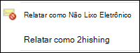
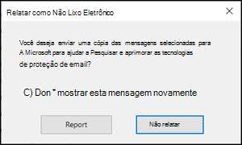

# <a name="install-and-use-the-junk-email-reporting-add-in-for-microsoft-outlook"></a>Instalar e usar o complemento Relatório de Lixo Eletrônico para o Microsoft Outlook

[!INCLUDE [Microsoft 365 Defender rebranding](../includes/microsoft-defender-for-office.md)]

**Aplica-se a**
- [Proteção do Exchange Online](exchange-online-protection-overview.md)
- [Plano 1 e plano 2 do Microsoft Defender para Office 365](defender-for-office-365.md)
- [Microsoft 365 Defender](../defender/microsoft-365-defender.md)

> [!NOTE]
> Se você não estiver usando o add-in Relatório de Lixo [](enable-the-report-message-add-in.md) Eletrônico no momento, recomendamos o complemento Mensagem de Relatório ou o complemento Relatar [Phishing.](enable-the-report-phish-add-in.md) Para mais informações, confira [Relatar mensagens e arquivos à Microsoft](report-junk-email-messages-to-microsoft.md).

O Junk Email Reporting Add-in para o Microsoft Outlook permite que os usuários enviem falsos positivos (emails bons marcados como spam), falsos negativos (email ruim permitido) e mensagens de phishing para a Microsoft. Se sua organização não usar a Proteção do Exchange Online (por exemplo, serviços locais do Exchange ou de email que não seja o Exchange Online), seu envio de relatório de lixo eletrônico não afetará sua filtragem de spam.

Este tópico explica como instalar e usar o complemento Relatório de Lixo Eletrônico.

## <a name="what-do-you-need-to-know-before-you-begin"></a>O que você precisa saber antes de começar?

- Para instalar o complemento Relatório de Lixo Eletrônico, consulte a seção Instalar o [complemento](#install-the-junk-email-reporting-add-in) Relatório de Lixo Eletrônico posteriormente neste artigo.

- O complemento Relatório de Lixo Eletrônico funciona com as seguintes versões do Outlook:

  - Outlook 2013 ou posterior
  - Outlook incluído no Microsoft 365 Apps para empresas

- Para obter mais informações sobre o relatório de mensagens para a Microsoft, consulte [Report messages and files to Microsoft](report-junk-email-messages-to-microsoft.md).

## <a name="use-the-junk-email-reporting-add-in-to-report-spam-and-phishing-messages"></a>Use o complemento Relatório de Lixo Eletrônico para relatar mensagens de spam e phishing

1. Para mensagens na Caixa de Entrada ou em qualquer outra pasta de email, exceto Lixo Eletrônico, use qualquer um dos seguintes métodos para relatar mensagens de spam e phishing:

   - Selecione a mensagem ou abra a mensagem. Na guia **Home** ou **Message** na faixa de opções, clique em **Lixo** Eletrônico e, em seguida, selecione Relatório como **Lixo** Eletrônico ou Relatório **como Phishing**.

     

   - Clique com o botão direito do mouse na mensagem, selecione **Lixo** Eletrônico e, em seguida, selecione **Relatório como Lixo** Eletrônico ou Relatório como **Phishing**.

     

   - Selecione várias mensagens, clique com o botão direito do mouse e selecione **Relatório como Lixo** Eletrônico ou Relatório como **Phishing**.

     

2. Na caixa de diálogo exibida, leia as informações e clique em **Relatar**. Se você mudar de ideia, clique **em Não Relatar**.

   

   

3. As mensagens selecionadas serão enviadas à Microsoft para análise e:

   - Movido para a pasta Lixo Eletrônico se tiver sido relatado como spam.
   - Excluído se tiver sido relatado como phishing.

   Para confirmar se as mensagens foram enviadas, abra sua pasta **Itens Enviados** para exibir as mensagens enviadas.

## <a name="use-the-junk-email-reporting-add-in-to-report-non-spam-and-phishing-messages-from-the-junk-email-folder"></a>Use o complemento Relatório de Lixo Eletrônico para relatar mensagens de não spam e phishing da pasta Lixo Eletrônico

1. Na pasta Lixo Eletrônico, use qualquer um dos seguintes métodos para relatar falsos positivos de spam ou mensagens de phishing:

   - Selecione a mensagem ou abra a mensagem. Na guia **Home** ou **Message** na faixa de opções, clique em **Não Lixo** Eletrônico e selecione **Relatório como** Não Lixo Eletrônico ou Relatório **como Phishing**.

     

   - Clique com o botão direito do mouse na mensagem, clique em **Lixo** Eletrônico e selecione **Relatório como Não** Lixo Eletrônico ou Relatório como **Phishing**.

     

   - Selecione várias mensagens, clique com o botão direito do mouse e selecione **Relatório como Não** Lixo Eletrônico ou Relatório como **Phishing**.

     

2. Na caixa de diálogo exibida, leia as informações e clique em **Relatar**. Se você mudar de ideia, clique **em Não Relatar**.

   

   

3. As mensagens selecionadas serão enviadas à Microsoft para análise e:

   - Movido para a pasta Lixo Eletrônico se tiver sido relatado como spam.
   - Excluído se tiver sido relatado como phishing.

   Para confirmar se as mensagens foram enviadas, abra sua pasta **Itens Enviados** para exibir as mensagens enviadas.

## <a name="install-the-junk-email-reporting-add-in"></a>Instalar o complemento Relatório de Lixo Eletrônico

- Você precisa ter privilégios de administrador no computador onde você está instalando o complemento.

- Acesse <https://www.microsoft.com/download/details.aspx?id=18275> e baixe o arquivo .msi apropriado para sua versão do Office para um local fácil de encontrar:

  - **32 bits**: `Junk Reporting Add-in for Office 2007, 2010, 2013, and 2016 (32-bit).msi`
  - **64 bits:**`Junk Reporting Add-in for Office 2007, 2010, 2013, and 2016 (64-bit).msi`

- Para o Outlook 2013 ou posterior, o único pré-requisito é o Microsoft .NET Framework 2.0. No Windows 10, você não instala o .NET Framework 2.0 de um download.

### <a name="install-the-junk-email-reporting-add-in-using-the-setup-wizard"></a>Instalar o Complemento de Relatório de Lixo Eletrônico usando o assistente de Instalação

1. Feche o Outlook no computador.

2. No Windows 10, verifique se o .NET Framework 2.0 está habilitado. Para obter instruções, [consulte Enable the .NET Framework 3.5 in Control Panel](/dotnet/framework/install/dotnet-35-windows-10#enable-the-net-framework-35-in-control-panel).

3. Localize o arquivo .msi que você baixou e clique duas vezes nele.

4. Na página **Bem-vindo à Configuração do Suplemento Relatório de Lixo Eletrônico para Microsoft** e clique em **Próximo**.

5. Revise o contrato de licença, clique em **Aceito os** termos no Contrato de Licença se você concordar com os termos e clique em **Próximo**.

6. Quando o assistente for concluído, clique em **Concluir**.

Inicie o Outlook.

Procure o botão **Lixo Eletrônico** na faixa de opções do Outlook. Agora, você pode relatar mensagens de lixo eletrônico à Microsoft selecionando-as na sua Caixa de Entrada e clicando no botão **Relatar Lixo Eletrônico**.

Selecione a seta para baixo ao lado de **Lixo Eletrônico** para obter mais opções, como **Relatar como Phishing** se você quiser relatar emails de esquemas de phishing para a Microsoft. Na pasta Lixo Eletrônico, você também pode selecionar, **Relatar como não sendo lixo eletrônico** se um email tiver sido identificado incorretamente como lixo eletrônico.

### <a name="install-the-junk-email-reporting-add-in-using-silent-mode"></a>Instalar o Suplemento Relatório de Lixo Eletrônico usando Modo Silencioso

1. Feche o Outlook no computador.

2. No Windows 10, instale o .NET Framework 2.0 executando o seguinte comando:

   ```dos
   DISM /Online /Enable-Feature /FeatureName:NetFx3 /All
   ```

3. Para instalar o add-in sem nenhuma interação do usuário, abra um Prompt de Comando e use a seguinte sintaxe:

   ```dos
   msiexec /qn /i "<PathToMSIFile>\<MSIFile>" [MaxMessageSelection=<1-50>] [BccEmailAddress="<EmailAddress1>; <EmailAddress2>"...]
   ```

   - `MaxMessageSelection` especifica o número máximo de mensagens que você pode selecionar para um único envio. Os valores válidos são de 1 a 50. O valor padrão é 15.

   - `BccEmailAddress` especifica destinatários Cc adicionais que receberão uma cópia de todos os envios do usuário. O valor padrão está em branco (nenhum destinatário Cc adicional).

   Este exemplo instala a versão de 64 bits do complemento do caminho especificado com as configurações padrão.

   ```dos
   msiexec /qn /i "C:\Downloads\Junk Reporting Add-in for Office 2007, 2010, 2013, and 2016 (64-bit).msi"
   ```

   Este exemplo instala a versão de 32 bits do complemento do caminho especificado com as seguintes configurações adicionais:

   - Até 20 mensagens podem ser selecionadas em um único envio.
   - junkreports@contoso.com e hollyd@treyresearch.net receber cópias Cc de todos os envios.

   ```dos
   msiexec /qn /i "C:\Downloads\Junk Reporting Add-in for Office 2007, 2010, 2013, and 2016 (32-bit).msi" MaxMessageSelection=20 BccEmailAddress="junkreports@contoso.com; hollyd@treyresearch.net"
   ```

### <a name="how-do-you-know-this-worked"></a>Como saber se funcionou?

Para verificar se você instalou com êxito o Complemento de Relatório de Lixo Eletrônico, faça as seguintes etapas no Outlook:

- Selecione a mensagem ou abra a mensagem. Na guia **Home** ou **Message** na faixa de opções, clique em **Lixo** Eletrônico e verifique se as seguintes opções estão disponíveis:

  - **Relatório como Lixo Eletrônico**
  - **Relatório como Phishing**
  - **Opções de relatório de lixo eletrônico**
  - **Relatar Ajuda de Lixo Eletrônico**

  

- Clique com o botão direito do mouse na mensagem, selecione **Lixo** Eletrônico e verifique se as seguintes opções estão disponíveis:

  - **Relatório como Lixo Eletrônico**
  - **Relatório como Phishing**
  - **Opções de relatório de lixo eletrônico**
  - **Relatar Ajuda de Lixo Eletrônico**

  

- Selecione várias mensagens, clique com o botão direito do mouse e verifique se as seguintes opções estão disponíveis:

  - **Relatório como Lixo Eletrônico**
  - **Relatório como Phishing**

  

- Faça as ações anteriores na pasta **Lixo Eletrônico** e verifique se as opções **anteriores** de relatório de lixo eletrônico agora não são **lixo eletrônico.**

  

  

  

## <a name="uninstall-the-junk-email-reporting-add-in"></a>Desinstalar o Suplemento Relatório de Lixo Eletrônico

Depois de fechar o Outlook, use qualquer um dos procedimentos a seguir para desinstalar o Complemento de Relatório de Lixo Eletrônico:

- **Painel de Controle**: pressione a tecla Windows + R. Na caixa **de diálogo Executar** que é aberta, digite e clique em `control appwiz.cpl` **OK**.

  Encontre e selecione **o Microsoft Junk Email Reporting Add-in** na lista e clique em **Desinstalar**.

- **Pacote do Windows Installer**: local ou baixe o arquivo .msi apropriado e clique duas vezes nele.

  - **32 bits**: `Junk Reporting Add-in for Office 2007, 2010, 2013, and 2016 (32-bit).msi`

  - **64 bits:**`Junk Reporting Add-in for Office 2007, 2010, 2013, and 2016 (64-bit).msi`

  Na caixa de diálogo exibida, selecione **Remover o Microsoft Junk Email Reporting Add-in para o Outlook** e clique em **Próximo**.

- **Modo Silencioso**: localmente ou baixe o arquivo .msi apropriado. Em uma janela prompt de comando, substitua pelo local do arquivo \<PathToFile\> .msi e execute um dos seguintes comandos:

  - **32 bits**:

    ```dos
    msiexec /x "<PathToFile>\Junk Reporting Add-in for Office 2007, 2010, 2013, and 2016 (32-bit).msi" /qn MSIRESTARTMANAGERCONTROL="DisableShutdown"
    ```

  - **64 bits:**

    ```dos
    msiexec /x "<PathToFile>\Junk Reporting Add-in for Office 2007, 2010, 2013, and 2016 (64-bit).msi" /qn MSIRESTARTMANAGERCONTROL="DisableShutdown"
    ```

Quando você abre o Outlook após a desinstalação, as opções de relatório de lixo eletrônico, não lixo eletrônico e phishing devem ter desaparecido.

## <a name="troubleshooting-the-junk-email-reporting-add-in"></a>Solução de problemas do complemento Relatório de Lixo Eletrônico

Ocasionalmente, você pode ter problemas com o Outlook depois de adicionar o Junk Email Reporting Add-In. Esta seção descreve problemas que você pode encontrar, juntamente com dicas para resolver esses problemas.

### <a name="troubleshooting-for-users"></a>Solução de problemas para usuários

Você tem um ou mais dos seguintes problemas:

- Nada acontece quando você clica em **Relatar Lixo Eletrônico**
- O Outlook para de responder depois que você selecionar uma mensagem de email
- O lixo eletrônico relatado não pode ser entregue devido a uma resposta "não entregue"

Para corrigir esse problema, faça as seguintes etapas:

1. Feche e reinicie o Outlook.
2. Crie e envie uma mensagem de teste e verifique se o destinatário recebeu a mensagem.
3. Se o problema persistir, contate o administrador.

Para outros métodos que você pode usar para enviar mensagens à Microsoft, consulte [Report messages and files to Microsoft](report-junk-email-messages-to-microsoft.md).

### <a name="troubleshooting-for-admins"></a>Solução de problemas para administradores

#### <a name="problem-an-error-message-continually-appears-that-asks-users-to-contact-their-system-administrator"></a>Problema: uma mensagem de erro é exibida continuamente que solicita que os usuários contatem o administrador do sistema

1. Verificar ou definir `LoggingLevel` a chave do Registro como o valor "Verbose":

   - Outlook de **32 bits no Windows de 32 bits**:

     ```text
     Windows Registry Editor Version 5.00

     [HKEY_LOCAL_MACHINE\Software\Microsoft\Junk Email Reporting\Addins]
     "LoggingLevel"="Verbose"
     ```

   - **Outlook de 32 bits no Windows de 64 bits**:

     ```text
     Windows Registry Editor Version 5.00

     [HKEY_LOCAL_MACHINE\Software\Wow6432Node\Microsoft\Junk Email Reporting\Addins]
     "LoggingLevel"="Verbose"
     ```

   - **Outlook de 64 bits**:

     ```text
     Windows Registry Editor Version 5.00

     [HKEY_LOCAL_MACHINE\Software\Microsoft\Junk E-mail Reporting\Addins]
     "LoggingLevel"="Verbose"
     ```

2. Reinicie o Outlook e peça que os usuários reportem novamente quando eles virem a mensagem de erro.

3. Colete as informações de log encontradas no seguinte local:

   `%LOCALAPPDATA%\Microsoft\Junk Email Reporting Add-in\SpamReporterAddinLog.txt`

4. Entre em contato com o suporte técnico do Exchange Online Protection e forneça as informações de log.

#### <a name="problem-users-selected-not-to-receive-a-confirmation-prompt-when-they-report-messages-and-now-they-want-the-prompt-back"></a>Problema: os usuários selecionados para não receber um prompt de confirmação quando relatam mensagens e agora querem o prompt de volta

1. Crie a `ConfirmReportJunk` chave do Registro com o valor "True":

   ```text
   Windows Registry Editor Version 5.00

   HKEY_CURRENT_USER\Software\Microsoft\Junk E-mail Reporting\Preferences]
   "ConfirmReportJunk"="True"
   ```

2. Reinicie o Outlook.