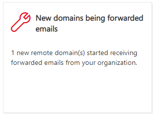

# Novos domínios que estão sendo encaminhados no Centro de Conformidade & Segurança

[!INCLUDE [Microsoft 365 Defender rebranding](../includes/microsoft-defender-for-office.md)]

**Aplica-se a**
- [Proteção do Exchange Online](exchange-online-protection-overview.md)
- [Plano 1 e plano 2 do Microsoft Defender para Office 365](defender-for-office-365.md)
- [Microsoft 365 Defender](../defender/microsoft-365-defender.md)

Há motivos comerciais válidos para encaminhar mensagens de email para destinatários externos em domínios específicos. No entanto, é suspeito quando os usuários em sua organização começam a encaminhar mensagens para um domínio para o qual ninguém em sua organização encaminhou mensagens (um novo domínio).

Essa condição pode indicar que as contas de usuário estão comprometidas. Se você suspeitar que as contas foram comprometidas, consulte [Respondendo a uma conta de email comprometida.](responding-to-a-compromised-email-account.md)

Os **Novos domínios** [&](https://protection.office.com) que estão sendo encaminhados no Centro de Conformidade e Segurança notificam você quando os usuários em sua organização estão encaminhando mensagens para novos domínios.

Esse insight aparece somente quando o problema é detectado e aparece na página [Relatório de](view-mail-flow-reports.md#forwarding-report) Encaminhamento.

Quando você clica no widget, um sobrevoo aparece onde você pode encontrar mais detalhes sobre as mensagens encaminhadas, incluindo um link de volta para o relatório [de encaminhamento](view-mail-flow-reports.md#forwarding-report).

Você também pode acessar **essa** página de detalhes  quando selecionar o insight depois de clicar em Exibir tudo na área Principais & recomendações em (**Painel** de Relatórios \>  ou <https://protection.office.com/insightdashboard> ).

Para impedir o encaminhamento automático de mensagens para domínios externos, configure um domínio remoto para alguns ou todos os domínios externos. Para obter mais informações, consulte [Gerenciar domínios remotos no Exchange Online](/Exchange/mail-flow-best-practices/remote-domains/manage-remote-domains).

## Tópicos relacionados

Para obter informações sobre outras informações no painel de fluxo de emails, consulte Informações de fluxo de email no Centro de Conformidade & [Segurança.](mail-flow-insights-v2.md)