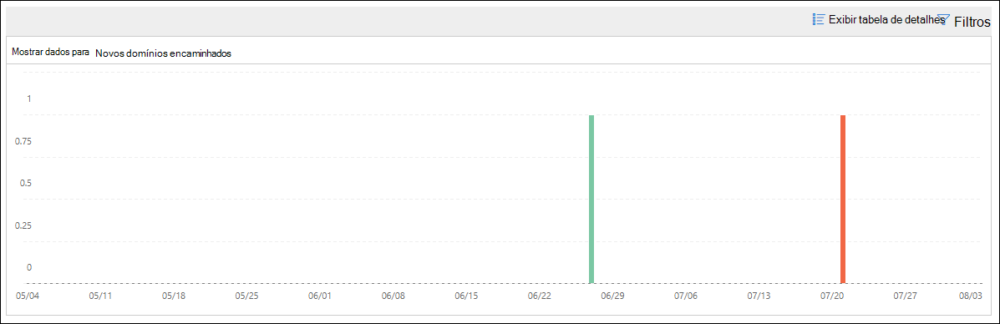

# Novos usuários encaminhando informações de email no Centro de Conformidade & Segurança

[!INCLUDE [Microsoft 365 Defender rebranding](../includes/microsoft-defender-for-office.md)]

**Aplica-se a**
- [Proteção do Exchange Online](exchange-online-protection-overview.md)
- [Plano 1 e plano 2 do Microsoft Defender para Office 365](defender-for-office-365.md)
- [Microsoft 365 Defender](../defender/microsoft-365-defender.md)

É suspeito quando novas contas de usuário em sua organização começam a encaminhar mensagens de email para domínios externos.

Os **novos domínio & s** que  estão sendo encaminhados no Centro de Conformidade e Segurança notificam você quando usuários recém-criados em sua organização estão encaminhando mensagens para domínios externos. Essa condição pode indicar que contas de administrador comprometidas foram usadas para criar os novos usuários. Se você suspeitar que as contas foram comprometidas, consulte [Respondendo a uma conta de email comprometida.](responding-to-a-compromised-email-account.md)

Esse insight aparece somente quando o problema é detectado e aparece na página [Relatório de](view-mail-flow-reports.md#forwarding-report) Encaminhamento.

Quando você clica no widget, um sobremenu aparece onde você pode encontrar mais  detalhes sobre as mensagens encaminhadas, incluindo um link para o relatório de modificações de encaminhamento conforme descrito posteriormente neste artigo.

Você também pode acessar **essa** página de detalhes  quando selecionar o insight depois de clicar em Exibir tudo na área Principais & recomendações em (**Painel** de Relatórios \>  ou <https://protection.office.com/insightdashboard> ).

Você pode clicar no link Ver relatório associado  **ao** insight para acessar o relatório de modificações de encaminhamento conforme descrito na próxima seção.

## Relatório de modificações de encaminhamento

O **relatório de modificações de encaminhamento** mostra detalhes sobre mensagens que estão sendo encaminhadas automaticamente de senders em sua organização:

- Contas recém-criadas que estão encaminhando mensagens para domínios externos.
- Contas que estão encaminhando mensagens para domínios externos que nunca foram encaminhadas por outros senders em sua organização.

Esses tipos de mensagens encaminhadas podem representar um risco de segurança ou conformidade e podem indicar contas comprometidas.

O relatório contém dados de até 90 dias. Por padrão, o relatório mostra dados dos últimos 7 dias.

Este relatório não está disponível  diretamente no painel de fluxo de emails ou no painel [Relatórios.](view-mail-flow-reports.md) Além de clicar no link **Ver relatório associado** ao insight no insight Novos usuários encaminhando informações de **email,** você pode acessar o relatório por:

- Clicando no **link Relatório de notificações** de encaminhamento nos detalhes dos novos domínios que estão sendo [encaminhados informações de email.](mfi-new-domains-being-forwarded-email.md)
- Abrindo <https://protection.office.com/reportv2?id=MailFlowNewForwarding> .

### Exibição de relatório para o relatório de modificações de encaminhamento

Os gráficos a seguir estão disponíveis na exibição de relatório:

- **Mostrar dados para: Novos usuários de encaminhamento:**

  

- **Mostrar dados para: Novos domínios de encaminhamento:**

  

Se você clicar **em Filtros** em um exibição de relatório, poderá especificar um intervalo de datas com **Data de** Início e Data **de Término.**

### Exibição de tabela de detalhes para o relatório de modificações de encaminhamento

Se você clicar **em Exibir tabela de** detalhes, as informações mostradas dependerão do gráfico que você estava olhando:

- **Mostrar dados para: Novos usuários de encaminhamento:**

  - **Nome**: o endereço de email do remetente.
  - **Tipo de encaminhamento**
  - **Endereço do destinatário**
  - **Detalhes**
  - **Count**
  - **Primeira data de encaminhamento**

- **Mostrar dados para: Novos domínios de encaminhamento:**

  - **Nome**: O domínio de email do remetente.
  - **Tipo de encaminhamento**
  - **Endereço do destinatário**
  - **Detalhes**
  - **Count**
  - **Primeira data de encaminhamento**

Se você clicar **em Filtros** em um exibição de tabela de detalhes, poderá especificar um intervalo de datas com **Data de** início e data **de término.**

Se você selecionar uma linha da tabela, um **sobremenu de Detalhes** aparecerá com as seguintes informações:

- **Nome**: Este é o endereço de email do remetente (de Mostrar dados **para:** nova exibição de usuários de encaminhamento) ou o domínio de email do remetente (de Mostrar dados para: Novo exibição de **domínios** de encaminhamento).
- **Tipo de encaminhamento**
- **Recipient**
- **Detalhes**
- **Count**
- **Data de início**
- **Recomendação**: a partir daqui, você pode clicar no link para gerenciar o usuário no Centro de administração do Microsoft 365.

Para voltar à exibição de relatórios, clique em **Exibir relatório**.

## Tópicos relacionados

Para obter informações sobre outras informações no painel de fluxo de emails, consulte Informações de fluxo de email no Centro de Conformidade & [Segurança.](mail-flow-insights-v2.md)
