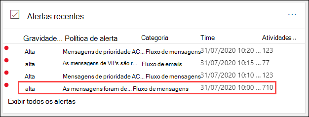
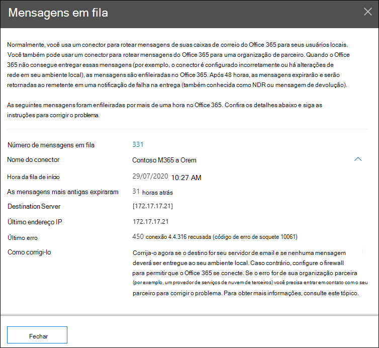

# Visão de filas no Centro de Conformidade & Segurança

[!INCLUDE [Microsoft 365 Defender rebranding](../includes/microsoft-defender-for-office.md)]

**Aplica-se a**
- [Proteção do Exchange Online](exchange-online-protection-overview.md)
- [Plano 1 e plano 2 do Microsoft Defender para Office 365](defender-for-office-365.md)
- [Microsoft 365 Defender](../defender/microsoft-365-defender.md)

Quando as mensagens não podem ser enviadas da sua organização para seus servidores de email locais ou parceiros usando conectores, as mensagens são enluadas no Microsoft 365. Exemplos comuns que causam essa condição são:

- O conector está configurado incorretamente.
- Houve alterações de rede ou firewall em seu ambiente local.

O Microsoft 365 continuará a tentar novamente a entrega por 24 horas. Após 24 horas, as mensagens expiram e serão retornadas para os envios em relatórios de não entrega (também conhecidos como NDRs ou mensagens de rejeição).

Se o volume de email em fila exceder o limite pré-definido (o valor padrão é 200 mensagens), as informações estarão disponíveis nos seguintes locais:

- O **insight Filas** no [painel de fluxo de](mail-flow-insights-v2.md) emails no Centro de Conformidade & [Segurança.](https://protection.office.com) Para obter mais informações, consulte o [insight Filas na seção Painel de fluxo de](#queues-insight-in-the-mail-flow-dashboard) emails neste artigo.

- Um alerta é exibido em **Alertas** recentes do painel Alertas no Centro de Conformidade & Segurança [(](https://protection.office.com) Painel de **Alertas** \>  ou <https://protection.office.com/alertsdashboard> ).

  

- Os administradores receberão uma notificação de email com base na configuração da política de alerta padrão chamada **Mensagens foram adiadas.** Para definir as configurações de notificação para esse alerta, consulte a próxima seção.

  Para obter mais informações sobre políticas de alerta, consulte Políticas de alerta no Centro de [Conformidade & Segurança.](../../compliance/alert-policies.md)

## Personalizar alertas de fila

1. No Centro [de Conformidade & segurança,](https://protection.office.com)acesse **Políticas de** \> **Alertas ou** abra <https://protection.office.com/alertpolicies> .

2. Na página **Políticas de alerta,** encontre e selecione a política chamada **Mensagens que foram adiadas**.

3. Na **mensagem que foi adiada,** você pode ativar ou desativar o alerta e definir as configurações de notificação.

   

   - **Status**: você pode alternar ou desligar o alerta.

   - **Destinatários de email** e **limite de notificação diária**: Clique em **Editar** para definir as seguintes configurações:

4. Para definir as configurações de notificação, clique em **Editar**. No **sobrevoo Editar política** que aparece, configure as seguintes configurações:

   - **Enviar notificações por email**: o valor padrão está em.
   - **Destinatários de email**: o valor padrão **é TenantAdmins**.
   - **Limite de notificação diário**: o valor padrão é **Sem limite**.
   - **Limite**: o valor padrão é 200.

   

5. Quando terminar, clique em **Salvar** e **Fechar.**

## Introspecção de filas no painel de fluxo de emails

Mesmo que o volume da mensagem enfileirada não tenha excedido o limite e  gerado um alerta, você ainda poderá usar o insight **Filas** no painel de fluxo de emails para ver mensagens que foram enfileiradas por mais de uma hora e tomar medidas antes que o número de mensagens enfileiradas se torne muito grande.

Se você clicar no número de  mensagens no widget, um sobrevoo de mensagens em fila aparecerá com as seguintes informações:

- **Número de mensagens em fila**
- **Nome do** conector : clique no nome do conector para gerenciar o conector no Centro de administração do Exchange (EAC).
- **Hora de início da fila**
- **Mensagens mais antigas expiradas**
- **Servidor de destino**
- **Último endereço IP**
- **Último erro**
- **Como corrigir**: Problemas comuns e soluções estão disponíveis. Se for um **link Corrigir agora** está disponível, clique nele para corrigir o problema. Caso contrário, clique em quaisquer links disponíveis para obter mais informações sobre o erro e possíveis soluções.

O mesmo flyout é exibido depois que você clica em **Exibir** fila nos detalhes de um alerta de mensagens **que foram adiadas.**

## Confira também

Para obter informações sobre outras informações no painel de fluxo de emails, consulte Informações de fluxo de email no Centro de Conformidade & [Segurança.](mail-flow-insights-v2.md)
