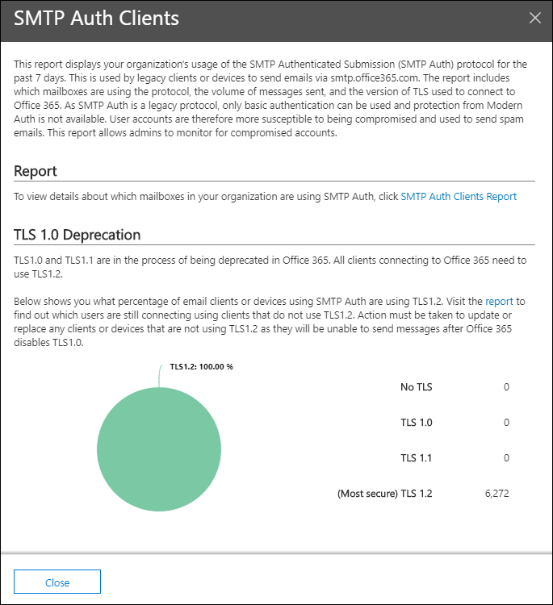
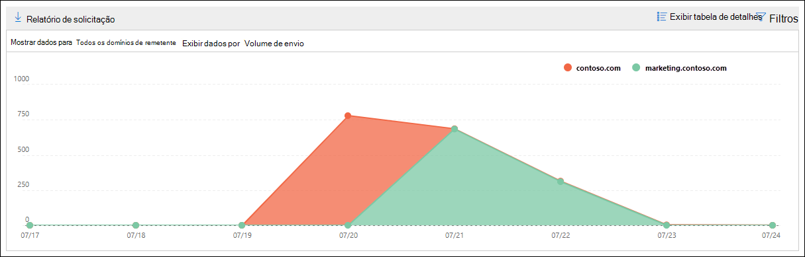
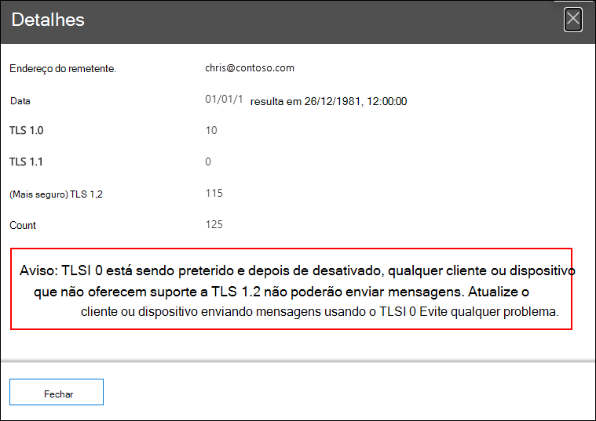

# Informações e relatório dos clientes do Auth SMTP no Centro de Conformidade & Segurança

[!INCLUDE [Microsoft 365 Defender rebranding](../includes/microsoft-defender-for-office.md)]

**Aplica-se a**
- [Proteção do Exchange Online](exchange-online-protection-overview.md)
- [Plano 1 e plano 2 do Microsoft Defender para Office 365](defender-for-office-365.md)
- [Microsoft 365 Defender](../defender/microsoft-365-defender.md)

A visão dos clientes **do Auth SMTP** no painel de fluxo de email e o relatório de clientes [Auth SMTP](#smtp-auth-clients-report) associados no Centro de Conformidade do & de Segurança realçam [o](https://protection.office.com) uso do protocolo de envio de cliente AUTH SMTP por usuários ou contas do sistema em sua organização.  Esse protocolo herdado (que usa o ponto de extremidade smtp.office365.com) só oferece autenticação básica e é suscetível a ser usado por contas comprometidas para enviar emails. O insight e o relatório permitem que você verifique se há atividades incomuns para envios de email SMTP AUTH. Ele também mostra os dados de uso TLS para clientes ou dispositivos que usam AUTH SMTP.

O widget indica o número de usuários ou contas de serviço que usaram o protocolo Auth SMTP nos últimos 7 dias.

Se você clicar no número de mensagens no widget, será exibido um flyout de clientes **Auth SMTP.** O flyout fornece uma exibição agregada do uso e volumes TLS da última semana.

Você pode clicar no link de relatório de clientes **SMTP Auth** para ir para o relatório de clientes Auth SMTP, conforme descrito na próxima seção.

## Relatório de clientes de autenticação SMTP

### Exibição de relatório para o relatório de clientes Auth SMTP

Por padrão, o relatório mostra dados dos últimos 7 dias, mas os dados estão disponíveis nos últimos 90 dias.

A seção visão geral contém os seguintes gráficos:

- Exibir dados **por:** Volume de envio : Por padrão, o gráfico mostra o número de mensagens de cliente SMTP Auth enviadas de todos os domínios ( Mostrar dados para: Todos os domínios de remetente **são selecionados** por padrão). Você pode filtrar os resultados para um domínio de remetente específico clicando em **Mostrar dados** e selecionando o domínio do remetente na lista de menus suspensos. Se você passar o mouse em um ponto de dados específico (dia), o número de mensagens será mostrado.

  

- **Exibir dados por: Uso do TLS**: O gráfico mostra a porcentagem de uso do TLS para todas as mensagens de cliente SMTP Auth durante o período de tempo selecionado. Este gráfico permite identificar e tomar medidas em usuários e contas do sistema que ainda estão usando versões mais antigas do TLS.

  

Se você clicar **em Filtros** em um exibição de relatório, poderá especificar um intervalo de datas com **Data de** Início e Data **de Término.**

Clique **em Solicitar relatório** para receber uma versão mais detalhada do relatório em uma mensagem de email. Você pode especificar o intervalo de datas e os destinatários para receber o relatório.

### Exibição de tabela de detalhes para o relatório de clientes SMTP Auth

Se você clicar **em Exibir tabela de** detalhes, as informações mostradas dependerão do gráfico que você estava olhando:

- **Exibir dados por: Volume de envio**: As seguintes informações são mostradas em uma tabela:

  - **Endereço do remetente**.
  - **Contagem de mensagem**

  Se você selecionar uma linha, os mesmos detalhes serão mostrados em um sobremenu.

- **Exibir dados por: Uso do TLS**: As informações a seguir são mostradas em uma tabela:

  - **Endereço do remetente**.
  - **TLS1.0%**\*
  - **TLS1.1%**\*
  - **TLS1,2%**\*
  - **Contagem de mensagem**

  \* Esta coluna mostra a porcentagem e o número de mensagens do remetente.

Se você clicar **em Filtros** em um exibição de tabela de detalhes, poderá especificar um intervalo de datas com **Data de** início e data **de término.**

Se você selecionar uma linha, detalhes semelhantes serão mostrados em um sobremenu:

Clique **em Solicitar relatório** para receber uma versão mais detalhada do relatório em uma mensagem de email. Você pode especificar o intervalo de datas e os destinatários para receber o relatório.

Para voltar à exibição de relatórios, clique em **Exibir relatório**.

## Tópicos relacionados

Para obter informações sobre outras informações no painel de fluxo de emails, consulte Informações de fluxo de email no Centro de Conformidade & [Segurança.](mail-flow-insights-v2.md)
