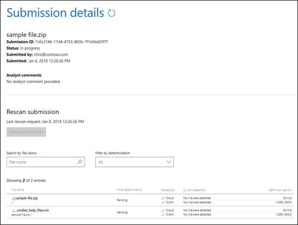

# Enviar malware e não malware à Microsoft para análise

[!INCLUDE [Microsoft 365 Defender rebranding](../includes/microsoft-defender-for-office.md)]

**Aplica-se a**
- [Proteção do Exchange Online](exchange-online-protection-overview.md)
- [Plano 1 e plano 2 do Microsoft Defender para Office 365](defender-for-office-365.md)
- [Microsoft 365 Defender](../defender/microsoft-365-defender.md)

> [!NOTE]
> Se você for um administrador em uma organização com caixas de correio do Exchange Online, recomendamos que você use o portal Envios no Centro de Conformidade & Segurança. Para obter mais informações, [consulte Use Admin Submission to submit suspected spam, phish, URLs, and files to Microsoft](admin-submission.md).

Nas organizações do Microsoft 365 com caixas de correio no Exchange Online ou organizações do Exchange Online Protection (EOP) autônomas sem caixas de correio do Exchange Online, o EOP inclui proteção anti-malware que é automaticamente habilitada. Para obter mais informações, consulte [Proteção anti-malware no EOP](anti-malware-protection.md).

Você provavelmente já deve ter ouvido as seguintes práticas recomendadas por anos:

- Evite abrir mensagens que pareçam suspeitas.
- Nunca abra um anexo de alguém que você não conhece.
- Evite abrir anexos em mensagens que solicitam que você abra ou clique neles.

Mas o que você pode fazer se receber uma mensagem com um anexo suspeito? Ou se você suspeitar que seu computador ou dispositivo foi infectado por um anexo de email que passou por nossos filtros? Nesses casos, você deve enviar o anexo de malware para a Microsoft. Por outro lado, se um anexo em uma mensagem de email foi identificado incorretamente como malware, você também pode enviar isso.

## O que você precisa saber antes de começar?

- Mensagens com anexos que contêm scripts ou outros executáveis mal-intencionados são consideradas malware e você pode usar os procedimentos deste artigo para reportá-los.

- Mensagens com links para sites mal-intencionados são consideradas spam. Para obter mais informações sobre como relatar spam e não spam, consulte [Report messages and files to Microsoft](report-junk-email-messages-to-microsoft.md).

## Enviar arquivos de malware para a Microsoft

Acesse o site do Microsoft Security Intelligence em <https://www.microsoft.com/wdsi/filesubmission> para enviar o arquivo. Para receber atualizações de análise, entre no site ou insira um endereço de email válido. Recomendamos que você use sua conta de estudante ou de trabalho da Microsoft.

Depois de carregar o arquivo ou arquivos, observe a **ID** de Envio criada para o envio de amostra (por exemplo, `7c6c214b-17d4-4703-860b-7f1e9da03f7f` ).

Depois de recebermos o exemplo, investigaremos. Se determinarmos que o arquivo de exemplo é mal-intencionado, tomaremos medidas corretivas para impedir que o malware seja detectado.

Se você continuar recebendo mensagens ou anexos infectados, copie os headers da mensagem de email e entre em contato com o Serviço de Atendimento ao Cliente e Suporte da Microsoft para mais assistência. Certifique-se de ter sua **ID de Envio** pronta também.

## Enviar arquivos que não são malware para a Microsoft

Você também pode enviar um arquivo que você acredita ter sido identificado incorretamente como malware no site (basta selecionar **Não** para a pergunta, Você acredita que esse arquivo contém **malware?**).

Depois de recebermos o exemplo, investigaremos. Se determinarmos que o arquivo de exemplo está limpo, tomaremos medidas corretivas para impedir que o arquivo seja detectado como malware.
