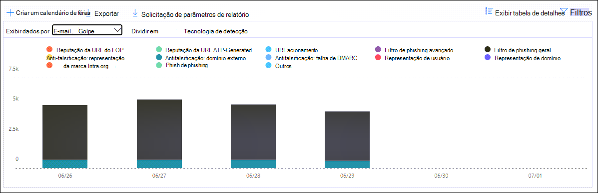
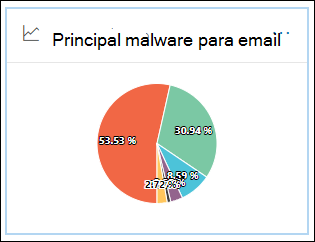

# Exibir relatórios de segurança de email no Centro de Conformidade e Segurança

[!INCLUDE [Microsoft 365 Defender rebranding](../includes/microsoft-defender-for-office.md)]

**Aplica-se a**
- [Proteção do Exchange Online](exchange-online-protection-overview.md)
- [Plano 1 e plano 2 do Microsoft Defender para Office 365](defender-for-office-365.md)
- [Microsoft 365 Defender](../defender/microsoft-365-defender.md)

Vários relatórios estão disponíveis no Centro de Conformidade e Segurança & para ajudá-lo a ver como os recursos de segurança de email, como anti-spam, anti-malware e recursos de criptografia no Microsoft 365 estão protegendo [sua](https://protection.office.com) organização. Se você tiver as [permissões necessárias,](#what-permissions-are-needed-to-view-these-reports)poderá exibir esses relatórios no Centro de Conformidade e Segurança & indo para **Painel de** \> **Relatórios.** Para ir diretamente para o painel Relatórios, abra <https://protection.office.com/insightdashboard> .

## Relatório de usuários comprometidos

> [!NOTE]
> Este relatório está disponível em organizações do Microsoft 365 com caixas de correio do Exchange Online. Ele não está disponível em organizações autônomas do Exchange Online Protection (EOP).

O **relatório Usuários Comprometidos** mostra o número de contas de usuário que foram marcadas como **Suspeitas** ou **Restritas** nos últimos 7 dias. As contas em qualquer um desses estados são problemáticas ou até mesmo comprometidas. Com o uso frequente, você pode usar o relatório para detectar picos e até tendências, em contas suspeitas ou restritas. Para obter mais informações sobre usuários comprometidos, consulte [Respondendo a uma conta de email comprometida.](responding-to-a-compromised-email-account.md)

A exibição agregada mostra os dados dos últimos 90 dias e a exibição de detalhes mostra os dados dos últimos 30 dias.

Para exibir o relatório, abra o [Centro](https://protection.office.com)de  Conformidade & Segurança, vá para Painel de Relatórios \>  e selecione **Usuários comprometidos.** Para ir diretamente para o relatório, abra <https://protection.office.com/reportv2?id=CompromisedUsers> .

Você pode filtrar o gráfico e a tabela de detalhes clicando em **Filtros** e selecionando um ou mais dos seguintes valores:

- **Data de início** **e data de término**

- **Suspeito**: a conta de usuário enviou emails suspeitos e corre o risco de ser restringida ao envio de emails.

- **Restrito**: a conta de usuário foi restrita ao envio de emails devido a padrões altamente suspeitos.

Se você clicar em **Exibir tabela de detalhes,** você poderá ver os seguintes detalhes:

- **Hora da criação**
- **ID de usuário**
- **Ação**

Para voltar à exibição de relatório, clique em **Exibir relatório**.

## Relatório de criptografia

O **relatório de criptografia** está disponível no EOP (assinaturas com caixas de correio no Exchange Online ou EOP autônomo sem caixas de correio do Exchange Online). A equipe de segurança da sua organização pode usar informações neste relatório para identificar padrões e aplicar ou ajustar de forma proativa políticas para mensagens de email confidenciais. Por exemplo:

- Se você vir um grande número de mensagens de email criptografadas por usuários, talvez queira adicionar uma política de criptografia para automatizar a criptografia para determinados casos de uso. Para obter mais informações, consulte Definir regras de fluxo de emails [para criptografar mensagens de email no Microsoft 365](../../compliance/define-mail-flow-rules-to-encrypt-email.md).

- Se você tiver vários modelos de criptografia disponíveis, mas ninguém os estiver usando, poderá explorar se os usuários precisam de treinamento de recursos.

A exibição agregada permite a filtragem dos últimos 90 dias, enquanto a exibição de detalhes permite a filtragem por 10 dias.

Para exibir o relatório, abra o [Centro](https://protection.office.com)de Conformidade & segurança, vá **para** Painel de Relatórios \>  e selecione Relatório **de criptografia.** Para ir diretamente para o relatório, abra <https://protection.office.com/reportv2?id=EncryptionReport> .

Para saber mais sobre criptografia, consulte [Criptografia de email no Microsoft 365](../../compliance/email-encryption.md).

### Exibição de relatório para o relatório de criptografia

Você pode usar os seguintes filtros no gráfico:

- **Exibir dados por: Relatório de Criptografia** de Mensagens e Quebra **por: Método de** criptografia : Os seguintes métodos de criptografia estão disponíveis:

  - **Criptografia por usuário**
  - **Criptografia por política**

  Se você clicar em **Filtros,** poderá modificar o gráfico com os seguintes filtros:

  - **Data de início** **e data de término**
  - Método de criptografia.
  - Modelo de criptografia.

- **Exibir dados por: Relatório de Criptografia** de Mensagens e Quebra **por: Modelo** de criptografia : Os seguintes métodos de criptografia estão disponíveis:

  - **Não encaminhar**
  - **Criptografar somente**
  - **OME anterior**
  - **Personalizados**

  Se você clicar em **Filtros,** poderá modificar o gráfico com os seguintes filtros:

  - **Data de início** **e data de término**
  - Método de criptografia
  - Modelo de criptografia

- **Exibir dados por: Os 5** principais domínios de destinatários : Este exibição mostra um gráfico de pizza com contagens de mensagens enviadas para os cinco domínios de destinatário principais.

  Se você clicar **em Filtros,** você poderá selecionar uma data **de início** e data **de término.**

### Exibição de tabela de detalhes para o relatório de criptografia

Se você clicar **em Exibir tabela de** detalhes, as informações mostradas dependerão do gráfico que você estava olhando:

- **Break down by: Encryption method** or **Break down by: Encryption template**: The following information is shown:

  - **Date**
  - **Endereço do remetente**.
  - **Modelo de criptografia**
  - **Método de criptografia**
  - **Endereço do destinatário**
  - **Assunto**

- **Exibir dados por: Principais 5 domínios de destinatário:**

  - **Date**
  - **Domínio de destinatário**
  - **Contagem de mensagem**

Se você clicar **em Filtros** em um exibição de tabela de detalhes, poderá modificar os resultados com os seguintes filtros:

- **Data de início** **e data de término**
- Método de criptografia
- Modelo de criptografia

Para voltar à exibição de relatório, clique em **Exibir relatório**.

## Relatório de status de fluxo de emails

O **relatório de status de fluxo de emails** contém informações sobre malware, spam, phishing e mensagens bloqueadas de borda. Para obter mais detalhes, consulte [Mailflow status report](view-mail-flow-reports.md#mailflow-status-report).

## Detecções de malware no relatório de email

As **detecções de malware** no relatório de email mostram informações sobre detecções de malware em mensagens de email de entrada e saída (malware detectado pela Proteção do Exchange Online ou pelo EOP). Para obter mais informações sobre a proteção contra malware no EOP, consulte [Proteção anti-malware no EOP](anti-malware-protection.md).

 O filtro de exibição agregado permite 90 dias, enquanto o filtro de tabela de detalhes só permite por 10 dias.

Para exibir o relatório, abra o [Centro](https://protection.office.com)de  Conformidade & segurança, vá para Painel de Relatórios e \>  selecione **Detecções de malware no email**. Para ir diretamente para o relatório, abra <https://protection.office.com/reportv2?id=MalwareDetections> .

Você pode filtrar o gráfico e a tabela de detalhes clicando em **Filtros** e selecionando:

- **Data de início** **e data de término**
- **Entrada**
- **Saída**

Se você clicar em **Exibir tabela de detalhes,** você poderá ver os seguintes detalhes:

- **Date**
- **Endereço do remetente**.
- **Endereço do destinatário**
- **ID da** mensagem : disponível no campo de header **Message-ID** no header da mensagem e deve ser exclusivo. Um valor de exemplo `<08f1e0f6806a47b4ac103961109ae6ef@server.domain>` é (observe os colchetes angulares).
- **Assunto**
- **Filename**
- **Nome do malware**

Para voltar à exibição de relatório, clique em **Exibir relatório**.

## Relatório de latência de email

O **relatório de latência de email** contém informações sobre a entrega de email e a latência de detonação experimentado em sua organização. Para obter mais informações, consulte [Relatório de latência de email](view-reports-for-mdo.md#mail-latency-report).

## Relatório de email enviado e recebido

O **relatório de email** enviado e recebido contém informações sobre malware, spam, regras de fluxo de emails (também conhecidas como regras de transporte) e detecções avançadas de malware depois que o email entra no serviço. Para obter mais informações, consulte [Sent and received email report](view-mail-flow-reports.md#sent-and-received-email-report).

## Relatório de detecções de spam

O **relatório de detecções de** spam mostra mensagens de email de spam que foram bloqueadas pelo EOP. As mensagens são contadas individualmente, não por destinatário. Por exemplo, se a mesma mensagem de spam foi enviada para 100 destinatários em sua organização, ela conta como uma mensagem.

A exibição agregada permite a filtragem de 90 dias, enquanto a tabela de detalhes permite a filtragem de 10 dias.

Para exibir o relatório, abra o [Centro](https://protection.office.com)de  Conformidade & segurança, vá para Painel de Relatórios \>  e selecione Detecções **de spam.** Para ir diretamente para o relatório, abra <https://protection.office.com/reportv2?id=SpamDetections> .

Para obter mais informações sobre a proteção anti-spam, consulte [Anti-spam protection in EOP](anti-spam-protection.md).

### Exibição de relatório para o relatório de detecções de spam

Os gráficos a seguir estão disponíveis na exibição de relatório:

- **Break down by: Action**: Os seguintes tipos de evento são mostrados:

  - **Conteúdo de spam filtrado**
  - **Bloqueio de IP de spam**
  - **Bloqueio de envelope de spam**
  - **Filtro DBEB de spam**: Bloqueio de borda baseado em diretório (DBEB)

  Ao passar o mouse sobre um dia (ponto de dados) no gráfico, você pode ver quantos itens foram bloqueados nesse dia, bem como como esses itens são categorizados.

  

- **Break down by: Direction**: The following directions are shown:

  - **Entrada**
  - **Saída**

  

Se você clicar **em Filtros** em um exibição de relatório, poderá modificar os resultados com os seguintes filtros:

- **Data de início** **e data de término**
- Valores de direção
- Valores de tipo de evento

### Exibição de tabela de detalhes para o relatório de detecções de spam

Se você clicar em **Exibir tabela de detalhes** em qualquer exibição de relatório, as seguintes informações serão mostradas:

- **Date**
- **Endereço do remetente**.
- **Endereço do destinatário**
- **Tipo de evento**
- **Ação**
- **Assunto**

Se você clicar **em Filtros** em uma tabela de detalhes, poderá modificar os resultados com os seguintes filtros:

- **Data de início** **e data de término**
- Valores de direção
- Valores de tipo de evento

Para voltar à exibição de relatório, clique em **Exibir relatório**.

## Relatório de detecções de spoof

O relatório de detecções **Spoof** mostra quantas mensagens de email falsas foram detectadas e dessas, quais foram consideradas "boas" (email de spoof feito por motivos comerciais legítimos). Para obter mais informações sobre a spoofing, consulte [Anti-spoofing protection in EOP](anti-spoofing-protection.md).

A exibição agregada do relatório permite 90 dias de filtragem, enquanto a exibição de detalhes permite apenas dez dias de filtragem.

Para exibir o relatório, abra o [Centro](https://protection.office.com)de  Conformidade & segurança, vá para Painel de Relatórios e \>  selecione **Detecções de Spoof**. Para ir diretamente para o relatório, abra <https://protection.office.com/reportv2?id=SpoofMailReport> .

Quando você passa o mouse sobre um dia (ponto de dados) no gráfico, você pode ver quantas mensagens de email falsas passaram.

Você pode filtrar o gráfico e a tabela de detalhes clicando em **Filtros** e selecionando um ou mais dos seguintes valores:

- **Data de início** **e data de término**

- **Bom email**

- **Capturado como spam**

Se você clicar em **Exibir tabela de detalhes,** você poderá ver os seguintes detalhes:

- **Date**
- **Remetentes com spoofed**
- **Remetente verdadeiro**
- **IP do remetente**
- **Ação**
- **Contagem de mensagem**

Para voltar à exibição de relatório, clique em **Exibir relatório**.

## Relatório de status de proteção contra ameaças

O **relatório de status de** proteção contra ameaças está disponível no EOP e no Microsoft Defender para Office 365; no entanto, os relatórios contêm dados diferentes. Por exemplo, os clientes do EOP podem exibir informações sobre malware detectados no email, mas não informações sobre arquivos mal-intencionados detectados por Anexos Seguros para [SharePoint, OneDrive e Microsoft Teams.](mdo-for-spo-odb-and-teams.md)

O relatório fornece a contagem de mensagens de email com conteúdo mal-intencionado, como arquivos ou endereços de site (URLs) bloqueados pelo mecanismo anti-malware, pela limpeza [automática zero hora (ZAP)](zero-hour-auto-purge.md)e pelos recursos do Defender for Office 365, como Links [Seguros,](safe-links.md) [Anexos](safe-attachments.md)Seguros e [Anti-phishing.](set-up-anti-phishing-policies.md) Você pode usar essas informações para identificar tendências ou determinar se as políticas da organização precisam de ajustes.

**Observação**: é importante entender que, se uma mensagem for enviada a cinco destinatários, a contaremos como cinco mensagens diferentes e não uma mensagem.

Para exibir o relatório, abra o [Centro](https://protection.office.com)de  Conformidade & Segurança, vá para Painel de \>  Relatórios e selecione Status de proteção **contra ameaças.** Para ir diretamente ao relatório, abra uma das seguintes URLs:

- Microsoft Defender para Office 365: <https://protection.office.com/reportv2?id=TPSAggregateReportATP>
- EOP: <https://protection.office.com/reportv2?id=TPSAggregateReport>

Por padrão, o gráfico mostra dados dos últimos 7 dias. Se você clicar **em Filtros,** poderá selecionar um intervalo de 90 dias (as assinaturas de avaliação podem ser limitadas a 30 dias). A exibição da tabela de detalhes permite a filtragem por 30 dias.

### Exibição de relatório para o relatório de status de proteção contra ameaças

As exibições a seguir estão disponíveis:

- **Exibir dados por: Visão geral**: As seguintes informações de detecção são mostradas:

  - **Malware de email**
  - **Phishing de email**
  - **Malware de conteúdo**

  

- **Exibir dados por: Conteúdo \> Malware**1: As informações a seguir são mostradas para organizações do Microsoft Defender para Office 365:

  - **Mecanismo anti-malware**: arquivos mal-intencionados detectados no Sharepoint, OneDrive e Microsoft Teams pela detecção interna de [vírus no Microsoft 365](virus-detection-in-spo.md).
  - **Detonação de** arquivo : arquivos mal-intencionados detectados por [Anexos Seguros para SharePoint, OneDrive e Microsoft Teams](mdo-for-spo-odb-and-teams.md).

  

- **Exibir dados por: Substituição de Mensagem**: As seguintes informações de motivo de substituição são mostradas:

  - **Ignorar local**
  - **IP Allow**
  - **Regra de fluxo de emails**
  - **Permitir remetente**
  - **Permitir domínio**
  - **ZAP não habilitado**
  - **Pasta Lixo Eletrônico não habilitada**
  - **Remetente seguro do usuário**
  - **Domínio Seguro do Usuário**

  

- **Break down by: Detection technology** and **View data by: Email \> Phish**: As seguintes informações são mostradas:

  - **Reputação de URL** gerada pela ATP 1: Reputação de URL mal-intencionada gerada a partir de detonações do Defender para Office 365 em outros clientes do Microsoft 365.
  - **Filtro de phishing avançado**: sinais de phishing com base no aprendizado de máquina.
  - **Anti-spoof - Falha de DMARC**: falha de autenticação DMARC em mensagens.
  - **Anti-spoof - intra-org**: O remetente está tentando despojar o domínio do destinatário.
  - **Anti-spoof - domínio externo**: o remetente está tentando despojar algum outro domínio.
  - **Representação de marca**: Representação de marcas conhecidas com base em senders.
  - **Representação de domínio**1: Representação de domínios que o cliente possui ou define.
  - **Reputação da URL do EOP:** reputação de URL mal-intencionada.
  - **Filtro de phishing geral**: sinais de phishing com base em regras de analista.
  - **Outros**
  - **Phish ZAP**2: Limpeza automática de hora zero de mensagens de phishing.
  - **Detonação de URL**1
  - **Representação do usuário**1: Representação de usuários definidos pelo administrador ou aprendidos por meio da inteligência da caixa de correio.

  

- **Break down by: Detection technology** and **View data by: Email \> Malware**: As seguintes informações são mostradas:

  - **Reputação de arquivo gerado pela ATP**1: Toda a reputação de arquivo mal-intencionado gerada pelas detonações do Defender para Office 365.
  - **Mecanismo anti-malware**1: Detecção de mecanismos anti-malware.
  - Bloco de tipo de arquivo de **política anti-malware**: São mensagens de email filtradas devido ao tipo de arquivo mal-intencionado identificado na mensagem.
  - **Detonação de**arquivo 1: Detecção por Anexos Seguros.
  - **Reputação de arquivo mal-intencionado**
  - **Malware ZAP**2
  - **Outros**

  

- **Break down by: Policy type and** **View data by: Email \> Phish** **or View data by: Email \> Malware**: As seguintes informações são mostradas:

  - **Anti-malware**
  - **Anexos Seguros**1
  - **Anti-phish**
  - **Anti-spam**
  - **Regra de fluxo de emails** (também conhecida como regra de transporte)
  - **Outros**

  

- **Break down by: Status de entrega** e **Exibir dados por: Email \> Phish** or **View data by: Email \> Malware**: As seguintes informações são mostradas:

  - **Falha na entrega**
  - **Descartado**
  - **Encaminhado**
  - **Caixa de correio hospedada: Pasta personalizada**
  - **Caixa de correio hospedada: itens excluídos**
  - **Caixa de correio hospedada: Caixa de Entrada**
  - **Caixa de correio hospedada: Lixo eletrônico**
  - **Servidor local: Entregue**
  - **Quarentena**

  

1 Defender para Office 365 somente

2 A limpeza automática de hora zero (ZAP) não está disponível no EOP autônomo (ele só funciona em caixas de correio do Exchange Online).

Se você clicar **em Filtros,** os filtros disponíveis dependerão do gráfico que você estava olhando:

- Para **Exibir dados por: Malware de \> Conteúdo**, você pode modificar o relatório por **Data** de Início e **Data** de Término e o **valor detecção.**

- Para **Exibir dados por: Substituição de Mensagens**, você pode modificar o relatório com os seguintes filtros:

  - **Data de início** **e data de término**
  - **Substituir Motivo**
  - **Marca**: filtre os resultados por usuários ou grupos que tiveram a marca de usuário especificada aplicada (incluindo contas prioritárias). Para obter mais informações sobre marcas de usuário, consulte [Marcas de usuário](user-tags.md).
  - **Domínio**

- Para todas as outras exibições, você pode modificar o relatório com os seguintes filtros:

  - **Data de início** **e data de término**
  - **Detecção**
  - **Protegido por**: **ATP** ou **EOP**
  - **Marca**: filtre os resultados por usuários ou grupos que tiveram a marca de usuário especificada aplicada (incluindo contas prioritárias). Para obter mais informações sobre marcas de usuário, consulte [Marcas de usuário](user-tags.md).
  - **Domínio**

### Exibição de tabela de detalhes para o relatório de status de proteção contra ameaças

Se você clicar **em Exibir tabela de** detalhes, as informações mostradas dependerão do gráfico que você estava olhando:

- **Exibir dados por: Visão geral**: o botão de **tabela sem exibir detalhes** está disponível.

- **Exibir dados por: Conteúdo \> Malware**:

  - **Date**
  - **Localização**
  - **Direcionado por**
  - **Nome do malware**

  Se você clicar **em Filtros** neste exibição, poderá modificar o relatório por data de início e data de término **e** o **valor detecção.** 

- **Exibir dados por: Substituição de Mensagens**:

  - **Date**
  - **Assunto**
  - **Sender**
  - **Destinatários**
  - **Detectado por**
  - **Substituir Motivo**
  - **Fonte de comprometimento**
  - **Marcas**

  Se você clicar **em Filtros** neste visualização, poderá modificar o relatório com os seguintes filtros:

  - **Data de início** **e data de término**
  - **Substituir Motivo**
  - **Marca**: filtre os resultados por usuários ou grupos que tiveram a marca de usuário especificada aplicada (incluindo contas prioritárias). Para obter mais informações sobre marcas de usuário, consulte [Marcas de usuário](user-tags.md).
  - **Domínio**
  - **Destinatários** (Observe que essa propriedade filtável só está disponível no exibição de tabela de detalhes)

- Todos os outros gráficos:

  - **Date**
  - **Assunto**
  - **Sender**
  - **Destinatários**
  - **Detectado por**
  - **Status da Entrega**
  - **Fonte de comprometimento**
  - **Marcas**

  Se você clicar **em Filtros,** poderá modificar o relatório com os seguintes filtros:

  - **Data de início** **e data de término**
  - **Detecção**
  - **Protegido por**: **Defender para Office 365** ou **EOP**
  - **Marca**: filtre os resultados por usuários ou grupos que tiveram a marca de usuário especificada aplicada (incluindo contas prioritárias). Para obter mais informações sobre marcas de usuário, consulte [Marcas de usuário](user-tags.md).
  - **Domínio**
  - **Destinatários** (Observe que essa propriedade filtável só está disponível no exibição de tabela de detalhes)

## Relatório de malware principal

O **relatório de malware** Top mostra os vários tipos de malware detectados pela proteção [anti-malware no EOP](anti-malware-protection.md).

Para exibir o relatório, abra o [Centro](https://protection.office.com)de  Conformidade & Segurança, vá para Painel de Relatórios \>  e selecione **Malware Superior.** Para ir diretamente para o relatório, abra <https://protection.office.com/reportv2?id=TopMalware> .

Quando você passar o mouse sobre uma cunha no gráfico de pizza, você pode ver o nome de um tipo de malware e quantas mensagens foram detectadas como tendo esse malware.

Se você clicar em **Exibir tabela de detalhes,** você poderá ver os seguintes detalhes:

- **Malware principal**
- **Count**

Se você clicar **em Filtros** no exibição de relatório ou no exibição de tabela de detalhes, poderá especificar um intervalo de datas com **Data de** início e data **de término.**

## Relatório de proteção contra ameaças de URL

O relatório de proteção contra **ameaças de URL** está disponível no Microsoft Defender para Office 365. Para obter mais informações, consulte [RELATÓRIO de proteção contra ameaças de URL](view-reports-for-mdo.md#url-threat-protection-report).

## Relatório de mensagens relatadas pelo usuário

O **relatório** de mensagens relatadas pelo usuário mostra informações sobre mensagens de email que os usuários relataram como lixo eletrônico, tentativas de phishing ou emails bons usando o complemento Mensagem de Relatório ou o [add-in](enable-the-report-message-add-in.md) Relatório [phishing](enable-the-report-phish-add-in.md).

Os detalhes estão disponíveis para cada mensagem, incluindo o motivo da entrega, uma exceção de política de spam ou uma regra de fluxo de emails configurada para sua organização. Para exibir detalhes, selecione um item na lista de relatórios do usuário e, em seguida, exibir as informações nas guias **Resumo** **e** Detalhes.

Para exibir este relatório, no Centro de Conformidade & [segurança,](https://protection.office.com)faça um dos seguintes:

- Vá para **Painel de Gerenciamento de** \> **Ameaças** \> **Mensagens relatadas pelo usuário.**

- Vá para **Gerenciamento de ameaças** Revisar \> **mensagens** \> **relatadas pelo usuário.**

> [!IMPORTANT]
> Para que o relatório de mensagens relatadas pelo usuário funcione corretamente, o **log** de auditoria deve estar ligado para seu ambiente do Office 365. Isso normalmente é feito por alguém que tem a função Logs de Auditoria atribuída no Exchange Online. Para obter mais informações, consulte Ativar ou desativar a pesquisa de log de [auditoria do Microsoft 365.](../../compliance/turn-audit-log-search-on-or-off.md)

## Quais permissões são necessárias para exibir esses relatórios?

Para exibir e usar os relatórios descritos neste artigo, você precisa ser membro de um dos seguintes grupos de funções no Centro de Conformidade & Segurança:

- **Organization Management**
- **Administrador de Segurança**
- **Leitor de Segurança**
- **Leitor Global**

Para saber mais, confira [Permissões no Centro de Conformidade de Segurança](permissions-in-the-security-and-compliance-center.md).

**Observação**: a adição de usuários à função correspondente do Azure Active Directory no Centro de administração do  Microsoft 365 fornece aos usuários as permissões necessárias no Centro de Conformidade & Segurança e permissões para outros recursos no Microsoft 365. Para obter mais informações, confira o artigo [Sobre funções de administrador](../../admin/add-users/about-admin-roles.md).

## E se os relatórios não mostrarem dados?

Se você não estiver vendo dados em seus relatórios, verifique duas vezes se suas políticas estão configuradas corretamente. Para saber mais, confira [Proteger contra ameaças](protect-against-threats.md).

## Tópicos relacionados

[Proteção anti-spam e anti-malware no EOP](anti-spam-and-anti-malware-protection.md)

[Relatórios inteligentes e insights no Centro de Conformidade e Segurança](reports-and-insights-in-security-and-compliance.md)

[Exibir relatórios de fluxo de emails no Centro de Conformidade & Segurança](view-mail-flow-reports.md)

[Exibir relatórios do Defender para Office 365](view-reports-for-mdo.md)
