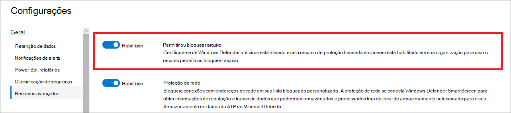

# Configurar recursos avançados no Defender para Ponto de ExtremidadeConfigure advanced features in Defender for Endpoint

**Aplica-se a:****Applies to:**
- [Microsoft Defender para Ponto de ExtremidadeMicrosoft Defender for Endpoint](https://go.microsoft.com/fwlink/p/?linkid=2154037)
- [Microsoft 365 DefenderMicrosoft 365 Defender](https://go.microsoft.com/fwlink/?linkid=2118804)

[!INCLUDE [Microsoft 365 Defender rebranding](../../includes/microsoft-defender.md)]

> Deseja experimentar o Defender para Ponto de Extremidade?Want to experience Defender for Endpoint? [Inscreva-se para uma avaliação gratuita.Sign up for a free trial.](https://www.microsoft.com/microsoft-365/windows/microsoft-defender-atp?ocid=docs-wdatp-advancedfeats-abovefoldlink)

Dependendo dos produtos de segurança da Microsoft que você usa, alguns recursos avançados podem estar disponíveis para integrar o Defender para o Ponto de Extremidade.Depending on the Microsoft security products that you use, some advanced features might be available for you to integrate Defender for Endpoint with.

## Habilitar recursos avançadosEnable advanced features

1. No painel de navegação, selecione **Configuração de preferências**  >  **Recursos avançados**.In the navigation pane, select **Preferences setup** > **Advanced features**.
2. Selecione o recurso avançado que você deseja configurar e alterne a configuração entre **On** e **Off**.Select the advanced feature you want to configure and toggle the setting between **On** and **Off**.
3. Clique **em Salvar preferências**.Click **Save preferences**.

Use os recursos avançados a seguir para se proteger melhor de arquivos potencialmente mal-intencionados e obter informações melhores durante investigações de segurança.Use the following advanced features to get better protected from potentially malicious files and gain better insight during security investigations.

## Investigação automatizadaAutomated investigation

A ativar esse recurso para aproveitar os recursos automatizados de investigação e correção do serviço.Turn on this feature to take advantage of the automated investigation and remediation features of the service. Para obter mais informações, consulte [Investigação automatizada](automated-investigations.md).For more information, see [Automated investigation](automated-investigations.md).

## Resposta ao vivoLive response

A turn on this feature so that users with the appropriate permissions can start a live response session on devices.Turn on this feature so that users with the appropriate permissions can start a live response session on devices.

Para obter mais informações sobre atribuições de função, consulte [Create and manage roles](user-roles.md).For more information about role assignments, see [Create and manage roles](user-roles.md).

## Resposta ao vivo para servidoresLive response for servers
A turn on this feature so that users with the appropriate permissions can start a live response session on servers.Turn on this feature so that users with the appropriate permissions can start a live response session on servers.

Para obter mais informações sobre atribuições de função, consulte [Create and manage roles](user-roles.md).For more information about role assignments, see [Create and manage roles](user-roles.md).

## Execução de script não assinado de resposta ao vivoLive response unsigned script execution

A habilitação desse recurso permite executar scripts não assinados em uma sessão de resposta ao vivo.Enabling this feature allows you to run unsigned scripts in a live response session.

## Sempre remediar PUAAlways remediate PUA
Aplicativos potencialmente indesejados (PUA) são uma categoria de software que pode fazer com que seu computador seja executado lentamente, exibir anúncios inesperados ou, na pior das hipóteses, instalar outros softwares que podem ser inesperados ou indesejados.Potentially unwanted applications (PUA) are a category of software that can cause your machine to run slowly, display unexpected ads, or at worst, install other software which might be unexpected or unwanted. 

A turn on this feature so that potentially unwanted applications (PUA) are remediated on all devices in your tenant, even if PUA protection is not configured on the devices.Turn on this feature so that potentially unwanted applications (PUA) are remediated on all devices in your tenant even if PUA protection is not configured on the devices. Isso ajudará a proteger os usuários contra a instalação inadvertida de aplicativos indesejados em seus dispositivos.This will help protect users from inadvertently installing unwanted applications on their device. Quando desligado, a correção depende da configuração do dispositivo.When turned off, remediation is dependent on the device configuration. 

## Restringir a correlação para dentro de grupos de dispositivos com escopoRestrict correlation to within scoped device groups
Essa configuração pode ser usada para cenários em que as operações SOC locais gostaria de limitar as correlações de alerta apenas aos grupos de dispositivos que eles podem acessar.This configuration can be used for scenarios where local SOC operations would like to limit alert correlations only to device groups that they can access. Ao ligar essa configuração, um incidente composto por alertas que cruzam grupos de dispositivos não será mais considerado um único incidente.By turning this setting on, an incident composed of alerts that cross device groups will no longer be considered a single incident. O SOC local pode, em seguida, tomar medidas sobre o incidente porque eles têm acesso a um dos grupos de dispositivos envolvidos.The local SOC can then take action on the incident because they have access to one of the device groups involved. No entanto, o SOC global verá vários incidentes diferentes por grupo de dispositivos em vez de um incidente.However, global SOC will see several different incidents by device group instead of one incident. Não recomendamos a adoção dessa configuração, a menos que isso supere os benefícios da correlação de incidentes em toda a organizaçãoWe do not recommend turning this setting on unless doing so outweighs the benefits of incident correlation across the entire organization
>[!NOTE]
>Alterar essa configuração afeta apenas as futuras correlações de alerta.Changing this setting impacts future alert correlations only.

## Habilitar eDR no modo de bloqueioEnable EDR in block mode
A detecção e a resposta do ponto de extremidade (EDR) no modo de bloqueio fornece proteção contra artefatos mal-intencionados, mesmo quando o Microsoft Defender Antivírus está em execução no modo passivo.Endpoint detection and response (EDR) in block mode provides protection from malicious artifacts, even when Microsoft Defender Antivirus is running in passive mode. Quando ligado, o EDR no modo de bloqueio bloqueia artefatos mal-intencionados ou comportamentos detectados em um dispositivo.When turned on, EDR in block mode blocks malicious artifacts or behaviors that are detected on a device. A EDR no modo de bloqueio funciona nos bastidores para correção de artefatos mal-intencionados detectados após a violação.EDR in block mode works behind the scenes to remediate malicious artifacts that are detected post breach.

## Autoresolve correção de alertasAutoresolve remediated alerts

Para locatários criados em ou após o Windows 10, versão 1809, o recurso de investigação e correção automatizado é configurado por padrão para resolver alertas em que o status do resultado da análise automatizada é "Nenhuma ameaça encontrada" ou "Correção".For tenants created on or after Windows 10, version 1809, the automated investigation and remediation capability is configured by default to resolve alerts where the automated analysis result status is "No threats found" or "Remediated".  Se você não quiser ter alertas resolvidos automaticamente, será necessário desativar manualmente o recurso.If you don't want to have alerts auto-resolved, you'll need to manually turn off the feature.

> [!TIP]
> Para locatários criados antes dessa versão, você precisará ativar manualmente esse recurso na página [Recursos Avançados.](https://securitycenter.windows.com/preferences2/integration)For tenants created prior to that version, you'll need to manually turn this feature on from the [Advanced features](https://securitycenter.windows.com/preferences2/integration) page.

> [!NOTE]
>
> - O resultado da ação de resolução automática pode influenciar o cálculo do nível de risco do dispositivo que se baseia nos alertas ativos encontrados em um dispositivo.The result of the auto-resolve action may influence the Device risk level calculation which is based on the active alerts found on a device.
> - Se um analista de operações de segurança define manualmente o status de um alerta como "Em andamento" ou "Resolvido" o recurso de resolução automática não o substituirá.If a security operations analyst manually sets the status of an alert to "In progress" or "Resolved" the auto-resolve capability will not overwrite it.

## Permitir ou bloquear arquivoAllow or block file

O bloqueio só estará disponível se sua organização atender a esses requisitos:Blocking is only available if your organization fulfills these requirements:

- Usa o Microsoft Defender Antivírus como a solução antimalware ativa e,Uses Microsoft Defender Antivirus as the active antimalware solution and,
- O recurso de proteção baseada em nuvem está habilitadoThe cloud-based protection feature is enabled

Esse recurso permite bloquear arquivos potencialmente mal-intencionados em sua rede.This feature enables you to block potentially malicious files in your network. Bloquear um arquivo impedirá que ele seja lido, gravado ou executado em dispositivos em sua organização.Blocking a file will prevent it from being read, written, or executed on devices in your organization.

Para ativar **Permitir ou bloquear** arquivos:To turn **Allow or block** files on:

1. No painel de navegação, selecione **Configurações**  >  **Recursos avançados** Permitir ou bloquear  >  **arquivo**.In the navigation pane, select **Settings** > **Advanced features** > **Allow or block file**.

1. Alterne a configuração **entre On** e **Off**.Toggle the setting between **On** and **Off**.

    

1. Selecione **Salvar preferências** na parte inferior da página.Select **Save preferences** at the bottom of the page.

Depois de acioná-lo, você pode [bloquear arquivos](respond-file-alerts.md#allow-or-block-file) por meio da guia **Adicionar Indicador** na página de perfil de um arquivo.After turning on this feature, you can [block files](respond-file-alerts.md#allow-or-block-file) via the **Add Indicator** tab on a file's profile page.

## Indicadores de rede personalizadosCustom network indicators

A ação desse recurso permite que você crie indicadores para endereços IP, domínios ou URLs, que determinam se eles serão permitidos ou bloqueados com base em sua lista de indicadores personalizados.Turning on this feature allows you to create indicators for IP addresses, domains, or URLs, which determine whether they will be allowed or blocked based on your custom indicator list.

Para usar esse recurso, os dispositivos devem estar executando o Windows 10 versão 1709 ou posterior.To use this feature, devices must be running Windows 10 version 1709 or later. Eles também devem ter proteção de rede no modo de bloqueio e versão 4.18.1906.3 ou posterior da plataforma antimalware consulte [KB 4052623](https://go.microsoft.com/fwlink/?linkid=2099834).They should also have network protection in block mode and version 4.18.1906.3 or later of the antimalware platform [see KB 4052623](https://go.microsoft.com/fwlink/?linkid=2099834).

Para obter mais informações, consulte [Gerenciar indicadores](manage-indicators.md).For more information, see [Manage indicators](manage-indicators.md).

> [!NOTE]
> A proteção de rede aproveita os serviços de reputação que processam solicitações em locais que podem estar fora do local selecionado para seus dados do Defender para o Ponto de Extremidade.Network protection leverages reputation services that process requests in locations that might be outside of the location you have selected for your Defender for Endpoint data.

## Proteção contra adulteraçãoTamper protection
Durante alguns tipos de ataques cibernéticos, os atores ruins tentam desabilitar recursos de segurança, como proteção antivírus, em seus computador.During some kinds of cyber attacks, bad actors try to disable security features, such as anti-virus protection, on your machines. Os atores ruins gostam de desabilitar seus recursos de segurança para obter acesso mais fácil aos seus dados, instalar malware ou explorar seus dados, identidade e dispositivos.Bad actors like to disable your security features to get easier access to your data, to install malware, or to otherwise exploit your data, identity, and devices.

A proteção contra violações bloqueia essencialmente o Microsoft Defender Antivírus e impede que suas configurações de segurança seja alterada por meio de aplicativos e métodos.Tamper protection essentially locks Microsoft Defender Antivirus and prevents your security settings from being changed through apps and methods.

Esse recurso estará disponível se sua organização usar o Microsoft Defender Antivírus e a proteção baseada em nuvem estiver habilitada.This feature is available if your organization uses Microsoft Defender Antivirus and Cloud-based protection is enabled. Para obter mais informações, [consulte Use next-generation technologies in Microsoft Defender Antivírus through cloud-delivered protection](cloud-protection-microsoft-defender-antivirus.md).For more information, see [Use next-generation technologies in Microsoft Defender Antivirus through cloud-delivered protection](cloud-protection-microsoft-defender-antivirus.md).

Mantenha a proteção contra adulteração 24h para evitar alterações indesejadas em sua solução de segurança e seus recursos essenciais.Keep tamper protection turned on to prevent unwanted changes to your security solution and its essential features.

## Mostrar detalhes do usuárioShow user details

A active this feature so that you can see user details stored in Azure Active Directory.Turn on this feature so that you can see user details stored in Azure Active Directory. Os detalhes incluem informações de imagem, nome, título e departamento de um usuário ao investigar entidades de conta de usuário.Details include a user's picture, name, title, and department information  when investigating user account entities. Você pode encontrar informações de conta de usuário nos seguintes exibições:You can find user account information in the following views:

- Painel de operações de segurançaSecurity operations dashboard
- Fila de alertasAlert queue
- Página de detalhes do dispositivoDevice details page

Para obter mais informações, consulte [Investigar uma conta de usuário](investigate-user.md).For more information, see [Investigate a user account](investigate-user.md).

## Integração do Skype for BusinessSkype for Business integration

A habilitação da integração do Skype for Business oferece a capacidade de se comunicar com usuários usando o Skype for Business, email ou telefone.Enabling the Skype for Business integration gives you the ability to communicate with users using Skype for Business, email, or phone. Isso pode ser útil quando você precisa se comunicar com o usuário e reduzir riscos.This can be handy when you need to communicate with the user and mitigate risks.

> [!NOTE]
> Quando um dispositivo está sendo isolado da rede, há um pop-up em que você pode optar por habilitar as comunicações do Outlook e do Skype que permitem comunicações com o usuário enquanto eles estão desconectados da rede.When a device is being isolated from the network, there's a pop-up where you can choose to enable Outlook and Skype communications which allows communications to the user while they are disconnected from the network. Essa configuração se aplica à comunicação do Skype e do Outlook quando os dispositivos estão no modo de isolamento.This setting applies to Skype and Outlook communication when devices are in isolation mode.

## Integração do Microsoft Defender para IdentidadeMicrosoft Defender for Identity integration

A integração com o Microsoft Defender para Identidade permite que você pivote diretamente em outro produto de segurança da Microsoft Identity.The integration with Microsoft Defender for Identity allows you to pivot directly into another Microsoft Identity security product. O Microsoft Defender for Identity aumenta uma investigação com informações adicionais sobre uma conta suspeita comprometida e recursos relacionados.Microsoft Defender for Identity augments an investigation with additional insights about a suspected compromised account and related resources. Habilitando esse recurso, você enriquecerá o recurso de investigação baseado em dispositivo, girando em toda a rede de um ponto de vista de identificação.By enabling this feature, you'll enrich the device-based investigation capability by pivoting across the network from an identify point of view.

> [!NOTE]
> Você precisará ter a licença apropriada para habilitar esse recurso.You'll need to have the appropriate license to enable this feature.

## Conexão de Inteligência de Ameaças do Office 365Office 365 Threat Intelligence connection

Esse recurso só estará disponível se você tiver um Office 365 E5 ativo ou o complemento threat Intelligence.This feature is only available if you have an active Office 365 E5 or the Threat Intelligence add-on. Para obter mais informações, consulte a página de produtos do Office 365 Enterprise E5.For more information, see the Office 365 Enterprise E5 product page.

Ao ativar esse recurso, você poderá incorporar dados do Microsoft Defender para Office 365 ao Centro de Segurança do Microsoft Defender para conduzir uma investigação abrangente de segurança em caixas de correio do Office 365 e dispositivos Windows.When you turn this feature on, you'll be able to incorporate data from Microsoft Defender for Office 365 into Microsoft Defender Security Center to conduct a comprehensive security investigation across Office 365 mailboxes and Windows devices.

> [!NOTE]
> Você precisará ter a licença apropriada para habilitar esse recurso.You'll need to have the appropriate license to enable this feature.

Para receber a integração de dispositivo contextual no Office 365 Threat Intelligence, você precisará habilitar as configurações do Defender para Ponto de Extremidade no painel Segurança & Conformidade.To receive contextual device integration in Office 365 Threat Intelligence, you'll need to enable the Defender for Endpoint settings in the Security & Compliance dashboard. Para obter mais informações, consulte [Investigação e resposta contra ameaças.](https://docs.microsoft.com/microsoft-365/security/office-365-security/office-365-ti)For more information, see [Threat investigation and response](https://docs.microsoft.com/microsoft-365/security/office-365-security/office-365-ti).

## Especialistas em ameaças da Microsoft - Notificações de ataque direcionadasMicrosoft Threat Experts - Targeted Attack Notifications

Dos dois componentes do Microsoft Threat Expert, a notificação de ataque direcionada está em disponibilidade geral.Out of the two Microsoft Threat Expert components, targeted attack notification is in general availability. A funcionalidade especialistas sob demanda ainda está em visualização.Experts-on-demand capability is still in preview. Você só poderá usar o recurso especialistas sob demanda se tiver se aplicado à visualização e seu aplicativo tiver sido aprovado.You can only use the experts-on-demand capability if you have applied for preview and your application has been approved. Você pode receber notificações de ataque direcionadas dos Especialistas em Ameaças da Microsoft por meio do painel de alertas do portal do Defender para Pontos de Extremidade e por email se você configurá-lo.You can receive targeted attack notifications from Microsoft Threat Experts through your Defender for Endpoint portal's alerts dashboard and via email if you configure it.

> [!NOTE]
> O recurso Especialistas em Ameaças da Microsoft no Defender para Ponto de Extremidade está disponível com uma licença E5 para [Enterprise Mobility + Security](https://www.microsoft.com/cloud-platform/enterprise-mobility-security).The Microsoft Threat Experts capability in Defender for Endpoint is available with an E5 license for [Enterprise Mobility + Security](https://www.microsoft.com/cloud-platform/enterprise-mobility-security).
## Microsoft Cloud App SecurityMicrosoft Cloud App Security

A habilitação dessa configuração encaminha sinais do Defender para o Ponto de Extremidade para o Microsoft Cloud App Security para fornecer uma visibilidade mais profunda sobre o uso de aplicativos na nuvem.Enabling this setting forwards Defender for Endpoint signals to Microsoft Cloud App Security to provide deeper visibility into cloud application usage. Os dados encaminhados são armazenados e processados no mesmo local que seus dados de Segurança do Aplicativo na Nuvem.Forwarded data is stored and processed in the same location as your Cloud App Security data.

> [!NOTE]
> Esse recurso estará disponível com uma licença E5 para [Enterprise Mobility + Security](https://www.microsoft.com/cloud-platform/enterprise-mobility-security) em dispositivos que executam o Windows 10, versão 1709 (Com build do sistema operacional 16299.1085 com [KB4493441](https://support.microsoft.com/help/4493441)), Windows 10, versão 1803 (build 17134.704 do sistema operacional com [KB4493464](https://support.microsoft.com/help/4493464)), Windows 10, versão 1809 (build 17763.379 do sistema operacional com [KB4489899 )](https://support.microsoft.com/help/4489899)ou versões posteriores do Windows 10.This feature will be available with an E5 license for [Enterprise Mobility + Security](https://www.microsoft.com/cloud-platform/enterprise-mobility-security) on devices running Windows 10, version 1709 (OS Build 16299.1085 with [KB4493441](https://support.microsoft.com/help/4493441)), Windows 10, version 1803 (OS Build 17134.704 with [KB4493464](https://support.microsoft.com/help/4493464)), Windows 10, version 1809 (OS Build 17763.379 with [KB4489899](https://support.microsoft.com/help/4489899)), or later Windows 10 versions.

## Microsoft Secure ScoreMicrosoft Secure Score

Encaminha os sinais do Microsoft Defender para o Ponto de Extremidade para a Pontuação Segura da Microsoft no centro de segurança do Microsoft 365.Forwards Microsoft Defender for Endpoint signals to Microsoft Secure Score in the Microsoft 365 security center. A ação desse recurso dá visibilidade à Pontuação Segura da Microsoft na postura de segurança do dispositivo.Turning on this feature gives Microsoft Secure Score visibility into the device's security posture. Os dados encaminhados são armazenados e processados no mesmo local que seus dados de Pontuação Segura da Microsoft.Forwarded data is stored and processed in the same location as your Microsoft Secure Score data.

### Habilitar a integração do Microsoft Defender para Ponto de Extremidade no portal do Microsoft Defender for IdentityEnable the Microsoft Defender for Endpoint integration from the Microsoft Defender for Identity portal

Para receber a integração de dispositivo contextual no Microsoft Defender para Identidade, você também precisará habilitar o recurso no portal do Microsoft Defender para Identidade.To receive contextual device integration in Microsoft Defender for Identity, you'll also need to enable the feature in the Microsoft Defender for Identity portal.

1. Faça logoff no [portal do Microsoft Defender for Identity](https://portal.atp.azure.com/) com uma função de Administrador Global ou Administrador de Segurança.Log in to the [Microsoft Defender for Identity portal](https://portal.atp.azure.com/) with a Global Administrator or Security Administrator role.

2. Clique **em Criar sua instância**.Click **Create your instance**.

3. Alterne a configuração Integração **para On** e clique em **Salvar**.Toggle the Integration setting to **On** and click **Save**.

Após concluir as etapas de integração em ambos os portais, você poderá ver alertas relevantes na página detalhes do dispositivo ou detalhes do usuário.After completing the integration steps on both portals, you'll be able to see relevant alerts in the device details or user details page.

## Filtragem de conteúdo da WebWeb content filtering
Bloqueie o acesso a sites que contêm conteúdo indesejado e acompanhe a atividade da Web em todos os domínios.Block access to websites containing unwanted content and track web activity across all domains. Para especificar as categorias de conteúdo da Web que você deseja bloquear, crie uma política de [filtragem de conteúdo da Web.](https://security.microsoft.com/preferences2/web_content_filtering_policy)To specify the web content categories you want to block, create a [web content filtering policy](https://security.microsoft.com/preferences2/web_content_filtering_policy). Verifique se você tem proteção de rede no modo de bloqueio ao implantar a linha de base de segurança do [Microsoft Defender para Ponto de Extremidade.](https://devicemanagement.microsoft.com/#blade/Microsoft_Intune_Workflows/SecurityBaselineSummaryMenu/overview/templateType/2)Ensure you have network protection in block mode when deploying the [Microsoft Defender for Endpoint security baseline](https://devicemanagement.microsoft.com/#blade/Microsoft_Intune_Workflows/SecurityBaselineSummaryMenu/overview/templateType/2).

## Compartilhar alertas de ponto de extremidade com o Centro de Conformidade da MicrosoftShare endpoint alerts with Microsoft Compliance Center
Encaminha alertas de segurança do ponto de extremidade e seu status de triagem para o Centro de Conformidade da Microsoft, permitindo que você aprimora as políticas de gerenciamento de riscos internos com alertas e correção de riscos internos antes que causem danos.Forwards endpoint security alerts and their triage status to Microsoft Compliance Center, allowing you to enhance insider risk management policies with alerts and remediate internal risks before they cause harm. Os dados encaminhados são processados e armazenados no mesmo local que seus dados do Office 365.Forwarded data is processed and stored in the same location as your Office 365 data.

Depois de configurar os [indicadores](/microsoft-365/compliance/insider-risk-management-settings#indicators) de violação de política de segurança nas configurações de gerenciamento de riscos insider, os alertas do Defender para Ponto de Extremidade serão compartilhados com o gerenciamento de riscos insider para usuários aplicáveis.After configuring the [Security policy violation indicators](/microsoft-365/compliance/insider-risk-management-settings#indicators) in the insider risk management settings, Defender for Endpoint alerts will be shared with insider risk management for applicable users.

## Conexão do Microsoft IntuneMicrosoft Intune connection

O Defender for Endpoint pode ser integrado ao [Microsoft Intune](https://docs.microsoft.com/intune/what-is-intune) para [habilitar o](https://docs.microsoft.com/intune/advanced-threat-protection#enable-windows-defender-atp-in-intune)acesso condicional baseado em risco de dispositivo.Defender for Endpoint can be integrated with [Microsoft Intune](https://docs.microsoft.com/intune/what-is-intune) to [enable device risk-based conditional access](https://docs.microsoft.com/intune/advanced-threat-protection#enable-windows-defender-atp-in-intune). Ao ativar [esse recurso,](configure-conditional-access.md)você poderá compartilhar informações do dispositivo Defender for Endpoint com o Intune, aprimorando a aplicação da política.When you [turn on this feature](configure-conditional-access.md), you'll be able to share Defender for Endpoint device information with Intune, enhancing policy enforcement.

> [!IMPORTANT]
> Você precisará habilitar a integração no Intune e no Defender for Endpoint para usar esse recurso.You'll need to enable the integration on both Intune and Defender for Endpoint to use this feature. Para obter mais informações sobre etapas específicas, consulte [Configure Conditional Access in Defender for Endpoint](configure-conditional-access.md).For more information on specific steps, see [Configure Conditional Access in Defender for Endpoint](configure-conditional-access.md).

Esse recurso só estará disponível se você tiver o seguinte:This feature is only available if you have the following:

- Um locatário licenciado para Enterprise Mobility + Security E3 e Windows E5 (ou Microsoft 365 Enterprise E5)A licensed tenant for Enterprise Mobility + Security E3, and Windows E5 (or Microsoft 365 Enterprise E5)
- Um ambiente ativo do Microsoft Intune, com dispositivos Windows 10 gerenciados pelo Intune [Azure AD ingressado](https://docs.microsoft.com/azure/active-directory/devices/concept-azure-ad-join/).An active Microsoft Intune environment, with Intune-managed Windows 10 devices [Azure AD-joined](https://docs.microsoft.com/azure/active-directory/devices/concept-azure-ad-join/).

### Política de acesso condicionalConditional Access policy

Ao habilitar a integração com o Intune, o Intune criará automaticamente uma política clássica de Acesso Condicional (CA).When you enable Intune integration, Intune will automatically create a classic Conditional Access (CA) policy. Essa política de AC clássica é um pré-requisito para configurar relatórios de status no Intune.This classic CA policy is a prerequisite for setting up status reports to Intune. Ele não deve ser excluído.It should not be deleted.

> [!NOTE]
> A política de AC clássica criada pelo Intune é distinta das políticas modernas de [Acesso](https://docs.microsoft.com/azure/active-directory/conditional-access/overview/)Condicional , que são usadas para configurar pontos de extremidade.The classic CA policy created by Intune is distinct from modern [Conditional Access policies](https://docs.microsoft.com/azure/active-directory/conditional-access/overview/), which are used for configuring endpoints.

## Descoberta de dispositivoDevice discovery
Ajuda você a encontrar dispositivos não administrativos conectados à sua rede corporativa sem a necessidade de dispositivos extras ou alterações de processo complicadas.Helps you find unmanaged devices connected to your corporate network without the need for extra appliances or cumbersome process changes. Usando dispositivos conectados, você pode encontrar dispositivos nãomanageados em sua rede e avaliar vulnerabilidades e riscos.Using onboarded devices, you can find unmanaged devices in your network and assess vulnerabilities and risks. Para obter mais informações, consulte [Descoberta de dispositivo](device-discovery.md).For more information, see [Device discovery](device-discovery.md).

## Recursos de pré-visualizaçãoPreview features

Saiba mais sobre os novos recursos na versão de visualização do Defender para Ponto de Extremidade e entre os primeiros a experimentar os recursos futuros, ligando a experiência de visualização.Learn about new features in the Defender for Endpoint preview release and be among the first to try upcoming features by turning on the preview experience.

Você terá acesso aos recursos futuros, nos quais você pode fornecer comentários para ajudar a melhorar a experiência geral antes que os recursos geralmente sejam disponibilizados.You'll have access to upcoming features, which you can provide feedback on to help improve the overall experience before features are generally available.

## Tópicos relacionadosRelated topics

- [Atualizar configurações de retenção de dadosUpdate data retention settings](data-retention-settings.md)
- [Configurar notificações de alertaConfigure alert notifications](configure-email-notifications.md)
