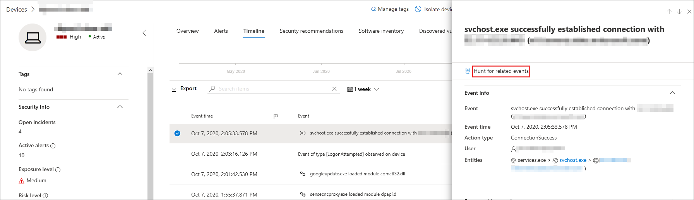

# <a name="quickly-hunt-for-entity-or-event-information-with-go-hunt"></a><span data-ttu-id="96484-104">Busca rápida por informações de entidade ou evento com a busca de ida e volta</span><span class="sxs-lookup"><span data-stu-id="96484-104">Quickly hunt for entity or event information with go hunt</span></span>

[!INCLUDE [Microsoft 365 Defender rebranding](../../includes/microsoft-defender.md)]

<span data-ttu-id="96484-105">**Aplica-se a:**</span><span class="sxs-lookup"><span data-stu-id="96484-105">**Applies to:**</span></span>
- [<span data-ttu-id="96484-106">Defender para Ponto de Extremidade</span><span class="sxs-lookup"><span data-stu-id="96484-106">Defender for Endpoint</span></span>](https://go.microsoft.com/fwlink/?linkid=2154037)

><span data-ttu-id="96484-107">Deseja experimentar o Defender para Ponto de Extremidade?</span><span class="sxs-lookup"><span data-stu-id="96484-107">Want to experience Defender for Endpoint?</span></span> [<span data-ttu-id="96484-108">Inscreva-se para uma avaliação gratuita.</span><span class="sxs-lookup"><span data-stu-id="96484-108">Sign up for a free trial.</span></span>](https://www.microsoft.com/microsoft-365/windows/microsoft-defender-atp?ocid=docs-wdatp-advancedhuntingref-abovefoldlink)


<span data-ttu-id="96484-109">Com a *ação ir à* busca, você pode investigar rapidamente eventos e vários tipos de entidade usando recursos avançados de busca avançados baseados [em](advanced-hunting-overview.md) consulta.</span><span class="sxs-lookup"><span data-stu-id="96484-109">With the *go hunt* action, you can quickly investigate events and various entity types using powerful query-based [advanced hunting](advanced-hunting-overview.md) capabilities.</span></span> <span data-ttu-id="96484-110">Essa ação executa automaticamente uma consulta de busca avançada para encontrar informações relevantes sobre o evento ou entidade selecionado.</span><span class="sxs-lookup"><span data-stu-id="96484-110">This action automatically runs an advanced hunting query to find relevant information about the selected event or entity.</span></span>

<span data-ttu-id="96484-111">A *ação de busca* de go está disponível em várias seções do centro de segurança sempre que os detalhes do evento ou da entidade são exibidos.</span><span class="sxs-lookup"><span data-stu-id="96484-111">The *go hunt* action is available in various sections of the security center whenever event or entity details are displayed.</span></span> <span data-ttu-id="96484-112">Por exemplo, você pode usar *ir procurar* nas seguintes seções:</span><span class="sxs-lookup"><span data-stu-id="96484-112">For example, you can use *go hunt* from the following sections:</span></span>

- <span data-ttu-id="96484-113">Na página [incidente,](investigate-incidents.md)você pode revisar detalhes sobre usuários, dispositivos e muitas outras entidades associadas a um incidente.</span><span class="sxs-lookup"><span data-stu-id="96484-113">In the [incident page](investigate-incidents.md), you can review details about users, devices, and many other entities associated with an incident.</span></span> <span data-ttu-id="96484-114">Ao selecionar uma entidade, você obterá informações adicionais, bem como várias ações que poderia tomar nessa entidade.</span><span class="sxs-lookup"><span data-stu-id="96484-114">When you select an entity, you get additional information as well as various actions you could take on that entity.</span></span> <span data-ttu-id="96484-115">No exemplo abaixo, um dispositivo é selecionado, mostrando detalhes sobre o dispositivo, bem como a opção de procurar mais informações sobre o dispositivo.</span><span class="sxs-lookup"><span data-stu-id="96484-115">In the example below, a device is selected, showing details about the device as well the option to hunt for more information about the device.</span></span>

    

- <span data-ttu-id="96484-117">Na página incidente, você também pode acessar uma lista de entidades na guia evidências. Selecionar uma dessas entidades fornece uma opção para procurar rapidamente informações sobre essa entidade.</span><span class="sxs-lookup"><span data-stu-id="96484-117">In the incident page, you can also access a list of entities under the evidence tab. Selecting one of those entities provides an option to quickly hunt for information about that entity.</span></span>

    

- <span data-ttu-id="96484-119">Ao exibir a linha do tempo de um dispositivo, você pode selecionar um evento na linha do tempo para exibir informações adicionais sobre esse evento.</span><span class="sxs-lookup"><span data-stu-id="96484-119">When viewing the timeline for a device, you can select an event in the timeline to view additional information about that event.</span></span> <span data-ttu-id="96484-120">Depois que um evento é selecionado, você tem a opção de procurar outros eventos relevantes na busca avançada.</span><span class="sxs-lookup"><span data-stu-id="96484-120">Once an event is selected, you get the option to hunt for other relevant events in advanced hunting.</span></span>

    

<span data-ttu-id="96484-122">Selecionar **Ir procurar** ou procurar **eventos** relacionados passa por diferentes consultas, dependendo se você selecionou uma entidade ou um evento.</span><span class="sxs-lookup"><span data-stu-id="96484-122">Selecting **Go hunt** or **Hunt for related events** passes different queries, depending on whether you've selected an entity or an event.</span></span>

## <a name="query-for-entity-information"></a><span data-ttu-id="96484-123">Consulta para informações da entidade</span><span class="sxs-lookup"><span data-stu-id="96484-123">Query for entity information</span></span>

<span data-ttu-id="96484-124">Ao usar *o go hunt* to query for information about a user, device, or any other type of entity, the query checks all relevant schema tables for any events involving that entity.</span><span class="sxs-lookup"><span data-stu-id="96484-124">When using *go hunt* to query for information about a user, device, or any other type of entity, the query checks all relevant schema tables for any events involving that entity.</span></span> <span data-ttu-id="96484-125">Para manter os resultados gerenciáveis, a consulta tem escopo para o mesmo período de tempo que a atividade mais antiga nos últimos 30 dias que envolve a entidade e está associada ao incidente.</span><span class="sxs-lookup"><span data-stu-id="96484-125">To keep the results manageable, the query is scoped to around the same time period as the earliest activity in the past 30 days that involves the entity and is associated with the incident.</span></span>

<span data-ttu-id="96484-126">Aqui está um exemplo da consulta go hunt para um dispositivo:</span><span class="sxs-lookup"><span data-stu-id="96484-126">Here is an example of the go hunt query for a device:</span></span>

```kusto
let selectedTimestamp = datetime(2020-06-02T02:06:47.1167157Z);
let deviceName = "fv-az770.example.com";
let deviceId = "device-guid";
search in (DeviceLogonEvents, DeviceProcessEvents, DeviceNetworkEvents, DeviceFileEvents, DeviceRegistryEvents, DeviceImageLoadEvents, DeviceEvents, DeviceImageLoadEvents, IdentityLogonEvents, IdentityQueryEvents)
Timestamp between ((selectedTimestamp - 1h) .. (selectedTimestamp + 1h))
and DeviceName == deviceName
// or RemoteDeviceName == deviceName
// or DeviceId == deviceId
| take 100
```

### <a name="supported-entity-types"></a><span data-ttu-id="96484-127">Tipos de entidade com suporte</span><span class="sxs-lookup"><span data-stu-id="96484-127">Supported entity types</span></span>

<span data-ttu-id="96484-128">Você pode usar *ir procurar depois* de selecionar qualquer um desses tipos de entidade:</span><span class="sxs-lookup"><span data-stu-id="96484-128">You can use *go hunt* after selecting any of these entity types:</span></span>

- <span data-ttu-id="96484-129">Arquivos</span><span class="sxs-lookup"><span data-stu-id="96484-129">Files</span></span>
- <span data-ttu-id="96484-130">Usuários</span><span class="sxs-lookup"><span data-stu-id="96484-130">Users</span></span>
- <span data-ttu-id="96484-131">Dispositivos</span><span class="sxs-lookup"><span data-stu-id="96484-131">Devices</span></span>
- <span data-ttu-id="96484-132">Endereços IP</span><span class="sxs-lookup"><span data-stu-id="96484-132">IP addresses</span></span>
- <span data-ttu-id="96484-133">URLs</span><span class="sxs-lookup"><span data-stu-id="96484-133">URLs</span></span>

## <a name="query-for-event-information"></a><span data-ttu-id="96484-134">Consulta para informações do evento</span><span class="sxs-lookup"><span data-stu-id="96484-134">Query for event information</span></span>

<span data-ttu-id="96484-135">Ao usar *o go hunt* to query for information about a timeline event, the query checks all relevant schema tables for other events around the time of the selected event.</span><span class="sxs-lookup"><span data-stu-id="96484-135">When using *go hunt* to query for information about a timeline event, the query checks all relevant schema tables for other events around the time of the selected event.</span></span> <span data-ttu-id="96484-136">Por exemplo, a consulta a seguir lista eventos em várias tabelas de esquema que ocorreram ao redor do mesmo período de tempo no mesmo dispositivo:</span><span class="sxs-lookup"><span data-stu-id="96484-136">For example, the following query lists events in various schema tables that occurred around the same time period on the same device:</span></span>

```kusto
// List relevant events 30 minutes before and after selected RegistryValueSet event
let selectedEventTimestamp = datetime(2020-10-06T21:40:25.3466868Z);
search in (DeviceFileEvents, DeviceProcessEvents, DeviceEvents, DeviceRegistryEvents, DeviceNetworkEvents, DeviceImageLoadEvents, DeviceLogonEvents)
    Timestamp between ((selectedEventTimestamp - 30m) .. (selectedEventTimestamp + 30m))
    and DeviceId == "a305b52049c4658ec63ae8b55becfe5954c654a4"
| sort by Timestamp desc
| extend Relevance = iff(Timestamp == selectedEventTimestamp, "Selected event", iff(Timestamp < selectedEventTimestamp, "Earlier event", "Later event"))
| project-reorder Relevance
```

## <a name="adjust-the-query"></a><span data-ttu-id="96484-137">Ajustar a consulta</span><span class="sxs-lookup"><span data-stu-id="96484-137">Adjust the query</span></span>

<span data-ttu-id="96484-138">Com algum conhecimento do [idioma de consulta,](advanced-hunting-query-language.md)você pode ajustar a consulta à sua preferência.</span><span class="sxs-lookup"><span data-stu-id="96484-138">With some knowledge of the [query language](advanced-hunting-query-language.md), you can adjust the query to your preference.</span></span> <span data-ttu-id="96484-139">Por exemplo, você pode ajustar essa linha, que determina o tamanho da janela de tempo:</span><span class="sxs-lookup"><span data-stu-id="96484-139">For example, you can adjust this line, which determines the size of the time window:</span></span>

```kusto
Timestamp between ((selectedTimestamp - 1h) .. (selectedTimestamp + 1h))
```

<span data-ttu-id="96484-140">Além de modificar a consulta para obter resultados mais relevantes, você também pode:</span><span class="sxs-lookup"><span data-stu-id="96484-140">In addition to modifying the query to get more relevant results, you can also:</span></span>

- [<span data-ttu-id="96484-141">Exibir os resultados como gráficos</span><span class="sxs-lookup"><span data-stu-id="96484-141">View the results as charts</span></span>](advanced-hunting-query-results.md#view-query-results-as-a-table-or-chart)
- [<span data-ttu-id="96484-142">Criar uma regra de detecção personalizada</span><span class="sxs-lookup"><span data-stu-id="96484-142">Create a custom detection rule</span></span>](custom-detection-rules.md)

## <a name="related-topics"></a><span data-ttu-id="96484-143">Tópicos relacionados</span><span class="sxs-lookup"><span data-stu-id="96484-143">Related topics</span></span>

- [<span data-ttu-id="96484-144">Visão geral da busca avançada</span><span class="sxs-lookup"><span data-stu-id="96484-144">Advanced hunting overview</span></span>](advanced-hunting-overview.md)
- [<span data-ttu-id="96484-145">Aprender a linguagem de consulta</span><span class="sxs-lookup"><span data-stu-id="96484-145">Learn the query language</span></span>](advanced-hunting-query-language.md)
- [<span data-ttu-id="96484-146">Trabalhar com os resultados da consulta</span><span class="sxs-lookup"><span data-stu-id="96484-146">Work with query results</span></span>](advanced-hunting-query-results.md)
- [<span data-ttu-id="96484-147">Regras de detecção personalizadas</span><span class="sxs-lookup"><span data-stu-id="96484-147">Custom detection rules</span></span>](custom-detection-rules.md)
