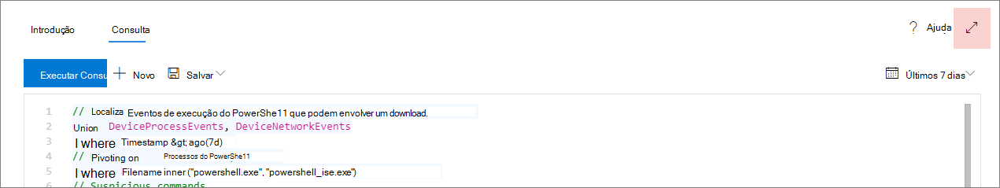
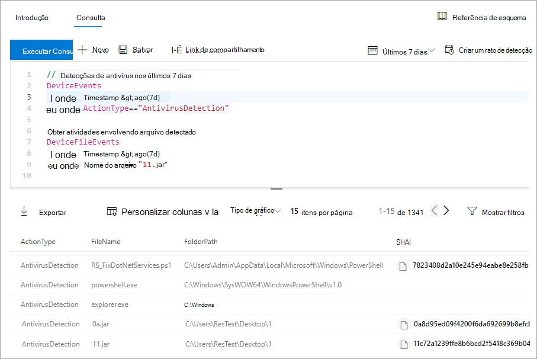
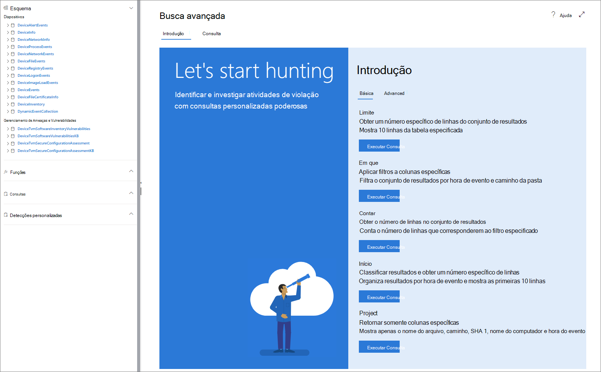

# <a name="learn-the-advanced-hunting-query-language"></a><span data-ttu-id="bb833-104">Conhecer a linguagem de consulta de busca avançada</span><span class="sxs-lookup"><span data-stu-id="bb833-104">Learn the advanced hunting query language</span></span>

[!INCLUDE [Microsoft 365 Defender rebranding](../../includes/microsoft-defender.md)]

<span data-ttu-id="bb833-105">**Aplica-se a:**</span><span class="sxs-lookup"><span data-stu-id="bb833-105">**Applies to:**</span></span>
- [<span data-ttu-id="bb833-106">Defender para Ponto de Extremidade</span><span class="sxs-lookup"><span data-stu-id="bb833-106">Defender for Endpoint</span></span>](https://go.microsoft.com/fwlink/?linkid=2154037)

> <span data-ttu-id="bb833-107">Deseja experimentar o Defender para Ponto de Extremidade?</span><span class="sxs-lookup"><span data-stu-id="bb833-107">Want to experience Defender for Endpoint?</span></span> [<span data-ttu-id="bb833-108">Inscreva-se para uma avaliação gratuita.</span><span class="sxs-lookup"><span data-stu-id="bb833-108">Sign up for a free trial.</span></span>](https://www.microsoft.com/microsoft-365/windows/microsoft-defender-atp?ocid=docs-wdatp-advancedhunting-abovefoldlink)

<span data-ttu-id="bb833-109">A caça avançada baseia-se na [linguagem de consulta Kusto](https://docs.microsoft.com/azure/kusto/query/).</span><span class="sxs-lookup"><span data-stu-id="bb833-109">Advanced hunting is based on the [Kusto query language](https://docs.microsoft.com/azure/kusto/query/).</span></span> <span data-ttu-id="bb833-110">Você pode usar operadores e instruções kusto para construir consultas que localizem informações em um [esquema especializado.](advanced-hunting-schema-reference.md)</span><span class="sxs-lookup"><span data-stu-id="bb833-110">You can use Kusto operators and statements to construct queries that locate information in a specialized [schema](advanced-hunting-schema-reference.md).</span></span> <span data-ttu-id="bb833-111">Para entender melhor esses conceitos, execute a primeira consulta.</span><span class="sxs-lookup"><span data-stu-id="bb833-111">To understand these concepts better, run your first query.</span></span>

## <a name="try-your-first-query"></a><span data-ttu-id="bb833-112">Experimente a primeira consulta</span><span class="sxs-lookup"><span data-stu-id="bb833-112">Try your first query</span></span>

<span data-ttu-id="bb833-113">No Centro de Segurança do Microsoft Defender, vá para **Busca Avançada** para executar sua primeira consulta.</span><span class="sxs-lookup"><span data-stu-id="bb833-113">In Microsoft Defender Security Center, go to **Advanced hunting** to run your first query.</span></span> <span data-ttu-id="bb833-114">Use o seguinte exemplo:</span><span class="sxs-lookup"><span data-stu-id="bb833-114">Use the following example:</span></span>

```kusto
// Finds PowerShell execution events that could involve a download
union DeviceProcessEvents, DeviceNetworkEvents
| where Timestamp > ago(7d)
// Pivoting on PowerShell processes
| where FileName in~ ("powershell.exe", "powershell_ise.exe")
// Suspicious commands
| where ProcessCommandLine has_any("WebClient",
    "DownloadFile",
    "DownloadData",
    "DownloadString",
    "WebRequest",
    "Shellcode",
    "http",
    "https")
| project Timestamp, DeviceName, InitiatingProcessFileName, InitiatingProcessCommandLine, 
FileName, ProcessCommandLine, RemoteIP, RemoteUrl, RemotePort, RemoteIPType
| top 100 by Timestamp
```
<span data-ttu-id="bb833-115">**[Executar essa consulta em busca avançada](https://securitycenter.windows.com/hunting?query=H4sIAAAAAAAEAI2TT0vDQBDF5yz4HUJPFcTqyZsXqyCIBFvxKNGWtpo_NVlbC8XP7m8mado0K5Zls8nkzdu3b2Z70pNAbmUmqYyk4D2UTJYyllwGMmWNGQHrN_NNvsSBzUBrbMFMiWieAx3xDEBl4GL4AuNd8B0bNgARENcdUmIZ3yM5liPwac3bN-YZPGPU5ET1rWDc7Ox4uod8YDp4MzI-GkjlX4Ne2nly0zEkKzFWh4ZE5sSuTN8Ehq5couvEMnvmUAhez-HsRBMipVa_W_OG6vEfGtT12JRHpqV064e1Kx04NsxFzXxW1aFjp_djXmDRPbfY3XMMcLogTz2bWZ2KqmIJI6q6wKe2WYnrRsa9KVeU9kCBBo2v7BzPxF_Bx2DKiqh63SGoRoc6Njti48z_yL71XHQAcgAur6rXRpcqH3l-4knZF23Utsbq2MircEqmw-G__xR1TdZ1r7zb7XLezmx3etkvGr-ze6NdGdW92azUfpcdluWvr-aqbh_nofnqcWI3aYyOsBV7giduRUO7187LMKTT5rxvHHX80_t8IeeMgLquvL7-Ak3q-kz8BAAA&runQuery=true&timeRangeId=week)**</span><span class="sxs-lookup"><span data-stu-id="bb833-115">**[Run this query in advanced hunting](https://securitycenter.windows.com/hunting?query=H4sIAAAAAAAEAI2TT0vDQBDF5yz4HUJPFcTqyZsXqyCIBFvxKNGWtpo_NVlbC8XP7m8mado0K5Zls8nkzdu3b2Z70pNAbmUmqYyk4D2UTJYyllwGMmWNGQHrN_NNvsSBzUBrbMFMiWieAx3xDEBl4GL4AuNd8B0bNgARENcdUmIZ3yM5liPwac3bN-YZPGPU5ET1rWDc7Ox4uod8YDp4MzI-GkjlX4Ne2nly0zEkKzFWh4ZE5sSuTN8Ehq5couvEMnvmUAhez-HsRBMipVa_W_OG6vEfGtT12JRHpqV064e1Kx04NsxFzXxW1aFjp_djXmDRPbfY3XMMcLogTz2bWZ2KqmIJI6q6wKe2WYnrRsa9KVeU9kCBBo2v7BzPxF_Bx2DKiqh63SGoRoc6Njti48z_yL71XHQAcgAur6rXRpcqH3l-4knZF23Utsbq2MircEqmw-G__xR1TdZ1r7zb7XLezmx3etkvGr-ze6NdGdW92azUfpcdluWvr-aqbh_nofnqcWI3aYyOsBV7giduRUO7187LMKTT5rxvHHX80_t8IeeMgLquvL7-Ak3q-kz8BAAA&runQuery=true&timeRangeId=week)**</span></span>

### <a name="describe-the-query-and-specify-the-tables-to-search"></a><span data-ttu-id="bb833-116">Descrever a consulta e especificar as tabelas a ser pesquisadas</span><span class="sxs-lookup"><span data-stu-id="bb833-116">Describe the query and specify the tables to search</span></span>
<span data-ttu-id="bb833-117">Um breve comentário foi adicionado ao início da consulta para descrever para que ela é.</span><span class="sxs-lookup"><span data-stu-id="bb833-117">A short comment has been added to the beginning of the query to describe what it is for.</span></span> <span data-ttu-id="bb833-118">Este comentário ajuda se você decidir mais tarde salvar a consulta e compartilhá-la com outras pessoas em sua organização.</span><span class="sxs-lookup"><span data-stu-id="bb833-118">This comment helps if you later decide to save the query and share it with others in your organization.</span></span>

```kusto
// Finds PowerShell execution events that could involve a download
```
<span data-ttu-id="bb833-119">A consulta em si normalmente iniciará com um nome de tabela seguido por vários elementos que começam com um pipe ( `|` ).</span><span class="sxs-lookup"><span data-stu-id="bb833-119">The query itself will typically start with a table name followed by several elements that start with a pipe (`|`).</span></span> <span data-ttu-id="bb833-120">Neste exemplo, começamos criando uma união de duas tabelas e , e adicionamos elementos  `DeviceProcessEvents` `DeviceNetworkEvents` canalados conforme necessário.</span><span class="sxs-lookup"><span data-stu-id="bb833-120">In this example, we start by creating a union of two tables,  `DeviceProcessEvents` and `DeviceNetworkEvents`, and add piped elements as needed.</span></span>

```kusto
union DeviceProcessEvents, DeviceNetworkEvents
```
### <a name="set-the-time-range"></a><span data-ttu-id="bb833-121">Definir o intervalo de tempo</span><span class="sxs-lookup"><span data-stu-id="bb833-121">Set the time range</span></span>
<span data-ttu-id="bb833-122">O primeiro elemento canalado é um filtro de tempo com escopo para os sete dias anteriores.</span><span class="sxs-lookup"><span data-stu-id="bb833-122">The first piped element is a time filter scoped to the previous seven days.</span></span> <span data-ttu-id="bb833-123">Limitar o intervalo de tempo ajuda a garantir que as consultas executem bem, retornem resultados gerenciáveis e não se limitem.</span><span class="sxs-lookup"><span data-stu-id="bb833-123">Limiting the time range helps ensure that queries perform well, return manageable results, and don't time out.</span></span>

```kusto
| where Timestamp > ago(7d)
```

### <a name="check-specific-processes"></a><span data-ttu-id="bb833-124">Verificar processos específicos</span><span class="sxs-lookup"><span data-stu-id="bb833-124">Check specific processes</span></span>
<span data-ttu-id="bb833-125">O intervalo de tempo é imediatamente seguido por uma pesquisa de nomes de arquivo de processo que representam o aplicativo PowerShell.</span><span class="sxs-lookup"><span data-stu-id="bb833-125">The time range is immediately followed by a search for process file names representing the PowerShell application.</span></span>

```kusto
// Pivoting on PowerShell processes
| where FileName in~ ("powershell.exe", "powershell_ise.exe")
```

### <a name="search-for-specific-command-strings"></a><span data-ttu-id="bb833-126">Pesquisar cadeias de caracteres de comando específicas</span><span class="sxs-lookup"><span data-stu-id="bb833-126">Search for specific command strings</span></span>
<span data-ttu-id="bb833-127">Posteriormente, a consulta procura cadeias de caracteres em linhas de comando que normalmente são usadas para baixar arquivos usando o PowerShell.</span><span class="sxs-lookup"><span data-stu-id="bb833-127">Afterwards, the query looks for strings in command lines that are typically used to download files using PowerShell.</span></span>

```kusto
// Suspicious commands
| where ProcessCommandLine has_any("WebClient",
    "DownloadFile",
    "DownloadData",
    "DownloadString",
    "WebRequest",
    "Shellcode",
    "http",
    "https")
```

### <a name="customize-result-columns-and-length"></a><span data-ttu-id="bb833-128">Personalizar colunas de resultados e comprimento</span><span class="sxs-lookup"><span data-stu-id="bb833-128">Customize result columns and length</span></span> 
<span data-ttu-id="bb833-129">Agora que sua consulta identifica claramente os dados que você deseja localizar, você pode definir a aparência dos resultados.</span><span class="sxs-lookup"><span data-stu-id="bb833-129">Now that your query clearly identifies the data you want to locate, you can define what the results look like.</span></span> <span data-ttu-id="bb833-130">`project` retorna colunas específicas e `top` limita o número de resultados.</span><span class="sxs-lookup"><span data-stu-id="bb833-130">`project` returns specific columns, and `top` limits the number of results.</span></span> <span data-ttu-id="bb833-131">Esses operadores ajudam a garantir que os resultados sejam bem formatados e razoavelmente grandes e fáceis de processar.</span><span class="sxs-lookup"><span data-stu-id="bb833-131">These operators help ensure the results are well-formatted and reasonably large and easy to process.</span></span>

```kusto
| project Timestamp, DeviceName, InitiatingProcessFileName, InitiatingProcessCommandLine, 
FileName, ProcessCommandLine, RemoteIP, RemoteUrl, RemotePort, RemoteIPType
| top 100 by Timestamp
```

<span data-ttu-id="bb833-132">Selecione **Executar consulta para** ver os resultados.</span><span class="sxs-lookup"><span data-stu-id="bb833-132">Select **Run query** to see the results.</span></span> <span data-ttu-id="bb833-133">Use o ícone de expansão na parte superior direita do editor de consulta para se concentrar na consulta de busca e nos resultados.</span><span class="sxs-lookup"><span data-stu-id="bb833-133">Use the expand icon at the top right of the query editor to focus on your hunting query and the results.</span></span> 



>[!TIP]
><span data-ttu-id="bb833-135">Você pode exibir os resultados da consulta como gráficos e ajustar filtros rapidamente.</span><span class="sxs-lookup"><span data-stu-id="bb833-135">You can view query results as charts and quickly adjust filters.</span></span> <span data-ttu-id="bb833-136">Para obter orientações, [leia sobre como trabalhar com resultados de consulta](advanced-hunting-query-results.md)</span><span class="sxs-lookup"><span data-stu-id="bb833-136">For guidance, [read about working with query results](advanced-hunting-query-results.md)</span></span>

## <a name="learn-common-query-operators-for-advanced-hunting"></a><span data-ttu-id="bb833-137">Conheça operadores de consulta comuns para a caça avançada</span><span class="sxs-lookup"><span data-stu-id="bb833-137">Learn common query operators for advanced hunting</span></span>

<span data-ttu-id="bb833-138">Você acabou de executar sua primeira consulta e ter uma ideia geral de seus componentes.</span><span class="sxs-lookup"><span data-stu-id="bb833-138">You've just run your first query and have a general idea of its components.</span></span> <span data-ttu-id="bb833-139">É hora de voltar um pouco e aprender alguns conceitos básicos.</span><span class="sxs-lookup"><span data-stu-id="bb833-139">It's time to backtrack slightly and learn some basics.</span></span> <span data-ttu-id="bb833-140">A linguagem de consulta Kusto usada por caça avançada oferece suporte a vários operadores, incluindo os seguintes.</span><span class="sxs-lookup"><span data-stu-id="bb833-140">The Kusto query language used by advanced hunting supports a range of operators, including the following common ones.</span></span>

| <span data-ttu-id="bb833-141">Operador</span><span class="sxs-lookup"><span data-stu-id="bb833-141">Operator</span></span> | <span data-ttu-id="bb833-142">Descrição e uso</span><span class="sxs-lookup"><span data-stu-id="bb833-142">Description and usage</span></span> |
|--|--|
| `where` | <span data-ttu-id="bb833-143">Filtre uma tabela no subconjunto de linhas que atendem a um predicado.</span><span class="sxs-lookup"><span data-stu-id="bb833-143">Filter a table to the subset of rows that satisfy a predicate.</span></span> |
| `summarize` | <span data-ttu-id="bb833-144">Produza uma tabela que agrega o conteúdo da tabela de entrada.</span><span class="sxs-lookup"><span data-stu-id="bb833-144">Produce a table that aggregates the content of the input table.</span></span> |
| `join` | <span data-ttu-id="bb833-145">Mescle as linhas de duas tabelas para formar uma nova tabela, correspondendo valores das colunas especificadas de cada tabela.</span><span class="sxs-lookup"><span data-stu-id="bb833-145">Merge the rows of two tables to form a new table by matching values of the specified column(s) from each table.</span></span> |
| `count` | <span data-ttu-id="bb833-146">Retorne o número de registros no conjunto de registros de entrada.</span><span class="sxs-lookup"><span data-stu-id="bb833-146">Return the number of records in the input record set.</span></span> |
| `top` | <span data-ttu-id="bb833-147">Retorne os primeiros registros N classificados pelas colunas especificadas.</span><span class="sxs-lookup"><span data-stu-id="bb833-147">Return the first N records sorted by the specified columns.</span></span> |
| `limit` | <span data-ttu-id="bb833-148">Retornar para o número especificado de linhas.</span><span class="sxs-lookup"><span data-stu-id="bb833-148">Return up to the specified number of rows.</span></span> |
| `project` | <span data-ttu-id="bb833-149">Selecione as colunas a serem incluídas, renomear ou descartar e inserir novas colunas computadas.</span><span class="sxs-lookup"><span data-stu-id="bb833-149">Select the columns to include, rename or drop, and insert new computed columns.</span></span> |
| `extend` | <span data-ttu-id="bb833-150">Crie colunas calculadas e as acrescente ao conjunto de resultados.</span><span class="sxs-lookup"><span data-stu-id="bb833-150">Create calculated columns and append them to the result set.</span></span> |
| `makeset` |  <span data-ttu-id="bb833-151">Retornar uma matriz dinâmica (JSON) do conjunto de valores distintos que Expr assume no grupo.</span><span class="sxs-lookup"><span data-stu-id="bb833-151">Return a dynamic (JSON) array of the set of distinct values that Expr takes in the group.</span></span> |
| `find` | <span data-ttu-id="bb833-152">Localizar linhas que correspondam a um predicado em um conjunto de tabelas.</span><span class="sxs-lookup"><span data-stu-id="bb833-152">Find rows that match a predicate across a set of tables.</span></span> |

<span data-ttu-id="bb833-153">Para ver um exemplo ao vivo desses operadores, execute-os na seção **Iniciar** da página de busca avançada.</span><span class="sxs-lookup"><span data-stu-id="bb833-153">To see a live example of these operators, run them from the **Get started** section of the advanced hunting page.</span></span>

## <a name="understand-data-types"></a><span data-ttu-id="bb833-154">Compreender tipos de dados</span><span class="sxs-lookup"><span data-stu-id="bb833-154">Understand data types</span></span>

<span data-ttu-id="bb833-155">A busca avançada dá suporte a tipos de dados Kusto, incluindo os seguintes tipos comuns:</span><span class="sxs-lookup"><span data-stu-id="bb833-155">Advanced hunting supports Kusto data types, including the following common types:</span></span>

| <span data-ttu-id="bb833-156">Tipo de dados</span><span class="sxs-lookup"><span data-stu-id="bb833-156">Data type</span></span> | <span data-ttu-id="bb833-157">Implicações de descrição e de consulta</span><span class="sxs-lookup"><span data-stu-id="bb833-157">Description and query implications</span></span> |
|--|--|
| `datetime` | <span data-ttu-id="bb833-158">As informações de dados e de hora geralmente representam os datas-hora do evento.</span><span class="sxs-lookup"><span data-stu-id="bb833-158">Data and time information typically representing event timestamps.</span></span> [<span data-ttu-id="bb833-159">Consulte formatos de data/hora suportados</span><span class="sxs-lookup"><span data-stu-id="bb833-159">See supported datetime formats</span></span>](https://docs.microsoft.com/azure/data-explorer/kusto/query/scalar-data-types/datetime) |
| `string` | <span data-ttu-id="bb833-160">Cadeia de caracteres em UTF-8 entre aspas simples ( `'` ) ou aspas duplas ( `"` ).</span><span class="sxs-lookup"><span data-stu-id="bb833-160">Character string in UTF-8 enclosed in single quotes (`'`) or double quotes (`"`).</span></span> [<span data-ttu-id="bb833-161">Leia mais sobre cadeias de caracteres</span><span class="sxs-lookup"><span data-stu-id="bb833-161">Read more about strings</span></span>](https://docs.microsoft.com/azure/data-explorer/kusto/query/scalar-data-types/string) |
| `bool` | <span data-ttu-id="bb833-162">Esse tipo de dados dá suporte `true` ou `false` estados.</span><span class="sxs-lookup"><span data-stu-id="bb833-162">This data type supports `true` or `false` states.</span></span> [<span data-ttu-id="bb833-163">Consulte literais e operadores com suporte</span><span class="sxs-lookup"><span data-stu-id="bb833-163">See supported literals and operators</span></span>](https://docs.microsoft.com/azure/data-explorer/kusto/query/scalar-data-types/bool) |
| `int` | <span data-ttu-id="bb833-164">Inteiro de 32 bits</span><span class="sxs-lookup"><span data-stu-id="bb833-164">32-bit integer</span></span>  |
| `long` | <span data-ttu-id="bb833-165">Inteiro de 64 bits</span><span class="sxs-lookup"><span data-stu-id="bb833-165">64-bit integer</span></span> |

<span data-ttu-id="bb833-166">Para saber mais sobre esses tipos de dados, leia sobre tipos de dados [escalares do Kusto.](https://docs.microsoft.com/azure/data-explorer/kusto/query/scalar-data-types/)</span><span class="sxs-lookup"><span data-stu-id="bb833-166">To learn more about these data types, [read about Kusto scalar data types](https://docs.microsoft.com/azure/data-explorer/kusto/query/scalar-data-types/).</span></span>

## <a name="get-help-as-you-write-queries"></a><span data-ttu-id="bb833-167">Obter ajuda durante a criação de consultas</span><span class="sxs-lookup"><span data-stu-id="bb833-167">Get help as you write queries</span></span>
<span data-ttu-id="bb833-168">Aproveite as funcionalidades a seguir para escrever rapidamente as consultas:</span><span class="sxs-lookup"><span data-stu-id="bb833-168">Take advantage of the following functionality to write queries faster:</span></span>

- <span data-ttu-id="bb833-169">**Autosuggest**— à medida que você escreve consultas, a busca avançada fornece sugestões de IntelliSense.</span><span class="sxs-lookup"><span data-stu-id="bb833-169">**Autosuggest**—as you write queries, advanced hunting provides suggestions from IntelliSense.</span></span>
- <span data-ttu-id="bb833-170">**Árvore de esquema**— uma representação de esquema que inclui a lista de tabelas e suas colunas é fornecida ao lado da sua área de trabalho.</span><span class="sxs-lookup"><span data-stu-id="bb833-170">**Schema tree**—a schema representation that includes the list of tables and their columns is provided next to your working area.</span></span> <span data-ttu-id="bb833-171">Para saber mais, passe o mouse sobre um item.</span><span class="sxs-lookup"><span data-stu-id="bb833-171">For more information, hover over an item.</span></span> <span data-ttu-id="bb833-172">Clique duas vezes em um item para inseri-lo no editor de consultas.</span><span class="sxs-lookup"><span data-stu-id="bb833-172">Double-click an item to insert it to the query editor.</span></span>
- <span data-ttu-id="bb833-173">**[Referência de esquema](advanced-hunting-schema-reference.md#get-schema-information-in-the-security-center)**— referência no portal com descrições de tabela e coluna, bem como tipos de eventos com suporte `ActionType` (valores) e consultas de exemplo</span><span class="sxs-lookup"><span data-stu-id="bb833-173">**[Schema reference](advanced-hunting-schema-reference.md#get-schema-information-in-the-security-center)**—in-portal reference with table and column descriptions as well as supported event types (`ActionType` values) and sample queries</span></span>

## <a name="work-with-multiple-queries-in-the-editor"></a><span data-ttu-id="bb833-174">Trabalhar com várias consultas no editor</span><span class="sxs-lookup"><span data-stu-id="bb833-174">Work with multiple queries in the editor</span></span>
<span data-ttu-id="bb833-175">Você pode usar o editor de consulta para experimentar várias consultas.</span><span class="sxs-lookup"><span data-stu-id="bb833-175">You can use the query editor to experiment with multiple queries.</span></span> <span data-ttu-id="bb833-176">Para usar várias consultas:</span><span class="sxs-lookup"><span data-stu-id="bb833-176">To use multiple queries:</span></span>

- <span data-ttu-id="bb833-177">Separe cada consulta com uma linha vazia.</span><span class="sxs-lookup"><span data-stu-id="bb833-177">Separate each query with an empty line.</span></span>
- <span data-ttu-id="bb833-178">Coloque o cursor em qualquer parte de uma consulta para selecionar essa consulta antes de ser executado.</span><span class="sxs-lookup"><span data-stu-id="bb833-178">Place the cursor on any part of a query to select that query before running it.</span></span> <span data-ttu-id="bb833-179">Isso executará apenas a consulta selecionada.</span><span class="sxs-lookup"><span data-stu-id="bb833-179">This will run only the selected query.</span></span> <span data-ttu-id="bb833-180">Para executar outra consulta, mova o cursor de acordo e selecione **Executar consulta**.</span><span class="sxs-lookup"><span data-stu-id="bb833-180">To run another query, move the cursor accordingly and select **Run query**.</span></span>

<span data-ttu-id="bb833-181">
 _consultas com várias consultas_</span><span class="sxs-lookup"><span data-stu-id="bb833-181">
_Query editor with multiple queries_</span></span>

## <a name="use-sample-queries"></a><span data-ttu-id="bb833-182">Use consultas de amostra</span><span class="sxs-lookup"><span data-stu-id="bb833-182">Use sample queries</span></span>

<span data-ttu-id="bb833-183">A seção **introdução** fornece algumas consultas simples usando operadores usados com frequência.</span><span class="sxs-lookup"><span data-stu-id="bb833-183">The **Get started** section provides a few simple queries using commonly used operators.</span></span> <span data-ttu-id="bb833-184">Tente executar essas consultas e faça pequenas modificações nelas.</span><span class="sxs-lookup"><span data-stu-id="bb833-184">Try running these queries and making small modifications to them.</span></span>



> [!NOTE]
> <span data-ttu-id="bb833-186">Além das amostras básicas de consulta, você também pode acessar [consultas compartilhadas](advanced-hunting-shared-queries.md) para cenários específicos de busca de ameaças.</span><span class="sxs-lookup"><span data-stu-id="bb833-186">Apart from the basic query samples, you can also access [shared queries](advanced-hunting-shared-queries.md) for specific threat hunting scenarios.</span></span> <span data-ttu-id="bb833-187">Explore as consultas compartilhadas no lado esquerdo da página ou no [repositório de consulta do GitHub.](https://aka.ms/hunting-queries)</span><span class="sxs-lookup"><span data-stu-id="bb833-187">Explore the shared queries on the left side of the page or the [GitHub query repository](https://aka.ms/hunting-queries).</span></span>

## <a name="access-comprehensive-query-language-reference"></a><span data-ttu-id="bb833-188">Acessar referência abrangente do idioma de consulta</span><span class="sxs-lookup"><span data-stu-id="bb833-188">Access comprehensive query language reference</span></span>

<span data-ttu-id="bb833-189">Para obter informações detalhadas sobre o idioma de consulta, consulte a documentação do idioma de consulta [kusto.](https://docs.microsoft.com/azure/kusto/query/)</span><span class="sxs-lookup"><span data-stu-id="bb833-189">For detailed information about the query language, see [Kusto query language documentation](https://docs.microsoft.com/azure/kusto/query/).</span></span>

## <a name="related-topics"></a><span data-ttu-id="bb833-190">Tópicos relacionados</span><span class="sxs-lookup"><span data-stu-id="bb833-190">Related topics</span></span>
- [<span data-ttu-id="bb833-191">Visão geral da busca avançada</span><span class="sxs-lookup"><span data-stu-id="bb833-191">Advanced hunting overview</span></span>](advanced-hunting-overview.md)
- [<span data-ttu-id="bb833-192">Trabalhar com os resultados da consulta</span><span class="sxs-lookup"><span data-stu-id="bb833-192">Work with query results</span></span>](advanced-hunting-query-results.md)
- [<span data-ttu-id="bb833-193">Usar consultas compartilhadas</span><span class="sxs-lookup"><span data-stu-id="bb833-193">Use shared queries</span></span>](advanced-hunting-shared-queries.md)
- [<span data-ttu-id="bb833-194">Entender o esquema</span><span class="sxs-lookup"><span data-stu-id="bb833-194">Understand the schema</span></span>](advanced-hunting-schema-reference.md)
- [<span data-ttu-id="bb833-195">Aplicar práticas recomendadas de consulta</span><span class="sxs-lookup"><span data-stu-id="bb833-195">Apply query best practices</span></span>](advanced-hunting-best-practices.md)
