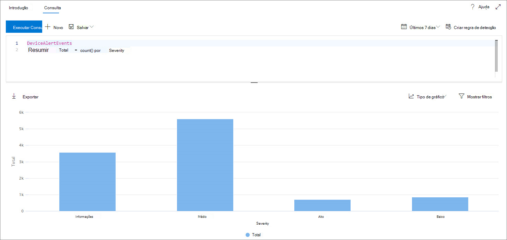
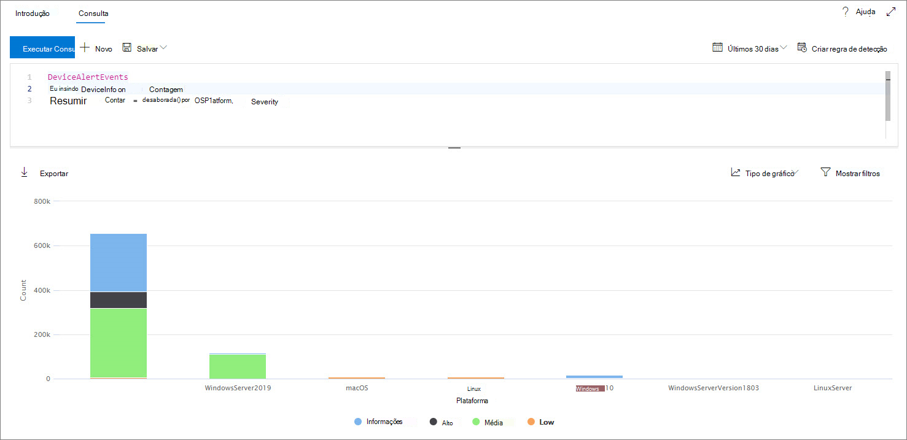
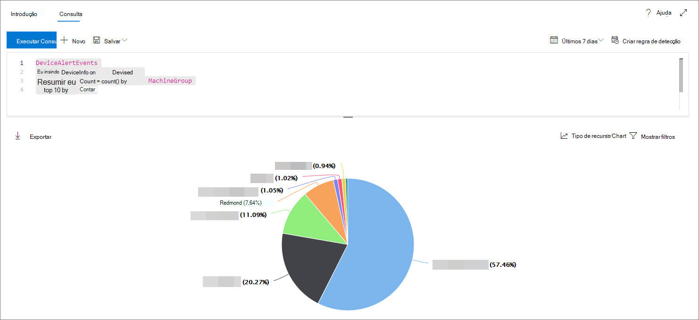
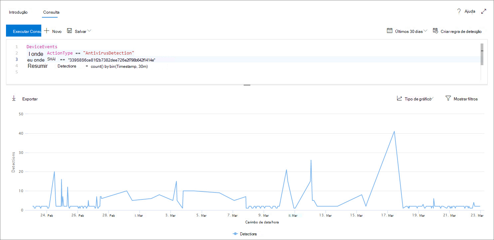
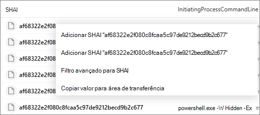
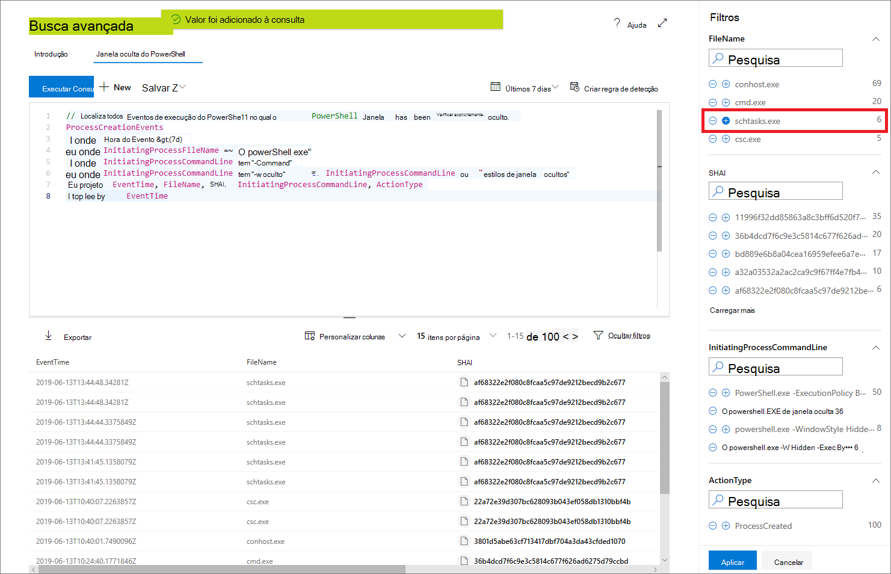

# <a name="work-with-advanced-hunting-query-results"></a><span data-ttu-id="a76f7-104">Trabalhar com resultados avançados de consulta de busca</span><span class="sxs-lookup"><span data-stu-id="a76f7-104">Work with advanced hunting query results</span></span>

[!INCLUDE [Microsoft 365 Defender rebranding](../../includes/microsoft-defender.md)]

<span data-ttu-id="a76f7-105">**Aplica-se a:**</span><span class="sxs-lookup"><span data-stu-id="a76f7-105">**Applies to:**</span></span>
- [<span data-ttu-id="a76f7-106">Microsoft Defender para Ponto de Extremidade</span><span class="sxs-lookup"><span data-stu-id="a76f7-106">Microsoft Defender for Endpoint</span></span>](https://go.microsoft.com/fwlink/?linkid=2154037)

><span data-ttu-id="a76f7-107">Deseja experimentar o Defender para Ponto de Extremidade?</span><span class="sxs-lookup"><span data-stu-id="a76f7-107">Want to experience Defender for Endpoint?</span></span> [<span data-ttu-id="a76f7-108">Inscreva-se para uma avaliação gratuita.</span><span class="sxs-lookup"><span data-stu-id="a76f7-108">Sign up for a free trial.</span></span>](https://www.microsoft.com/microsoft-365/windows/microsoft-defender-atp?ocid=docs-wdatp-advancedhunting-abovefoldlink)

<span data-ttu-id="a76f7-109">Embora você possa construir [suas](advanced-hunting-overview.md) consultas de busca avançadas para retornar informações muito precisas, você também pode trabalhar com os resultados da consulta para obter mais informações e investigar atividades e indicadores específicos.</span><span class="sxs-lookup"><span data-stu-id="a76f7-109">While you can construct your [advanced hunting](advanced-hunting-overview.md) queries to return very precise information, you can also work with the query results to gain further insight and investigate specific activities and indicators.</span></span> <span data-ttu-id="a76f7-110">Você pode tomar as seguintes ações em seus resultados de consulta:</span><span class="sxs-lookup"><span data-stu-id="a76f7-110">You can take the following actions on your query results:</span></span>

- <span data-ttu-id="a76f7-111">Exibir resultados como tabela ou gráfico</span><span class="sxs-lookup"><span data-stu-id="a76f7-111">View results as a table or chart</span></span>
- <span data-ttu-id="a76f7-112">Exportar tabelas e gráficos</span><span class="sxs-lookup"><span data-stu-id="a76f7-112">Export tables and charts</span></span>
- <span data-ttu-id="a76f7-113">Detalhar as informações detalhadas da entidade</span><span class="sxs-lookup"><span data-stu-id="a76f7-113">Drill down to detailed entity information</span></span>
- <span data-ttu-id="a76f7-114">Ajustar suas consultas diretamente dos resultados ou aplicar filtros</span><span class="sxs-lookup"><span data-stu-id="a76f7-114">Tweak your queries directly from the results or apply filters</span></span>

## <a name="view-query-results-as-a-table-or-chart"></a><span data-ttu-id="a76f7-115">Exibir resultados da consulta como uma tabela ou gráfico</span><span class="sxs-lookup"><span data-stu-id="a76f7-115">View query results as a table or chart</span></span>
<span data-ttu-id="a76f7-116">Por padrão, a busca avançada exibe os resultados da consulta como dados tabular.</span><span class="sxs-lookup"><span data-stu-id="a76f7-116">By default, advanced hunting displays query results as tabular data.</span></span> <span data-ttu-id="a76f7-117">Você também pode exibir os mesmos dados de um gráfico.</span><span class="sxs-lookup"><span data-stu-id="a76f7-117">You can also display the same data as a chart.</span></span> <span data-ttu-id="a76f7-118">A busca avançada dá suporte às seguintes exibições:</span><span class="sxs-lookup"><span data-stu-id="a76f7-118">Advanced hunting supports the following views:</span></span>

| <span data-ttu-id="a76f7-119">Tipo de modo de exibição</span><span class="sxs-lookup"><span data-stu-id="a76f7-119">View type</span></span> | <span data-ttu-id="a76f7-120">Descrição</span><span class="sxs-lookup"><span data-stu-id="a76f7-120">Description</span></span> |
| -- | -- |
| <span data-ttu-id="a76f7-121">**Table**</span><span class="sxs-lookup"><span data-stu-id="a76f7-121">**Table**</span></span> | <span data-ttu-id="a76f7-122">Exibe os resultados da consulta no formato tabular</span><span class="sxs-lookup"><span data-stu-id="a76f7-122">Displays the query results in tabular format</span></span> |
| <span data-ttu-id="a76f7-123">**Gráfico de colunas**</span><span class="sxs-lookup"><span data-stu-id="a76f7-123">**Column chart**</span></span> | <span data-ttu-id="a76f7-124">Renderiza uma série de itens exclusivos no eixo x como barras verticais cujas alturas representam valores numéricos de outro campo</span><span class="sxs-lookup"><span data-stu-id="a76f7-124">Renders a series of unique items on the x-axis as vertical bars whose heights represent numeric values from another field</span></span> |
| <span data-ttu-id="a76f7-125">**Gráfico de colunas empilhadas**</span><span class="sxs-lookup"><span data-stu-id="a76f7-125">**Stacked column chart**</span></span> | <span data-ttu-id="a76f7-126">Renderiza uma série de itens exclusivos no eixo x como barras verticais empilhadas cujas alturas representam valores numéricos de um ou mais outros campos</span><span class="sxs-lookup"><span data-stu-id="a76f7-126">Renders a series of unique items on the x-axis as stacked vertical bars whose heights represent numeric values from one or more other fields</span></span> |
| <span data-ttu-id="a76f7-127">**Gráfico de pizza**</span><span class="sxs-lookup"><span data-stu-id="a76f7-127">**Pie chart**</span></span> | <span data-ttu-id="a76f7-128">Renderiza as pizzas desaversais que representam itens exclusivos.</span><span class="sxs-lookup"><span data-stu-id="a76f7-128">Renders sectional pies representing unique items.</span></span> <span data-ttu-id="a76f7-129">O tamanho de cada pizza representa valores numéricos de outro campo.</span><span class="sxs-lookup"><span data-stu-id="a76f7-129">The size of each pie represents numeric values from another field.</span></span> |
| <span data-ttu-id="a76f7-130">**Gráfico de rosca**</span><span class="sxs-lookup"><span data-stu-id="a76f7-130">**Donut chart**</span></span> | <span data-ttu-id="a76f7-131">Renderiza arcos seccionais que representam itens exclusivos.</span><span class="sxs-lookup"><span data-stu-id="a76f7-131">Renders sectional arcs representing unique items.</span></span> <span data-ttu-id="a76f7-132">O comprimento de cada arco representa valores numéricos de outro campo.</span><span class="sxs-lookup"><span data-stu-id="a76f7-132">The length of each arc represents numeric values from another field.</span></span> |
| <span data-ttu-id="a76f7-133">**Gráfico de linhas**</span><span class="sxs-lookup"><span data-stu-id="a76f7-133">**Line chart**</span></span> | <span data-ttu-id="a76f7-134">Plota valores numéricos para uma série de itens exclusivos e conecta os valores plotados</span><span class="sxs-lookup"><span data-stu-id="a76f7-134">Plots numeric values for a series of unique items and connects the plotted values</span></span> |
| <span data-ttu-id="a76f7-135">**Gráfico de dispersão**</span><span class="sxs-lookup"><span data-stu-id="a76f7-135">**Scatter chart**</span></span> | <span data-ttu-id="a76f7-136">Plota valores numéricos para uma série de itens exclusivos</span><span class="sxs-lookup"><span data-stu-id="a76f7-136">Plots numeric values for a series of unique items</span></span> |
| <span data-ttu-id="a76f7-137">**Gráfico de área**</span><span class="sxs-lookup"><span data-stu-id="a76f7-137">**Area chart**</span></span> | <span data-ttu-id="a76f7-138">Plota valores numéricos para uma série de itens exclusivos e preenche as seções abaixo dos valores plotados</span><span class="sxs-lookup"><span data-stu-id="a76f7-138">Plots numeric values for a series of unique items and fills the sections below the plotted values</span></span> |

### <a name="construct-queries-for-effective-charts"></a><span data-ttu-id="a76f7-139">Criar consultas para gráficos efetivos</span><span class="sxs-lookup"><span data-stu-id="a76f7-139">Construct queries for effective charts</span></span>
<span data-ttu-id="a76f7-140">Ao renderizar gráficos, a busca avançada identifica automaticamente colunas de interesse e os valores numéricos a agregar.</span><span class="sxs-lookup"><span data-stu-id="a76f7-140">When rendering charts, advanced hunting automatically identifies columns of interest and the numeric values to aggregate.</span></span> <span data-ttu-id="a76f7-141">Para obter gráficos significativos, construa suas consultas para retornar os valores específicos que você deseja ver visualizados.</span><span class="sxs-lookup"><span data-stu-id="a76f7-141">To get meaningful charts, construct your queries to return the specific values you want to see visualized.</span></span> <span data-ttu-id="a76f7-142">Aqui estão algumas consultas de exemplo e os gráficos resultantes.</span><span class="sxs-lookup"><span data-stu-id="a76f7-142">Here are some sample queries and the resulting charts.</span></span>

#### <a name="alerts-by-severity"></a><span data-ttu-id="a76f7-143">Alertas por gravidade</span><span class="sxs-lookup"><span data-stu-id="a76f7-143">Alerts by severity</span></span>
<span data-ttu-id="a76f7-144">Use o `summarize` operador para obter uma contagem numérica dos valores que você deseja fazer gráfico.</span><span class="sxs-lookup"><span data-stu-id="a76f7-144">Use the `summarize` operator to obtain a numeric count of the values you want to chart.</span></span> <span data-ttu-id="a76f7-145">A consulta abaixo usa o `summarize` operador para obter o número de alertas por gravidade.</span><span class="sxs-lookup"><span data-stu-id="a76f7-145">The query below uses the `summarize` operator to get the number of alerts by severity.</span></span>

```kusto
DeviceAlertEvents
| summarize Total = count() by Severity
```
<span data-ttu-id="a76f7-146">Ao renderizar os resultados, um gráfico de coluna exibe cada valor de severidade como uma coluna separada:</span><span class="sxs-lookup"><span data-stu-id="a76f7-146">When rendering the results, a column chart displays each severity value as a separate column:</span></span>

<span data-ttu-id="a76f7-147">
 *exibidos como um gráfico de colunas*</span><span class="sxs-lookup"><span data-stu-id="a76f7-147">
*Query results for alerts by severity displayed as a column chart*</span></span>

#### <a name="alert-severity-by-operating-system"></a><span data-ttu-id="a76f7-148">Gravidade do alerta pelo sistema operacional</span><span class="sxs-lookup"><span data-stu-id="a76f7-148">Alert severity by operating system</span></span>
<span data-ttu-id="a76f7-149">Você também pode usar o `summarize` operador para preparar resultados para o gráfico de valores de vários campos.</span><span class="sxs-lookup"><span data-stu-id="a76f7-149">You could also use the `summarize` operator to prepare results for charting values from multiple fields.</span></span> <span data-ttu-id="a76f7-150">Por exemplo, talvez você queira entender como as gravidades do alerta são distribuídas entre os sistemas operacionais (SO).</span><span class="sxs-lookup"><span data-stu-id="a76f7-150">For example, you might want to understand how alert severities are distributed across operating systems (OS).</span></span> 

<span data-ttu-id="a76f7-151">A consulta abaixo usa um operador para obter informações do sistema operacional da tabela e usa para contar valores nas `join` `DeviceInfo` `summarize` `OSPlatform` `Severity` colunas e:</span><span class="sxs-lookup"><span data-stu-id="a76f7-151">The query below uses a `join` operator to pull in OS information from the `DeviceInfo` table, and then uses `summarize` to count values in both the `OSPlatform` and `Severity` columns:</span></span>

```kusto
DeviceAlertEvents
| join DeviceInfo on DeviceId
| summarize Count = count() by OSPlatform, Severity
```
<span data-ttu-id="a76f7-152">Esses resultados são melhor visualizados usando um gráfico de colunas empilhados:</span><span class="sxs-lookup"><span data-stu-id="a76f7-152">These results are best visualized using a stacked column chart:</span></span>

<span data-ttu-id="a76f7-153">
 *exibidos como um gráfico empilhado*</span><span class="sxs-lookup"><span data-stu-id="a76f7-153">
*Query results for alerts by OS and severity displayed as a stacked chart*</span></span>

#### <a name="top-ten-device-groups-with-alerts"></a><span data-ttu-id="a76f7-154">Os dez principais grupos de dispositivos com alertas</span><span class="sxs-lookup"><span data-stu-id="a76f7-154">Top ten device groups with alerts</span></span>
<span data-ttu-id="a76f7-155">Se você estiver lidando com uma lista de valores que não são finitos, você pode usar o operador para gráfico somente os valores com a maioria `Top` das instâncias.</span><span class="sxs-lookup"><span data-stu-id="a76f7-155">If you're dealing with a list of values that isn’t finite, you can use the `Top` operator to chart only the values with the most instances.</span></span> <span data-ttu-id="a76f7-156">Por exemplo, para obter os dez principais grupos de dispositivos com a maioria dos alertas, use a consulta abaixo:</span><span class="sxs-lookup"><span data-stu-id="a76f7-156">For example, to get the top ten device groups with the most alerts, use the query below:</span></span>

```kusto
DeviceAlertEvents
| join DeviceInfo on DeviceId
| summarize Count = count() by MachineGroup
| top 10 by Count
```
<span data-ttu-id="a76f7-157">Use o modo de exibição do gráfico de pizza para mostrar efetivamente a distribuição entre os principais grupos:</span><span class="sxs-lookup"><span data-stu-id="a76f7-157">Use the pie chart view to effectively show distribution across the top groups:</span></span>

<span data-ttu-id="a76f7-158">
 *de alertas entre grupos de dispositivos*</span><span class="sxs-lookup"><span data-stu-id="a76f7-158">
*Pie chart showing distribution of alerts across device groups*</span></span>

#### <a name="malware-detections-over-time"></a><span data-ttu-id="a76f7-159">Detecções de malware ao longo do tempo</span><span class="sxs-lookup"><span data-stu-id="a76f7-159">Malware detections over time</span></span>
<span data-ttu-id="a76f7-160">Usando o `summarize` operador com `bin()` a função, você pode verificar se há eventos envolvendo um indicador específico ao longo do tempo.</span><span class="sxs-lookup"><span data-stu-id="a76f7-160">Using the `summarize` operator with the `bin()` function, you can check for events involving a particular indicator over time.</span></span> <span data-ttu-id="a76f7-161">A consulta abaixo conta detecções de um arquivo de teste EICAR em intervalos de 30 minutos para mostrar picos nas detecções desse arquivo:</span><span class="sxs-lookup"><span data-stu-id="a76f7-161">The query below counts detections of an EICAR test file at 30 minute intervals to show spikes in detections of that file:</span></span>

```kusto
DeviceEvents
| where ActionType == "AntivirusDetection"
| where SHA1 == "3395856ce81f2b7382dee72602f798b642f14140"
| summarize Detections = count() by bin(Timestamp, 30m)
```
<span data-ttu-id="a76f7-162">O gráfico de linha abaixo realça claramente os períodos de tempo com mais detecções do malware de teste:</span><span class="sxs-lookup"><span data-stu-id="a76f7-162">The line chart below clearly highlights time periods with more detections of the test malware:</span></span> 

<span data-ttu-id="a76f7-163">
 *detecções* de um malware de teste ao longo do tempo</span><span class="sxs-lookup"><span data-stu-id="a76f7-163">
*Line chart showing the number of detections of a test malware over time*</span></span>


## <a name="export-tables-and-charts"></a><span data-ttu-id="a76f7-164">Exportar tabelas e gráficos</span><span class="sxs-lookup"><span data-stu-id="a76f7-164">Export tables and charts</span></span>
<span data-ttu-id="a76f7-165">Depois de executar uma consulta, selecione **Exportar** para salvar os resultados no arquivo local.</span><span class="sxs-lookup"><span data-stu-id="a76f7-165">After running a query, select **Export** to save the results to local file.</span></span> <span data-ttu-id="a76f7-166">Sua exibição escolhida determina como os resultados são exportados:</span><span class="sxs-lookup"><span data-stu-id="a76f7-166">Your chosen view determines how the results are exported:</span></span>

- <span data-ttu-id="a76f7-167">**Exibição de** tabela — os resultados da consulta são exportados no formato tabular como uma planilha do Microsoft Excel</span><span class="sxs-lookup"><span data-stu-id="a76f7-167">**Table view** — the query results are exported in tabular form as a Microsoft Excel workbook</span></span>
- <span data-ttu-id="a76f7-168">**Qualquer gráfico** — os resultados da consulta são exportados como uma imagem JPEG do gráfico renderizado</span><span class="sxs-lookup"><span data-stu-id="a76f7-168">**Any chart** — the query results are exported as a JPEG image of the rendered chart</span></span>

## <a name="drill-down-from-query-results"></a><span data-ttu-id="a76f7-169">Detalhar a partir dos resultados da consulta</span><span class="sxs-lookup"><span data-stu-id="a76f7-169">Drill down from query results</span></span>
<span data-ttu-id="a76f7-170">Para exibir mais informações sobre entidades, como dispositivos, arquivos, usuários, endereços IP e URLs, nos resultados da consulta, basta clicar no identificador da entidade.</span><span class="sxs-lookup"><span data-stu-id="a76f7-170">To view more information about entities, such as devices, files, users, IP addresses, and URLs, in your query results, simply click the entity identifier.</span></span> <span data-ttu-id="a76f7-171">Isso abre uma página de perfil detalhada para a entidade selecionada.</span><span class="sxs-lookup"><span data-stu-id="a76f7-171">This opens a detailed profile page for the selected entity.</span></span>

<span data-ttu-id="a76f7-172">Para inspecionar rapidamente um registro nos resultados da consulta, selecione a linha correspondente para abrir o painel Inspecionar registro.</span><span class="sxs-lookup"><span data-stu-id="a76f7-172">To quickly inspect a record in your query results, select the corresponding row to open the Inspect record panel.</span></span> <span data-ttu-id="a76f7-173">O painel fornece as seguintes informações com base no registro selecionado:</span><span class="sxs-lookup"><span data-stu-id="a76f7-173">The panel provides the following information based on the selected record:</span></span>

- <span data-ttu-id="a76f7-174">**Ativos** — Uma exibição resumida dos principais ativos (caixas de correio, dispositivos e usuários) encontrados no registro, enriquecidos com informações disponíveis, como níveis de risco e exposição</span><span class="sxs-lookup"><span data-stu-id="a76f7-174">**Assets** — A summarized view of the main assets (mailboxes, devices, and users) found in the record, enriched with available information, such as risk and exposure levels</span></span>
- <span data-ttu-id="a76f7-175">**Árvore de** processos — um gráfico gerado para registros com informações de processo e enriquecido usando informações contextuais disponíveis; em geral, consultas que retornam mais colunas podem resultar em árvores de processo mais ricas.</span><span class="sxs-lookup"><span data-stu-id="a76f7-175">**Process tree** — A chart generated for records with process information and enriched using available contextual information; in general, queries that return more columns can result in richer process trees.</span></span>
- <span data-ttu-id="a76f7-176">**Todos os detalhes** — lista todos os valores das colunas no registro</span><span class="sxs-lookup"><span data-stu-id="a76f7-176">**All details** — Lists all the values from the columns in the record</span></span>

## <a name="tweak-your-queries-from-the-results"></a><span data-ttu-id="a76f7-177">Ajustar consultas a partir dos resultados</span><span class="sxs-lookup"><span data-stu-id="a76f7-177">Tweak your queries from the results</span></span>
<span data-ttu-id="a76f7-178">Clique com o botão direito do mouse em um valor no conjunto de resultados para aprimorar rapidamente a consulta.</span><span class="sxs-lookup"><span data-stu-id="a76f7-178">Right-click a value in the result set to quickly enhance your query.</span></span> <span data-ttu-id="a76f7-179">Você pode usar as opções para:</span><span class="sxs-lookup"><span data-stu-id="a76f7-179">You can use the options to:</span></span>

- <span data-ttu-id="a76f7-180">Procurar explicitamente pelo valor selecionado (`==`)</span><span class="sxs-lookup"><span data-stu-id="a76f7-180">Explicitly look for the selected value (`==`)</span></span>
- <span data-ttu-id="a76f7-181">Excluir o valor selecionado da consulta (`!=`)</span><span class="sxs-lookup"><span data-stu-id="a76f7-181">Exclude the selected value from the query (`!=`)</span></span>
- <span data-ttu-id="a76f7-182">Obter operadores mais avançados para adicionar o valor à sua consulta, como `contains`, `starts with` e `ends with`</span><span class="sxs-lookup"><span data-stu-id="a76f7-182">Get more advanced operators for adding the value to your query, such as `contains`, `starts with` and `ends with`</span></span> 



## <a name="filter-the-query-results"></a><span data-ttu-id="a76f7-184">Filtrar os resultados da consulta</span><span class="sxs-lookup"><span data-stu-id="a76f7-184">Filter the query results</span></span>
<span data-ttu-id="a76f7-185">Os filtros exibidos no painel direito fornecem um resumo do conjunto de resultados.</span><span class="sxs-lookup"><span data-stu-id="a76f7-185">The filters displayed in the right pane provide a summary of the result set.</span></span> <span data-ttu-id="a76f7-186">Cada coluna tem sua própria seção no painel, cada uma lista os valores encontrados nessa coluna e o número de instâncias.</span><span class="sxs-lookup"><span data-stu-id="a76f7-186">Every column has its own section in the pane, each of which lists the values found in that column, and the number of instances.</span></span>

<span data-ttu-id="a76f7-187">Refine sua consulta selecionando os botões ou nos valores `+` que você deseja incluir ou `-` excluir.</span><span class="sxs-lookup"><span data-stu-id="a76f7-187">Refine your query by selecting the `+` or `-` buttons on the values that you want to include or exclude.</span></span> <span data-ttu-id="a76f7-188">Em **seguida, selecione Executar consulta**.</span><span class="sxs-lookup"><span data-stu-id="a76f7-188">Then select **Run query**.</span></span>



<span data-ttu-id="a76f7-190">Depois de aplicar o filtro para modificar e executar a consulta, os resultados serão atualizados de acordo.</span><span class="sxs-lookup"><span data-stu-id="a76f7-190">Once you apply the filter to modify the query and then run the query, the results are updated accordingly.</span></span>

## <a name="related-topics"></a><span data-ttu-id="a76f7-191">Tópicos relacionados</span><span class="sxs-lookup"><span data-stu-id="a76f7-191">Related topics</span></span>
- [<span data-ttu-id="a76f7-192">Visão geral da busca avançada</span><span class="sxs-lookup"><span data-stu-id="a76f7-192">Advanced hunting overview</span></span>](advanced-hunting-overview.md)
- [<span data-ttu-id="a76f7-193">Aprender a linguagem de consulta</span><span class="sxs-lookup"><span data-stu-id="a76f7-193">Learn the query language</span></span>](advanced-hunting-query-language.md)
- [<span data-ttu-id="a76f7-194">Usar consultas compartilhadas</span><span class="sxs-lookup"><span data-stu-id="a76f7-194">Use shared queries</span></span>](advanced-hunting-shared-queries.md)
- [<span data-ttu-id="a76f7-195">Entender o esquema</span><span class="sxs-lookup"><span data-stu-id="a76f7-195">Understand the schema</span></span>](advanced-hunting-schema-reference.md)
- [<span data-ttu-id="a76f7-196">Aplicar práticas recomendadas de consulta</span><span class="sxs-lookup"><span data-stu-id="a76f7-196">Apply query best practices</span></span>](advanced-hunting-best-practices.md)
- [<span data-ttu-id="a76f7-197">Visão geral de detecções personalizadas</span><span class="sxs-lookup"><span data-stu-id="a76f7-197">Custom detections overview</span></span>](overview-custom-detections.md)
