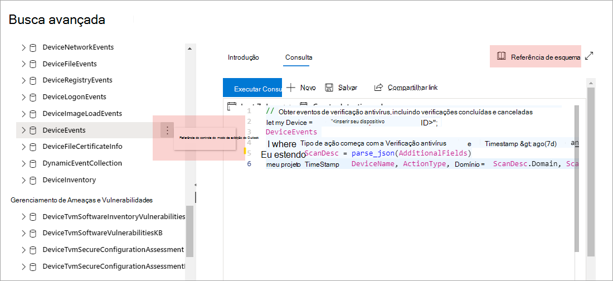

# Entenda o esquema de busca avançado no Microsoft Defender para Ponto de Extremidade

[!INCLUDE [Microsoft 365 Defender rebranding](../../includes/microsoft-defender.md)]

**Aplica-se a:**
- [Microsoft Defender para Ponto de Extremidade](https://go.microsoft.com/fwlink/?linkid=2154037)

>Deseja experimentar o Defender para Ponto de Extremidade? [Inscreva-se para uma avaliação gratuita.](https://www.microsoft.com/microsoft-365/windows/microsoft-defender-atp?ocid=docs-wdatp-advancedhuntingref-abovefoldlink)

[!include[Prerelease information](../../includes/prerelease.md)]

O [esquema de busca](advanced-hunting-overview.md) avançado é feito de várias tabelas que fornecem informações de eventos ou informações sobre dispositivos e outras entidades. Para criar efetivamente consultas que abrangem várias tabelas, é necessário entender as tabelas e as colunas no esquema de busca avançado.

## Obter informações de esquema no centro de segurança
Durante a construção de consultas, use a referência de esquema integrado para obter rapidamente as seguintes informações sobre cada tabela no esquema:

- **Descrição de** tabelas — tipo de dados contidos na tabela e a origem desses dados.
- **Colunas**— todas as colunas na tabela.
- **Tipos de** ação — valores possíveis na coluna `ActionType` que representam os tipos de evento suportados pela tabela. Isso é fornecido apenas para tabelas que contêm informações de evento.
- **Consulta de exemplo**— consultas de exemplo que apresentam como a tabela pode ser usada.

### Acessar a referência de esquema
Para acessar rapidamente a referência de esquema, selecione a ação **Exibir referência** ao lado do nome da tabela na representação do esquema. Você também pode selecionar **Referência de esquema** para pesquisar uma tabela.

## Saiba as tabelas de esquema

A referência a seguir lista todas as tabelas no esquema de busca avançado. Cada nome de tabela se vincula a uma página que descreve os nomes das colunas da tabela.

Os nomes de tabela e coluna também são listados no Centro de Segurança do Microsoft Defender, na representação do esquema na tela de busca avançada.

| Nome da tabela | Descrição |
|------------|-------------|
| **[DeviceAlertEvents](advanced-hunting-devicealertevents-table.md)** | Alertas no Centro de Segurança do Microsoft Defender |
| **[DeviceInfo](advanced-hunting-deviceinfo-table.md)** | Informações do dispositivo, incluindo informações do sistema operacional |
| **[DeviceNetworkInfo](advanced-hunting-devicenetworkinfo-table.md)** | Propriedades de rede de dispositivos, incluindo adaptadores, endereços IP e MAC, bem como redes e domínios conectados |
| **[DeviceProcessEvents](advanced-hunting-deviceprocessevents-table.md)** | Criação de processos e eventos relacionados |
| **[DeviceNetworkEvents](advanced-hunting-devicenetworkevents-table.md)** | Conexão de rede e eventos relacionados |
| **[DeviceFileEvents](advanced-hunting-devicefileevents-table.md)** | Criação de arquivos, modificação e outros eventos do sistema de arquivos |
| **[DeviceRegistryEvents](advanced-hunting-deviceregistryevents-table.md)** | Criação e modificação de entradas do registro |
| **[DeviceLogonEvents](advanced-hunting-devicelogonevents-table.md)** | Entradas e outros eventos de autenticação |
| **[DeviceImageLoadEvents](advanced-hunting-deviceimageloadevents-table.md)** | Carregamento de eventos DLL |
| **[Eventos do dispositivo](advanced-hunting-deviceevents-table.md)** | Vários tipos de eventos, incluindo eventos disparados por controles de segurança, como o Microsoft Defender Antivírus e a proteção de exploração |
| **[DeviceFileCertificateInfo](advanced-hunting-devicefilecertificateinfo-table.md)** | Informações de certificado de arquivos assinados obtidos de eventos de verificação de certificado em pontos de extremidade |
| **[DeviceTvmSoftwareInventory](advanced-hunting-devicetvmsoftwareinventory-table.md)** | Inventário de software instalado em dispositivos, incluindo suas informações de versão e status de fim de suporte |
| **[DeviceTvmSoftwareVulnerabilities](advanced-hunting-devicetvmsoftwarevulnerabilities-table.md)** | Vulnerabilidades de software encontradas em dispositivos e a lista de atualizações de segurança disponíveis que abordam cada vulnerabilidade |
| **[DeviceTvmSoftwareVulnerabilitiesKB](advanced-hunting-devicetvmsoftwarevulnerabilitieskb-table.md)** | Base de dados de conhecimento de vulnerabilidades divulgadas publicamente, incluindo se o código de exploração está disponível publicamente |
| **[DeviceTvmSecureConfigurationAssessment](advanced-hunting-devicetvmsecureconfigurationassessment-table.md)** | Eventos de avaliação do Gerenciamento de Vulnerabilidades e Ameaças, indicando o status de várias configurações de segurança em dispositivos |
| **[DeviceTvmSecureConfigurationAssessmentKB](advanced-hunting-devicetvmsecureconfigurationassessmentkb-table.md)** | Base de dados de conhecimento de várias configurações de segurança usadas pelo Gerenciamento de Vulnerabilidades e Ameaças para avaliar dispositivos; Inclui mapeamentos para vários padrões e benchmarks |

>[!TIP]
>Use a busca avançada no [Microsoft 365 Defender](/microsoft-365/security/defender/advanced-hunting-overview) para procurar ameaças usando dados do Defender para Ponto de Extremidade, do Microsoft Defender para Office 365, do Microsoft Cloud App Security e do Microsoft Defender para Identidade. [Ativar o Microsoft 365 Defender](/microsoft-365/security/defender/m365d-enable)  
Saiba mais sobre como mover seus fluxos de trabalho de busca avançados do Microsoft Defender para o Endpoint para o Microsoft 365 Defender em [Migrar](/microsoft-365/security/defender/advanced-hunting-migrate-from-mde)consultas de busca avançadas do Microsoft Defender para o Ponto de Extremidade .

## Tópicos relacionados
- [Visão geral da busca avançada](advanced-hunting-overview.md)
- [Aprender a linguagem de consulta](advanced-hunting-query-language.md)
- [Trabalhar com os resultados da consulta](advanced-hunting-query-results.md)
- [Aplicar práticas recomendadas de consulta](advanced-hunting-best-practices.md)
- [Visão geral de detecções personalizadas](overview-custom-detections.md)
- [Alterações avançadas no esquema de dados de busca](https://techcommunity.microsoft.com/t5/microsoft-defender-atp/advanced-hunting-data-schema-changes/ba-p/1043914)
