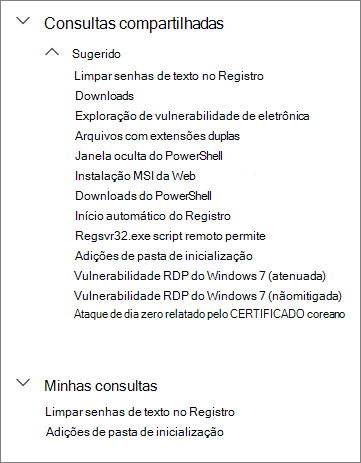
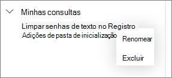

# Usar consultas compartilhadas na busca avançadaUse shared queries in advanced hunting

[!INCLUDE [Microsoft 365 Defender rebranding](../../includes/microsoft-defender.md)]

**Aplica-se a:****Applies to:**
- [Microsoft Defender para Ponto de ExtremidadeMicrosoft Defender for Endpoint](https://go.microsoft.com/fwlink/p/?linkid=2154037)

>Deseja experimentar o Defender para Ponto de Extremidade?Want to experience Defender for Endpoint? [Inscreva-se para uma avaliação gratuita.Sign up for a free trial.](https://www.microsoft.com/microsoft-365/windows/microsoft-defender-atp?ocid=docs-wdatp-advancedhunting-abovefoldlink)

[Buscas avançadas](advanced-hunting-overview.md) consultas podem ser compartilhadas entre usuários na mesma organização.[Advanced hunting](advanced-hunting-overview.md) queries can be shared among users in the same organization. Você também pode encontrar consultas compartilhadas publicamente no GitHub.You can also find queries shared publicly on GitHub. Essas consultas permitem que você pesquise rapidamente cenários de busca específica de ameaças sem ter que escrever consultas do zero.These queries let you quickly pursue specific threat hunting scenarios without having to write queries from scratch.

## Salvar, modificar e compartilhar uma consultaSave, modify, and share a query
Você pode salvar uma consulta nova ou existente para que ela possa ser acessada ou apenas por você ou então compartilhada com outros usuários em sua organização.You can save a new or existing query so that it is only accessible to you or shared with other users in your organization.

1. Digite uma nova consulta ou carregue uma existente em **Consultas compartilhadas** ou **Minhas consultas**.Type a new query or load an existing one from under **Shared queries** or **My queries**.

2. Selecione **Salvar** ou **Salvar como** nas opções de salvar.Select **Save** or **Save as** from the save options. Para evitar a substituição de uma consulta existente, escolha **Salvar como**.To avoid overwriting an existing query, choose **Save as**.

3. Digite um nome para a consulta.Enter a name for the query.

   

4. Selecione a pasta em que você deseja salvar a consulta.Select the folder where you'd like to save the query.
    - **Consultas compartilhadas** — compartilhadas com todos os usuários em sua organização**Shared queries** — shared to all users in your organization
    - **Minhas consultas** — acessíveis somente para você**My queries** — accessible only to you
    
5. Selecione **Salvar**.Select **Save**.

## Excluir ou renomear uma consultaDelete or rename a query
1. Clique com o botão direito do mouse em uma consulta que você deseja renomear ou excluir.Right-click on a query you want to rename or delete.

    

2. Selecione **Exclua** e confirme a exclusão.Select **Delete** and confirm deletion. Ou selecione **Renomear** e forneça um novo nome para a consulta.Or select **Rename** and provide a new name for the query.

## Criar um link direto para uma consultaCreate a direct link to a query
Para gerar um link que abra sua consulta diretamente no editor de consulta de busca avançada, finalize sua consulta e selecione **Compartilhar link**.To generate a link that opens your query directly in the advanced hunting query editor, finalize your query and select **Share link**.

## Acessar consultas no repositório do GitHubAccess queries in the GitHub repository  
Os pesquisadores de segurança da Microsoft compartilham regularmente consultas avançadas em um [repositório público designado no GitHub](https://github.com/Microsoft/WindowsDefenderATP-Hunting-Queries).Microsoft security researchers regularly share advanced hunting queries in a [designated public repository on GitHub](https://github.com/Microsoft/WindowsDefenderATP-Hunting-Queries). Esse repositório está aberto para a contribuições.This repository is open to contributions. Para contribuir, acesse [integrar o GitHub gratuitamente](https://github.com/).To contribute, [join GitHub for free](https://github.com/). 

>[!TIP]
>Os pesquisadores de segurança da Microsoft também oferecem consultas avançadas para que você possa localizar atividades e indicadores associados a ameaças emergentes.Microsoft security researchers also provide advanced hunting queries that you can use to locate activities and indicators associated with emerging threats. Essas consultas são fornecidas como parte dos relatórios de [análise de ameaças](threat-analytics.md) da Central de Segurança do Microsoft Defender.These queries are provided as part of the [threat analytics](threat-analytics.md) reports in Microsoft Defender Security Center.

## Tópicos relacionadosRelated topics
- [Visão geral da busca avançadaAdvanced hunting overview](advanced-hunting-overview.md)
- [Aprender a linguagem de consultaLearn the query language](advanced-hunting-query-language.md)
- [Trabalhar com os resultados da consultaWork with query results](advanced-hunting-query-results.md)
- [Compreender o esquemaUnderstand the schema](advanced-hunting-schema-reference.md)
- [Aplicar práticas recomendadas de consultaApply query best practices](advanced-hunting-best-practices.md)
- [Visão geral de detecções personalizadasCustom detections overview](overview-custom-detections.md)
