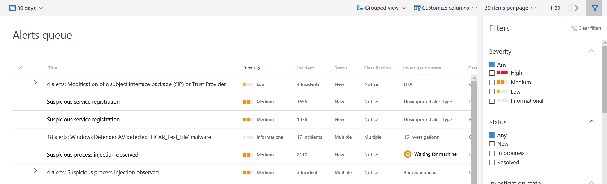

# Exibir e organizar a fila de alertas do Microsoft Defender for EndpointView and organize the Microsoft Defender for Endpoint Alerts queue

[!INCLUDE [Microsoft 365 Defender rebranding](../../includes/microsoft-defender.md)]

**Aplica-se a:****Applies to:**
- [Defender para Ponto de ExtremidadeDefender for Endpoint](https://go.microsoft.com/fwlink/?linkid=2154037)

>Deseja experimentar o Defender para Ponto de Extremidade?Want to experience Defender for Endpoint? [Inscreva-se para uma avaliação gratuita.Sign up for a free trial.](https://www.microsoft.com/microsoft-365/windows/microsoft-defender-atp?ocid=docs-wdatp-alertsq-abovefoldlink) 

A **fila Alertas** mostra uma lista de alertas que foram sinalizados de dispositivos em sua rede.The **Alerts queue** shows a list of alerts that were flagged from devices in your network. Por padrão, a fila exibe alertas vistos nos últimos 30 dias em um modo de exibição agrupado.By default, the queue displays alerts seen in the last 30 days in a grouped view. Os alertas mais recentes são mostrados na parte superior da lista, ajudando você a ver os alertas mais recentes primeiro.The most recent alerts are showed at the top of the list helping you see the most recent alerts first.

> [!NOTE]
> A fila de alertas é significativamente reduzida com investigação e correção automatizadas, permitindo que especialistas em operações de segurança se concentrem em ameaças mais sofisticadas e em outras iniciativas de alto valor.The alerts queue is significantly reduced with automated investigation and remediation, allowing security operations experts to focus on more sophisticated threats and other high value initiatives. Quando um alerta contém uma entidade com suporte para investigação automatizada (por exemplo, um arquivo) em um dispositivo com um sistema operacional com suporte para ele, uma investigação e correção automatizadas podem começar.When an alert contains a supported entity for automated investigation (for example, a file) in a device that has a supported operating system for it, an automated investigation and remediation can start. Para obter mais informações sobre investigações automatizadas, consulte [Overview of Automated investigations](automated-investigations.md).For more information on automated investigations, see [Overview of Automated investigations](automated-investigations.md).

Há várias opções que você pode escolher para personalizar o exibição de fila de alertas.There are several options you can choose from to customize the alerts queue view. 

Na navegação superior, você pode:On the top navigation you can:

- Selecionar exibição agrupada ou exibição de listaSelect grouped view or list view
- Personalizar colunas para adicionar ou remover colunasCustomize columns to add or remove columns 
- Selecione os itens a mostrar por páginaSelect the items to show per page
- Navegar entre páginasNavigate between pages
- Aplicar filtrosApply filters

## Classificar, filtrar e agrupar a fila de alertasSort, filter, and group the alerts queue

Você pode aplicar os filtros a seguir para limitar a lista de alertas e obter uma exibição mais focada dos alertas.You can apply the following filters to limit the list of alerts and get a more focused view the alerts.

### SeveritySeverity

Gravidade do alertaAlert severity | DescriçãoDescription
:---|:---
AltoHigh  (Vermelho)(Red) | Alertas comumente vistos associados a ameaças persistentes avançadas (APT).Alerts commonly seen associated with advanced persistent threats (APT). Esses alertas indicam um alto risco devido à gravidade dos danos que podem causar em dispositivos.These alerts indicate a high risk because of  the severity of damage they can inflict on devices. Alguns exemplos são: atividades de ferramentas de roubo de credenciais, atividades de ransomware não associadas a nenhum grupo, adulteração de sensores de segurança ou atividades mal-intencionadas indicando um adversário humano.Some examples are: credential theft tools activities, ransomware activities not associated with any group, tampering with security sensors, or any malicious activities indicative of a human adversary.
MédioMedium  (Laranja)(Orange) | Alertas de comportamentos pós-violação de detecção e resposta do ponto de extremidade que podem fazer parte de uma ameaça persistente avançada (APT).Alerts from endpoint detection and response post-breach behaviors that might be a part of an advanced persistent threat (APT). Isso inclui comportamentos observados típicos de estágios de ataque, alteração anômala do registro, execução de arquivos suspeitos e assim por diante.This includes observed behaviors typical of attack stages, anomalous registry change, execution of suspicious files, and so forth. Embora alguns possam fazer parte de testes internos de segurança, ele requer investigação, pois também pode fazer parte de um ataque avançado.Although some might be part of internal security testing, it requires investigation as it might also be a part of an advanced attack.
BaixoLow  (Amarelo)(Yellow) | Alertas sobre ameaças associadas ao malware predominante.Alerts on threats associated with prevalent malware. Por exemplo, ferramentas de hack, ferramentas de hack não malware, como a execução de comandos de exploração, a limpeza de logs, etc., que muitas vezes não indicam uma ameaça avançada visando a organização.For example, hack-tools, non-malware hack tools, such as running exploration commands, clearing logs, etc., that often do not indicate an advanced threat targeting the organization. Ele também pode vir de um teste de ferramenta de segurança isolado por um usuário em sua organização.It could also come from an isolated security tool testing by a user in your organization.
InformaçõesInformational  (Cinza)(Grey) | Alertas que podem não ser considerados prejudiciais para a rede, mas podem impulsionar a conscientização de segurança organizacional sobre possíveis problemas de segurança.Alerts that might not be considered harmful to the network but can drive organizational security awareness on potential security issues.

#### Noções básicas sobre a gravidade do alertaUnderstanding alert severity

As gravidades de alerta do Microsoft Defender Antivírus (Microsoft Defender AV) e do Defender for Endpoint são diferentes porque representam escopos diferentes.Microsoft Defender Antivirus (Microsoft Defender AV) and Defender for Endpoint alert severities are different because they represent different scopes.

A gravidade da ameaça av do Microsoft Defender representa a gravidade absoluta da ameaça detectada (malware) e é atribuída com base no risco potencial para o dispositivo individual, se infectado.The Microsoft Defender AV threat severity represents the absolute severity of the detected threat (malware), and is assigned based on the potential risk to the individual device, if infected.

A gravidade do alerta do Defender para Ponto de Extremidade representa a gravidade do comportamento detectado, o risco real para o dispositivo, mas, mais importante, o risco potencial para a organização.The Defender for Endpoint alert severity represents the severity of the detected behavior, the actual risk to the device but more importantly the potential risk to the organization.

Portanto, por exemplo:So, for example:

- A gravidade de um alerta do Defender for Endpoint sobre uma ameaça detectada pelo Microsoft Defender AV que foi totalmente impedida e não infectou o dispositivo é categorizada como "Informacional" porque não houve danos reais.The severity of a Defender for Endpoint alert about a Microsoft Defender AV detected threat that was completely prevented and did not infect the device is categorized as "Informational" because there was no actual damage.
- Um alerta sobre um malware comercial foi detectado durante a execução, mas bloqueado e remediado pelo Microsoft Defender AV, é categorizado como "Baixo" porque pode ter causado alguns danos ao dispositivo individual, mas não representa nenhuma ameaça organizacional.An alert about a commercial malware was detected while executing, but blocked and remediated by Microsoft Defender AV, is categorized as  "Low" because it may have caused some damage to the individual device but poses no organizational threat.
- Um alerta sobre malware detectado durante a execução que pode representar uma ameaça não apenas para o dispositivo individual, mas para a organização, independentemente se ele foi bloqueado eventualmente, pode ser classificado como "Médio" ou "Alto".An alert about malware detected while executing which can pose a threat not only to the individual device but to the organization, regardless if it was eventually blocked, may be ranked as "Medium" or "High".
- Alertas comportamentais suspeitos, que não foram bloqueados ou remediados, serão classificados como "Baixo", "Médio" ou "Alto" seguindo as mesmas considerações de ameaça organizacional.Suspicious behavioral alerts, which weren't blocked or remediated will be ranked "Low", "Medium" or "High" following the same organizational threat considerations.

#### Noções básicas sobre categorias de alertaUnderstanding alert categories

Redefinimos as categorias de alerta  para alinhar às táticas de ataque empresariais na matriz de [CK mitre att&CK](https://attack.mitre.org/).We've redefined the alert categories to align to the [enterprise attack tactics](https://attack.mitre.org/tactics/enterprise/) in the [MITRE ATT&CK matrix](https://attack.mitre.org/). Novos nomes de categoria se aplicam a todos os novos alertas.New category names apply to all new alerts. Os alertas existentes manterão os nomes de categorias anteriores.Existing alerts will keep the previous category names.

A tabela abaixo lista as categorias atuais e como elas geralmente mapeiam para categorias anteriores.The table below lists the current categories and how they generally map to previous categories. 

| Nova categoriaNew   category       | Nome da categoria da APIAPI category name   | Atividade ou componente de ameaça detectadoDetected threat activity or   component                                                                                                 |
|----------------------|---------------------|-----------------------------------------------------------------------------------------------------------------------------------------|
| ColeçãoCollection           | ColeçãoCollection          | Localizando e coletando dados para exfiltraçãoLocating   and collecting data for exfiltration                                                                                         |
| Comando e controleCommand and control  | CommandAndControlCommandAndControl   | Conectar-se à infraestrutura de rede controlada pelo invasor para retransmitir dados ou receber comandosConnecting   to attacker-controlled network infrastructure to relay data or receive   commands                                          |
| Acesso a credenciaisCredential access    | CredentialAccessCredentialAccess    | Obtendo credenciais válidas para estender o controle sobre dispositivos e outros recursos na redeObtaining   valid credentials to extend control over devices and other resources in the   network                                       |
| Evasão de defesaDefense evasion      | DefenseEvasionDefenseEvasion      | Evitando controles de segurança, por exemplo, desligando aplicativos de segurança, excluindo implantes e executando rootkitsAvoiding security controls by, for example, turning off   security apps, deleting implants, and running rootkits                        |
| DescobertaDiscovery            | DescobertaDiscovery           | Coletando informações sobre dispositivos e recursos importantes, como computadores administradores, controladores de domínio e servidores de arquivosGathering   information about important devices and resources, such as administrator   computers, domain controllers, and file servers  |
| ExecuçãoExecution            | ExecuçãoExecution           | Iniciando ferramentas de invasor e código mal-intencionado, incluindo RATs e backdoorsLaunching   attacker tools and malicious code, including RATs and backdoors                                                             |
| ExfiltraçãoExfiltration         | ExfiltraçãoExfiltration        | Extrair dados da rede para um local externo controlado pelo invasorExtracting   data from the network to an external, attacker-controlled location                                                         |
| ExploitExploit              | ExploitExploit             | Explorar o código e a possível atividade de exploraçãoExploit   code and possible exploitation activity                                                                                       |
| Acesso inicialInitial access       | InitialAccessInitialAccess       | Obter entrada inicial na rede de destino, geralmente envolvendo a adivinhação de senha, explorações ou emails de phishingGaining   initial entry to the target network, usually involving password-guessing,   exploits, or phishing emails                      |
| Movimento lateralLateral movement     | LateralMovementLateralMovement     | Mover-se entre dispositivos na rede de destino para alcançar recursos críticos ou obter persistência de redeMoving   between devices in the target network to reach critical resources or gain   network persistence                                |
| MalwareMalware              | MalwareMalware             | Backdoors, trojans e outros tipos de código mal-intencionadoBackdoors,   trojans, and other types of malicious code                                                                                 |
| PersistênciaPersistence          | PersistênciaPersistence         | Criando pontos de extensibilidade de início automático (ASEPs) para permanecer ativo e sobreviver a reinicializações do sistemaCreating   autostart extensibility points (ASEPs) to remain active and survive system   restarts                                        |
| Escalonamento de privilégiosPrivilege escalation | PrivilegeEscalationPrivilegeEscalation | Obtendo níveis de permissão mais altos para código executando-o no contexto de um processo privilegiado ou contaObtaining   higher permission levels for code by running it in the context of a   privileged process or account                         |
| RansomwareRansomware           | RansomwareRansomware          | Malware que criptografa arquivos e extortas pagamento para restaurar o acessoMalware   that encrypts files and extorts payment to restore access                                                                     |
| Atividade suspeitaSuspicious activity  | SuspiciousActivitySuspiciousActivity  | Atividade atípica que pode ser atividade de malware ou parte de um ataqueAtypical   activity that could be malware activity or part of an attack                                                                 |
| Software indesejadoUnwanted software    | UnwantedSoftwareUnwantedSoftware    | Aplicativos e aplicativos de baixa reputação que impactam a produtividade e a experiência do usuário; detectados como aplicativos potencialmente indesejados (PUAs)Low-reputation   apps and apps that impact productivity and the user experience; detected as   potentially unwanted applications (PUAs) |

### StatusStatus

Você pode optar por limitar a lista de alertas com base em seu status.You can choose to limit the list of alerts based on their status.

### Estado da investigaçãoInvestigation state

Corresponde ao estado de investigação automatizada.Corresponds to the automated investigation state.

### CategoriaCategory

Você pode optar por filtrar a fila para exibir tipos específicos de atividade mal-intencionada.You can choose to filter the queue to display specific types of malicious activity.

### Atribuído aAssigned to

Você pode escolher entre mostrar alertas atribuídos a você ou automação.You can choose between showing alerts that are assigned to you or automation.

### Fonte de detecçãoDetection source

Selecione a origem que disparou a detecção de alerta.Select the source that triggered the alert detection. Os participantes de visualização do Microsoft Threat Experts agora podem filtrar e ver detecções do novo serviço de busca gerenciado por especialistas em ameaças.Microsoft Threat Experts preview participants can now filter and see detections from the new threat experts-managed hunting service.

>[!NOTE]
>O filtro Antivírus só aparecerá se os dispositivos estão usando o Microsoft Defender Antivírus como o produto antimalware de proteção em tempo real padrão.The Antivirus filter will only appear if devices are using Microsoft Defender Antivirus as the default real-time protection antimalware product.

| Fonte de detecçãoDetection source                  | Valor da APIAPI value                  |
|-----------------------------------|----------------------------|
| Sensores de terceiros3rd party sensors                 | ThirdPartySensorsThirdPartySensors          |
| AntivírusAntivirus                         | WindowsDefenderAvWindowsDefenderAv          |
| Investigação automatizadaAutomated investigation           | AutomatedInvestigationAutomatedInvestigation     |
| Detecção personalizadaCustom detection                  | CustomDetectionCustomDetection            |
| TI personalizadaCustom TI                         | CustomerTICustomerTI                 |
| EDREDR                               | WindowsDefenderAtpWindowsDefenderAtp         |
| Microsoft 365 DefenderMicrosoft 365 Defender            | MTPMTP                        |
| Microsoft Defender para Office 365Microsoft Defender for Office 365 | OfficeATPOfficeATP                  |
| Especialistas em ameaças da MicrosoftMicrosoft Threat Experts          | ThreatExpertsThreatExperts              |
| SmartScreenSmartScreen                       | WindowsDefenderSmartScreenWindowsDefenderSmartScreen |

### Plataforma do sistema operacionalOS platform

Limite a exibição de fila de alertas selecionando a plataforma do sistema operacional que você está interessado em investigar.Limit the alerts queue view by selecting the OS platform that you're interested in investigating.

### Grupo de dispositivosDevice group

Se você tem grupos de dispositivos específicos que você está interessado em verificar, você pode selecionar os grupos para limitar o exibição de fila de alertas.If you have specific device groups that you're interested in checking, you can select the groups to limit the alerts queue view. 

### Ameaça associadaAssociated threat

Use esse filtro para se concentrar em alertas relacionados a ameaças de alto perfil.Use this filter to focus on alerts that are related to high profile threats. Você pode ver a lista completa de ameaças de alto perfil na [análise de ameaças.](threat-analytics.md)You can see the full list of high-profile threats in [Threat analytics](threat-analytics.md).

## Tópicos relacionadosRelated topics

- [Gerenciar alertas do Microsoft Defender para Pontos de ExtremidadeManage Microsoft Defender for Endpoint alerts](manage-alerts.md)
- [Investigar alertas do Microsoft Defender para Pontos de ExtremidadeInvestigate Microsoft Defender for Endpoint alerts](investigate-alerts.md)
- [Investigar um arquivo associado a um alerta do Microsoft Defender para Ponto de ExtremidadeInvestigate a file associated with a Microsoft Defender for Endpoint alert](investigate-files.md)
- [Investigar dispositivos na lista do Microsoft Defender for Endpoint DevicesInvestigate devices in the Microsoft Defender for Endpoint Devices list](investigate-machines.md)
- [Investigar um endereço IP associado a um alerta do Microsoft Defender para Ponto de ExtremidadeInvestigate an IP address associated with a Microsoft Defender for Endpoint alert](investigate-ip.md)
- [Investigar um domínio associado a um alerta do Microsoft Defender para Ponto de ExtremidadeInvestigate a domain associated with a Microsoft Defender for Endpoint alert](investigate-domain.md)
- [Investigar uma conta de usuário no Microsoft Defender para Ponto de ExtremidadeInvestigate a user account in Microsoft Defender for Endpoint](investigate-user.md)
