# Implantar o Microsoft Defender para Ponto de Extremidade para Android com o Microsoft Intune 

[!INCLUDE [Microsoft 365 Defender rebranding](../../includes/microsoft-defender.md)]

**Aplica-se a:**
- [Microsoft Defender para Ponto de Extremidade](https://go.microsoft.com/fwlink/p/?linkid=2154037)
- [Microsoft 365 Defender](https://go.microsoft.com/fwlink/?linkid=2118804)

> Deseja experimentar o Microsoft Defender para Ponto de Extremidade? [Inscreva-se para uma avaliação gratuita.](https://www.microsoft.com/microsoft-365/windows/microsoft-defender-atp?ocid=docs-wdatp-exposedapis-abovefoldlink) 

Saiba como implantar o Defender para Ponto de Extremidade no Android em dispositivos inscritos no Portal da Empresa do Intune. Para obter mais informações sobre o registro do dispositivo Intune, consulte  [Registrar seu dispositivo](https://docs.microsoft.com/mem/intune/user-help/enroll-device-android-company-portal).

> [!NOTE]
> **O Defender para Ponto de Extremidade no Android agora está disponível no [Google Play](https://play.google.com/store/apps/details?id=com.microsoft.scmx)**  
> Você pode se conectar ao Google Play do Intune para implantar o aplicativo Defender para Ponto de Extremidade nos modos de entrolamento do Administrador de Dispositivos e Android Enterprise.
As atualizações para o aplicativo são automáticas por meio do Google Play.

## Implantar em dispositivos inscritos pelo Administrador de Dispositivos

**Implantar o Defender para Ponto de Extremidade no Android no Portal da Empresa do Intune - Dispositivos inscritos pelo Administrador de Dispositivos**

Saiba como implantar o Defender para Ponto de Extremidade no Android no Portal da Empresa do Intune - Dispositivos inscritos pelo Administrador de Dispositivos. 

### Adicionar como aplicativo da Loja do Android

1. No [Centro de administração do Microsoft Endpoint Manager,](https://go.microsoft.com/fwlink/?linkid=2109431) acesse  \> **Aplicativos Android Apps** Adicionar aplicativo da Loja \> **do \> Android** e **escolha Selecionar**.

   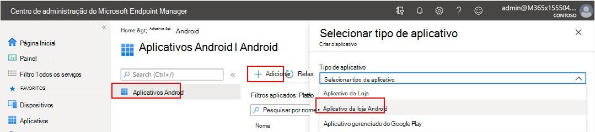

2. Na página **Adicionar aplicativo** e na seção Informações *do* Aplicativo, insira: 

   - **Nome** 
   - **Descrição**
   - **Publisher** como Microsoft.
   - **URL da Loja de Aplicativos** https://play.google.com/store/apps/details?id=com.microsoft.scmx como (URL do Defender for Endpoint App Google Play Store) 

   Outros campos são opcionais. Selecione **Avançar**.

   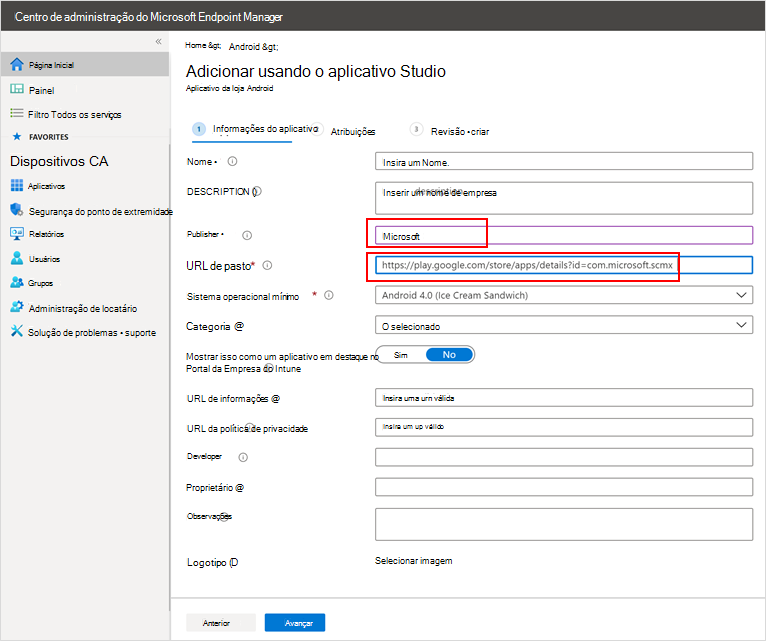

3. Na seção *Atribuições,* vá para a seção **Obrigatório** e selecione **Adicionar grupo.** Em seguida, você pode escolher os grupos de usuários que você gostaria de direcionar o Defender para Ponto de Extremidade no aplicativo Android. Escolha **Selecionar** e, em **seguida, Próximo**.

    >[!NOTE]
    >O grupo de usuários selecionado deve consistir em usuários inscritos do Intune.

    > [!div class="mx-imgBorder"]

    > 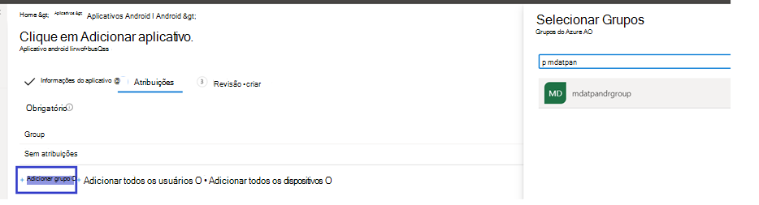

4. Na seção **Review+Create,** verifique se todas as informações inseridas estão corretas e selecione **Criar**.

    Em alguns instantes, o aplicativo Defender para Ponto de Extremidade seria criado com êxito, e uma notificação apareceria no canto superior direito da página.

    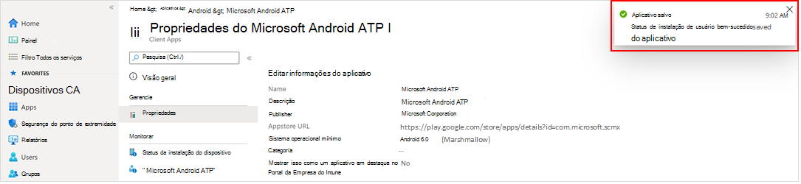

5. Na página informações do aplicativo exibida, na seção **Monitor,** selecione **Status** de instalação do dispositivo para verificar se a instalação do dispositivo foi concluída com êxito.

    > [!div class="mx-imgBorder"]
    > 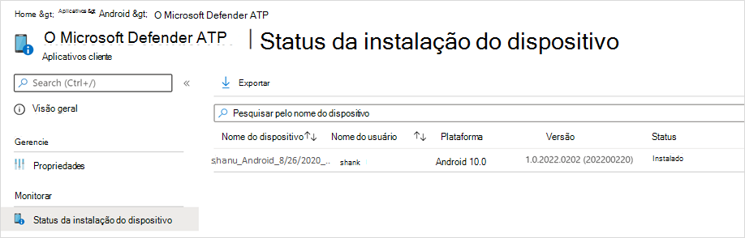

### Concluir a integração e verificar o status

1. Depois que o Defender for Endpoint no Android tiver sido instalado no dispositivo, você verá o ícone do aplicativo.

    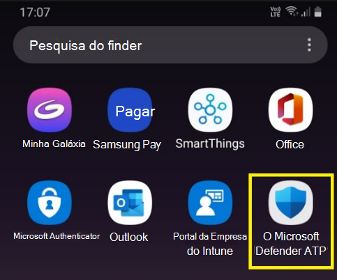

2. Toque no ícone de aplicativo do Microsoft Defender para Ponto de Extremidade e siga as instruções na tela para concluir a integração do aplicativo. Os detalhes incluem a aceitação do usuário final das permissões do Android exigidas pelo Defender para Ponto de Extremidade no Android.

3. Após a integração bem-sucedida, o dispositivo começará a aparecer na lista Dispositivos no Centro de Segurança do Microsoft Defender.

    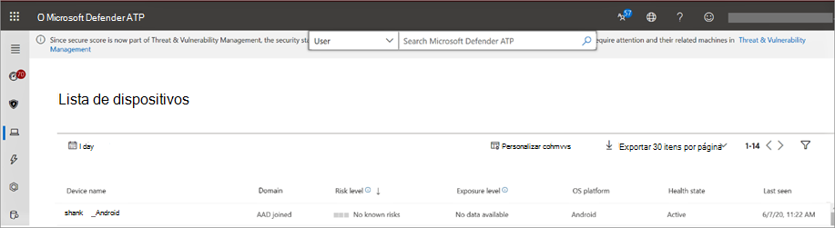

## Implantar em dispositivos inscritos no Android Enterprise

O Defender para Ponto de Extremidade no Android dá suporte a dispositivos inscritos no Android Enterprise.

Para obter mais informações sobre as opções de registro com suporte do Intune, consulte [Opções de Inscrição](https://docs.microsoft.com/mem/intune/enrollment/android-enroll).

**Atualmente, dispositivos de propriedade pessoal com perfil de trabalho e registro de dispositivos de usuário totalmente gerenciados de propriedade corporativa são suportados para implantação.**

## Adicionar o Microsoft Defender para Ponto de Extremidade no Android como um aplicativo gerenciado do Google Play

Siga as etapas a seguir para adicionar o aplicativo Microsoft Defender para Ponto de Extremidade ao Google Play gerenciado.

1. No [Centro de administração do Microsoft Endpoint Manager,](https://go.microsoft.com/fwlink/?linkid=2109431) acesse  \> **Aplicativos Android Apps** Adicionar e \>  selecione Aplicativo Gerenciado do **Google Play**.

    > [!div class="mx-imgBorder"]
    > 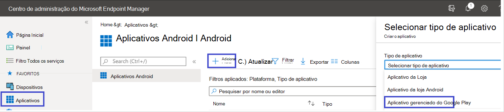

2. Na página gerenciada do Google Play que é carregada posteriormente, vá até a caixa de pesquisa e procure o **Microsoft Defender.** Sua pesquisa deve exibir o aplicativo Microsoft Defender para Ponto de Extremidade em seu Google Play Gerenciado. Clique no aplicativo Microsoft Defender para Ponto de Extremidade no resultado da pesquisa aplicativos.

    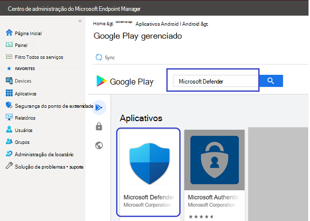

3. Na página Descrição do aplicativo que vem a seguir, você deve ser capaz de ver detalhes do aplicativo no Defender para Ponto de Extremidade. Revise as informações na página e selecione **Aprovar**.

    > [!div class="mx-imgBorder"]
    > 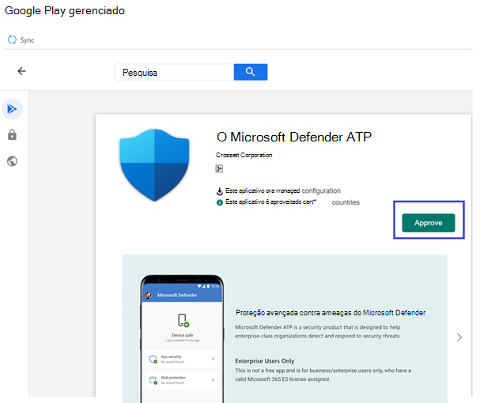

4. Você será apresentado com as permissões que o Defender for Endpoint obtém para que ele funcione. Revise-os e selecione **Aprovar**.

    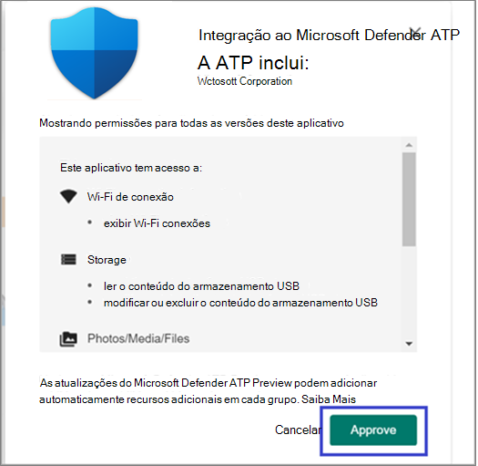

5. Você será apresentado com a página Configurações de Aprovação. A página confirma sua preferência para lidar com novas permissões de aplicativo que o Defender para Ponto de Extremidade pode solicitar no Android. Revise as opções e selecione sua opção preferida. Selecione **Concluído**.

    Por padrão, o Google Play gerenciado seleciona *Manter aprovado quando o aplicativo solicita novas permissões*

    > [!div class="mx-imgBorder"]
    > 

6. Depois que a seleção de manipulação de permissões for feita, selecione **Sincronizar** para sincronizar o Microsoft Defender para o Ponto de Extremidade à sua lista de aplicativos.

    > [!div class="mx-imgBorder"]
    > 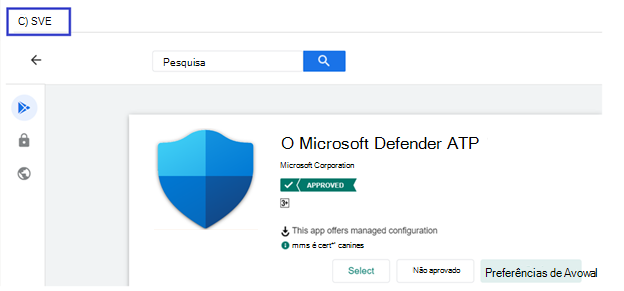

7. A sincronização será concluída em alguns minutos.

    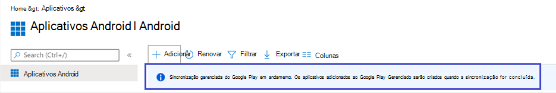

8. Selecione o **botão Atualizar** na tela aplicativos Android e o Microsoft Defender para Ponto de Extremidade deve estar visível na lista de aplicativos.

    > [!div class="mx-imgBorder"]
    > 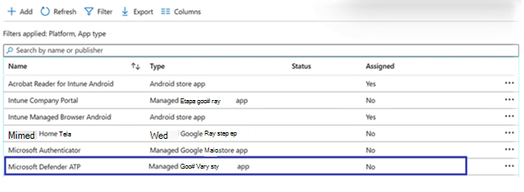

9. O Defender for Endpoint dá suporte a políticas de configuração de aplicativo para dispositivos gerenciados por meio do Intune. Esse recurso pode ser aproveitado para autograntar as permissões aplicáveis do Android, para que o usuário final não precise aceitar essas permissões.

    1. Na página **Aplicativos,** vá para Política > Políticas de configuração de **aplicativos > Adicionar > dispositivos gerenciados.**

       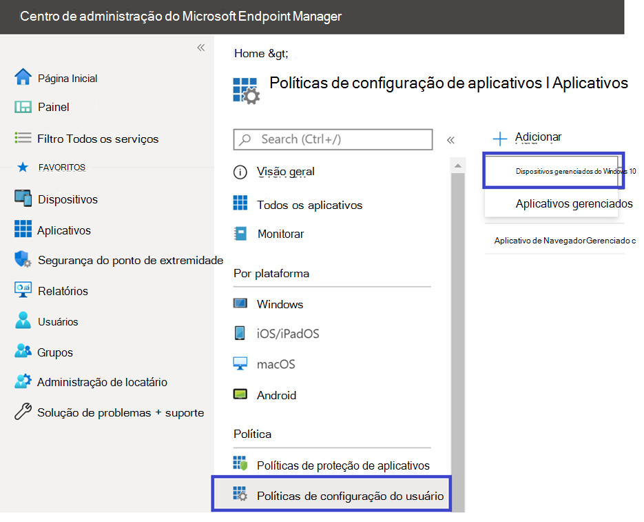

    1. Na página **Criar política de configuração do** aplicativo, insira os seguintes detalhes:
    
        - Nome: Microsoft Defender para Ponto de Extremidade.
        - Escolha **Android Enterprise** como plataforma.
        - Escolha **Perfil de Trabalho apenas** como Tipo de Perfil.
        - Clique **em Selecionar Aplicativo,** escolha **Microsoft Defender ATP,** selecione **OK** e, em **seguida, Próximo**.
    
        > [!div class="mx-imgBorder"]
        > 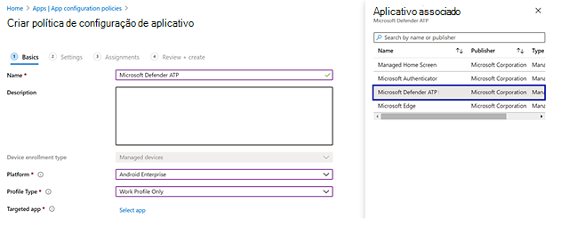

    1. Na página **Configurações,** vá para a seção Permissões clique em Adicionar para exibir a lista de permissões com suporte. Na seção Adicionar Permissões, selecione as seguintes permissões:

       - Armazenamento externo (leitura)
       - Armazenamento externo (gravação)

       Em seguida, selecione **OK**.

       > [!div class="mx-imgBorder"]
      > 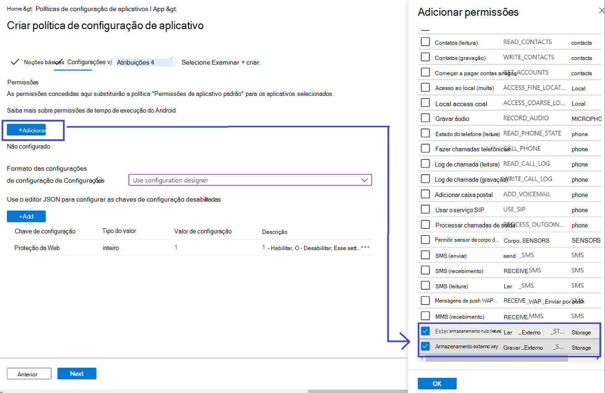

    1. Agora você deve ver as permissões listadas e agora você pode autograntar ambos escolhendo a autogrant no **drop-down** estado de permissão e, em seguida, selecione **Next**.

       > [!div class="mx-imgBorder"]
       > 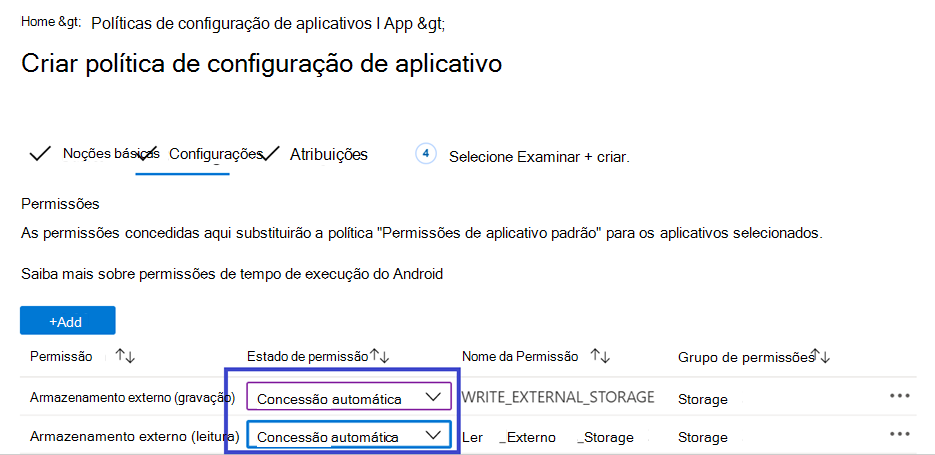

    1. Na página **Atribuições,** selecione o grupo de usuários ao qual essa política de configuração de aplicativo seria atribuída. Clique **em Selecionar grupos para incluir** e selecionar o grupo aplicável e, em seguida, selecione **Next**.  O grupo selecionado aqui geralmente é o mesmo grupo ao qual você atribuiria o Microsoft Defender para o aplicativo Do ponto de extremidade android. 

       > [!div class="mx-imgBorder"]
       > 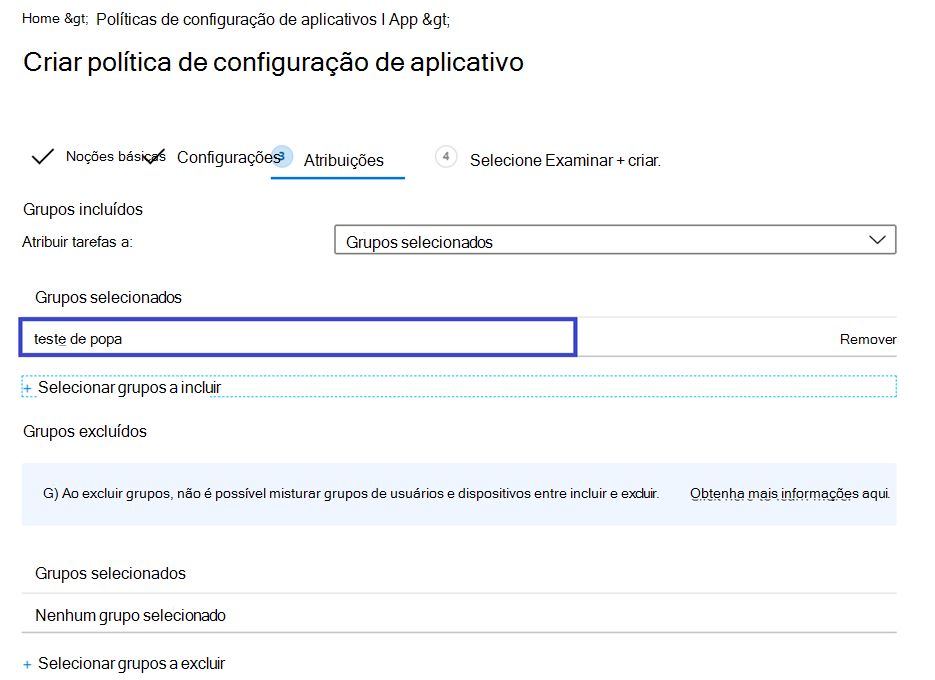
    

     1. Na página **Revisar + Criar** que aparece em seguida, revise todas as informações e selecione **Criar**.  
    
        A política de configuração do aplicativo para o Defender for Endpoint autogranting the storage permission is now assigned to the selected user group.

        > [!div class="mx-imgBorder"]
        > 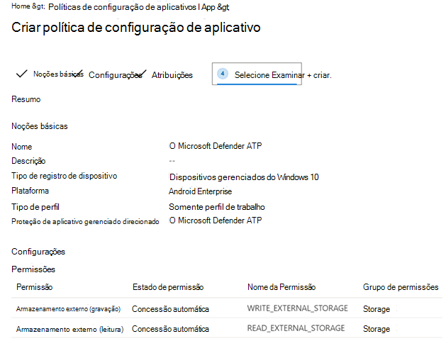

10. Selecione **o aplicativo Microsoft Defender ATP** na lista \> **Propriedades** \> **Atribuições** \> **Editar**.

    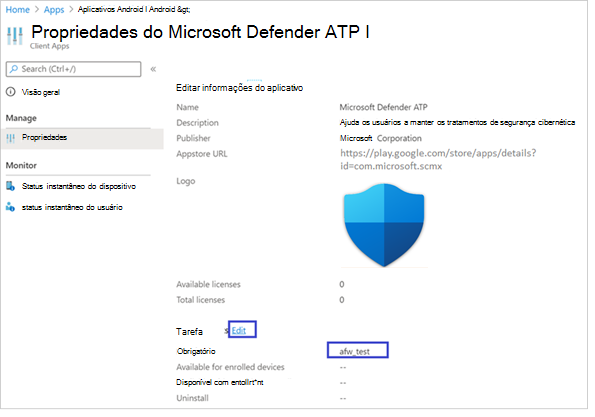

11. Atribua o aplicativo como *um aplicativo obrigatório* a um grupo de usuários. Ele é instalado automaticamente no perfil *de trabalho* durante a próxima sincronização do dispositivo por meio do aplicativo Portal da Empresa. Essa atribuição pode ser feita navegando até a seção Obrigatório Adicionar  \> **grupo,** selecionando o grupo de usuários e clique em **Selecionar**.

    > [!div class="mx-imgBorder"]
    > 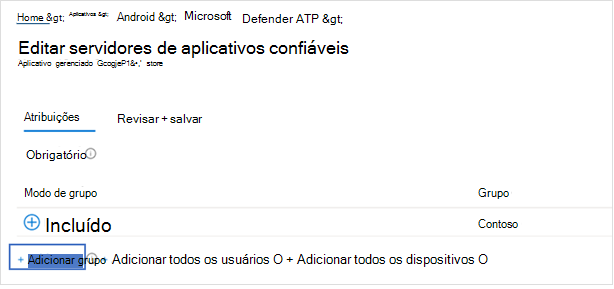

12. Na página **Editar Aplicativo,** revise todas as informações inseridas acima. Em seguida, **selecione Revisar + Salvar** e **salvar** novamente para iniciar a atribuição.

### Configuração automática da VPN always-on 
O Defender for Endpoint oferece suporte a políticas de configuração de dispositivo para dispositivos gerenciados por meio do Intune. Esse recurso pode ser aproveitado para a configuração automática da **VPN Always-on** em dispositivos inscritos no Android Enterprise, para que o usuário final não precise configurar o serviço VPN durante a integração.
1.  Em **Dispositivos**, selecione **Perfis** de Configuração Criar Plataforma de Perfil Android Enterprise Selecionar Restrições de dispositivo em uma das seguintes  >    >    >   opções, com  base no tipo de registro do dispositivo 
- **Perfil de trabalho totalmente gerenciado, dedicado e Corporate-Owned trabalho**
- **Perfil de Trabalho de propriedade pessoal**

Selecione **Criar**.
 
   > 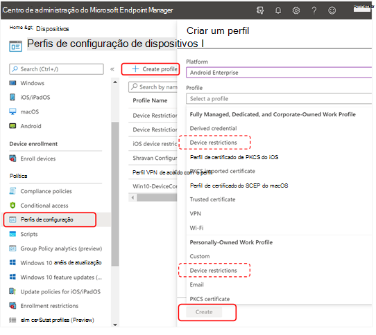
    
2. **Configurações** Forneça um **Nome e** uma **Descrição** para identificar exclusivamente o perfil de configuração. 

   > 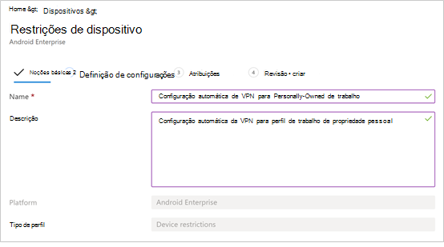
   
 3. Selecione **Conectividade e** configure VPN:
- **Habilita a Instalação de VPN always-on** de um cliente VPN no perfil de trabalho para se conectar e reconectar automaticamente à VPN sempre que possível. Somente um cliente VPN pode ser configurado para VPN sempre on em um determinado dispositivo, portanto, certifique-se de não ter mais de uma política VPN sempre on implantada em um único dispositivo. 
- Selecione **Personalizado na** lista suspenso do cliente VPN A VPN personalizada nesse caso é o Defender for Endpoint VPN, que é usado para fornecer o recurso de Proteção da Web. 
    > [!NOTE]
    > O aplicativo do Microsoft Defender para Ponto de Extremidade deve ser instalado no dispositivo do usuário, para funcionar da configuração automática dessa VPN.

- Insira **a ID do** pacote do aplicativo Microsoft Defender para Ponto de Extremidade na Google Play Store. Para a URL do aplicativo https://play.google.com/store/apps/details?id=com.microsoft.scmx Defender, a ID do pacote **é com.microsoft.scmx**  
- **Modo de bloqueio** Não configurado (Padrão) 

     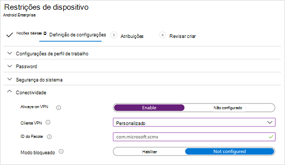
   
4. **Atribuição** Na página  **Atribuições,** selecione o grupo de usuários ao qual essa política de configuração de aplicativo   seria atribuída. Clique **em Selecionar grupos** para incluir e selecionar o grupo aplicável e clique em **Próximo**. O grupo selecionado aqui geralmente é o mesmo grupo ao qual você atribuiria o Microsoft Defender para o aplicativo Do ponto de extremidade android. 

     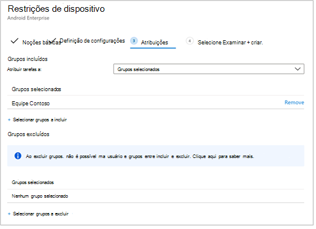

5. Na página **Revisar + Criar** que aparece em seguida, revise todas as informações e selecione **Criar**. O perfil de configuração do dispositivo agora é atribuído ao grupo de usuários selecionado.    

    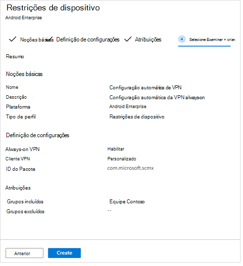

## Concluir a integração e verificar o status

1. Confirme o status de instalação do Microsoft Defender para Ponto de Extremidade no Android clicando no **Status de Instalação do Dispositivo.** Verifique se o dispositivo é exibido aqui.

    > [!div class="mx-imgBorder"]
    > 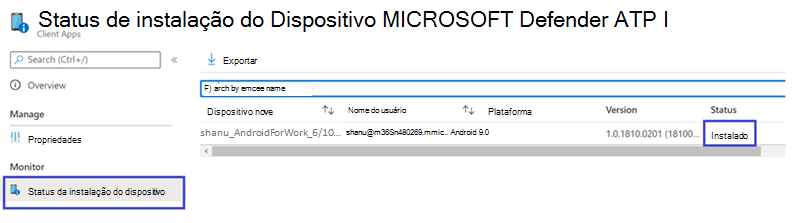

2. No dispositivo, você pode validar o status de integração indo para o perfil **de trabalho**. Confirme se o Defender para Ponto de Extremidade está disponível e se você está inscrito nos dispositivos de **propriedade pessoal com o perfil de trabalho**.  Se você estiver inscrito em um dispositivo de usuário totalmente gerenciado de propriedade **corporativa,** você terá um único perfil no dispositivo onde poderá confirmar se o Defender para Ponto de Extremidade está disponível.

    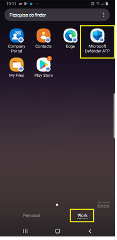

3. Quando o aplicativo estiver instalado, abra o aplicativo e aceite as permissões e, em seguida, sua integração deve ser bem-sucedida.

    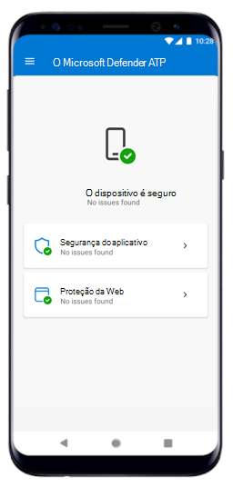

4. Neste estágio, o dispositivo é bem-sucedido no Defender para Ponto de Extremidade no Android. Você pode verificar isso no Centro de Segurança do [Microsoft Defender](https://securitycenter.microsoft.com) navegando até a página **Dispositivos.**

    

## Tópicos relacionados
- [Visão geral do Microsoft Defender para Ponto de Extremidade para Android](microsoft-defender-endpoint-android.md)
- [Configurar o Microsoft Defender para Ponto de Extremidade para recursos do Android](android-configure.md)
