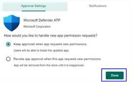

# Implantar o Microsoft Defender para Ponto de Extremidade para Android com o Microsoft IntuneDeploy Microsoft Defender for Endpoint on Android with Microsoft Intune

[!INCLUDE [Microsoft 365 Defender rebranding](../../includes/microsoft-defender.md)]

**Aplica-se a:****Applies to:**
- [Microsoft Defender para Ponto de ExtremidadeMicrosoft Defender for Endpoint](https://go.microsoft.com/fwlink/p/?linkid=2154037)
- [Microsoft 365 DefenderMicrosoft 365 Defender](https://go.microsoft.com/fwlink/?linkid=2118804)

> Deseja experimentar o Microsoft Defender para Ponto de Extremidade?Want to experience Microsoft Defender for Endpoint? [Inscreva-se para uma avaliação gratuita.Sign up for a free trial.](https://www.microsoft.com/microsoft-365/windows/microsoft-defender-atp?ocid=docs-wdatp-exposedapis-abovefoldlink)

Saiba como implantar o Defender para Ponto de Extremidade no Android Portal da Empresa do Intune dispositivos inscritos.Learn how to deploy Defender for Endpoint on Android on Intune Company Portal enrolled devices. Para obter mais informações sobre o registro do dispositivo Intune, consulte  [Registrar seu dispositivo](/mem/intune/user-help/enroll-device-android-company-portal).For more information about Intune device enrollment, see  [Enroll your device](/mem/intune/user-help/enroll-device-android-company-portal).

> [!NOTE]
> **O Defender para Ponto de Extremidade no Android agora está disponível no [Google Play](https://play.google.com/store/apps/details?id=com.microsoft.scmx)****Defender for Endpoint on Android is now available on [Google Play](https://play.google.com/store/apps/details?id=com.microsoft.scmx)**
>
> Você pode se conectar ao Google Play do Intune para implantar o aplicativo Defender para Ponto de Extremidade no Administrador de Dispositivos e Enterprise de registro.You can connect to Google Play from Intune to deploy Defender for Endpoint app across Device Administrator and Android Enterprise enrollment modes.
>
> As atualizações para o aplicativo são automáticas por meio do Google Play.Updates to the app are automatic via Google Play.

## Implantar em dispositivos inscritos pelo Administrador de DispositivosDeploy on Device Administrator enrolled devices

**Implantar o Defender para Ponto de Extremidade no Android Portal da Empresa do Intune - Dispositivos inscritos pelo Administrador de Dispositivos****Deploy Defender for Endpoint on Android on Intune Company Portal - Device Administrator enrolled devices**

Saiba como implantar o Defender para Ponto de Extremidade no Android Portal da Empresa do Intune - Dispositivos inscritos pelo Administrador de Dispositivos.Learn how to deploy Defender for Endpoint on Android on Intune Company Portal - Device Administrator enrolled devices.

### Adicionar como aplicativo da Loja do AndroidAdd as Android store app

1. No [Microsoft Endpoint Manager de administração,](https://go.microsoft.com/fwlink/?linkid=2109431) acesse **Aplicativos** Android Apps Adicionar aplicativo da Loja \>  \> **\> do Android** e escolha **Selecionar**.In [Microsoft Endpoint Manager admin center](https://go.microsoft.com/fwlink/?linkid=2109431) , go to **Apps** \> **Android Apps** \> **Add \> Android store app** and choose **Select**.

   

2. Na página **Adicionar aplicativo** e na seção Informações *do* Aplicativo, insira:On the **Add app** page and in the *App Information* section enter:

   - **Nome****Name**
   - **Descrição****Description**
   - **Publisher** como Microsoft.**Publisher** as Microsoft.
   - **URL da Loja de Aplicativos** https://play.google.com/store/apps/details?id=com.microsoft.scmx como (URL do Defender for Endpoint App Google Play Store)**App store URL** as https://play.google.com/store/apps/details?id=com.microsoft.scmx (Defender for Endpoint app Google Play Store URL)

   Outros campos são opcionais.Other fields are optional. Selecione **Avançar**.Select **Next**.

   

3. Na seção *Atribuições,* vá para a seção **Obrigatório** e selecione **Adicionar grupo.**In the *Assignments* section, go to the **Required** section and select **Add group.** Em seguida, você pode escolher os grupos de usuários que você gostaria de direcionar o Defender para Ponto de Extremidade no aplicativo Android.You can then choose the user group(s) that you would like to target Defender for Endpoint on Android app. Escolha **Selecionar** e, em **seguida, Próximo**.Choose **Select** and then **Next**.

    > [!NOTE]
    > O grupo de usuários selecionado deve consistir em usuários inscritos do Intune.The selected user group should consist of Intune enrolled users.

    > [!div class="mx-imgBorder"]

    > 

4. Na seção **Review+Create,** verifique se todas as informações inseridas estão corretas e selecione **Criar**.In the **Review+Create** section, verify that all the information entered is correct and then select **Create**.

    Em alguns instantes, o aplicativo Defender para Ponto de Extremidade seria criado com êxito, e uma notificação apareceria no canto superior direito da página.In a few moments, the Defender for Endpoint app would be created successfully, and a notification would show up at the top-right corner of the page.

    

5. Na página informações do aplicativo exibida, na seção **Monitor,** selecione **Status** de instalação do dispositivo para verificar se a instalação do dispositivo foi concluída com êxito.In the app information page that is displayed, in the **Monitor** section, select **Device install status** to verify that the device installation has completed successfully.

    > [!div class="mx-imgBorder"]
    > 

### Concluir a integração e verificar o statusComplete onboarding and check status

1. Depois que o Defender for Endpoint no Android tiver sido instalado no dispositivo, você verá o ícone do aplicativo.Once Defender for Endpoint on Android has been installed on the device, you'll see the app icon.

    

2. Toque no ícone de aplicativo do Microsoft Defender para Ponto de Extremidade e siga as instruções na tela para concluir a integração do aplicativo.Tap the Microsoft Defender for Endpoint app icon and follow the on-screen instructions to complete onboarding the app. Os detalhes incluem a aceitação do usuário final das permissões do Android exigidas pelo Defender para Ponto de Extremidade no Android.The details include end-user acceptance of Android permissions required by Defender for Endpoint on Android.

3. Após a integração bem-sucedida, o dispositivo começará a aparecer na lista Dispositivos Central de Segurança do Microsoft Defender.Upon successful onboarding, the device will start showing up on the Devices list in Microsoft Defender Security Center.

    

## Implantar em dispositivos Enterprise Android inscritosDeploy on Android Enterprise enrolled devices

O Defender para Ponto de Extremidade no Android dá suporte Enterprise dispositivos inscritos.Defender for Endpoint on Android supports Android Enterprise enrolled devices.

Para obter mais informações sobre as opções de registro com suporte do Intune, consulte [Opções de Inscrição](/mem/intune/enrollment/android-enroll).For more information on the enrollment options supported by Intune, see [Enrollment Options](/mem/intune/enrollment/android-enroll).

**Atualmente, dispositivos de propriedade pessoal com perfil de trabalho e registro de dispositivos de usuário totalmente gerenciados de propriedade corporativa são suportados para implantação.****Currently, Personally owned devices with work profile and Corporate-owned fully managed user device enrollments are supported for deployment.**

## Adicionar o Microsoft Defender para Ponto de Extremidade no Android como um aplicativo gerenciado do Google PlayAdd Microsoft Defender for Endpoint on Android as a Managed Google Play app

Siga as etapas a seguir para adicionar o aplicativo Microsoft Defender para Ponto de Extremidade ao Google Play gerenciado.Follow the steps below to add Microsoft Defender for Endpoint app into your managed Google Play.

1. No [Microsoft Endpoint Manager de administração,](https://go.microsoft.com/fwlink/?linkid=2109431) vá para  \> **Aplicativos Android Apps** Adicionar e \>  selecione Aplicativo Gerenciado do **Google Play**.In [Microsoft Endpoint Manager admin center](https://go.microsoft.com/fwlink/?linkid=2109431) , go to **Apps** \> **Android Apps** \> **Add** and select **Managed Google Play app**.

    > [!div class="mx-imgBorder"]
    > 

2. Na página gerenciada do Google Play que é carregada posteriormente, vá até a caixa de pesquisa e procure o **Microsoft Defender.**On your managed Google Play page that loads subsequently, go to the search box and lookup **Microsoft Defender.** Sua pesquisa deve exibir o aplicativo Microsoft Defender para Ponto de Extremidade em seu Google Play Gerenciado.Your search should display the Microsoft Defender for Endpoint app in your Managed Google Play. Clique no aplicativo Microsoft Defender para Ponto de Extremidade no resultado da pesquisa aplicativos.Click on the Microsoft Defender for Endpoint app from the Apps search result.

    

3. Na página Descrição do aplicativo que vem a seguir, você deve ser capaz de ver detalhes do aplicativo no Defender para Ponto de Extremidade.In the App description page that comes up next, you should be able to see app details on Defender for Endpoint. Revise as informações na página e selecione **Aprovar**.Review the information on the page and then select **Approve**.

    > [!div class="mx-imgBorder"]
    > 

4. Você será apresentado com as permissões que o Defender for Endpoint obtém para que ele funcione.You'll be presented with the permissions that Defender for Endpoint obtains for it to work. Revise-os e selecione **Aprovar**.Review them and then select **Approve**.

    

5. Você será apresentado com a página Configurações de Aprovação.You'll be presented with the Approval settings page. A página confirma sua preferência para lidar com novas permissões de aplicativo que o Defender para Ponto de Extremidade pode solicitar no Android.The page confirms your preference to handle new app permissions that Defender for Endpoint on Android might ask. Revise as opções e selecione sua opção preferida.Review the choices and select your preferred option. Selecione **Concluído**.Select **Done**.

    Por padrão, o Google Play gerenciado seleciona *Manter aprovado quando o aplicativo solicita novas permissões*By default, managed Google Play selects *Keep approved when app requests new permissions*

    > [!div class="mx-imgBorder"]
    > 

6. Depois que a seleção de manipulação de permissões for feita, selecione **Sincronizar** para sincronizar o Microsoft Defender para o Ponto de Extremidade à sua lista de aplicativos.After the permissions handling selection is made, select **Sync** to sync Microsoft Defender for Endpoint to your apps list.

    > [!div class="mx-imgBorder"]
    > 

7. A sincronização será concluída em alguns minutos.The sync will complete in a few minutes.

    

8. Selecione o **botão Atualizar** na tela aplicativos Android e o Microsoft Defender para Ponto de Extremidade deve estar visível na lista de aplicativos.Select the **Refresh** button in the Android apps screen and Microsoft Defender for Endpoint should be visible in the apps list.

    > [!div class="mx-imgBorder"]
    > 

9. O Defender for Endpoint dá suporte a políticas de configuração de aplicativo para dispositivos gerenciados por meio do Intune.Defender for Endpoint supports App configuration policies for managed devices via Intune. Esse recurso pode ser aproveitado para autograntar as permissões aplicáveis do Android, para que o usuário final não precise aceitar essas permissões.This capability can be leveraged to autogrant applicable Android permission(s), so the end user does not need to accept these permission(s).

    1. Na página **Aplicativos,** vá para Política > Políticas de configuração de **aplicativos > Adicionar > dispositivos gerenciados.**In the **Apps** page, go to **Policy > App configuration policies > Add > Managed devices**.

       

    1. Na página **Criar política de configuração do** aplicativo, insira os seguintes detalhes:In the **Create app configuration policy** page, enter the following details:

        - Nome: Microsoft Defender para Ponto de Extremidade.Name: Microsoft Defender for Endpoint.
        - Escolha **Android Enterprise** como plataforma.Choose **Android Enterprise** as platform.
        - Escolha **Perfil de Trabalho apenas** como Tipo de Perfil.Choose **Work Profile only** as Profile Type.
        - Clique **em Selecionar Aplicativo,** escolha **Microsoft Defender ATP,** selecione **OK** e, em **seguida, Próximo**.Click **Select App**, choose **Microsoft Defender ATP**, select **OK** and then **Next**.

        > [!div class="mx-imgBorder"]
        > 

    1. Na página **Configurações,** vá para a seção Permissões clique em Adicionar para exibir a lista de permissões com suporte.In the **Settings** page, go to the Permissions section click on Add to view the list of supported permissions. Na seção Adicionar Permissões, selecione as seguintes permissões:In the Add Permissions section, select the following permissions:

       - Armazenamento externo (leitura)External storage (read)
       - Armazenamento externo (gravação)External storage (write)

       Em seguida, selecione **OK**.Then select **OK**.

       > [!div class="mx-imgBorder"]
      > 

    1. Agora você deve ver as permissões listadas e agora você pode autograntar ambos escolhendo a autogrant no **drop-down** estado de permissão e, em seguida, selecione **Next**.You should now see both the permissions listed and now you can autogrant both by choosing autogrant in the **Permission state** drop-down and then select **Next**.

       > [!div class="mx-imgBorder"]
       > 

    1. Na página **Atribuições,** selecione o grupo de usuários ao qual essa política de configuração de aplicativo seria atribuída.In the **Assignments** page, select the user group to which this app config policy would be assigned to. Clique **em Selecionar grupos para incluir** e selecionar o grupo aplicável e, em seguida, selecione **Next**.Click **Select groups to include** and selecting the applicable group and then selecting **Next**.  O grupo selecionado aqui geralmente é o mesmo grupo ao qual você atribuiria o Microsoft Defender para o aplicativo Do ponto de extremidade android.The group selected here is usually the same group to which you would assign Microsoft Defender for Endpoint Android app.

       > [!div class="mx-imgBorder"]
       > 

    1. Na página **Revisar + Criar** que aparece em seguida, revise todas as informações e selecione **Criar**.In the **Review + Create** page that comes up next, review all the information and then select **Create**.  

        A política de configuração do aplicativo para o Defender for Endpoint autogranting the storage permission is now assigned to the selected user group.The app configuration policy for Defender for Endpoint autogranting the storage permission is now assigned to the selected user group.

        > [!div class="mx-imgBorder"]
        > 

10. Selecione **o aplicativo Microsoft Defender ATP** na lista \> **Propriedades** \> **Atribuições** \> **Editar**.Select **Microsoft Defender ATP** app in the list \> **Properties** \> **Assignments** \> **Edit**.

    

11. Atribua o aplicativo como *um aplicativo obrigatório* a um grupo de usuários.Assign the app as a *Required* app to a user group. Ele é instalado automaticamente no perfil *de* trabalho durante a próxima sincronização do dispositivo por meio Portal da Empresa app.It is automatically installed in the *work profile* during the next sync of the device via Company Portal app. Essa atribuição pode ser feita navegando até a seção Obrigatório Adicionar  \> **grupo,** selecionando o grupo de usuários e clique em **Selecionar**.This assignment can be done by navigating to the *Required* section \> **Add group,** selecting the user group and click **Select**.

    > [!div class="mx-imgBorder"]
    > 

12. Na página **Editar Aplicativo,** revise todas as informações inseridas acima.In the **Edit Application** page, review all the information that was entered above. Em seguida, **selecione Revisar + Salvar** e **salvar** novamente para iniciar a atribuição.Then select **Review + Save** and then **Save** again to commence assignment.

### Configuração automática da VPN always-onAuto Setup of Always-on VPN

O Defender for Endpoint oferece suporte a políticas de configuração de dispositivo para dispositivos gerenciados por meio do Intune.Defender for Endpoint supports Device configuration policies for managed devices via Intune. Esse recurso pode ser aproveitado para a configuração automática da **VPN Always-on** em dispositivos Enterprise Android, para que o usuário final não precise configurar o serviço VPN durante a integração.This capability can be leveraged to **Auto setup of Always-on VPN** on Android Enterprise enrolled devices, so the end user does not need to set up VPN service while onboarding.

1. Em **Dispositivos**, selecione **Perfis de**  >  **Configuração Criar Plataforma**  >  **de** Perfil Android  >  **Enterprise**On **Devices**, select **Configuration Profiles** > **Create Profile** > **Platform** > **Android Enterprise**

   Selecione **Restrições de dispositivo** em uma das seguintes, com base no tipo de registro do dispositivo:Select **Device restrictions** under one of the following, based on your device enrollment type:
   - **Perfil de trabalho totalmente gerenciado, dedicado e Corporate-Owned trabalho****Fully Managed, Dedicated, and Corporate-Owned Work Profile**
   - **Perfil de Trabalho de propriedade pessoal****Personally owned Work Profile**

   Selecione **Criar**.Select **Create**.

   > 

2. **Configuração Configurações** Forneça um **Nome e** uma **Descrição** para identificar exclusivamente o perfil de configuração.**Configuration Settings** Provide a **Name** and a **Description** to uniquely identify the configuration profile.

   > 

3. Selecione **Conectividade e** configure VPN:Select **Connectivity** and configure VPN:
   - **Habilitar VPN always-on**Enable **Always-on VPN**

   Configure um cliente VPN no perfil de trabalho para se conectar e reconectar automaticamente à VPN sempre que possível.Setup a VPN client in the work profile to automatically connect and reconnect to the VPN whenever possible. Somente um cliente VPN pode ser configurado para VPN sempre on em um determinado dispositivo, portanto, certifique-se de não ter mais de uma política VPN sempre on implantada em um único dispositivo.Only one VPN client can be configured for always-on VPN on a given device, so be sure to have no more than one always-on VPN policy deployed to a single device.

   - Selecionar **Personalizado na** lista de lista suspenso do cliente VPNSelect **Custom** in VPN client dropdown list

   A VPN personalizada nesse caso é o Defender for Endpoint VPN, que é usado para fornecer o recurso de Proteção da Web.Custom VPN in this case is Defender for Endpoint VPN which is used to provide the Web Protection feature.

   > [!NOTE]
   > O aplicativo do Microsoft Defender para Ponto de Extremidade deve ser instalado no dispositivo do usuário, para funcionar da configuração automática dessa VPN.Microsoft Defender for Endpoint app must be installed on user’s device, in order to functioning of auto setup of this VPN.

   - Insira **a ID do** pacote do aplicativo Microsoft Defender para Ponto de Extremidade na Google Play Store.Enter **Package ID** of the Microsoft Defender for Endpoint app in Google Play store. Para a URL do aplicativo <https://play.google.com/store/apps/details?id=com.microsoft.scmx> Defender, a ID do pacote **é com.microsoft.scmx**For the Defender app URL <https://play.google.com/store/apps/details?id=com.microsoft.scmx>, Package ID is **com.microsoft.scmx**
   - **Modo de bloqueio** Não configurado (Padrão)**Lockdown mode** Not configured (Default)

     

4. **Assignment****Assignment**

   Na página **Atribuições,** selecione o grupo de usuários ao qual essa política de configuração de aplicativo   seria atribuída.In the **Assignments** page, select the user group to which this app config policy would be assigned to. Clique **em Selecionar grupos** para incluir e selecionar o grupo aplicável e clique em **Próximo**.Click **Select groups** to include and selecting the applicable group and then click **Next**. O grupo selecionado aqui geralmente é o mesmo grupo ao qual você atribuiria o Microsoft Defender para o aplicativo Do ponto de extremidade android.The group selected here is usually the same group to which you would assign Microsoft Defender for Endpoint Android app.

     

5. Na página **Revisar + Criar** que aparece em seguida, revise todas as informações e selecione **Criar**.In the **Review + Create** page that comes up next, review all the information and then select **Create**.
O perfil de configuração do dispositivo agora é atribuído ao grupo de usuários selecionado.The device configuration profile is now assigned to the selected user group.

    

## Concluir a integração e verificar o statusComplete onboarding and check status

1. Confirme o status de instalação do Microsoft Defender para Ponto de Extremidade no Android clicando no **Status de Instalação do Dispositivo.**Confirm the installation status of Microsoft Defender for Endpoint on Android by clicking on the **Device Install Status**. Verifique se o dispositivo é exibido aqui.Verify that the device is displayed here.

    > [!div class="mx-imgBorder"]
    > 

2. No dispositivo, você pode validar o status de integração indo para o perfil **de trabalho**.On the device, you can validate the onboarding status by going to the **work profile**. Confirme se o Defender para Ponto de Extremidade está disponível e se você está inscrito nos dispositivos de **propriedade pessoal com o perfil de trabalho**.Confirm that Defender for Endpoint is available and that you are enrolled to the **Personally owned devices with work profile**.  Se você estiver inscrito em um dispositivo de usuário totalmente gerenciado de propriedade **corporativa,** você terá um único perfil no dispositivo onde poderá confirmar se o Defender para Ponto de Extremidade está disponível.If you are enrolled to a **Corporate-owned, fully managed user device**, you will have a single profile on the device where you can confirm that Defender for Endpoint is available.

    

3. Quando o aplicativo estiver instalado, abra o aplicativo e aceite as permissões e, em seguida, sua integração deve ser bem-sucedida.When the app is installed, open the app and accept the permissions and then your onboarding should be successful.

    

4. Neste estágio, o dispositivo é bem-sucedido no Defender para Ponto de Extremidade no Android.At this stage the device is successfully onboarded onto Defender for Endpoint on Android. Você pode verificar isso no [Central de Segurança do Microsoft Defender](https://securitycenter.microsoft.com) navegando até a página **Dispositivos.**You can verify this on the [Microsoft Defender Security Center](https://securitycenter.microsoft.com) by navigating to the **Devices** page.

    

## Tópicos relacionadosRelated topics

- [Visão geral do Microsoft Defender para Ponto de Extremidade para AndroidOverview of Microsoft Defender for Endpoint on Android](microsoft-defender-endpoint-android.md)
- [Configurar o Microsoft Defender para Ponto de Extremidade para recursos do AndroidConfigure Microsoft Defender for Endpoint on Android features](android-configure.md)
