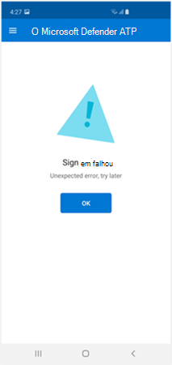
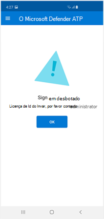
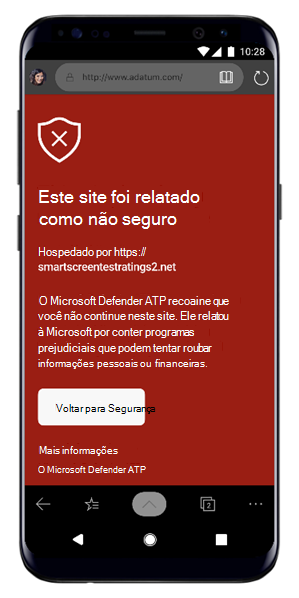
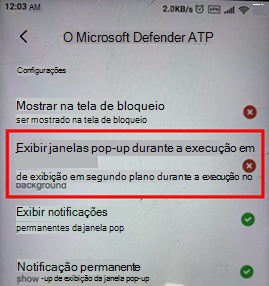

# Solução de problemas no Microsoft Defender para Ponto de Extremidade no AndroidTroubleshooting issues on Microsoft Defender for Endpoint on Android

[!INCLUDE [Microsoft 365 Defender rebranding](../../includes/microsoft-defender.md)]

**Aplica-se a:****Applies to:**
- [Microsoft Defender para Ponto de ExtremidadeMicrosoft Defender for Endpoint](https://go.microsoft.com/fwlink/p/?linkid=2154037)
- [Microsoft 365 DefenderMicrosoft 365 Defender](https://go.microsoft.com/fwlink/?linkid=2118804)

> Deseja experimentar o Microsoft Defender para Ponto de Extremidade?Want to experience Microsoft Defender for Endpoint? [Inscreva-se para uma avaliação gratuita.Sign up for a free trial.](https://www.microsoft.com/microsoft-365/windows/microsoft-defender-atp?ocid=docs-wdatp-exposedapis-abovefoldlink) 

Ao fazer a integração de um dispositivo, você pode ver problemas de entrada após a instalação do aplicativo.When onboarding a device, you might see sign in issues after the app is installed.

Durante a integração, você pode encontrar problemas de entrada após a instalação do aplicativo em seu dispositivo.During onboarding, you might encounter sign in issues after the app is installed on your device.

Este artigo fornece soluções para ajudar a resolver os problemas de login.This article provides solutions to help address the sign-on issues.  

## Falha ao entrar - erro inesperadoSign in failed - unexpected error
**Falha ao entrar:** *Erro inesperado, tente mais tarde***Sign in failed:** *Unexpected error, try later*

**Mensagem:****Message:**

Erro inesperado, tente mais tardeUnexpected error, try later

**Causa:****Cause:**

Você tem uma versão mais antiga do aplicativo "Microsoft Authenticator" instalada em seu dispositivo.You have an older version of "Microsoft Authenticator" app installed on your device.

**Solução:****Solution:**

Instalar a versão mais recente e o [Microsoft Authenticator](https://play.google.com/store/apps/details?androidid=com.azure.authenticator) na Google Play Store e tentar novamenteInstall latest version and of [Microsoft Authenticator](https://play.google.com/store/apps/details?androidid=com.azure.authenticator) from Google Play Store and try again

## Falha ao entrar - licença inválidaSign in failed - invalid license

**Falha ao entrar:** *Licença inválida, entre em contato com o administrador***Sign in failed:** *Invalid license, please contact administrator*

**Mensagem:** *Licença inválida, entre em contato com o administrador***Message:** *Invalid license, please contact administrator*

**Causa:****Cause:**

Você não tem a licença do Microsoft 365 atribuída ou sua organização não tem uma licença para a assinatura do Microsoft 365 Enterprise.You do not have Microsoft 365 license assigned, or your organization does not have a license for Microsoft 365 Enterprise subscription.

**Solução:****Solution:**

Entre em contato com o administrador para obter ajuda.Contact your administrator for help.

## Páginas de phishing não são bloqueadas em alguns dispositivos OEMPhishing pages aren't blocked on some OEM devices

**Aplica-se a:** Somente OEMs específicos**Applies to:** Specific OEMs only

-   **Xiaomi****Xiaomi**

Phishing e ameaças na Web prejudiciais detectadas pelo Defender para Ponto de Extremidade para Android não são bloqueadas em alguns dispositivos Xiaomi.Phishing and harmful web threats that are detected by Defender for Endpoint for Android are not blocked on some Xiaomi devices. A funcionalidade a seguir não funciona nesses dispositivos.The following functionality doesn't work on these devices.

**Causa:****Cause:**

Os dispositivos Xiaomi incluem um novo modelo de permissão.Xiaomi devices include a new permission model. Isso impede que o Defender para Ponto de Extremidade para Android ex displaye janelas pop-up enquanto ele é executado em segundo plano.This prevents Defender for Endpoint for Android from displaying pop-up windows while it runs in the background.

Permissão de dispositivos Xiaomi: "Exibir janelas pop-up durante a execução em segundo plano".Xiaomi devices permission: "Display pop-up windows while running in the background."

**Solução:****Solution:**

Habilita a permissão necessária em dispositivos Xiaomi.Enable the required permission on Xiaomi devices.

- Exibir janelas pop-up durante a execução em segundo plano.Display pop-up windows while running in the background.
