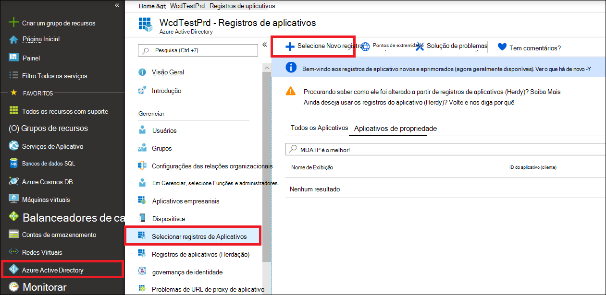
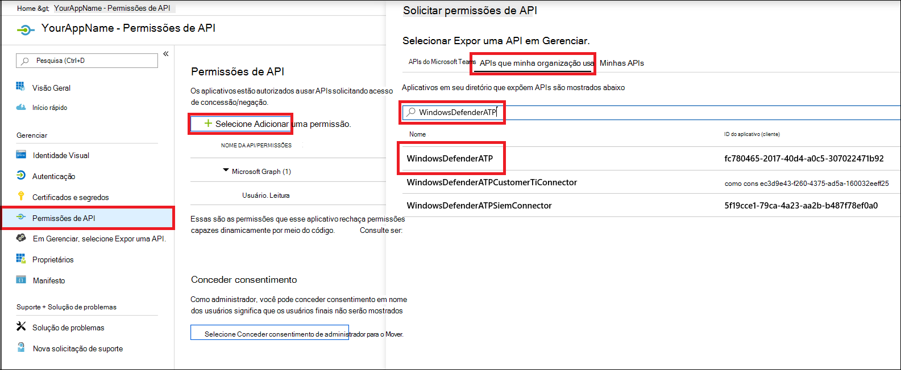
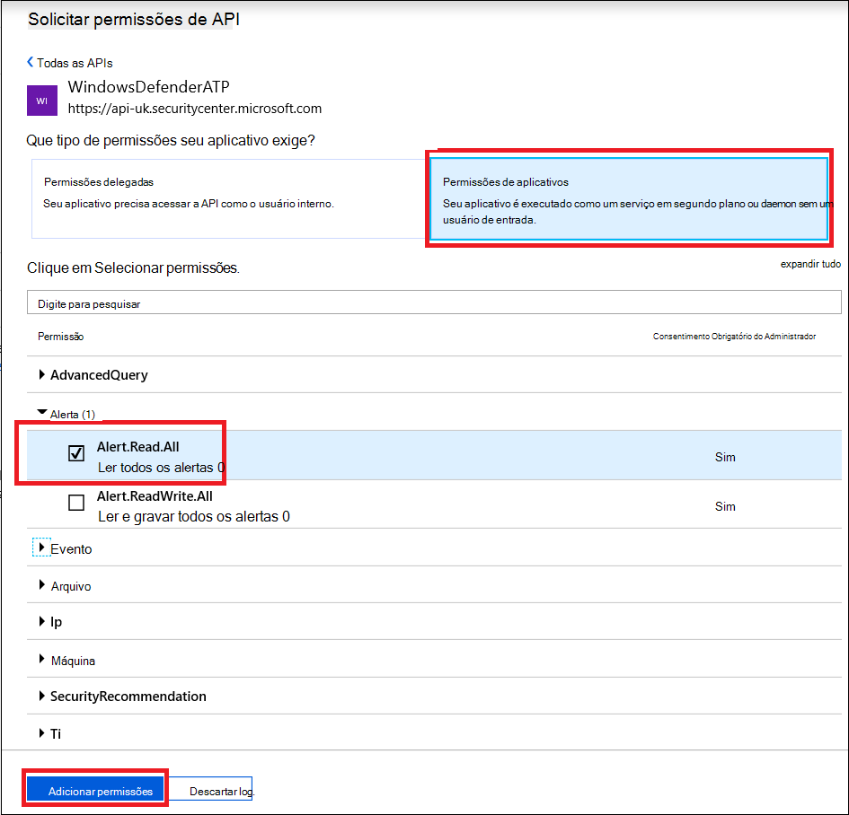
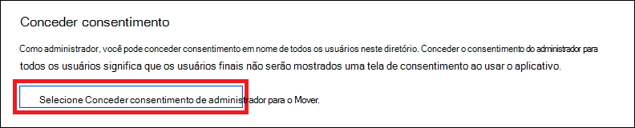
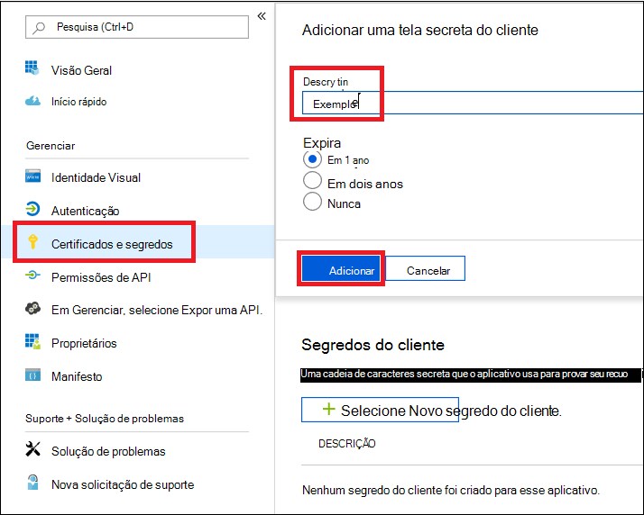
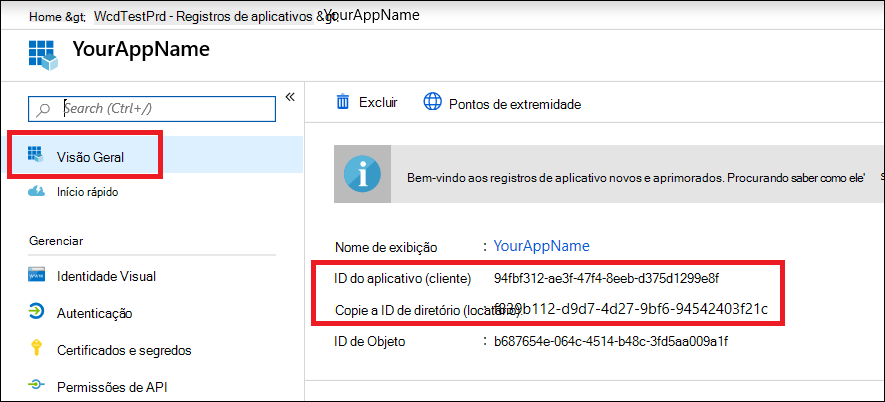
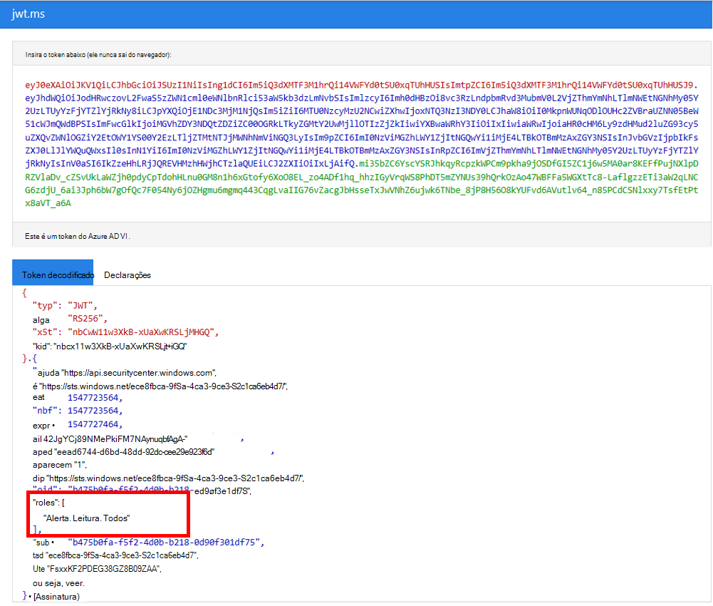

# <a name="microsoft-defender-for-endpoint-api---hello-world"></a><span data-ttu-id="3b123-104">API do Microsoft Defender para Ponto de Extremidade - Hello World</span><span class="sxs-lookup"><span data-stu-id="3b123-104">Microsoft Defender for Endpoint API - Hello World</span></span>

[!INCLUDE [Microsoft 365 Defender rebranding](../../includes/microsoft-defender.md)]


<span data-ttu-id="3b123-105">**Aplica-se a:**</span><span class="sxs-lookup"><span data-stu-id="3b123-105">**Applies to:**</span></span>
- [<span data-ttu-id="3b123-106">Microsoft Defender para Ponto de Extremidade</span><span class="sxs-lookup"><span data-stu-id="3b123-106">Microsoft Defender for Endpoint</span></span>](https://go.microsoft.com/fwlink/?linkid=2154037)


- <span data-ttu-id="3b123-107">Deseja experimentar o Microsoft Defender para Ponto de Extremidade?</span><span class="sxs-lookup"><span data-stu-id="3b123-107">Want to experience Microsoft Defender for Endpoint?</span></span> [<span data-ttu-id="3b123-108">Inscreva-se para uma avaliação gratuita.</span><span class="sxs-lookup"><span data-stu-id="3b123-108">Sign up for a free trial.</span></span>](https://www.microsoft.com/microsoft-365/windows/microsoft-defender-atp?ocid=docs-wdatp-exposedapis-abovefoldlink)

[!include[Microsoft Defender for Endpoint API URIs for US Government](../../includes/microsoft-defender-api-usgov.md)]

[!include[Improve request performance](../../includes/improve-request-performance.md)]


## <a name="get-alerts-using-a-simple-powershell-script"></a><span data-ttu-id="3b123-109">Obter alertas usando um script simples do PowerShell</span><span class="sxs-lookup"><span data-stu-id="3b123-109">Get Alerts using a simple PowerShell script</span></span>

### <a name="how-long-it-takes-to-go-through-this-example"></a><span data-ttu-id="3b123-110">Quanto tempo leva para passar por este exemplo?</span><span class="sxs-lookup"><span data-stu-id="3b123-110">How long it takes to go through this example?</span></span>
<span data-ttu-id="3b123-111">Leva apenas 5 minutos para ser feito em duas etapas:</span><span class="sxs-lookup"><span data-stu-id="3b123-111">It only takes 5 minutes done in two steps:</span></span>
- <span data-ttu-id="3b123-112">Registro de aplicativo</span><span class="sxs-lookup"><span data-stu-id="3b123-112">Application registration</span></span>
- <span data-ttu-id="3b123-113">Exemplos de uso: só requer cópia/colar de um script curto do PowerShell</span><span class="sxs-lookup"><span data-stu-id="3b123-113">Use examples: only requires copy/paste of a short PowerShell script</span></span>

### <a name="do-i-need-a-permission-to-connect"></a><span data-ttu-id="3b123-114">Preciso de uma permissão para me conectar?</span><span class="sxs-lookup"><span data-stu-id="3b123-114">Do I need a permission to connect?</span></span>
<span data-ttu-id="3b123-115">Para o estágio de registro do aplicativo, você deve ter uma função de administrador **global** em seu locatário Azure Active Directory (Azure AD).</span><span class="sxs-lookup"><span data-stu-id="3b123-115">For the Application registration stage, you must have a **Global administrator** role in your Azure Active Directory (Azure AD) tenant.</span></span>

### <a name="step-1---create-an-app-in-azure-active-directory"></a><span data-ttu-id="3b123-116">Etapa 1 - Criar um aplicativo no Azure Active Directory</span><span class="sxs-lookup"><span data-stu-id="3b123-116">Step 1 - Create an App in Azure Active Directory</span></span>

1. <span data-ttu-id="3b123-117">Faça logoff no [Azure](https://portal.azure.com) com seu **usuário de administrador** global.</span><span class="sxs-lookup"><span data-stu-id="3b123-117">Log on to [Azure](https://portal.azure.com) with your **Global administrator** user.</span></span>

2. <span data-ttu-id="3b123-118">Navegue **até Azure Active Directory** registros do  >  **aplicativo** Novo  >  **registro**.</span><span class="sxs-lookup"><span data-stu-id="3b123-118">Navigate to **Azure Active Directory** > **App registrations** > **New registration**.</span></span>

   

3. <span data-ttu-id="3b123-120">No formulário de registro, escolha um nome para seu aplicativo e clique em **Registrar**.</span><span class="sxs-lookup"><span data-stu-id="3b123-120">In the registration form, choose a name for your application and then click **Register**.</span></span>

4. <span data-ttu-id="3b123-121">Permitir que seu aplicativo acesse o Defender para Ponto de Extremidade e atribua a permissão **"Ler todos os alertas":**</span><span class="sxs-lookup"><span data-stu-id="3b123-121">Allow your Application to access Defender for Endpoint and assign it **'Read all alerts'** permission:</span></span>

   - <span data-ttu-id="3b123-122">Em sua página de aplicativo, clique em Permissões de **API** Adicionar APIs de permissão que minha organização usa > tipo  >    >   **WindowsDefenderATP** e clique em **WindowsDefenderATP**.</span><span class="sxs-lookup"><span data-stu-id="3b123-122">On your application page, click **API Permissions** > **Add permission** > **APIs my organization uses** > type **WindowsDefenderATP** and click on **WindowsDefenderATP**.</span></span>

   - <span data-ttu-id="3b123-123">**Observação**: WindowsDefenderATP não aparece na lista original.</span><span class="sxs-lookup"><span data-stu-id="3b123-123">**Note**: WindowsDefenderATP does not appear in the original list.</span></span> <span data-ttu-id="3b123-124">Você precisa começar a escrever seu nome na caixa de texto para vê-lo aparecer.</span><span class="sxs-lookup"><span data-stu-id="3b123-124">You need to start writing its name in the text box to see it appear.</span></span>

   

   - <span data-ttu-id="3b123-126">Escolha **Permissões de aplicativo**  >  **Alert.Read.All** > Clique em Adicionar **permissões**</span><span class="sxs-lookup"><span data-stu-id="3b123-126">Choose **Application permissions** > **Alert.Read.All** > Click on **Add permissions**</span></span>

   

   <span data-ttu-id="3b123-128">**Observação importante:** você precisa selecionar as permissões relevantes.</span><span class="sxs-lookup"><span data-stu-id="3b123-128">**Important note**: You need to select the relevant permissions.</span></span> <span data-ttu-id="3b123-129">'Ler Todos os Alertas' é apenas um exemplo!</span><span class="sxs-lookup"><span data-stu-id="3b123-129">'Read All Alerts' is only an example!</span></span>

     <span data-ttu-id="3b123-130">Por exemplo,</span><span class="sxs-lookup"><span data-stu-id="3b123-130">For instance,</span></span>

     - <span data-ttu-id="3b123-131">Para [executar consultas avançadas,](run-advanced-query-api.md)selecione 'Executar consultas avançadas' permissão</span><span class="sxs-lookup"><span data-stu-id="3b123-131">To [run advanced queries](run-advanced-query-api.md), select 'Run advanced queries' permission</span></span>
     - <span data-ttu-id="3b123-132">Para [isolar um computador,](isolate-machine.md)selecione a permissão 'Isolar máquina'</span><span class="sxs-lookup"><span data-stu-id="3b123-132">To [isolate a machine](isolate-machine.md), select 'Isolate machine' permission</span></span>
     - <span data-ttu-id="3b123-133">Para determinar de que permissão você precisa, consulte a seção **Permissões** na API que você está interessado em chamar.</span><span class="sxs-lookup"><span data-stu-id="3b123-133">To determine which permission you need, please look at the **Permissions** section in the API you are interested to call.</span></span>

5. <span data-ttu-id="3b123-134">Clique **em Conceder consentimento**</span><span class="sxs-lookup"><span data-stu-id="3b123-134">Click **Grant consent**</span></span>

   - <span data-ttu-id="3b123-135">**Observação**: sempre que você adicionar permissão, clique em **Conceder consentimento** para que a nova permissão entre em vigor.</span><span class="sxs-lookup"><span data-stu-id="3b123-135">**Note**: Every time you add permission you must click on **Grant consent** for the new permission to take effect.</span></span>

   

6. <span data-ttu-id="3b123-137">Adicione um segredo ao aplicativo.</span><span class="sxs-lookup"><span data-stu-id="3b123-137">Add a secret to the application.</span></span>

   - <span data-ttu-id="3b123-138">Clique **em Certificados & segredos,** adicione a descrição ao segredo e clique em **Adicionar**.</span><span class="sxs-lookup"><span data-stu-id="3b123-138">Click **Certificates & secrets**, add description to the secret and click **Add**.</span></span>

    <span data-ttu-id="3b123-139">**Importante**: depois de clicar em Adicionar, **copie o valor secreto gerado.**</span><span class="sxs-lookup"><span data-stu-id="3b123-139">**Important**: After click Add, **copy the generated secret value**.</span></span> <span data-ttu-id="3b123-140">Você não poderá recuperar depois de sair!</span><span class="sxs-lookup"><span data-stu-id="3b123-140">You won't be able to retrieve after you leave!</span></span>

    

7. <span data-ttu-id="3b123-142">Anote sua ID de aplicativo e sua ID de locatário:</span><span class="sxs-lookup"><span data-stu-id="3b123-142">Write down your application ID and your tenant ID:</span></span>

   - <span data-ttu-id="3b123-143">Na página do aplicativo, vá para **Visão Geral** e copie o seguinte:</span><span class="sxs-lookup"><span data-stu-id="3b123-143">On your application page, go to **Overview** and copy the following:</span></span>

   

<span data-ttu-id="3b123-145">Pronto!</span><span class="sxs-lookup"><span data-stu-id="3b123-145">Done!</span></span> <span data-ttu-id="3b123-146">Você registrou com êxito um aplicativo!</span><span class="sxs-lookup"><span data-stu-id="3b123-146">You have successfully registered an application!</span></span>

### <a name="step-2---get-a-token-using-the-app-and-use-this-token-to-access-the-api"></a><span data-ttu-id="3b123-147">Etapa 2 : Obter um token usando o Aplicativo e usar esse token para acessar a API.</span><span class="sxs-lookup"><span data-stu-id="3b123-147">Step 2 - Get a token using the App and use this token to access the API.</span></span>

- <span data-ttu-id="3b123-148">Copie o script abaixo para o ISE do PowerShell ou para um editor de texto e salve-o como "**Get-Token.ps1**"</span><span class="sxs-lookup"><span data-stu-id="3b123-148">Copy the script below to PowerShell ISE or to a text editor, and save it as "**Get-Token.ps1**"</span></span>
- <span data-ttu-id="3b123-149">Executar esse script gerará um token e o salvará na pasta de trabalho com o nome "**Latest-token.txt**".</span><span class="sxs-lookup"><span data-stu-id="3b123-149">Running this script will generate a token and will save it in the working folder under the name "**Latest-token.txt**".</span></span>

   ```powershell
   # That code gets the App Context Token and save it to a file named "Latest-token.txt" under the current directory
   # Paste below your Tenant ID, App ID and App Secret (App key).

   $tenantId = '' ### Paste your tenant ID here
   $appId = '' ### Paste your Application ID here
   $appSecret = '' ### Paste your Application secret here

   $resourceAppIdUri = 'https://api.securitycenter.microsoft.com'
   $oAuthUri = "https://login.microsoftonline.com/$TenantId/oauth2/token"
   $authBody = [Ordered] @{
       resource = "$resourceAppIdUri"
       client_id = "$appId"
       client_secret = "$appSecret"
       grant_type = 'client_credentials'
   }
   $authResponse = Invoke-RestMethod -Method Post -Uri $oAuthUri -Body $authBody -ErrorAction Stop
   $token = $authResponse.access_token
   Out-File -FilePath "./Latest-token.txt" -InputObject $token
   return $token
   ```

- <span data-ttu-id="3b123-150">Verificação de sanidade:</span><span class="sxs-lookup"><span data-stu-id="3b123-150">Sanity Check:</span></span>
  - <span data-ttu-id="3b123-151">Execute o script.</span><span class="sxs-lookup"><span data-stu-id="3b123-151">Run the script.</span></span>
  - <span data-ttu-id="3b123-152">No navegador, vá para: <https://jwt.ms/></span><span class="sxs-lookup"><span data-stu-id="3b123-152">In your browser go to: <https://jwt.ms/></span></span>
  - <span data-ttu-id="3b123-153">Copie o token (o conteúdo do arquivo Latest-token.txt arquivo).</span><span class="sxs-lookup"><span data-stu-id="3b123-153">Copy the token (the content of the Latest-token.txt file).</span></span>
  - <span data-ttu-id="3b123-154">Colar na caixa superior.</span><span class="sxs-lookup"><span data-stu-id="3b123-154">Paste in the top box.</span></span>
  - <span data-ttu-id="3b123-155">Procure a seção "funções".</span><span class="sxs-lookup"><span data-stu-id="3b123-155">Look for the "roles" section.</span></span> <span data-ttu-id="3b123-156">Encontre a função Alert.Read.All.</span><span class="sxs-lookup"><span data-stu-id="3b123-156">Find the Alert.Read.All role.</span></span>

  

### <a name="lets-get-the-alerts"></a><span data-ttu-id="3b123-158">Vamos obter os Alertas!</span><span class="sxs-lookup"><span data-stu-id="3b123-158">Lets get the Alerts!</span></span>

- <span data-ttu-id="3b123-159">O script a seguir usará **Get-Token.ps1** acessar a API e receberá os alertas das últimas 48 horas.</span><span class="sxs-lookup"><span data-stu-id="3b123-159">The script below will use **Get-Token.ps1** to access the API and will get the past 48 hours Alerts.</span></span>
- <span data-ttu-id="3b123-160">Salve esse script na mesma pasta que você salvou o script **anteriorGet-Token.ps1**.</span><span class="sxs-lookup"><span data-stu-id="3b123-160">Save this script in the same folder you saved the previous script **Get-Token.ps1**.</span></span>
- <span data-ttu-id="3b123-161">O script cria dois arquivos (json e csv) com os dados na mesma pasta que os scripts.</span><span class="sxs-lookup"><span data-stu-id="3b123-161">The script creates two files (json and csv) with the data in the same folder as the scripts.</span></span>

  ```powershell
  # Returns Alerts created in the past 48 hours.

  $token = ./Get-Token.ps1       #run the script Get-Token.ps1  - make sure you are running this script from the same folder of Get-Token.ps1

  # Get Alert from the last 48 hours. Make sure you have alerts in that time frame.
  $dateTime = (Get-Date).ToUniversalTime().AddHours(-48).ToString("o")

  # The URL contains the type of query and the time filter we create above
  # Read more about other query options and filters at   Https://TBD- add the documentation link
  $url = "https://api.securitycenter.microsoft.com/api/alerts?`$filter=alertCreationTime ge $dateTime"

  # Set the WebRequest headers
  $headers = @{
      'Content-Type' = 'application/json'
      Accept = 'application/json'
      Authorization = "Bearer $token"
  }

  # Send the webrequest and get the results.
  $response = Invoke-WebRequest -Method Get -Uri $url -Headers $headers -ErrorAction Stop

  # Extract the alerts from the results.
  $alerts =  ($response | ConvertFrom-Json).value | ConvertTo-Json

  # Get string with the execution time. We concatenate that string to the output file to avoid overwrite the file
  $dateTimeForFileName = Get-Date -Format o | foreach {$_ -replace ":", "."}

  # Save the result as json and as csv
  $outputJsonPath = "./Latest Alerts $dateTimeForFileName.json"
  $outputCsvPath = "./Latest Alerts $dateTimeForFileName.csv"

  Out-File -FilePath $outputJsonPath -InputObject $alerts
  ($alerts | ConvertFrom-Json) | Export-CSV $outputCsvPath -NoTypeInformation
  ```

<span data-ttu-id="3b123-162">Você terminou!</span><span class="sxs-lookup"><span data-stu-id="3b123-162">You're all done!</span></span> <span data-ttu-id="3b123-163">Você acabou de fazer isso com êxito:</span><span class="sxs-lookup"><span data-stu-id="3b123-163">You have just successfully:</span></span>

- <span data-ttu-id="3b123-164">Criado e registrado e aplicativo</span><span class="sxs-lookup"><span data-stu-id="3b123-164">Created and registered and application</span></span>
- <span data-ttu-id="3b123-165">Permissão concedida para que o aplicativo leia alertas</span><span class="sxs-lookup"><span data-stu-id="3b123-165">Granted permission for that application to read alerts</span></span>
- <span data-ttu-id="3b123-166">Conectado a API</span><span class="sxs-lookup"><span data-stu-id="3b123-166">Connected the API</span></span>
- <span data-ttu-id="3b123-167">Usou um script do PowerShell para retornar alertas criados nas últimas 48 horas</span><span class="sxs-lookup"><span data-stu-id="3b123-167">Used a PowerShell script to return alerts created in the past 48 hours</span></span>

## <a name="related-topic"></a><span data-ttu-id="3b123-168">Tópicos relacionados</span><span class="sxs-lookup"><span data-stu-id="3b123-168">Related topic</span></span>

- [<span data-ttu-id="3b123-169">APIs do Microsoft Defender para Ponto de Extremidade</span><span class="sxs-lookup"><span data-stu-id="3b123-169">Microsoft Defender for Endpoint APIs</span></span>](exposed-apis-list.md)
- [<span data-ttu-id="3b123-170">Acessar o Microsoft Defender para Ponto de Extremidade com contexto de aplicativo</span><span class="sxs-lookup"><span data-stu-id="3b123-170">Access Microsoft Defender for Endpoint with application context</span></span>](exposed-apis-create-app-webapp.md)
- [<span data-ttu-id="3b123-171">Acessar o Microsoft Defender para Ponto de Extremidade com contexto de usuário</span><span class="sxs-lookup"><span data-stu-id="3b123-171">Access Microsoft Defender for Endpoint with user context</span></span>](exposed-apis-create-app-nativeapp.md)
