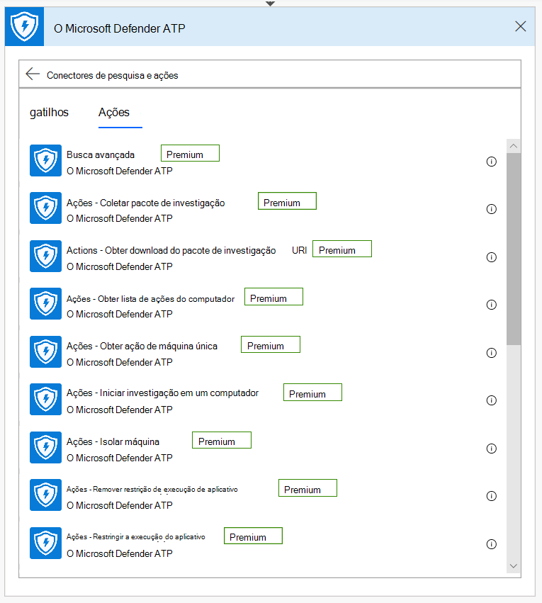
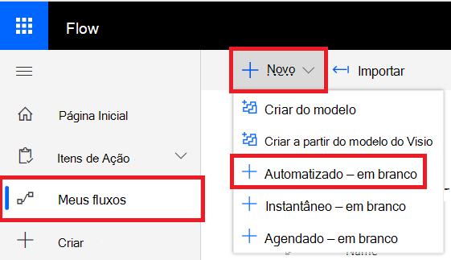

# Microsoft Power Automate (anteriormente Microsoft Flow) e Funções do AzureMicrosoft Power Automate (formerly Microsoft Flow), and Azure Functions

[!INCLUDE [Microsoft 365 Defender rebranding](../../includes/microsoft-defender.md)]

**Aplica-se a:****Applies to:**
- [Microsoft Defender para Ponto de ExtremidadeMicrosoft Defender for Endpoint](https://go.microsoft.com/fwlink/p/?linkid=2154037)
- [Microsoft 365 DefenderMicrosoft 365 Defender](https://go.microsoft.com/fwlink/?linkid=2118804)

- Deseja experimentar o Microsoft Defender para Ponto de Extremidade?Want to experience Microsoft Defender for Endpoint? [Inscreva-se para uma avaliação gratuita.Sign up for a free trial.](https://www.microsoft.com/microsoft-365/windows/microsoft-defender-atp?ocid=docs-wdatp-exposedapis-abovefoldlink) 

Automatizar procedimentos de segurança é um requisito padrão para cada Centro de Operações de Segurança moderno.Automating security procedures is a standard requirement for every modern Security Operations Center. A falta de defensores cibernéticos profissionais força o SOC a trabalhar da maneira mais eficiente e a automação é uma tarefa.The lack of professional cyber defenders forces SOC to work in the most efficient way and automation is a must. O Microsoft Power Automate oferece suporte a conectores diferentes que foram construídos exatamente para isso.Microsoft Power Automate supports different connectors that were built exactly for that. Você pode criar uma automação de procedimento de ponta a ponta em alguns minutos.You can build an end-to-end procedure automation within a few minutes.

A API do Microsoft Defender tem um Conector de Fluxo oficial com muitos recursos.Microsoft Defender API has an official Flow Connector with many capabilities.

> [!NOTE]
> Para obter mais detalhes sobre os pré-requisitos de licenciamento de conectores premium, consulte [Licensing for premium connectors](https://docs.microsoft.com/power-automate/triggers-introduction#licensing-for-premium-connectors).For more details about premium connectors licensing prerequisites, see [Licensing for premium connectors](https://docs.microsoft.com/power-automate/triggers-introduction#licensing-for-premium-connectors).

## Exemplo de usoUsage example

O exemplo a seguir demonstra como criar um Fluxo que é acionado sempre que um novo Alerta ocorre em seu locatário.The following example demonstrates how to create a Flow that is triggered any time a new Alert occurs on your tenant.

1. Faça logoff no [Microsoft Power Automate](https://flow.microsoft.com).Log in to [Microsoft Power Automate](https://flow.microsoft.com).

2. Vá para **Meus fluxos**  >    >  **New Automated-from em branco**.Go to **My flows** > **New** > **Automated-from blank**.

    

3. Escolha um nome para o seu Fluxo, procure "Gatilhos do Microsoft Defender ATP" como o gatilho e selecione o novo gatilho Alertas.Choose a name for your Flow, search for "Microsoft Defender ATP Triggers" as the trigger, and then select the new Alerts trigger.

    

Agora você tem um Fluxo que é disparado sempre que um novo Alerta ocorre.Now you have a Flow that is triggered every time a new Alert occurs.

Tudo o que você precisa fazer agora é escolher suas próximas etapas.All you need to do now is choose your next steps.
Por exemplo, você pode isolar o dispositivo se a Gravidade do Alerta for Alta e enviar um email sobre ele.For example, you can isolate the device if the Severity of the Alert is High and send an email about it.
O gatilho Alerta fornece apenas a ID do Alerta e a ID do Computador.The Alert trigger provides only the Alert ID and the Machine ID. Você pode usar o conector para expandir essas entidades.You can use the connector to expand these entities.

### Obter a entidade Alert usando o conectorGet the Alert entity using the connector

1. Escolha **o Microsoft Defender ATP** para a nova etapa.Choose **Microsoft Defender ATP** for the new step.

2. Escolha **Alertas - Obter API de alerta único.**Choose **Alerts - Get single alert API**.

3. De definir **a ID do Alerta** da última etapa como **Entrada**.Set the **Alert ID** from the last step as **Input**.

    

### Isolar o dispositivo se a gravidade do Alerta for AltaIsolate the device if the Alert's severity is High

1. Adicionar **Condição** como uma nova etapa.Add **Condition** as a new step.

2. Verifique se a gravidade do alerta **é igual a** Alta.Check if the Alert severity **is equal to** High.

   Se sim, adicione o **Microsoft Defender ATP - Isolar** a ação do computador com a ID do computador e um comentário.If yes, add the **Microsoft Defender ATP - Isolate machine** action with the Machine ID and a comment.

    

3. Adicione uma nova etapa para enviar emails sobre o Alerta e o Isolamento.Add a new step for emailing about the Alert and the Isolation. Há vários conectores de email que são muito fáceis de usar, como o Outlook ou o Gmail.There are multiple email connectors that are very easy to use, such as Outlook or Gmail.

4. Salve o fluxo.Save your flow.

Você também pode criar um **fluxo agendado** que executa consultas de Busca Avançada e muito mais!You can also create a **scheduled** flow that runs Advanced Hunting queries and much more!

## Tópicos relacionadosRelated topic
- [APIs do Microsoft Defender para Ponto de ExtremidadeMicrosoft Defender for Endpoint APIs](apis-intro.md)
