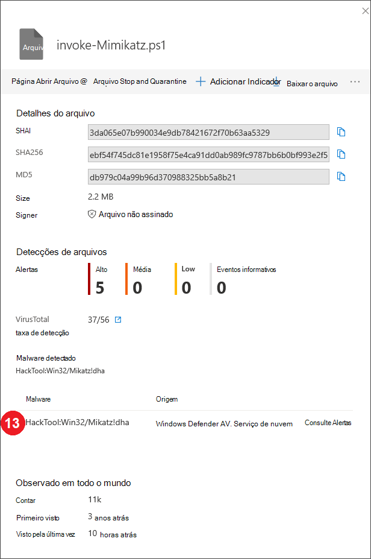
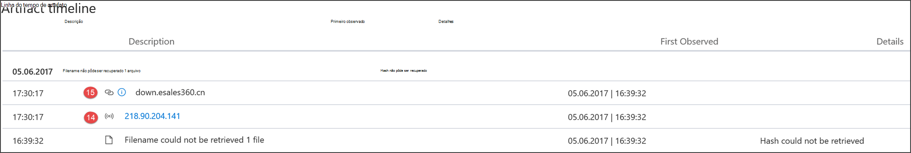
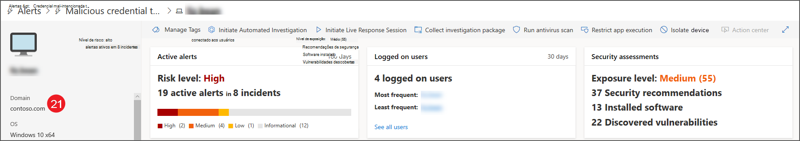
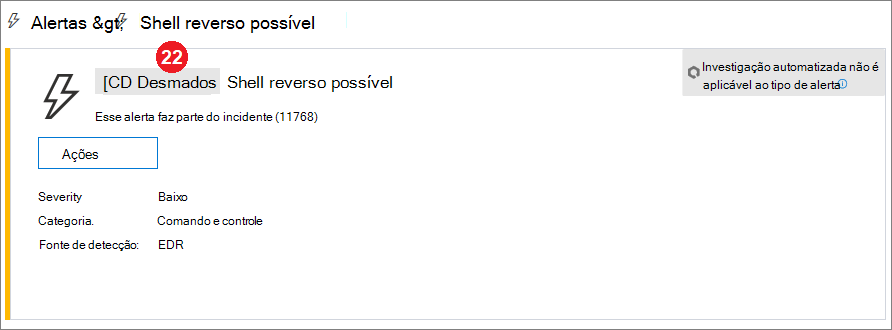

# Campos da API do Microsoft Defender para Detecções de Ponto de Extremidade

[!INCLUDE [Microsoft 365 Defender rebranding](../../includes/microsoft-defender.md)]

**Aplica-se a:**
- [Microsoft Defender para Ponto de Extremidade](https://go.microsoft.com/fwlink/p/?linkid=2154037)
- [Microsoft 365 Defender](https://go.microsoft.com/fwlink/?linkid=2118804)

>Deseja experimentar o Defender para Ponto de Extremidade? [Inscreva-se para uma avaliação gratuita.](https://www.microsoft.com/microsoft-365/windows/microsoft-defender-atp?ocid=docs-wdatp-apiportalmapping-abovefoldlink)

Entenda quais campos de dados são expostos como parte da API de detecções e como eles mapeiam para o Centro de Segurança do Microsoft Defender.

>[!Note]
>- [O Alerta do Defender para Ponto](alerts.md) de Extremidade é composto por uma ou mais detecções.
>- **A Detecção do Microsoft Defender ATP** é composta do evento suspeito ocorrido no Dispositivo e seus detalhes **de Alerta relacionados.**
>- A API de Alerta do Microsoft Defender para Ponto de Extremidade é a API mais recente para consumo de alerta e contém uma lista detalhada de evidências relacionadas para cada alerta. Para obter mais informações, consulte [Métodos de alerta e propriedades](alerts.md) e [Alertas de lista.](get-alerts.md)

## Campos de API de detecções e mapeamento de portal
A tabela a seguir lista os campos disponíveis expostos na carga da API de detecções. Ele mostra exemplos para os valores preenchidos e uma referência sobre como os dados são refletidos no portal.

A coluna de campo ArcSight contém o mapeamento padrão entre os campos Defender para Ponto de Extremidade e os campos integrados no ArcSight. Você pode baixar o arquivo de mapeamento do portal ao habilitar o recurso de integração SIEM e modificá-lo para corresponder às necessidades da sua organização. Para obter mais informações, consulte [Enable SIEM integration in Defender for Endpoint](enable-siem-integration.md).

Os números de campo combinam com os números nas imagens abaixo.

> [!div class="mx-tableFixed"]
> 
> | Rótulo de portal   | Nome do campo SIEM           | Campo ArcSight      | Valor de exemplo                                                                      | Descrição                                                                                                                                                                    |
> |------------------|---------------------------|---------------------|------------------------------------------------------------------------------------|--------------------------------------------------------------------------------------------------------------------------------------------------------------------------------|
> | 1                | AlertTitle                | nome                | O Microsoft Defender AV detectou malware de alta gravidade 'Mikatz' | Valor disponível para cada Detecção.                                                                                                                                               |
> | 2                | Severity                  | deviceSeverity      | Alto                                                                             | Valor disponível para cada Detecção.                                                                                                                                               |
> | 3                | Categoria                  | deviceEventCategory | Malware                                                               | Valor disponível para cada Detecção.                                                                                                                                               |
> | 4                 | Fonte de detecção                    | sourceServiceName   | Antivírus                                                                 | Microsoft Defender Antivírus ou Defender para Ponto de Extremidade. Valor disponível para cada Detecção.                                                                                         |
> | 5                 | MachineName               | sourceHostName      | desktop-4a5ngd6                                                                           | Valor disponível para cada Detecção.                                                                                                                                               |
> | 6                 | FileName                  | fileName            | Robocopy.exe                                                                       | Disponível para detecções associadas a um arquivo ou processo.                                                                                                                      |
> | 7                 | FilePath                  | filePath            | C:\Windows\System32\Robocopy.exe                                                   | Disponível para detecções associadas a um arquivo ou processo.                                                                                                                     |
> | 8                 | UserDomain                | sourceNtDomain      | CONTOSO                                                                            | O domínio do contexto do usuário executando a atividade, disponível para detecções comportamentais do Defender for Endpoint.                                                           |
> | 9                 | UserName                  | sourceUserName      | liz.bean                                                                           | O contexto do usuário executando a atividade, disponível para detecções comportamentais do Defender for Endpoint.                                                                           |
> | 10                | Sha1                      | fileHash            | 3da065e07b990034e9db7842167f70b63a5329                                           | Disponível para detecções associadas a um arquivo ou processo.                                                                                                                      |
> | 11               | Sha256                    | deviceCustomString6 | ebf54f745dc81e1958f75e4ca91dd0ab989fc9787bb6b0bf993e2f5                   | Disponível para detecções do Microsoft Defender AV.                                                                                                                                    |
> | 12                | Md5                       | deviceCustomString5 | db979c04a99b96d370988325bb5a8b21                                                   | Disponível para detecções do Microsoft Defender AV.                                                                                                                                    |
> | 13               | ThreatName                | deviceCustomString1  | HackTool:Win32/Mikatz!dha                                                         | Disponível para detecções do Microsoft Defender AV.                                                                                                                                    |
> | 14                | IpAddress                 | sourceAddress       | 218.90.204.141                                                                     | Disponível para detecções associadas a eventos de rede. Por exemplo, "Comunicação com um destino de rede mal-intencionado".                                                        |
> | 15                | Url                       | requestUrl          | down.esales360.cn                                                                  | Disponível para detecções associadas a eventos de rede. Por exemplo, "Comunicação com um destino de rede mal-intencionado".                                                         |
> | 16                | RemediationIsSuccess      | deviceCustomNumber2 | TRUE                                                                               | Disponível para detecções do Microsoft Defender AV. O valor ArcSight é 1 quando VERDADEIRO e 0 quando FALSE.                                                                                    |
> | 17                | WasExecutingWhileDetected | deviceCustomNumber1 | FALSE                                                                              | Disponível para detecções do Microsoft Defender AV. O valor ArcSight é 1 quando VERDADEIRO e 0 quando FALSE.                                                                                    |
> | 18                | AlertId                   | externalId          | 636210704265059241_673569822                                                       | Valor disponível para cada Detecção.                                                                                                                                               |
> | 19               | LinkToWDATP               | flexString1         | `https://securitycenter.windows.com/alert/636210704265059241_673569822`            | Valor disponível para cada Detecção.                                                                                                                                               |
> | 20               | AlertTime                 | deviceReceiptTime   | 2017-05-07T01:56:59.3191352Z                                                       | A hora em que o evento ocorreu. Valor disponível para cada Detecção.                                                                                       |
> |  21                | MachineDomain             | sourceDnsDomain     | contoso.com                                                                        | Nome de domínio não relevante para dispositivos ingressados no AAD. Valor disponível para cada Detecção.                                                                                           |
> | 22               | Actor                     | deviceCustomString4 | BORON                                                                                   | Disponível para alertas relacionados a um grupo de atores conhecido.                                                                                                                         |
> | 21+5             | ComputerDnsName           | Sem mapeamento          | liz-bean.contoso.com                                                               | O nome de domínio totalmente qualificado do dispositivo. Valor disponível para cada Detecção.                                                                                                    |
> |                  | LogOnUsers                | sourceUserId        | contoso\liz-bean;   contoso\jay-hardee                                             | O domínio e o usuário do usuário/s de logon interativo no momento do evento. Observação: para dispositivos no Windows 10 versão 1607, as informações de domínio não estarão disponíveis. |
> |                  | InternalIPv4List          | Sem mapeamento          | 192.168.1.7, 10.1.14.1                                                             | Lista de IPs internos IPV4 para interfaces de rede ativas.                                                                                                                                                                               |
> |                  | InternalIPv6List          | Sem mapeamento          | fd30:0000:0000:0001:ff4e:003e:0009:000e, FE80:CD00:0000:0CDE:1257:0000:211E:729C | Lista de IPs internos IPV6 para interfaces de rede ativas.                                                                                                                                                                               |
| | LinkToMTP | Sem mapeamento | `https://security.microsoft.com/alert/da637370718981685665_16349121` | Valor disponível para cada Detecção.
| | IncidentLinkToMTP | Sem mapeamento | `"https://security.microsoft.com/incidents/byalert?alertId=da637370718981685665_16349121&source=SIEM` | Valor disponível para cada Detecção.
| | IncidentLinkToWDATP | Sem mapeamento | `https://securitycenter.windows.com/incidents/byalert?alertId=da637370718981685665_16349121&source=SIEM` | Valor disponível para cada Detecção.
> | Campo interno | LastProcessedTimeUtc      | Sem mapeamento          | 2017-05-07T01:56:58.9936648Z                                                       | Hora em que o evento chegou no back-end. Esse campo pode ser usado ao definir o parâmetro request para o intervalo de tempo em que as detecções são recuperadas.                         |
> |                  | Não faz parte do esquema    | deviceVendor        |                                                                                    | Valor estático no mapeamento ArcSight - 'Microsoft'.                                                                                                                          |
> |                  | Não faz parte do esquema    | deviceProduct       |                                                                                    | Valor estático no mapeamento ArcSight - 'Microsoft Defender ATP'.                                                                                                               |
> |                  | Não faz parte do esquema    | deviceVersion       |                                                                                    | Valor estático no mapeamento ArcSight - '2.0', usado para identificar as versões de mapeamento.                                                                                         

## Tópicos relacionados
- [Habilitar a integração do SIEM no Microsoft Defender para Endpoint](enable-siem-integration.md)
- [Configurar ArcSight para puxar o Microsoft Defender para detecções de ponto de extremidade](configure-arcsight.md)
- [Puxar o Microsoft Defender para detecções de ponto de extremidade usando a API REST](pull-alerts-using-rest-api.md)
- [Solucionar problemas de integração de ferramentas SIEM](troubleshoot-siem.md)
