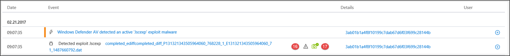

# Campos da API do Microsoft Defender para Detecções de Ponto de ExtremidadeMicrosoft Defender for Endpoint detections API fields

[!INCLUDE [Microsoft 365 Defender rebranding](../../includes/microsoft-defender.md)]

**Aplica-se a:****Applies to:**
- [Microsoft Defender para Ponto de ExtremidadeMicrosoft Defender for Endpoint](https://go.microsoft.com/fwlink/p/?linkid=2154037)
- [Microsoft 365 DefenderMicrosoft 365 Defender](https://go.microsoft.com/fwlink/?linkid=2118804)

>Deseja experimentar o Defender para Ponto de Extremidade?Want to experience Defender for Endpoint? [Inscreva-se para uma avaliação gratuita.Sign up for a free trial.](https://www.microsoft.com/microsoft-365/windows/microsoft-defender-atp?ocid=docs-wdatp-apiportalmapping-abovefoldlink)

Entenda quais campos de dados são expostos como parte da API de detecções e como eles mapeiam para o Centro de Segurança do Microsoft Defender.Understand what data fields are exposed as part of the detections API and how they map to Microsoft Defender Security Center.

>[!Note]
>- [O Alerta do Defender para Ponto](alerts.md) de Extremidade é composto por uma ou mais detecções.[Defender for Endpoint Alert](alerts.md) is composed from one or more detections.
>- **A Detecção do Microsoft Defender ATP** é composta do evento suspeito ocorrido no Dispositivo e seus detalhes **de Alerta relacionados.****Microsoft Defender ATP Detection** is composed from the suspicious event occurred on the Device and its related **Alert** details.
>- A API de Alerta do Microsoft Defender para Ponto de Extremidade é a API mais recente para consumo de alerta e contém uma lista detalhada de evidências relacionadas para cada alerta.The Microsoft Defender for Endpoint Alert API is the latest API for alert consumption and contain a detailed list of related evidence for each alert. Para obter mais informações, consulte [Métodos de alerta e propriedades](alerts.md) e [Alertas de lista.](get-alerts.md)For more information, see [Alert methods and properties](alerts.md) and [List alerts](get-alerts.md).

## Campos de API de detecções e mapeamento de portalDetections API fields and portal mapping
A tabela a seguir lista os campos disponíveis expostos na carga da API de detecções.The following table lists the available fields exposed in the detections API payload. Ele mostra exemplos para os valores preenchidos e uma referência sobre como os dados são refletidos no portal.It shows examples for the populated values and a reference on how data is reflected on the portal.

A coluna de campo ArcSight contém o mapeamento padrão entre os campos Defender para Ponto de Extremidade e os campos integrados no ArcSight.The ArcSight field column contains the default mapping between the Defender for Endpoint fields and the built-in fields in ArcSight. Você pode baixar o arquivo de mapeamento do portal ao habilitar o recurso de integração SIEM e modificá-lo para corresponder às necessidades da sua organização.You can download the mapping file from the portal when you enable the SIEM integration feature and you can modify it to match the  needs of your organization. Para obter mais informações, consulte [Enable SIEM integration in Defender for Endpoint](enable-siem-integration.md).For more information, see [Enable SIEM integration in Defender for Endpoint](enable-siem-integration.md).

Os números de campo combinam com os números nas imagens abaixo.Field numbers match the numbers in the images below.

> [!div class="mx-tableFixed"]
> 
> | Rótulo de portalPortal   label   | Nome do campo SIEMSIEM field name           | Campo ArcSightArcSight field      | Valor de exemploExample value                                                                      | DescriçãoDescription                                                                                                                                                                    |
> |------------------|---------------------------|---------------------|------------------------------------------------------------------------------------|--------------------------------------------------------------------------------------------------------------------------------------------------------------------------------|
> | 11                | AlertTitleAlertTitle                | nomename                | O Microsoft Defender AV detectou malware de alta gravidade 'Mikatz'Microsoft Defender AV detected 'Mikatz' high-severity malware | Valor disponível para cada Detecção.Value available for every Detection.                                                                                                                                               |
> | 22                | SeveritySeverity                  | deviceSeveritydeviceSeverity      | AltoHigh                                                                             | Valor disponível para cada Detecção.Value available for every Detection.                                                                                                                                               |
> | 33                | CategoriaCategory                  | deviceEventCategorydeviceEventCategory | MalwareMalware                                                               | Valor disponível para cada Detecção.Value available for every Detection.                                                                                                                                               |
> | 4 4                | Fonte de detecçãoDetection source                    | sourceServiceNamesourceServiceName   | AntivírusAntivirus                                                                 | Microsoft Defender Antivírus ou Defender para Ponto de Extremidade.Microsoft Defender Antivirus or  Defender for Endpoint. Valor disponível para cada Detecção.Value available for every Detection.                                                                                         |
> | 5 5                | MachineNameMachineName               | sourceHostNamesourceHostName      | desktop-4a5ngd6desktop-4a5ngd6                                                                           | Valor disponível para cada Detecção.Value available for every Detection.                                                                                                                                               |
> | 6 6                | FileNameFileName                  | fileNamefileName            | Robocopy.exeRobocopy.exe                                                                       | Disponível para detecções associadas a um arquivo ou processo.Available for detections associated   with a file or process.                                                                                                                      |
> | 7 7                | FilePathFilePath                  | filePathfilePath            | C:\Windows\System32\Robocopy.exeC:\Windows\System32\Robocopy.exe                                                   | Disponível para detecções associadas a um arquivo ou processo.Available for detections associated   with a file or process.                                                                                                                     |
> | 8 8                | UserDomainUserDomain                | sourceNtDomainsourceNtDomain      | CONTOSOCONTOSO                                                                            | O domínio do contexto do usuário executando a atividade, disponível para detecções comportamentais do Defender for Endpoint.The domain of the user context   running the activity, available for Defender for Endpoint behavioral based detections.                                                           |
> | 9 9                | UserNameUserName                  | sourceUserNamesourceUserName      | liz.beanliz.bean                                                                           | O contexto do usuário executando a atividade, disponível para detecções comportamentais do Defender for Endpoint.The user context running the   activity, available for Defender for Endpoint behavioral based detections.                                                                           |
> | 10 10               | Sha1Sha1                      | fileHashfileHash            | 3da065e07b990034e9db7842167f70b63a53293da065e07b990034e9db7842167f70b63aa5329                                           | Disponível para detecções associadas a um arquivo ou processo.Available for detections associated   with a file or process.                                                                                                                      |
> | 1111               | Sha256Sha256                    | deviceCustomString6deviceCustomString6 | ebf54f745dc81e1958f75e4ca91dd0ab989fc9787bb6b0bf993e2f5ebf54f745dc81e1958f75e4ca91dd0ab989fc9787bb6b0bf993e2f5                   | Disponível para detecções do Microsoft Defender AV.Available for Microsoft Defender AV detections.                                                                                                                                    |
> | 12 12               | Md5Md5                       | deviceCustomString5deviceCustomString5 | db979c04a99b96d370988325bb5a8b21db979c04a99b96d370988325bb5a8b21                                                   | Disponível para detecções do Microsoft Defender AV.Available for Microsoft Defender AV detections.                                                                                                                                    |
> | 1313               | ThreatNameThreatName                | deviceCustomString1deviceCustomString1  | HackTool:Win32/Mikatz!dhaHackTool:Win32/Mikatz!dha                                                         | Disponível para detecções do Microsoft Defender AV.Available for Microsoft Defender AV detections.                                                                                                                                    |
> | 14 14               | IpAddressIpAddress                 | sourceAddresssourceAddress       | 218.90.204.141218.90.204.141                                                                     | Disponível para detecções associadas a eventos de rede.Available for detections associated   to network events. Por exemplo, "Comunicação com um destino de rede mal-intencionado".For example, 'Communication to a malicious network   destination'.                                                        |
> | 15 15               | UrlUrl                       | requestUrlrequestUrl          | down.esales360.cndown.esales360.cn                                                                  | Disponível para detecções associadas a eventos de rede.Available for detections associated to   network events. Por exemplo, "Comunicação com um destino de rede mal-intencionado".For example, 'Communication to a malicious network   destination'.                                                         |
> | 16 16               | RemediationIsSuccessRemediationIsSuccess      | deviceCustomNumber2deviceCustomNumber2 | TRUETRUE                                                                               | Disponível para detecções do Microsoft Defender AV.Available for Microsoft Defender AV detections. O valor ArcSight é 1 quando VERDADEIRO e 0 quando FALSE.ArcSight value is 1 when TRUE and 0 when FALSE.                                                                                    |
> | 17 17               | WasExecutingWhileDetectedWasExecutingWhileDetected | deviceCustomNumber1deviceCustomNumber1 | FALSEFALSE                                                                              | Disponível para detecções do Microsoft Defender AV.Available for Microsoft Defender AV detections. O valor ArcSight é 1 quando VERDADEIRO e 0 quando FALSE.ArcSight value is 1 when TRUE and 0 when FALSE.                                                                                    |
> | 18 18               | AlertIdAlertId                   | externalIdexternalId          | 636210704265059241_673569822636210704265059241_673569822                                                       | Valor disponível para cada Detecção.Value available for every Detection.                                                                                                                                               |
> | 1919               | LinkToWDATPLinkToWDATP               | flexString1flexString1         | `https://securitycenter.windows.com/alert/636210704265059241_673569822`            | Valor disponível para cada Detecção.Value available for every Detection.                                                                                                                                               |
> | 2020               | AlertTimeAlertTime                 | deviceReceiptTimedeviceReceiptTime   | 2017-05-07T01:56:59.3191352Z2017-05-07T01:56:59.3191352Z                                                       | A hora em que o evento ocorreu.The time the event occurred. Valor disponível para cada Detecção.Value available for every Detection.                                                                                       |
> |  21 21               | MachineDomainMachineDomain             | sourceDnsDomainsourceDnsDomain     | contoso.comcontoso.com                                                                        | Nome de domínio não relevante para dispositivos ingressados no AAD.Domain name not relevant for AAD   joined devices. Valor disponível para cada Detecção.Value available for every Detection.                                                                                           |
> | 2222               | ActorActor                     | deviceCustomString4deviceCustomString4 | BORONBORON                                                                                   | Disponível para alertas relacionados a um grupo de atores conhecido.Available for alerts related to a   known actor group.                                                                                                                         |
> | 21+521+5             | ComputerDnsNameComputerDnsName           | Sem mapeamentoNo mapping          | liz-bean.contoso.comliz-bean.contoso.com                                                               | O nome de domínio totalmente qualificado do dispositivo.The device fully qualified   domain name. Valor disponível para cada Detecção.Value available for every Detection.                                                                                                    |
> |                  | LogOnUsersLogOnUsers                | sourceUserIdsourceUserId        | contoso\liz-bean;   contoso\jay-hardeecontoso\liz-bean;   contoso\jay-hardee                                             | O domínio e o usuário do usuário/s de logon interativo no momento do evento.The domain and user of the   interactive logon user/s at the time of the event. Observação: para dispositivos no Windows 10 versão 1607, as informações de domínio não estarão disponíveis.Note: For devices on   Windows 10 version 1607, the domain information will not be available. |
> |                  | InternalIPv4ListInternalIPv4List          | Sem mapeamentoNo mapping          | 192.168.1.7, 10.1.14.1192.168.1.7, 10.1.14.1                                                             | Lista de IPs internos IPV4 para interfaces de rede ativas.List of IPV4 internal IPs for active network interfaces.                                                                                                                                                                               |
> |                  | InternalIPv6ListInternalIPv6List          | Sem mapeamentoNo mapping          | fd30:0000:0000:0001:ff4e:003e:0009:000e, FE80:CD00:0000:0CDE:1257:0000:211E:729Cfd30:0000:0000:0001:ff4e:003e:0009:000e,   FE80:CD00:0000:0CDE:1257:0000:211E:729C | Lista de IPs internos IPV6 para interfaces de rede ativas.List of IPV6 internal IPs for active network interfaces.                                                                                                                                                                               |
| | LinkToMTPLinkToMTP | Sem mapeamentoNo mapping | `https://security.microsoft.com/alert/da637370718981685665_16349121` | Valor disponível para cada Detecção.Value available for every Detection.
| | IncidentLinkToMTPIncidentLinkToMTP | Sem mapeamentoNo mapping | `"https://security.microsoft.com/incidents/byalert?alertId=da637370718981685665_16349121&source=SIEM` | Valor disponível para cada Detecção.Value available for every Detection.
| | IncidentLinkToWDATPIncidentLinkToWDATP | Sem mapeamentoNo mapping | `https://securitycenter.windows.com/incidents/byalert?alertId=da637370718981685665_16349121&source=SIEM` | Valor disponível para cada Detecção.Value available for every Detection.
> | Campo internoInternal   field | LastProcessedTimeUtcLastProcessedTimeUtc      | Sem mapeamentoNo mapping          | 2017-05-07T01:56:58.9936648Z2017-05-07T01:56:58.9936648Z                                                       | Hora em que o evento chegou no back-end.Time when event arrived at the   backend. Esse campo pode ser usado ao definir o parâmetro request para o intervalo de tempo em que as detecções são recuperadas.This field can be used when setting the request parameter for the range of time that detections are retrieved.                         |
> |                  | Não faz parte do esquemaNot part of the schema    | deviceVendordeviceVendor        |                                                                                    | Valor estático no mapeamento ArcSight - 'Microsoft'.Static value in the ArcSight   mapping - 'Microsoft'.                                                                                                                          |
> |                  | Não faz parte do esquemaNot part of the schema    | deviceProductdeviceProduct       |                                                                                    | Valor estático no mapeamento ArcSight - 'Microsoft Defender ATP'.Static value in the ArcSight   mapping - 'Microsoft Defender ATP'.                                                                                                               |
> |                  | Não faz parte do esquemaNot part of the schema    | deviceVersiondeviceVersion       |                                                                                    | Valor estático no mapeamento ArcSight - '2.0', usado para identificar as versões de mapeamento.Static value in the ArcSight   mapping - '2.0', used to identify the mapping versions.                                                                                         

## Tópicos relacionadosRelated topics
- [Habilitar a integração do SIEM no Microsoft Defender para EndpointEnable SIEM integration in Microsoft Defender for Endpoint](enable-siem-integration.md)
- [Configurar ArcSight para puxar o Microsoft Defender para detecções de ponto de extremidadeConfigure ArcSight to pull Microsoft Defender for Endpoint detections](configure-arcsight.md)
- [Puxar o Microsoft Defender para detecções de ponto de extremidade usando a API RESTPull Microsoft Defender for Endpoint detections using REST API](pull-alerts-using-rest-api.md)
- [Solucionar problemas de integração de ferramentas SIEMTroubleshoot SIEM tool integration issues](troubleshoot-siem.md)
