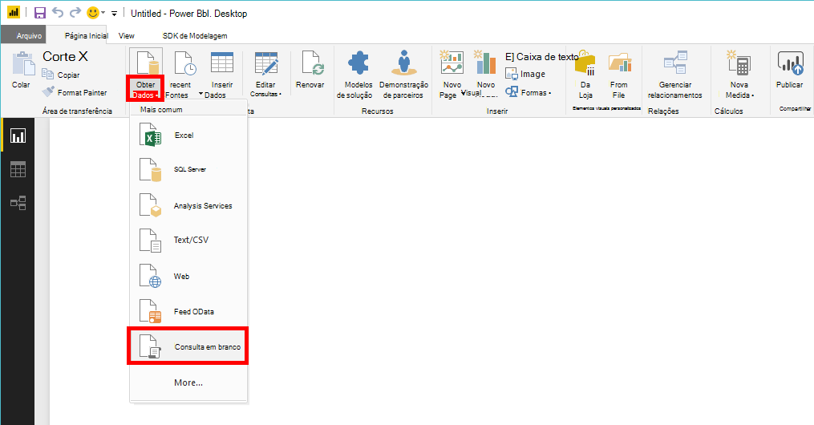
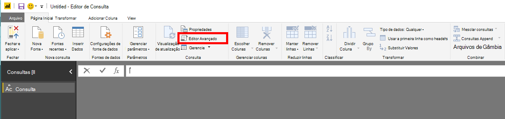
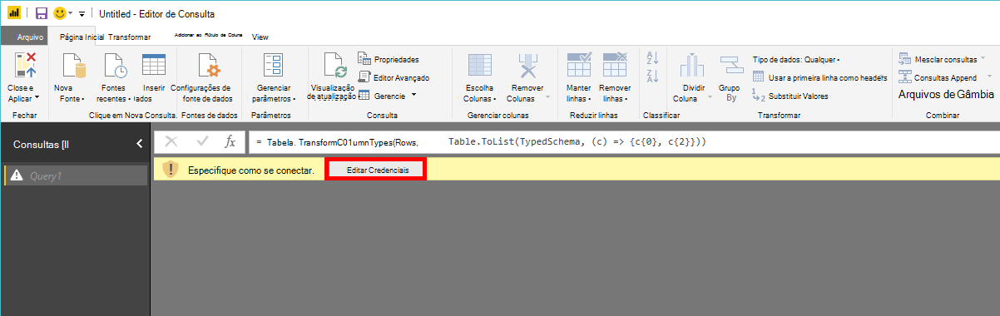
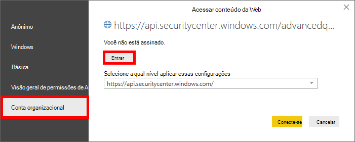
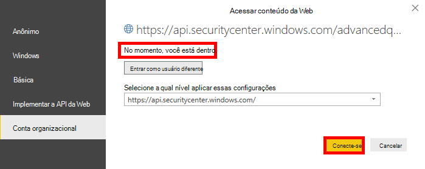

# <a name="create-custom-reports-using-power-bi"></a><span data-ttu-id="b2ff1-104">Criar relatórios personalizados usando Power BI</span><span class="sxs-lookup"><span data-stu-id="b2ff1-104">Create custom reports using Power BI</span></span>

[!INCLUDE [Microsoft 365 Defender rebranding](../../includes/microsoft-defender.md)]

<span data-ttu-id="b2ff1-105">**Aplica-se a:**</span><span class="sxs-lookup"><span data-stu-id="b2ff1-105">**Applies to:**</span></span>
- [<span data-ttu-id="b2ff1-106">Microsoft Defender para Ponto de Extremidade</span><span class="sxs-lookup"><span data-stu-id="b2ff1-106">Microsoft Defender for Endpoint</span></span>](https://go.microsoft.com/fwlink/p/?linkid=2154037)
- [<span data-ttu-id="b2ff1-107">Microsoft 365 Defender</span><span class="sxs-lookup"><span data-stu-id="b2ff1-107">Microsoft 365 Defender</span></span>](https://go.microsoft.com/fwlink/?linkid=2118804)


- <span data-ttu-id="b2ff1-108">Deseja experimentar o Microsoft Defender para Ponto de Extremidade?</span><span class="sxs-lookup"><span data-stu-id="b2ff1-108">Want to experience Microsoft Defender for Endpoint?</span></span> [<span data-ttu-id="b2ff1-109">Inscreva-se para uma avaliação gratuita.</span><span class="sxs-lookup"><span data-stu-id="b2ff1-109">Sign up for a free trial.</span></span>](https://www.microsoft.com/microsoft-365/windows/microsoft-defender-atp?ocid=docs-wdatp-exposedapis-abovefoldlink) 

[!include[Microsoft Defender for Endpoint API URIs for US Government](../../includes/microsoft-defender-api-usgov.md)]

[!include[Improve request performance](../../includes/improve-request-performance.md)]

<span data-ttu-id="b2ff1-110">Nesta seção, você aprenderá a criar um relatório Power BI sobre as APIs do Defender para Ponto de Extremidade.</span><span class="sxs-lookup"><span data-stu-id="b2ff1-110">In this section you will learn create a Power BI report on top of Defender for Endpoint APIs.</span></span>

<span data-ttu-id="b2ff1-111">O primeiro exemplo demonstra como conectar o Power BI à API de Busca Avançada e o segundo exemplo demonstra uma conexão com nossas APIs OData, como Ações de Máquina ou Alertas.</span><span class="sxs-lookup"><span data-stu-id="b2ff1-111">The first example demonstrates how to connect Power BI to Advanced Hunting API and the second example demonstrates a connection to our OData APIs, such as Machine Actions or Alerts.</span></span>

## <a name="connect-power-bi-to-advanced-hunting-api"></a><span data-ttu-id="b2ff1-112">Conexão Power BI api de busca avançada</span><span class="sxs-lookup"><span data-stu-id="b2ff1-112">Connect Power BI to Advanced Hunting API</span></span>

- <span data-ttu-id="b2ff1-113">Abra o Microsoft Power BI</span><span class="sxs-lookup"><span data-stu-id="b2ff1-113">Open Microsoft Power BI</span></span>

- <span data-ttu-id="b2ff1-114">Clique **em Obter consulta em** branco de  >  **dados**</span><span class="sxs-lookup"><span data-stu-id="b2ff1-114">Click **Get Data** > **Blank Query**</span></span>

    

- <span data-ttu-id="b2ff1-116">Clique **em Editor Avançado**</span><span class="sxs-lookup"><span data-stu-id="b2ff1-116">Click **Advanced Editor**</span></span>

    

- <span data-ttu-id="b2ff1-118">Copie o abaixo e a colar no editor:</span><span class="sxs-lookup"><span data-stu-id="b2ff1-118">Copy the below and paste it in the editor:</span></span>

```
    let 
        AdvancedHuntingQuery = "DeviceEvents | where ActionType contains 'Anti' | limit 20",

        HuntingUrl = "https://api.securitycenter.microsoft.com/api/advancedqueries",

        Response = Json.Document(Web.Contents(HuntingUrl, [Query=[key=AdvancedHuntingQuery]])),

        TypeMap = #table(
            { "Type", "PowerBiType" },
            {
                { "Double",   Double.Type },
                { "Int64",    Int64.Type },
                { "Int32",    Int32.Type },
                { "Int16",    Int16.Type },
                { "UInt64",   Number.Type },
                { "UInt32",   Number.Type },
                { "UInt16",   Number.Type },
                { "Byte",     Byte.Type },
                { "Single",   Single.Type },
                { "Decimal",  Decimal.Type },
                { "TimeSpan", Duration.Type },
                { "DateTime", DateTimeZone.Type },
                { "String",   Text.Type },
                { "Boolean",  Logical.Type },
                { "SByte",    Logical.Type },
                { "Guid",     Text.Type }
            }),

        Schema = Table.FromRecords(Response[Schema]),
        TypedSchema = Table.Join(Table.SelectColumns(Schema, {"Name", "Type"}), {"Type"}, TypeMap , {"Type"}),
        Results = Response[Results],
        Rows = Table.FromRecords(Results, Schema[Name]),
        Table = Table.TransformColumnTypes(Rows, Table.ToList(TypedSchema, (c) => {c{0}, c{2}}))

    in Table

```

- <span data-ttu-id="b2ff1-119">Clique **em Feito**</span><span class="sxs-lookup"><span data-stu-id="b2ff1-119">Click **Done**</span></span>

- <span data-ttu-id="b2ff1-120">Clique **em Editar Credenciais**</span><span class="sxs-lookup"><span data-stu-id="b2ff1-120">Click **Edit Credentials**</span></span>

    

- <span data-ttu-id="b2ff1-122">Selecione **Entrar na conta**  >  **organizacional**</span><span class="sxs-lookup"><span data-stu-id="b2ff1-122">Select **Organizational account** > **Sign in**</span></span>

    

- <span data-ttu-id="b2ff1-124">Insira suas credenciais e aguarde para entrar</span><span class="sxs-lookup"><span data-stu-id="b2ff1-124">Enter your credentials and wait to be signed in</span></span>

- <span data-ttu-id="b2ff1-125">Clique **Conexão**</span><span class="sxs-lookup"><span data-stu-id="b2ff1-125">Click **Connect**</span></span>

    

- <span data-ttu-id="b2ff1-127">Agora, os resultados de sua consulta serão exibidos como tabela e você pode começar a criar visualizações em cima dela!</span><span class="sxs-lookup"><span data-stu-id="b2ff1-127">Now the results of your query will appear as table and you can start build visualizations on top of it!</span></span>

- <span data-ttu-id="b2ff1-128">Você pode duplicar essa tabela, renomeá-la e editar a consulta De Busca Avançada dentro para obter todos os dados que você gostaria.</span><span class="sxs-lookup"><span data-stu-id="b2ff1-128">You can duplicate this table, rename it and edit the Advanced Hunting query inside to get any data you would like.</span></span>

## <a name="connect-power-bi-to-odata-apis"></a><span data-ttu-id="b2ff1-129">Conexão Power BI APIs OData</span><span class="sxs-lookup"><span data-stu-id="b2ff1-129">Connect Power BI to OData APIs</span></span>

- <span data-ttu-id="b2ff1-130">A única diferença do exemplo acima é a consulta dentro do editor.</span><span class="sxs-lookup"><span data-stu-id="b2ff1-130">The only difference from the above example is the query inside the editor.</span></span> 

- <span data-ttu-id="b2ff1-131">Copie o abaixo e a colar no editor para puxar todas as **Ações do Computador** de sua organização:</span><span class="sxs-lookup"><span data-stu-id="b2ff1-131">Copy the below and paste it in the editor to pull all **Machine Actions** from your organization:</span></span>

```
    let

        Query = "MachineActions",

        Source = OData.Feed("https://api.securitycenter.microsoft.com/api/" & Query, null, [Implementation="2.0", MoreColumns=true])
    in
        Source

```

- <span data-ttu-id="b2ff1-132">Você pode fazer o mesmo para **Alertas** e **Máquinas.**</span><span class="sxs-lookup"><span data-stu-id="b2ff1-132">You can do the same for **Alerts** and **Machines**.</span></span>

- <span data-ttu-id="b2ff1-133">Você também pode usar consultas OData para filtros de consultas, consulte [Using OData Queries](exposed-apis-odata-samples.md)</span><span class="sxs-lookup"><span data-stu-id="b2ff1-133">You also can use OData queries for queries filters, see [Using OData Queries](exposed-apis-odata-samples.md)</span></span>


## <a name="power-bi-dashboard-samples-in-github"></a><span data-ttu-id="b2ff1-134">Power BI de painel no GitHub</span><span class="sxs-lookup"><span data-stu-id="b2ff1-134">Power BI dashboard samples in GitHub</span></span>
<span data-ttu-id="b2ff1-135">Para obter mais informações, consulte [os Power BI de relatório](https://github.com/microsoft/MicrosoftDefenderATP-PowerBI).</span><span class="sxs-lookup"><span data-stu-id="b2ff1-135">For more information see the [Power BI report templates](https://github.com/microsoft/MicrosoftDefenderATP-PowerBI).</span></span>

## <a name="sample-reports"></a><span data-ttu-id="b2ff1-136">Relatórios de exemplo</span><span class="sxs-lookup"><span data-stu-id="b2ff1-136">Sample reports</span></span>
<span data-ttu-id="b2ff1-137">Exibir os exemplos de relatório do Microsoft Defender for Endpoint Power BI endpoint.</span><span class="sxs-lookup"><span data-stu-id="b2ff1-137">View the Microsoft Defender for Endpoint Power BI report samples.</span></span> <span data-ttu-id="b2ff1-138">Para obter mais informações, consulte [Procurar exemplos de código](https://docs.microsoft.com/samples/browse/?products=mdatp).</span><span class="sxs-lookup"><span data-stu-id="b2ff1-138">For more information, see [Browse code samples](https://docs.microsoft.com/samples/browse/?products=mdatp).</span></span>


## <a name="related-topic"></a><span data-ttu-id="b2ff1-139">Tópicos relacionados</span><span class="sxs-lookup"><span data-stu-id="b2ff1-139">Related topic</span></span>
- [<span data-ttu-id="b2ff1-140">Defender para APIs de Ponto de Extremidade</span><span class="sxs-lookup"><span data-stu-id="b2ff1-140">Defender for Endpoint APIs</span></span>](apis-intro.md)
- [<span data-ttu-id="b2ff1-141">API de Busca Avançada</span><span class="sxs-lookup"><span data-stu-id="b2ff1-141">Advanced Hunting API</span></span>](run-advanced-query-api.md)
- [<span data-ttu-id="b2ff1-142">Usar consultas de OData</span><span class="sxs-lookup"><span data-stu-id="b2ff1-142">Using OData Queries</span></span>](exposed-apis-odata-samples.md)
