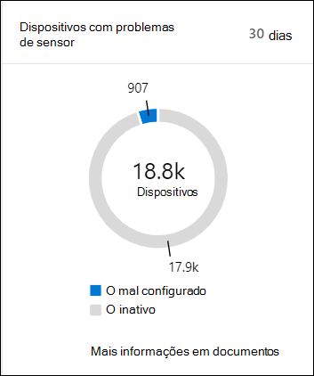

# Verificar o estado de saúde do sensor no Microsoft Defender para Ponto de ExtremidadeCheck sensor health state in Microsoft Defender for Endpoint

[!INCLUDE [Microsoft 365 Defender rebranding](../../includes/microsoft-defender.md)]

**Aplica-se a:****Applies to:**
- [Microsoft Defender para Ponto de ExtremidadeMicrosoft Defender for Endpoint](https://go.microsoft.com/fwlink/p/?linkid=2154037)
- [Microsoft 365 DefenderMicrosoft 365 Defender](https://go.microsoft.com/fwlink/?linkid=2118804)

>Deseja experimentar o Defender para Ponto de Extremidade?Want to experience Defender for Endpoint? [Inscreva-se para uma avaliação gratuita.Sign up for a free trial.](https://www.microsoft.com/microsoft-365/windows/microsoft-defender-atp?ocid=docs-wdatp-checksensor-abovefoldlink)

O **painel Dispositivos com problemas** de sensor é encontrado no painel Operações de Segurança.The **Devices with sensor issues** tile is found on the Security Operations dashboard. Esse tile fornece informações sobre a capacidade do dispositivo individual de fornecer dados do sensor e se comunicar com o serviço Defender para Ponto de Extremidade.This tile provides information on the individual device’s ability to provide sensor data and communicate with the Defender for Endpoint service. Ele relata quantos dispositivos exigem atenção e ajuda você a identificar dispositivos problemáticos e a tomar medidas para corrigir problemas conhecidos.It reports how many devices require attention and helps you identify problematic devices and take action to correct known issues.

Há dois indicadores de status no azulejo que fornecem informações sobre o número de dispositivos que não estão relatando corretamente para o serviço:There are two status indicators on the tile that provide information on the number of devices that are not reporting properly to the service:
- **Configuração incorretamente** - Esses dispositivos podem estar relatando parcialmente dados do sensor para o serviço Defender para Ponto de Extremidade e podem ter erros de configuração que precisam ser corrigidos.**Misconfigured** - These devices might partially be reporting sensor data to the Defender for Endpoint service and might have configuration errors that need to be corrected.
- **Inativos** - Dispositivos que pararam de relatar para o serviço Defender para Ponto de Extremidade por mais de sete dias no mês passado.**Inactive** - Devices that have stopped reporting to the Defender for Endpoint service for more than seven days in the past month.

Clicar em qualquer um dos grupos direciona você para a lista **Dispositivos**, filtrada de acordo com sua escolha.Clicking any of the groups directs you to **Devices list**, filtered according to your choice.

Na **lista Dispositivos,** você pode filtrar a lista de estado de saúde pelo seguinte status:On **Devices list**, you can filter the health state list by the following status:
- **Ativo** - Dispositivos que estão relatando ativamente para o serviço Defender para Ponto de Extremidade.**Active** - Devices that are actively reporting to the Defender for Endpoint service.
- **Configuração incorretamente** - Esses dispositivos podem estar relatando parcialmente dados do sensor para o serviço Defender para Ponto de Extremidade, mas têm erros de configuração que precisam ser corrigidos.**Misconfigured** - These devices might partially be reporting sensor data to the Defender for Endpoint service but have configuration errors that need to be corrected. Dispositivos mal configurados podem ter um ou uma combinação dos seguintes problemas:Misconfigured devices can have either one or a combination of the following issues:
  - **Sem dados do sensor** - Os dispositivos pararam de enviar dados do sensor.**No sensor data** - Devices has stopped sending sensor data. Alertas limitados podem ser disparados do dispositivo.Limited alerts can be triggered from the device.
  - **Comunicações prejudicadas** - A capacidade de se comunicar com o dispositivo está prejudicada.**Impaired communications** - Ability to communicate with device is impaired. O envio de arquivos para análise profunda, bloqueio de arquivos, isolamento do dispositivo da rede e outras ações que exigem comunicação com o dispositivo pode não funcionar.Sending files for deep analysis, blocking files, isolating device from network and other actions that require communication with the device may not work.
- **Inativo -** Dispositivos que pararam de relatar para o serviço Defender para Ponto de Extremidade.**Inactive** - Devices that have stopped reporting to the Defender for Endpoint service.

Você também pode baixar a lista inteira no formato CSV usando o **recurso Exportar.**You can also download the entire list in CSV format using the **Export** feature. Para obter mais informações sobre filtros, [consulte Exibir e organizar a lista Dispositivos](machines-view-overview.md).For more information on filters, see [View and organize the Devices list](machines-view-overview.md).

>[!NOTE]
>Exporte a lista no formato CSV para exibir os dados não filtrados.Export the list in CSV format to display the unfiltered data. O arquivo CSV incluirá todos os dispositivos na organização, independentemente de qualquer filtragem aplicada no próprio exibição e pode levar um tempo significativo para ser baixado, dependendo do tamanho da sua organização.The CSV file will include all devices in the organization, regardless of any filtering applied in the view itself and can take a significant amount of time to download, depending on how large your organization is.

Você pode exibir os detalhes do dispositivo quando clicar em um dispositivo mal configurado ou inativo.You can view the device details when you click on a misconfigured or inactive device.

## Tópicos relacionadosRelated topic
- [Corrigir sensores não salubres no Defender para Ponto de ExtremidadeFix unhealthy sensors in Defender for Endpoint](fix-unhealthy-sensors.md)
