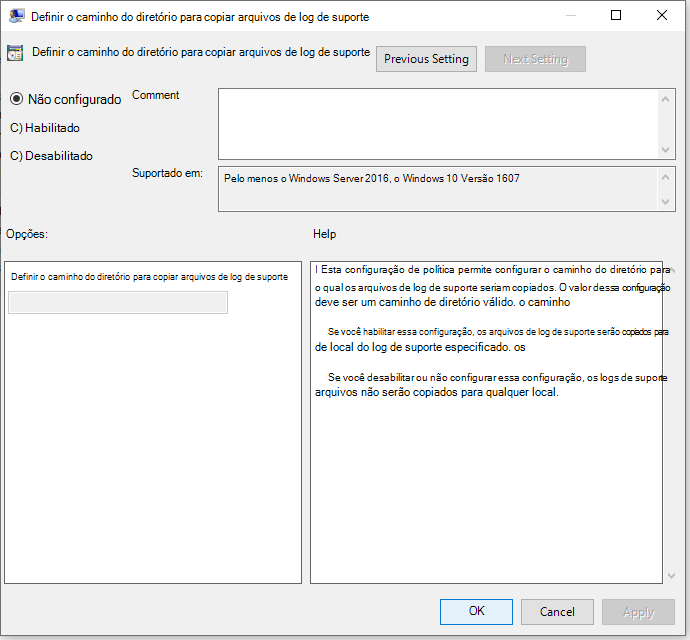
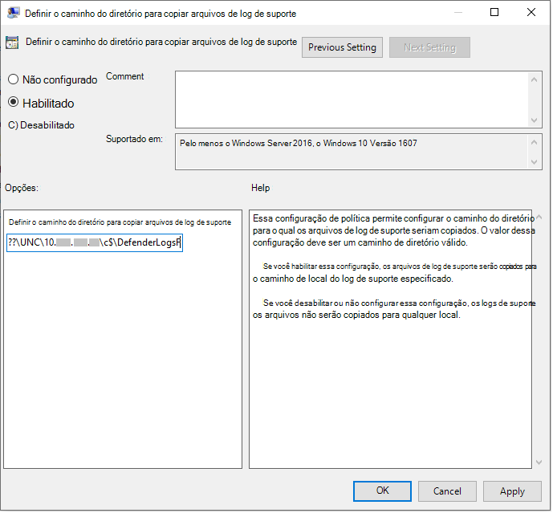

# <a name="collect-microsoft-defender-av-diagnostic-data"></a>Coletar dados de diagnóstico do Microsoft Defender AV

[!INCLUDE [Microsoft 365 Defender rebranding](../../includes/microsoft-defender.md)]


**Aplica-se a:**

- [Microsoft Defender para Ponto de Extremidade](/microsoft-365/security/defender-endpoint/)

Este artigo descreve como coletar dados de diagnóstico que podem ser usados pelas equipes de suporte e engenharia da Microsoft para ajudar a solucionar problemas que você pode encontrar ao usar o Microsoft Defender AV.

> [!NOTE]
> Como parte do processo de investigação ou resposta, você pode coletar um pacote de investigação de um dispositivo. Veja como: Coletar o pacote [de investigação de dispositivos](/windows/security/threat-protection/microsoft-defender-atp/respond-machine-alerts#collect-investigation-package-from-devices).

Em pelo menos dois dispositivos que estão enfrentando o mesmo problema, obtenha o arquivo de diagnóstico .cab, seguindo as seguintes etapas:

1. Abra uma versão no nível de administrador do prompt de comando da seguinte forma:

    a. Abra o menu **Iniciar.**

    b. Digite **cmd**. Clique com o botão direito do mouse **no Prompt de** Comando e clique em Executar como **administrador**.

    c. Insira credenciais de administrador ou aprove o prompt.

2. Navegue até o diretório do Microsoft Defender. Por padrão, é `C:\Program Files\Windows Defender`

> [!NOTE]
> Se você estiver executando uma versão atualizada da [Plataforma do Microsoft Defender,](https://support.microsoft.com/help/4052623/update-for-microsoft-defender-antimalware-platform)execute a `MpCmdRun` partir do seguinte local: `C:\ProgramData\Microsoft\Windows Defender\Platform\<version>` .

3. Digite o seguinte comando e pressione **Enter**  

    ```Dos
    mpcmdrun.exe -GetFiles
    ```
  
4. Um .cab será gerado que contém vários logs de diagnóstico. O local do arquivo será especificado na saída no prompt de comando. Por padrão, o local é `C:\ProgramData\Microsoft\Microsoft Defender\Support\MpSupportFiles.cab` .

> [!NOTE]
> Para redirecionar o arquivo de cab para um caminho diferente ou compartilhamento UNC, use o seguinte comando: `mpcmdrun.exe -GetFiles -SupportLogLocation <path>`  <br/>Para obter mais informações, consulte [Redirecionar dados de diagnóstico para um compartilhamento UNC](#redirect-diagnostic-data-to-a-unc-share).

5. Copie esses .cab para um local que pode ser acessado pelo suporte da Microsoft. Um exemplo pode ser uma pasta de OneDrive protegida por senha que você pode compartilhar conosco.

> [!NOTE]
>Se você tiver um problema com a conformidade de Atualização, envie um email usando o modelo de email de suporte de Conformidade de Atualização <a href="mailto:ucsupport@microsoft.com?subject=WDAV assessment issue&body=I%20am%20encountering%20the%20following%20issue%20when%20using%20Windows%20Defender%20AV%20in%20Update%20Compliance%3a%20%0d%0aI%20have%20provided%20at%20least%202%20support%20.cab%20files%20at%20the%20following%20location%3a%20%3Caccessible%20share%2c%20including%20access%20details%20such%20as%20password%3E%0d%0aMy%20OMS%20workspace%20ID%20is%3a%20%0d%0aPlease%20contact%20me%20at%3a">e</a>preencha o modelo com as seguintes informações:
>```
> I am encountering the following issue when using Microsoft Defender Antivirus in Update Compliance:
> I have provided at least 2 support .cab files at the following location:  
> <accessible share, including access details such as password>
>
>    My OMS workspace ID is:
>
>    Please contact me at:

## <a name="redirect-diagnostic-data-to-a-unc-share"></a>Redirecionar dados de diagnóstico para um compartilhamento UNC
Para coletar dados de diagnóstico em um repositório central, você pode especificar o parâmetro SupportLogLocation.

```Dos
mpcmdrun.exe -GetFiles -SupportLogLocation <path>
```

Copia os dados de diagnóstico para o caminho especificado. Se o caminho não for especificado, os dados de diagnóstico serão copiados para o local especificado na Configuração de Local do Log de Suporte.

Quando o parâmetro SupportLogLocation for usado, uma estrutura de pasta como a seguir será criada no caminho de destino:

```Dos
<path>\<MMDD>\MpSupport-<hostname>-<HHMM>.cab
```

| campo  | Descrição   |
|:----|:----|
| caminho | O caminho conforme especificado na linha de comando ou recuperado da configuração
| MMDD | Mês e dia em que os dados de diagnóstico foram coletados (por exemplo, 0530)
| hostname | O nome do host do dispositivo no qual os dados de diagnóstico foram coletados
| HHMM | Horas e minutos quando os dados de diagnóstico foram coletados (por exemplo, 1422)

> [!NOTE]
> Ao usar um compartilhamento de arquivos, certifique-se de que a conta usada para coletar o pacote de diagnóstico tenha acesso de gravação ao compartilhamento.  

## <a name="specify-location-where-diagnostic-data-is-created"></a>Especificar o local onde os dados de diagnóstico são criados

Você também pode especificar onde o arquivo de .cab de diagnóstico será criado usando um Objeto de Política de Grupo (GPO). 

1. Abra o Editor de Política de Grupo Local e encontre o GPO SupportLogLocation em: `HKEY_LOCAL_MACHINE\SOFTWARE\Policies\Microsoft\Windows Defender\SupportLogLocation`
   
1. Selecione **Definir o caminho do diretório para copiar arquivos de log de suporte.**

      
        
       
3. Dentro do editor de política, selecione **Habilitado**.
       
4. Especifique o caminho do diretório onde você deseja copiar os arquivos de log de suporte no **campo Opções.**
      
5. Selecione **OK** ou **Aplicar**.

## <a name="see-also"></a>Confira também

- [Solucionar problemas Microsoft Defender Antivírus relatórios](troubleshoot-reporting.md)