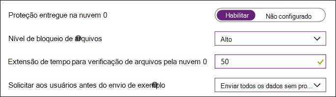

# Ativar o bloqueio à primeira vistaTurn on block at first sight

[!INCLUDE [Microsoft 365 Defender rebranding](../../includes/microsoft-defender.md)]

**Aplica-se a:****Applies to:**

- [Microsoft Defender para Ponto de ExtremidadeMicrosoft Defender for Endpoint](/microsoft-365/security/defender-endpoint/)

Este artigo descreve um recurso antivírus/antimalware conhecido como "bloquear à primeira vista" e descreve como habilitar o bloqueio à primeira vista para sua organização.This article describes an antivirus/antimalware feature known as "block at first sight", and describes how to enable block at first sight for your organization. 

> [!TIP]
> Este artigo destina-se a administradores corporativos e profissionais de IT que gerenciam configurações de segurança para organizações.This article is intended for enterprise admins and IT Pros who manage security settings for organizations. Se você não for um administrador enteprise ou profissional de TI, mas tiver dúvidas sobre bloquear à primeira vista, consulte [Not an enterprise admin or IT Pro?](#not-an-enterprise-admin-or-it-pro).If you are not an enteprise admin or IT Pro but you have questions about block at first sight, see [Not an enterprise admin or IT Pro?](#not-an-enterprise-admin-or-it-pro).

## O que é "bloquear à primeira vista"?What is "block at first sight"?

Bloquear à primeira vista é um recurso de proteção contra ameaças da proteção de próxima geração que detecta o novo malware e o bloqueia em segundos.Block at first sight is a threat protection feature of next-generation protection that detects new malware and blocks it within seconds. O bloqueio à primeira vista é habilitado quando determinadas configurações de segurança estão habilitadas.Block at first sight is enabled when certain security settings are enabled. Essas configurações incluem:These settings include:

- Proteção entregue na nuvem;Cloud-delivered protection; 
- Um tempo de tempo de envio de amostra especificado (como 50 segundos); eA specified sample submission timeout (such as 50 seconds); and 
- Um nível de bloqueio de arquivo alto.A file-blocking level of high. 

Na maioria das organizações corporativas, as configurações necessárias para habilitar o bloqueio à primeira vista são configuradas com implantações do Microsoft Defender Antivírus.In most enterprise organizations, the settings needed to enable block at first sight are configured with Microsoft Defender Antivirus deployments. 

## Como funcionaHow it works

Quando o Microsoft Defender Antivírus encontra um arquivo suspeito, mas não detectado, ele consulta nosso back-end de proteção de nuvem.When Microsoft Defender Antivirus encounters a suspicious but undetected file, it queries our cloud protection backend. O back-back da nuvem aplica heurística, aprendizado de máquina e análise automatizada do arquivo para determinar se os arquivos são mal-intencionados ou não uma ameaça.The cloud backend applies heuristics, machine learning, and automated analysis of the file to determine whether the files are malicious or not a threat.

O Microsoft Defender Antivírus usa várias tecnologias de detecção e prevenção para oferecer proteção precisa, inteligente e em tempo real.Microsoft Defender Antivirus uses multiple detection and prevention technologies to deliver accurate, intelligent, and real-time protection. 

  

> [!TIP]
> Para saber mais, confira este blog: Conheça as tecnologias avançadas no núcleo do [Microsoft Defender para Endpoint de proteção de próxima geração.](https://www.microsoft.com/security/blog/2019/06/24/inside-out-get-to-know-the-advanced-technologies-at-the-core-of-microsoft-defender-atp-next-generation-protection/)To learn more, see this blog: [Get to know the advanced technologies at the core of Microsoft Defender for Endpoint next-generation protection](https://www.microsoft.com/security/blog/2019/06/24/inside-out-get-to-know-the-advanced-technologies-at-the-core-of-microsoft-defender-atp-next-generation-protection/).

## Algumas coisas a saber sobre bloqueio à primeira vistaA few things to know about block at first sight

- No Windows 10, versão 1803 ou posterior, o bloqueio à primeira vista pode bloquear arquivos executáveis não portáteis (como JS, VBS ou macros) e arquivos executáveis.In Windows 10, version 1803 or later, block at first sight can block non-portable executable files (such as JS, VBS, or macros) and executable files.

- O bloqueio à primeira vista usa apenas o back-end de proteção de nuvem para arquivos executáveis e arquivos executáveis não portáteis baixados da Internet ou que se originam da zona da Internet.Block at first sight only uses the cloud protection backend for executable files and non-portable executable files that are downloaded from the Internet, or that originate from the Internet zone. Um valor de hash do arquivo .exe é verificado por meio do back-end da nuvem para determinar se o arquivo é um arquivo não detectado anteriormente.A hash value of the .exe file is checked via the cloud backend to determine if the file is a previously undetected file.

- Se o back-back da nuvem não puder fazer uma determinação, o Microsoft Defender Antivírus bloqueia o arquivo e carrega uma cópia na nuvem.If the cloud backend is unable to make a determination, Microsoft Defender Antivirus locks the file and uploads a copy to the cloud. A nuvem executa mais análises para alcançar uma determinação antes de permitir que o arquivo seja executado ou o bloqueia em todos os futuros encontros, dependendo de determinar se o arquivo é mal-intencionado ou não uma ameaça.The cloud performs more analysis to reach a determination before it either allows the file to run or blocks it in all future encounters, depending on whether it determines the file to be malicious or not a threat.

- Em muitos casos, esse processo pode reduzir o tempo de resposta para o novo malware de horas para segundos.In many cases, this process can reduce the response time for new malware from hours to seconds.

- Você pode [especificar por quanto tempo um arquivo deve ser](configure-cloud-block-timeout-period-microsoft-defender-antivirus.md) impedido de ser executado enquanto o serviço de proteção baseado em nuvem analisa o arquivo.You can [specify how long a file should be prevented from running](configure-cloud-block-timeout-period-microsoft-defender-antivirus.md) while the cloud-based protection service analyzes the file. E, você pode [personalizar a mensagem exibida nos desktops dos](/windows/security/threat-protection//windows-defender-security-center/wdsc-customize-contact-information.md) usuários quando um arquivo é bloqueado.And, you can [customize the message displayed on users' desktops](/windows/security/threat-protection//windows-defender-security-center/wdsc-customize-contact-information.md) when a file is blocked. Você pode alterar o nome da empresa, as informações de contato e a URL da mensagem.You can change the company name, contact information, and message URL.

## Ativar bloqueio à primeira vista com o Microsoft IntuneTurn on block at first sight with Microsoft Intune

> [!TIP]
> O Microsoft Intune agora faz parte do Microsoft Endpoint Manager.Microsoft Intune is now part of Microsoft Endpoint Manager.

1. No Centro de administração do Microsoft Endpoint Manager ( ), navegue até [https://endpoint.microsoft.com](https://endpoint.microsoft.com) **Perfis**  >  **de Configuração de Dispositivos.**In the Microsoft Endpoint Manager admin center ([https://endpoint.microsoft.com](https://endpoint.microsoft.com)), navigate to **Devices** > **Configuration profiles**.

2. Selecione ou crie um perfil usando o tipo **de perfil restrições** de dispositivo.Select or create a profile using the **Device restrictions** profile type.

3. Nas **configurações do** perfil restrições de dispositivo, de definir ou confirmar as seguintes configurações em **Microsoft Defender Antivírus**:In the **Configuration settings** for the Device restrictions profile, set or confirm the following settings under **Microsoft Defender Antivirus**:

   - **Proteção entregue na nuvem**: Habilitada**Cloud-delivered protection**: Enabled
   - **Nível de bloqueio de arquivos**: alto**File Blocking Level**: High
   - **Extensão de tempo para verificação de arquivos pela nuvem**: 50**Time extension for file scanning by the cloud**: 50
   - **Solicitar aos usuários antes do envio de exemplo**: Enviar todos os dados sem solicitar**Prompt users before sample submission**: Send all data without prompting

   

4. Salve suas configurações.Save your settings.

> [!TIP]
> - Definir o nível de bloqueio de arquivo **como Alto** aplica um nível forte de detecção.Setting the file blocking level to **High** applies a strong level of detection. No caso improvável de que o bloqueio de arquivos cause uma detecção de falsos positivos de arquivos legítimos, sua equipe de operações de segurança [poderá restaurar arquivos em quarentena.](./restore-quarantined-files-microsoft-defender-antivirus.md)In the unlikely event that file blocking causes a false positive detection of legitimate files, your security operations team can [restore quarantined files](./restore-quarantined-files-microsoft-defender-antivirus.md).
> - Para obter mais informações sobre como configurar restrições de dispositivo do Microsoft Defender Antivírus no Intune, consulte [Configure device restriction settings in Microsoft Intune](/intune/device-restrictions-configure).For more information about configuring Microsoft Defender Antivirus device restrictions in Intune, see [Configure device restriction settings in Microsoft Intune](/intune/device-restrictions-configure).
> - Para ver uma lista de restrições de dispositivo do Microsoft Defender Antivírus no Intune, consulte Restrição de dispositivo para configurações do [Windows 10 (e mais novas) no Intune](/intune/device-restrictions-windows-10#microsoft-defender-antivirus).For a list of Microsoft Defender Antivirus device restrictions in Intune, see [Device restriction for Windows 10 (and newer) settings in Intune](/intune/device-restrictions-windows-10#microsoft-defender-antivirus).

## Ativar o bloqueio à primeira vista com o Microsoft Endpoint ManagerTurn on block at first sight with Microsoft Endpoint Manager

> [!TIP]
> Se você estiver procurando o Microsoft Endpoint Configuration Manager, ele agora faz parte do Microsoft Endpoint Manager.If you're looking for Microsoft Endpoint Configuration Manager, it's now part of Microsoft Endpoint Manager.

1. No Microsoft Endpoint Manager ( [https://endpoint.microsoft.com](https://endpoint.microsoft.com) ), acesse **Endpoint security**  >  **Antivírus**.In Microsoft Endpoint Manager ([https://endpoint.microsoft.com](https://endpoint.microsoft.com)), go to **Endpoint security** > **Antivirus**.

2. Selecione uma política existente ou crie uma nova política usando o tipo de **perfil do Microsoft Defender Antivírus.**Select an existing policy, or create a new policy using the **Microsoft Defender Antivirus** profile type.

3. De definir ou confirmar as seguintes configurações:Set or confirm the following configuration settings:

   - **Ativar a proteção entregue na nuvem**: Sim**Turn on cloud-delivered protection**: Yes
   - **Nível de proteção entregue na nuvem**: Alto**Cloud-delivered protection level**: High
   - **Tempo de tempo estendido da** nuvem do Defender em segundos : 50**Defender Cloud Extended Timeout in Seconds**: 50

   :::image type="content" source="images/endpointmgr-antivirus-cloudprotection.png" alt-text="Bloquear as configurações à primeira vista no Endpoint Manager":::

4. Aplique o perfil do Microsoft Defender Antivírus a um grupo, como **Todos** os usuários , **Todos** os dispositivos ou **Todos os usuários e dispositivos**.Apply the Microsoft Defender Antivirus profile to a group, such as **All users**, **All devices**, or **All users and devices**.

## Ativar o bloqueio à primeira vista com a Política de GrupoTurn on block at first sight with Group Policy

> [!NOTE]
> Recomendamos usar o Intune ou o Microsoft Endpoint Manager para ativar o bloqueio à primeira vista.We recommend using Intune or Microsoft Endpoint Manager to turn on block at first sight. 

1. No computador de gerenciamento de Política de Grupo, abra o Console de Gerenciamento de Política de [Grupo](/previous-versions/windows/it-pro/windows-server-2008-R2-and-2008/cc731212(v=ws.11)), clique com o botão direito do mouse no Objeto de Política de Grupo que você deseja configurar e selecione **Editar**.On your Group Policy management computer, open the [Group Policy Management Console](/previous-versions/windows/it-pro/windows-server-2008-R2-and-2008/cc731212(v=ws.11)), right-click the Group Policy Object you want to configure and select **Edit**. 

2. Usando o **Editor de Gerenciamento de Política de Grupo,** acesse **Configuração** do computador  >  **Modelos administrativos**  >  **Componentes do Windows** Microsoft Defender  >    >  **Antivírus MAPS**.Using the **Group Policy Management Editor** go to **Computer configuration** > **Administrative templates** > **Windows Components** > **Microsoft Defender Antivirus** > **MAPS**. 

3. Na seção MAPAs, clique duas vezes em Configurar o recurso **"Bloquear** à Primeira Vista", des configurá-lo como Habilitado **e** selecione **OK**.In the MAPS section, double-click **Configure the 'Block at First Sight' feature**, and set it to **Enabled**, and then select **OK**.

    > [!IMPORTANT]
    > A **configuração como Sempre prompt (0)** diminuirá o estado de proteção do dispositivo.Setting to **Always prompt (0)** will lower the protection state of the device. Definir como **Nunca enviar (2)** significa que o bloqueio à primeira vista não funcionará.Setting to **Never send (2)** means block at first sight will not function.

4. Na seção MAPAs, clique duas vezes em **Enviar amostras** de arquivo quando outra análise for necessária e desdeixá-la **como Habilitado**.In the MAPS section, double-click **Send file samples when further analysis is required**, and set it to **Enabled**. Em **Enviar amostras de arquivo quando uma análise** posterior for necessária, selecione Enviar todos os **exemplos** e selecione **OK**.Under **Send file samples when further analysis is required**, select **Send all samples**, and then select **OK**.

5. Reimplante seu Objeto de Política de Grupo em sua rede como normalmente faz.Redeploy your Group Policy Object across your network as you usually do.

## Confirmar que o bloqueio à primeira vista está habilitado em dispositivos cliente individuaisConfirm block at first sight is enabled on individual client devices

Você pode confirmar que o bloqueio à primeira vista está habilitado em dispositivos cliente individuais usando o aplicativo segurança do Windows.You can confirm that block at first sight is enabled on individual client devices using the Windows Security app. O bloqueio à primeira vista é  habilitado automaticamente, desde que a proteção entregue na nuvem e o envio **automático** de exemplo sejam ativados.Block at first sight is automatically enabled as long as **Cloud-delivered protection** and **Automatic sample submission** are both turned on.

1. Abra o aplicativo segurança do Windows.Open the Windows Security app.

2. Selecione **Proteção contra &** contra vírus e, em Configurações de proteção contra & vírus, selecione Gerenciar **Configurações**. Select **Virus & threat protection**, and then, under **Virus & threat protection settings**, select **Manage Settings**.

   

3. Confirme se **a proteção entregue na nuvem** e o envio **automático** de exemplo estão ambos a ligado.Confirm that **Cloud-delivered protection** and **Automatic sample submission** are both turned on.

> [!NOTE]
> - Se as configurações de pré-requisitos são configuradas e implantadas usando a Política de Grupo, as configurações descritas nesta seção serão acinzenadas e indisponíveis para uso em pontos de extremidade individuais.If the prerequisite settings are configured and deployed using Group Policy, the settings described in this section will be greyed-out and unavailable for use on individual endpoints. 
> - As alterações feitas por meio de um Objeto de Política de Grupo devem primeiro ser implantadas em pontos de extremidade individuais antes que a configuração seja atualizada nas Configurações do Windows.Changes made through a Group Policy Object must first be deployed to individual endpoints before the setting will be updated in Windows Settings.

## Validar bloco à primeira vista está funcionandoValidate block at first sight is working

Para validar se o recurso está funcionando, siga as orientações em Validar conexões [entre sua rede e a nuvem](configure-network-connections-microsoft-defender-antivirus.md#validate-connections-between-your-network-and-the-cloud).To validate that the feature is working, follow the guidance in [Validate connections between your network and the cloud](configure-network-connections-microsoft-defender-antivirus.md#validate-connections-between-your-network-and-the-cloud).

## Desativar o bloco à primeira vistaTurn off block at first sight

> [!CAUTION]
> Desligar o bloco à primeira vista diminuirá o estado de proteção de seus dispositivos e de sua rede.Turning off block at first sight will lower the protection state of your device(s) and your network.

Você pode optar por desabilitar o bloqueio à primeira vista se quiser manter as configurações de pré-requisito sem realmente usar a proteção de bloqueio à primeira vista.You might choose to disable block at first sight if you want to retain the prerequisite settings without actually using block at first sight protection. Você pode desativar temporariamente o bloqueio à primeira vista para ver como esse recurso afeta sua rede.You might temporarily turn block at first sight off to see how this feature affects your network. No entanto, não recomendamos desabilitar o bloco à primeira vista permanentemente.However, we do not recommend disabling block at first sight protection permanently.

### Desativar o bloco à primeira vista com o Microsoft Endpoint ManagerTurn off block at first sight with Microsoft Endpoint Manager

1. Vá para o Centro de administração do Microsoft Endpoint Manager ( [https://endpoint.microsoft.com](https://endpoint.microsoft.com) ) e entre.Go to Microsoft Endpoint Manager admin center ([https://endpoint.microsoft.com](https://endpoint.microsoft.com)) and sign in.

2. Vá para **o Antivírus de segurança** do ponto de extremidade e selecione sua política do Microsoft Defender  >  Antivírus.Go to **Endpoint security** > **Antivirus**, and then select your Microsoft Defender Antivirus policy.

3. Em **Gerenciar**, escolha **Propriedades**.Under **Manage**, choose **Properties**.

4. Ao lado **das configurações,** escolha **Editar**.Next to **Configuration settings**, choose **Edit**.

5. Altere uma ou mais das seguintes configurações:Change one or more of the following settings:

   - Definir **Ativar a proteção entregue na nuvem** como **Não** ou **Não configurado.**Set **Turn on cloud-delivered protection** to **No** or **Not configured**.
   - Definir **o nível de proteção entregue na nuvem** como Não **configurado**.Set **Cloud-delivered protection level** to **Not configured**.
   - Desacordo a caixa de seleção **para o Tempo Decoro** Estendido da Nuvem do Defender em Segundos.Clear the check box for **Defender Cloud Extended Timeout In Seconds**.

6. Revise e salve suas configurações.Review and save your settings.

### Desativar o bloco à primeira vista com a Política de GrupoTurn off block at first sight with Group Policy

1. No computador de gerenciamento de Política de Grupo, abra o Console de Gerenciamento de Política de [Grupo](/previous-versions/windows/it-pro/windows-server-2008-R2-and-2008/cc731212(v=ws.11)), clique com o botão direito do mouse no Objeto de Política de Grupo que você deseja configurar e selecione **Editar**.On your Group Policy management computer, open the [Group Policy Management Console](/previous-versions/windows/it-pro/windows-server-2008-R2-and-2008/cc731212(v=ws.11)), right-click the Group Policy Object you want to configure, and then select **Edit**.

2. Usando o **Editor de Gerenciamento de Política de Grupo,** acesse **Configuração do** computador e selecione Modelos **administrativos**.Using the **Group Policy Management Editor** go to **Computer configuration** and select **Administrative templates**.

3. Expanda a árvore por meio **de componentes do Windows** Microsoft Defender  >    >  **Antivírus MAPS**.Expand the tree through **Windows components** > **Microsoft Defender Antivirus** > **MAPS**.

4. Clique duas vezes **em Configurar o recurso "Bloquear à Primeira Vista"** e de definir a opção como **Desabilitada**.Double-click **Configure the 'Block at First Sight' feature** and set the option to **Disabled**.

    > [!NOTE]
    > Desabilitar o bloco à primeira vista não desabilita ou altera as políticas de grupo de pré-requisitos.Disabling block at first sight does not disable or alter the prerequisite group policies.

## Não é um administrador empresarial ou um profissional de IT?Not an enterprise admin or IT Pro?

Se você não for um administrador corporativo ou profissional de TI, mas tiver dúvidas sobre bloquear à primeira vista, esta seção será para você.If you are not an enterprise admin or IT Pro, but you have questions about block at first sight, this section is for you. Bloquear à primeira vista é um recurso de proteção contra ameaças que detecta e bloqueia malware em segundos.Block at first sight is a threat protection feature that detects and blocks malware within seconds. Embora não haja uma configuração específica chamada "Bloquear à primeira vista", o recurso é habilitado quando determinadas configurações são configuradas em seu dispositivo.Although there isn't a specific setting called "Block at first sight," the feature is enabled when certain settings are configured on your device.

### Como gerenciar o bloqueio à primeira vista em seu próprio dispositivoHow to manage block at first sight on or off on your own device

Se você tiver um dispositivo pessoal que não seja gerenciado por uma organização, você pode estar se perguntando como ativar ou desativar o bloqueio à primeira vista.If you have a personal device that is not managed by an organization, you might be wondering how to turn block at first sight on or off. Você pode usar o aplicativo segurança do Windows para gerenciar o bloqueio à primeira vista.You can use the Windows Security app to manage block at first sight.

1. No computador com Windows 10, abra o aplicativo segurança do Windows.On your Windows 10 computer, open the Windows Security app.

2. Selecione **Proteção contra & contra ameaças.**Select **Virus & threat protection**.

3. Em **Configurações & proteção contra vírus,** selecione **Gerenciar configurações**.Under **Virus & threat protection settings**, select **Manage settings**.

4. Siga uma destas etapas:Take one of the following steps:

   - Para habilitar o bloqueio à primeira vista, **certifique-se** de que a proteção entregue na nuvem e o envio **automático** de exemplo estão ativados.To enable block at first sight, make sure that both **Cloud-delivered protection** and **Automatic sample submission** are both turned on.

   - Para desabilitar o bloqueio à primeira vista, desative a **proteção entregue na nuvem** ou **o envio automático de amostra.**To disable block at first sight, turn off **Cloud-delivered protection** or **Automatic sample submission**.  
    
     > [!CAUTION]
     > Desligar o bloco à primeira vista reduz o nível de proteção do dispositivo.Turning off block at first sight lowers the level of protection for your device. Não é recomendável desabilitar permanentemente o bloco à primeira vista.We do not recommend permanently disabling block at first sight. 

## Confira tambémSee also

- [Microsoft Defender Antivírus no Windows 10Microsoft Defender Antivirus in Windows 10](microsoft-defender-antivirus-in-windows-10.md)
- [Habilitar a proteção entregue na nuvemEnable cloud-delivered protection](enable-cloud-protection-microsoft-defender-antivirus.md)
- [Mantenha-se protegido com o Windows SecurityStay protected with Windows Security](https://support.microsoft.com/windows/stay-protected-with-windows-security-2ae0363d-0ada-c064-8b56-6a39afb6a963)