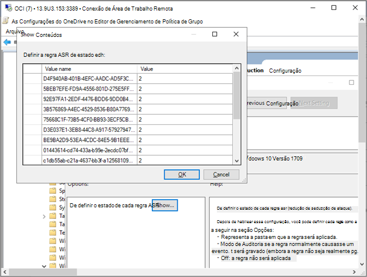

# Integração Windows 10 usando a Política de GrupoOnboard Windows 10 devices using Group Policy 

[!INCLUDE [Microsoft 365 Defender rebranding](../../includes/microsoft-defender.md)]

**Aplica-se a:****Applies to:**

- Política de GrupoGroup Policy
- [Microsoft Defender para Ponto de ExtremidadeMicrosoft Defender for Endpoint](https://go.microsoft.com/fwlink/p/?linkid=2154037)
- [Microsoft 365 DefenderMicrosoft 365 Defender](https://go.microsoft.com/fwlink/?linkid=2118804)

>Deseja experimentar o Defender para Ponto de Extremidade?Want to experience Defender for Endpoint? [Inscreva-se para uma avaliação gratuita.Sign up for a free trial.](https://www.microsoft.com/microsoft-365/windows/microsoft-defender-atp?ocid=docs-wdatp-configureendpointsgp-abovefoldlink)

> [!NOTE]
> Para usar atualizações de Política de Grupo (GP) para implantar o pacote, você deve estar Windows Server 2008 R2 ou posterior.To use Group Policy (GP) updates to deploy the package, you must be on Windows Server 2008 R2 or later.
> 
> Para o Windows Server 2019, talvez seja necessário substituir o NT AUTHORITY\Well-Known-System-Account por NT AUTHORITY\SYSTEM do arquivo XML que a preferência de Política de Grupo cria.For Windows Server 2019, you may need to replace NT AUTHORITY\Well-Known-System-Account with NT AUTHORITY\SYSTEM of the XML file that the Group Policy preference creates.

## Dispositivos integrados usando Política de GrupoOnboard devices using Group Policy

Confira o [PDF](https://github.com/MicrosoftDocs/microsoft-365-docs/raw/public/microsoft-365/security/defender-endpoint/downloads/mdatp-deployment-strategy.pdf) ou [Visio](https://github.com/MicrosoftDocs/microsoft-365-docs/raw/public/microsoft-365/security/defender-endpoint/downloads/mdatp-deployment-strategy.vsdx) para ver os vários caminhos na implantação do Defender para o Ponto de Extremidade.Check out the [PDF](https://github.com/MicrosoftDocs/microsoft-365-docs/raw/public/microsoft-365/security/defender-endpoint/downloads/mdatp-deployment-strategy.pdf)  or  [Visio](https://github.com/MicrosoftDocs/microsoft-365-docs/raw/public/microsoft-365/security/defender-endpoint/downloads/mdatp-deployment-strategy.vsdx) to see the various paths in deploying Defender for Endpoint. 

1. Abra o arquivo de pacote de configuração da GP .zip (*WindowsDefenderATPOnboardingPackage.zip*) que você baixou do assistente de integração do serviço.Open the GP configuration package .zip file (*WindowsDefenderATPOnboardingPackage.zip*) that you downloaded from the service onboarding wizard. Você também pode obter o pacote de [Central de Segurança do Microsoft Defender](https://securitycenter.windows.com/):You can also get the package from [Microsoft Defender Security Center](https://securitycenter.windows.com/):
 
    1. No painel de navegação, selecione **Configurações**  >  **Integração**.In the navigation pane, select **Settings** > **Onboarding**.

    1. Selecione Windows 10 como o sistema operacional.Select Windows 10 as the operating system.
    
    1. No campo **Método de implantação,** selecione **Política de grupo**.In the **Deployment method** field, select **Group policy**.
    
    1. Clique **em Baixar pacote** e salve o .zip arquivo.Click **Download package** and save the .zip file.

2. Extraia o conteúdo do arquivo .zip para um local compartilhado somente leitura que pode ser acessado pelo dispositivo.Extract the contents of the .zip file to a shared, read-only location that can be accessed by the device. Você deve ter uma pasta chamada *OptionalParamsPolicy* e o *arquivo WindowsDefenderATPOnboardingScript.cmd*.You should have a folder called *OptionalParamsPolicy* and the file *WindowsDefenderATPOnboardingScript.cmd*.

3. Abra o [Console de Gerenciamento de Política](/internet-explorer/ie11-deploy-guide/group-policy-and-group-policy-mgmt-console-ie11) de Grupo (GPMC), clique com o botão direito do mouse no Objeto de Política de Grupo (GPO) que você deseja configurar e clique em **Editar**.Open the [Group Policy Management Console](/internet-explorer/ie11-deploy-guide/group-policy-and-group-policy-mgmt-console-ie11) (GPMC), right-click the Group Policy Object (GPO) you want to configure and click **Edit**.

4. No Editor **de Gerenciamento de Política de Grupo,** vá para **Configuração** do computador, **Preferências** e configurações **do painel de controle.**In the **Group Policy Management Editor**, go to **Computer configuration**, then **Preferences**, and then **Control panel settings**.

5. Clique com o botão direito do mouse em **Tarefas Agendadas,** aponte para **Novo** e clique em Tarefa Imediata (Pelo menos **Windows 7)**.Right-click **Scheduled tasks**, point to **New**, and then click **Immediate Task (At least Windows 7)**.

6. Na janela **Tarefa** aberta, vá para a **guia** Geral. Em **Opções de segurança,** **clique em Alterar Usuário ou Grupo** e digite SISTEMA e clique em Verificar **Nomes,** em **seguida, OK**.In the **Task** window that opens, go to the **General** tab. Under **Security options** click **Change User or Group** and type SYSTEM and then click **Check Names** then **OK**. NT AUTHORITY\SYSTEM aparece como a conta de usuário que a tarefa executará como.NT AUTHORITY\SYSTEM appears as the user account the task will run as.

7. Selecione **Executar se o usuário está conectado ou não** e marque a caixa de seleção Executar com privilégios **mais** altos.Select **Run whether user is logged on or not** and check the **Run with highest privileges** check box.

8. Vá até a guia **Ações** e clique em **Novo...** Verifique se **Iniciar um programa** está selecionado no **campo** Ação.Go to the **Actions** tab and click **New...** Ensure that **Start a program** is selected in the **Action** field. Insira o nome do arquivo e o local do *arquivo WindowsDefenderATPOnboardingScript.cmd* compartilhado.Enter the file name and location of the shared *WindowsDefenderATPOnboardingScript.cmd* file.

9. Clique **em OK** e feche as janelas do GPMC abertas.Click **OK** and close any open GPMC windows.

>[!TIP]
> Após a integração do dispositivo, você pode optar por executar um teste de detecção para verificar se o dispositivo está corretamente conectado ao serviço.After onboarding the device, you can choose to run a detection test to verify that the device is properly onboarded to the service. Para obter mais informações, [consulte Execute a detection test on a newly onboarded Defender for Endpoint device](run-detection-test.md).For more information, see [Run a detection test on a newly onboarded Defender for Endpoint device](run-detection-test.md).

## Configurações adicionais do Defender para Ponto de ExtremidadeAdditional Defender for Endpoint configuration settings
Para cada dispositivo, você pode determinar se amostras podem ser coletadas do dispositivo quando uma solicitação é feita por meio Central de Segurança do Microsoft Defender enviar um arquivo para análise profunda.For each device, you can state whether samples can be collected from the device when a request is made through Microsoft Defender Security Center to submit a file for deep analysis.

Você pode usar a Política de Grupo (GP) para definir configurações, como configurações para o compartilhamento de exemplo usado no recurso de análise profunda.You can use Group Policy (GP) to configure settings, such as settings for the sample sharing used in the deep analysis feature.

### Configurar configurações de coleção de exemplosConfigure sample collection settings
1.  Em seu dispositivo de gerenciamento de GP, copie os seguintes arquivos do pacote de configuração:On your GP management device, copy the following files from the configuration package:

    - Copie _AtpConfiguration.admx_ em _C: \\ Windows \\ PolicyDefinitions_Copy _AtpConfiguration.admx_ into _C:\\Windows\\PolicyDefinitions_

    - Copiar _AtpConfiguration.adml_ em _C: \\ Windows \\ PolicyDefinitions \\ en-US_Copy _AtpConfiguration.adml_ into _C:\\Windows\\PolicyDefinitions\\en-US_

    Se você estiver usando um Armazenamento Central para Modelos [Administrativos](https://support.microsoft.com/help/3087759/how-to-create-and-manage-the-central-store-for-group-policy-administra)de Política de Grupo, copie os seguintes arquivos do pacote de configuração:If you are using a [Central Store for Group Policy Administrative Templates](https://support.microsoft.com/help/3087759/how-to-create-and-manage-the-central-store-for-group-policy-administra), copy the following files from the configuration package:
    
    - Copiar _AtpConfiguration.admx_ em _\\ \\ \<forest.root\> \\ Políticas SysVol \\ \<forest.root\> \\ \\ PolicyDefinitions_Copy _AtpConfiguration.admx_ into _\\\\\<forest.root\>\\SysVol\\\<forest.root\>\\Policies\\PolicyDefinitions_

    - Copiar _AtpConfiguration.adml_ em _\\ \\ \<forest.root\> \\ Políticas SysVol \\ \<forest.root\> \\ \\ PolicyDefinitions \\ en-US_Copy _AtpConfiguration.adml_ into _\\\\\<forest.root\>\\SysVol\\\<forest.root\>\\Policies\\PolicyDefinitions\\en-US_

2.  Abra o [Console de Gerenciamento de Política de Grupo](/internet-explorer/ie11-deploy-guide/group-policy-and-group-policy-mgmt-console-ie11), clique com o botão direito do mouse no GPO que você deseja configurar e clique em **Editar**.Open the [Group Policy Management Console](/internet-explorer/ie11-deploy-guide/group-policy-and-group-policy-mgmt-console-ie11), right-click the GPO you want to configure and click **Edit**.

3.  No Editor **de Gerenciamento de Política de Grupo,** acesse **Configuração do computador**.In the **Group Policy Management Editor**, go to **Computer configuration**.

4.  Clique **em Políticas** e, em **seguida, modelos administrativos.**Click **Policies**, then **Administrative templates**.

5.  Clique **Windows componentes e,** **em seguida, Windows Defender SmartScreen**.Click **Windows components** and then **Windows Defender SmartScreen**.

6.  Escolha habilitar ou desabilitar o compartilhamento de exemplo de seus dispositivos.Choose to enable or disable sample sharing from your devices.

>[!NOTE]
> Se você não definir um valor, o valor padrão será habilitar a coleção de exemplos.If you don't set a value, the default value is to enable sample collection.

## Outras configurações recomendadasOther recommended configuration settings

### Atualizar a configuração de proteção do ponto de extremidadeUpdate endpoint protection configuration

Depois de configurar o script de integração, continue editando a mesma política de grupo para adicionar configurações de proteção de ponto de extremidade.After configuring the onboarding script, continue editing the same group policy to add endpoint protection configurations. Execute as edições de política de grupo de um sistema que Windows 10 ou o Server 2019 para garantir que você tenha todos os recursos de Microsoft Defender Antivírus necessários.Perform group policy edits from a system running Windows 10 or Server 2019 to ensure you have all of the required Microsoft Defender Antivirus capabilities. Talvez seja necessário fechar e reabrir o objeto de política de grupo para registrar as configurações do Defender ATP.You may need to close and reopen the group policy object to register the Defender ATP configuration settings.

Todas as políticas estão localizadas em `Computer Configuration\Policies\Administrative Templates` .All policies are located under `Computer Configuration\Policies\Administrative Templates`.

**Local da política:** \Windows Components\Windows Defender ATP**Policy location:** \Windows Components\Windows Defender ATP

PolíticaPolicy | SettingSetting 
:---|:---
Enable\Disable Sample collectionEnable\Disable Sample collection|   Habilitado - verificado "Habilitar coleta de exemplo em máquinas"Enabled - "Enable sample collection on machines" checked

 

**Local da política:** \Windows Components\Microsoft Defender Antivírus**Policy location:**  \Windows Components\Microsoft Defender Antivirus

PolíticaPolicy | SettingSetting 
:---|:---
Configurar a detecção para aplicativos potencialmente indesejadosConfigure detection for potentially unwanted applications | Habilitado, BloqueadoEnabled, Block

 

**Local da política:** \Windows Components\Microsoft Defender Antivírus\MAPS**Policy location:** \Windows Components\Microsoft Defender Antivirus\MAPS

PolíticaPolicy | SettingSetting 
:---|:---
Ingressar no Microsoft MAPSJoin Microsoft MAPS | MAPAs avançados e habilitadosEnabled, Advanced MAPS
Enviar amostras de arquivo quando uma análise posterior for necessáriaSend file samples when further analysis is required | Habilitado, Enviar amostras segurasEnabled, Send safe samples

 

**Local da política:** \Windows Components\Microsoft Defender Antivírus\Proteção em tempo real**Policy location:** \Windows Components\Microsoft Defender Antivirus\Real-time Protection

PolíticaPolicy | SettingSetting 
:---|:---
Desativar a proteção em tempo realTurn off real-time protection|DesabilitadoDisabled
Ativar o monitoramento de comportamentoTurn on behavior monitoring|HabilitadoEnabled
Examinar todos os arquivos e anexos baixadosScan all downloaded files and attachments|HabilitadoEnabled
Monitorar atividades de arquivo e programa em seu computadorMonitor file and program activity on your computer|HabilitadoEnabled

 

**Local da política:** \Windows Components\Microsoft Defender Antivírus\Scan**Policy location:**  \Windows Components\Microsoft Defender Antivirus\Scan

Essas configurações configuram verificações periódicas do ponto de extremidade.These settings configure periodic scans of the endpoint. Recomendamos a realização de uma verificação rápida semanal, permitindo desempenho.We recommend performing a weekly quick scan, performance permitting.

PolíticaPolicy | SettingSetting 
:---|:---
Verifique a inteligência de segurança de vírus e spyware mais recente antes de executar uma verificação agendadaCheck for the latest virus and spyware security intelligence before running a scheduled scan |HabilitadoEnabled

 

**Local da política:** \Windows Components\Microsoft Defender Antivírus\Microsoft Defender Exploit Guard\Redução de Superfície de Ataque**Policy location:** \Windows Components\Microsoft Defender Antivirus\Microsoft Defender Exploit Guard\Attack Surface Reduction

Obter a lista atual de GUIDs de redução de superfície de ataque de Personalizar regras de redução [de superfície de ataque](customize-attack-surface-reduction.md)Get the current list of attack surface reduction GUIDs from [Customize attack surface reduction rules](customize-attack-surface-reduction.md)

1. Abra a **política Configurar Redução de Superfície de** Ataque.Open the **Configure Attack Surface Reduction** policy.

1. Selecione **Habilitado**.Select **Enabled**.

1. Selecione o **botão Mostrar.**Select the **Show** button.

1. Adicione cada GUID no campo **Nome do** Valor com um Valor de 2.Add each GUID in the **Value Name** field with a Value of 2.

   Isso configurará cada um deles apenas para auditoria.This will set each up for audit only.

   

PolíticaPolicy | SettingSetting 
:---|:---
Configurar acesso controlado a pastasConfigure Controlled folder access| Habilitado, Modo de AuditoriaEnabled, Audit Mode

## Dispositivos offboard usando a Política de GrupoOffboard devices using Group Policy
Por motivos de segurança, o pacote usado para dispositivos offboard expirará 30 dias após a data em que foi baixado.For security reasons, the package used to Offboard devices will expire 30 days after the date it was downloaded. Os pacotes de offboard expirados enviados para um dispositivo serão rejeitados.Expired offboarding packages sent to a device will be rejected. Ao baixar um pacote de offboard, você será notificado sobre a data de expiração dos pacotes e ele também será incluído no nome do pacote.When downloading an offboarding package you will be notified of the packages expiry date and it will also be included in the package name.

> [!NOTE]
> As políticas de integração e de offboard não devem ser implantadas no mesmo dispositivo ao mesmo tempo, caso contrário, isso causará colisões imprevisíveis.Onboarding and offboarding policies must not be deployed on the same device at the same time, otherwise this will cause unpredictable collisions.

1. Obter o pacote de offboard de [Central de Segurança do Microsoft Defender](https://securitycenter.windows.com/):Get the offboarding package from [Microsoft Defender Security Center](https://securitycenter.windows.com/):

    1. No painel de navegação, selecione **Configurações**  >  **Offboarding**.In the navigation pane, select **Settings** > **Offboarding**.

    1. Selecione Windows 10 como o sistema operacional.Select Windows 10 as the operating system.
    
    1. No campo **Método de implantação,** selecione **Política de grupo**.In the **Deployment method** field, select **Group policy**.

    1. Clique **em Baixar pacote** e salve o .zip arquivo.Click **Download package** and save the .zip file.

2. Extraia o conteúdo do arquivo .zip para um local compartilhado somente leitura que pode ser acessado pelo dispositivo.Extract the contents of the .zip file to a shared, read-only location that can be accessed by the device. Você deve ter um arquivo chamado *WindowsDefenderATPOffboardingScript_valid_until_YYYY-MM-DD.cmd*.You should have a file named *WindowsDefenderATPOffboardingScript_valid_until_YYYY-MM-DD.cmd*.

3. Abra o [Console de Gerenciamento de Política](/internet-explorer/ie11-deploy-guide/group-policy-and-group-policy-mgmt-console-ie11) de Grupo (GPMC), clique com o botão direito do mouse no Objeto de Política de Grupo (GPO) que você deseja configurar e clique em **Editar**.Open the [Group Policy Management Console](/internet-explorer/ie11-deploy-guide/group-policy-and-group-policy-mgmt-console-ie11) (GPMC), right-click the Group Policy Object (GPO) you want to configure and click **Edit**.

4. No Editor **de Gerenciamento de Política de Grupo,** vá para Configuração do **computador,** **Preferências** e configurações **do painel de controle.**In the **Group Policy Management Editor**, go to **Computer configuration,** then **Preferences**, and then **Control panel settings**.

5. Clique com o botão direito do mouse **em Tarefas agendadas,** aponte para **Novo** e clique em **Tarefa Imediata.**Right-click **Scheduled tasks**, point to **New**, and then click **Immediate task**.

6. Na janela **Tarefa** aberta, vá para a **guia** Geral. Escolha a conta de usuário do SISTEMA local (BUILTIN\SYSTEM) em **Opções de segurança.**In the **Task** window that opens, go to the **General** tab. Choose the local SYSTEM user account (BUILTIN\SYSTEM) under **Security options**.

7. Selecione **Executar se o usuário está conectado ou não** e marque a caixa de seleção Executar com privilégios **mais** altos.Select **Run whether user is logged on or not** and check the **Run with highest privileges** check-box.

8. Vá até a guia **Ações** e clique em **Novo...**. Verifique se **Iniciar um programa** está selecionado no **campo** Ação.Go to the **Actions** tab and click **New...**. Ensure that **Start a program** is selected in the **Action** field. Insira o nome do arquivo e o local do arquivo  *WindowsDefenderATPOffboardingScript_valid_until_YYYY-MM-DD.cmd* compartilhado.Enter the file name and location of the shared  *WindowsDefenderATPOffboardingScript_valid_until_YYYY-MM-DD.cmd* file.

9. Clique **em OK** e feche as janelas do GPMC abertas.Click **OK** and close any open GPMC windows.

> [!IMPORTANT]
> O offboard faz com que o dispositivo pare de enviar dados do sensor para o portal, mas os dados do dispositivo, incluindo a referência a todos os alertas que ele teve, serão mantidos por até 6 meses.Offboarding causes the device to stop sending sensor data to the portal but data from the device, including reference to any alerts it has had will be retained for up to 6 months.

## Monitorar a configuração do dispositivoMonitor device configuration
Com a Política de Grupo, não há uma opção para monitorar a implantação de políticas nos dispositivos.With Group Policy there isn’t an option to monitor deployment of policies on the devices. O monitoramento pode ser feito diretamente no portal ou usando as diferentes ferramentas de implantação.Monitoring can be done directly on the portal, or by using the different deployment tools.

## Monitorar dispositivos usando o portalMonitor devices using the portal
1. Vá para [Central de Segurança do Microsoft Defender](https://securitycenter.windows.com/).Go to [Microsoft Defender Security Center](https://securitycenter.windows.com/).
2. Clique **em Lista de dispositivos**.Click **Devices list**.
3. Verifique se os dispositivos estão aparecendo.Verify that devices are appearing.

> [!NOTE]
> Pode levar vários dias para que os dispositivos comecem a ser exibidos na lista **Dispositivos.**It can take several days for devices to start showing on the **Devices list**. Isso inclui o tempo necessário para que as políticas sejam distribuídas para o dispositivo, o tempo necessário para o usuário fazer o login e o tempo necessário para que o ponto de extremidade comece a relatar.This includes the time it takes for the policies to be distributed to the device, the time it takes before the user logs on, and the time it takes for the endpoint to start reporting.

## Tópicos relacionadosRelated topics
- [Integração Windows 10 dispositivos usando Microsoft Endpoint Configuration ManagerOnboard Windows 10 devices using Microsoft Endpoint Configuration Manager](configure-endpoints-sccm.md)
- [Integrar dispositivo Windows 10 usando as ferramentas de Gerenciamento de Dispositivo MóvelOnboard Windows 10 devices using Mobile Device Management tools](configure-endpoints-mdm.md)
- [Integrar dispositivos Windows 10 usando um script localOnboard Windows 10 devices using a local script](configure-endpoints-script.md)
- [Dispositivos integrados de VDI (Virtual Desktop Infrastructure) não persistenteOnboard non-persistent virtual desktop infrastructure (VDI) devices](configure-endpoints-vdi.md)
- [Executar um teste de detecção em um Microsoft Defender recém-integrado para dispositivos de ponto de extremidadeRun a detection test on a newly onboarded Microsoft Defender for Endpoint devices](run-detection-test.md)
- [Solucionar problemas de integração do Microsoft Defender para pontos de extremidadeTroubleshoot Microsoft Defender for Endpoint onboarding issues](troubleshoot-onboarding.md)
