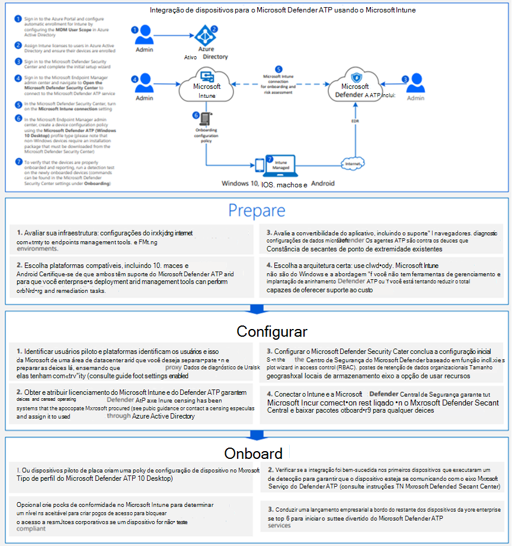

# Integrar dispositivo Windows 10 usando as ferramentas de Gerenciamento de Dispositivo MóvelOnboard Windows 10 devices using Mobile Device Management tools

[!INCLUDE [Microsoft 365 Defender rebranding](../../includes/microsoft-defender.md)]

**Aplica-se a:****Applies to:**
- [Microsoft Defender para Ponto de ExtremidadeMicrosoft Defender for Endpoint](https://go.microsoft.com/fwlink/p/?linkid=2154037)
- [Microsoft 365 DefenderMicrosoft 365 Defender](https://go.microsoft.com/fwlink/?linkid=2118804)

>Deseja experimentar o Defender para Ponto de Extremidade?Want to experience Defender for Endpoint? [Inscreva-se para uma avaliação gratuita.Sign up for a free trial.](https://www.microsoft.com/microsoft-365/windows/microsoft-defender-atp?ocid=docs-wdatp-configureendpointsmdm-abovefoldlink)

Você pode usar soluções de gerenciamento de dispositivo móvel (MDM) para configurar dispositivos.You can use mobile device management (MDM) solutions to configure devices. O Defender for Endpoint dá suporte a MDMs fornecendo OMA-URIs para criar políticas para gerenciar dispositivos.Defender for Endpoint supports MDMs by providing OMA-URIs to create policies to manage devices.

Para obter mais informações sobre como usar o CSP do Defender para Ponto de Extremidade, consulte o arquivo [DDF do WindowsAdvancedThreatProtection](https://msdn.microsoft.com/library/windows/hardware/mt723296(v=vs.85).aspx) e o arquivo [DDF do WindowsAdvancedThreatProtection.](https://msdn.microsoft.com/library/windows/hardware/mt723297(v=vs.85).aspx)For more information on using Defender for Endpoint CSP see, [WindowsAdvancedThreatProtection CSP](https://msdn.microsoft.com/library/windows/hardware/mt723296(v=vs.85).aspx) and [WindowsAdvancedThreatProtection DDF file](https://msdn.microsoft.com/library/windows/hardware/mt723297(v=vs.85).aspx).

## Antes de começarBefore you begin
Se você estiver usando Microsoft Intune, deverá ter o MDM do dispositivo inscrito.If you're using Microsoft Intune, you must have the device MDM Enrolled. Caso contrário, as configurações não serão aplicadas com êxito.Otherwise, settings will not be applied successfully. 

Para obter mais informações sobre a habilitação do MDM com Microsoft Intune, consulte Registro de [dispositivo (Microsoft Intune)](/mem/intune/enrollment/device-enrollment).For more information on enabling MDM with Microsoft Intune, see [Device enrollment (Microsoft Intune)](/mem/intune/enrollment/device-enrollment).

## Dispositivos de integração usando Microsoft IntuneOnboard devices using Microsoft Intune

Confira o [PDF](https://github.com/MicrosoftDocs/microsoft-365-docs/raw/public/microsoft-365/security/defender-endpoint/downloads/mdatp-deployment-strategy.pdf) ou [Visio](https://github.com/MicrosoftDocs/microsoft-365-docs/raw/public/microsoft-365/security/defender-endpoint/downloads/mdatp-deployment-strategy.vsdx) para ver os vários caminhos na implantação do Defender para o Ponto de Extremidade.Check out the [PDF](https://github.com/MicrosoftDocs/microsoft-365-docs/raw/public/microsoft-365/security/defender-endpoint/downloads/mdatp-deployment-strategy.pdf)  or  [Visio](https://github.com/MicrosoftDocs/microsoft-365-docs/raw/public/microsoft-365/security/defender-endpoint/downloads/mdatp-deployment-strategy.vsdx) to see the various paths in deploying Defender for Endpoint. 

Siga as instruções do [Intune](/intune/advanced-threat-protection).Follow the instructions from [Intune](/intune/advanced-threat-protection).

Para obter mais informações sobre como usar o CSP do Defender para Ponto de Extremidade, consulte o arquivo [DDF do WindowsAdvancedThreatProtection](https://msdn.microsoft.com/library/windows/hardware/mt723296(v=vs.85).aspx) e o arquivo [DDF do WindowsAdvancedThreatProtection.](https://msdn.microsoft.com/library/windows/hardware/mt723297(v=vs.85).aspx)For more information on using Defender for Endpoint CSP see, [WindowsAdvancedThreatProtection CSP](https://msdn.microsoft.com/library/windows/hardware/mt723296(v=vs.85).aspx) and [WindowsAdvancedThreatProtection DDF file](https://msdn.microsoft.com/library/windows/hardware/mt723297(v=vs.85).aspx).

> [!NOTE]
> - A **política Status da Saúde para dispositivos conectados** usa propriedades somente leitura e não pode ser remediada.The **Health Status for onboarded devices** policy uses read-only properties and can't be remediated.
> - A configuração da frequência de relatório de dados de diagnóstico só está disponível para dispositivos Windows 10 versão 1703.Configuration of diagnostic data reporting frequency is only available for devices on Windows 10, version 1703.

>[!TIP]
> Após a integração do dispositivo, você pode optar por executar um teste de detecção para verificar se um dispositivo está corretamente conectado ao serviço.After onboarding the device, you can choose to run a detection test to verify that a device is properly onboarded to the service. Para obter mais informações, [consulte Execute a detection test on a newly onboarded Microsoft Defender for Endpoint device](run-detection-test.md).For more information, see [Run a detection test on a newly onboarded Microsoft Defender for Endpoint device](run-detection-test.md).

Confira o [PDF](https://github.com/MicrosoftDocs/microsoft-365-docs/raw/public/microsoft-365/security/defender-endpoint/downloads/mdatp-deployment-strategy.pdf) ou [Visio](https://github.com/MicrosoftDocs/microsoft-365-docs/raw/public/microsoft-365/security/defender-endpoint/downloads/mdatp-deployment-strategy.vsdx) para ver os vários caminhos na implantação do Microsoft Defender para Ponto de Extremidade.Check out the [PDF](https://github.com/MicrosoftDocs/microsoft-365-docs/raw/public/microsoft-365/security/defender-endpoint/downloads/mdatp-deployment-strategy.pdf)  or  [Visio](https://github.com/MicrosoftDocs/microsoft-365-docs/raw/public/microsoft-365/security/defender-endpoint/downloads/mdatp-deployment-strategy.vsdx) to see the various paths in deploying Microsoft Defender for Endpoint.

## Offboard e monitore dispositivos usando ferramentas de Gerenciamento de Dispositivo MóvelOffboard and monitor devices using Mobile Device Management tools
Por motivos de segurança, o pacote usado para dispositivos offboard expirará 30 dias após a data em que foi baixado.For security reasons, the package used to Offboard devices will expire 30 days after the date it was downloaded. Os pacotes de offboard expirados enviados para um dispositivo serão rejeitados.Expired offboarding packages sent to a device will be rejected. Ao baixar um pacote de offboard, você será notificado sobre a data de expiração dos pacotes e ele também será incluído no nome do pacote.When downloading an offboarding package you will be notified of the packages expiry date and it will also be included in the package name.

> [!NOTE]
> As políticas de integração e de offboard não devem ser implantadas no mesmo dispositivo ao mesmo tempo, caso contrário, isso causará colisões imprevisíveis.Onboarding and offboarding policies must not be deployed on the same device at the same time, otherwise this will cause unpredictable collisions.

1. Obter o pacote de offboard de [Central de Segurança do Microsoft Defender](https://securitycenter.windows.com/):Get the offboarding package from [Microsoft Defender Security Center](https://securitycenter.windows.com/):

   1. No painel de navegação, selecione **Configurações**  >  **Offboarding**.In the navigation pane, select **Settings** > **Offboarding**.

   1. Selecione Windows 10 como o sistema operacional.Select Windows 10 as the operating system.

   1. No campo **Método de implantação,** selecione **Gerenciamento de Dispositivo Móvel /Microsoft Intune**.In the **Deployment method** field, select **Mobile Device Management / Microsoft Intune**.
    
   1. Clique **em Baixar pacote** e salve o .zip arquivo.Click **Download package**, and save the .zip file.

2. Extraia o conteúdo do arquivo .zip para um local compartilhado somente leitura que pode ser acessado pelos administradores de rede que implantarão o pacote.Extract the contents of the .zip file to a shared, read-only location that can be accessed by the network administrators who will deploy the package. Você deve ter um arquivo chamado *WindowsDefenderATP_valid_until_YYYY-MM-DD.offboarding*.You should have a file named *WindowsDefenderATP_valid_until_YYYY-MM-DD.offboarding*.

3. Use a Microsoft Intune de configuração personalizada para implantar as seguintes configurações OMA-URI com suporte.Use the Microsoft Intune custom configuration policy to deploy the following supported OMA-URI settings.

      OMA-URI: ./Device/Vendor/MSFT/WindowsAdvancedThreatProtection/OffboardingOMA-URI: ./Device/Vendor/MSFT/WindowsAdvancedThreatProtection/Offboarding 
      Tipo de data: Cadeia de caracteresDate type: String 
      Valor: [Copiar e colar o valor do conteúdo do arquivo WindowsDefenderATP_valid_until_YYYY-MM-DD.offboarding]Value: [Copy and paste the value from the content of the WindowsDefenderATP_valid_until_YYYY-MM-DD.offboarding file]

Para obter mais informações sobre Microsoft Intune configurações de política, consulte Windows 10 [configurações](/intune/deploy-use/windows-10-policy-settings-in-microsoft-intune)de política em Microsoft Intune .For more information on Microsoft Intune policy settings see, [Windows 10 policy settings in Microsoft Intune](/intune/deploy-use/windows-10-policy-settings-in-microsoft-intune).

> [!NOTE]
> A **política Status da Saúde para dispositivos** fora do quadro usa propriedades somente leitura e não pode ser remediada.The **Health Status for offboarded devices** policy uses read-only properties and can't be remediated.

> [!IMPORTANT]
> O offboard faz com que o dispositivo pare de enviar dados do sensor para o portal, mas os dados do dispositivo, incluindo a referência a todos os alertas que ele teve, serão mantidos por até 6 meses.Offboarding causes the device to stop sending sensor data to the portal but data from the device, including reference to any alerts it has had will be retained for up to 6 months.

## Tópicos relacionadosRelated topics
- [Integração Windows 10 usando a Política de GrupoOnboard Windows 10 devices using Group Policy](configure-endpoints-gp.md)
- [Integração Windows 10 dispositivos usando Microsoft Endpoint Configuration ManagerOnboard Windows 10 devices using Microsoft Endpoint Configuration Manager](configure-endpoints-sccm.md)
- [Integrar dispositivos Windows 10 usando um script localOnboard Windows 10 devices using a local script](configure-endpoints-script.md)
- [Dispositivos integrados de VDI (Virtual Desktop Infrastructure) não persistenteOnboard non-persistent virtual desktop infrastructure (VDI) devices](configure-endpoints-vdi.md)
- [Executar um teste de detecção em um dispositivo recém-integrado do Microsoft Defender para Ponto de ExtremidadeRun a detection test on a newly onboarded Microsoft Defender for Endpoint device](run-detection-test.md)
- [Solucionar problemas de integração do Microsoft Defender para pontos de extremidadeTroubleshoot Microsoft Defender for Endpoint onboarding issues](troubleshoot-onboarding.md)
