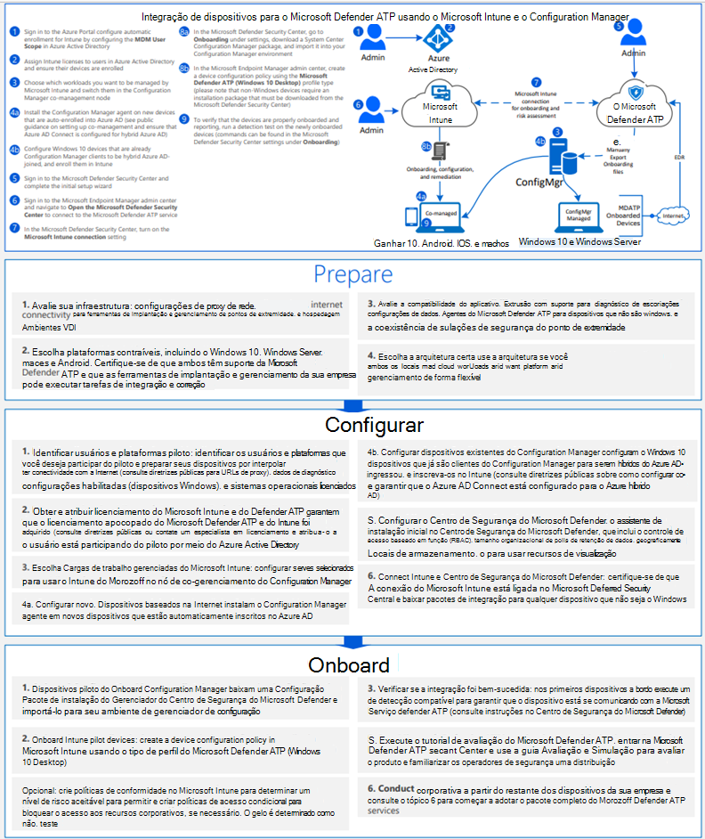
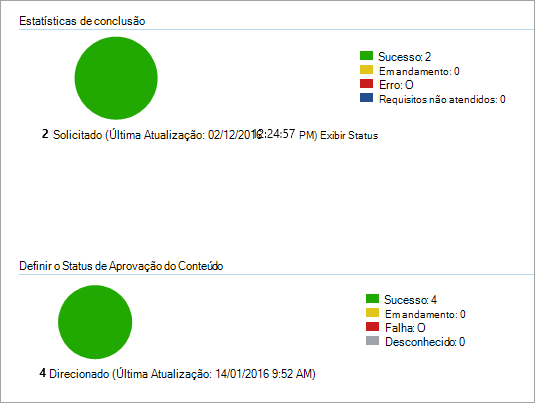

# <a name="onboard-windows-10-devices-using-configuration-manager"></a><span data-ttu-id="43fee-104">Integrar dispositivo Windows 10 usando o Configuration Manager</span><span class="sxs-lookup"><span data-stu-id="43fee-104">Onboard Windows 10 devices using Configuration Manager</span></span>

[!INCLUDE [Microsoft 365 Defender rebranding](../../includes/microsoft-defender.md)]

<span data-ttu-id="43fee-105">**Aplica-se a:**</span><span class="sxs-lookup"><span data-stu-id="43fee-105">**Applies to:**</span></span>

- [<span data-ttu-id="43fee-106">Microsoft Defender para Ponto de Extremidade</span><span class="sxs-lookup"><span data-stu-id="43fee-106">Microsoft Defender for Endpoint</span></span>](https://go.microsoft.com/fwlink/p/?linkid=2154037)
- [<span data-ttu-id="43fee-107">Microsoft 365 Defender</span><span class="sxs-lookup"><span data-stu-id="43fee-107">Microsoft 365 Defender</span></span>](https://go.microsoft.com/fwlink/?linkid=2118804)
- <span data-ttu-id="43fee-108">Microsoft Endpoint Configuration Manager branch atual</span><span class="sxs-lookup"><span data-stu-id="43fee-108">Microsoft Endpoint Configuration Manager current branch</span></span>
- <span data-ttu-id="43fee-109">Gerenciador de Configurações do System Center 2012 R2</span><span class="sxs-lookup"><span data-stu-id="43fee-109">System Center 2012 R2 Configuration Manager</span></span>

><span data-ttu-id="43fee-110">Deseja experimentar o Defender para Ponto de Extremidade?</span><span class="sxs-lookup"><span data-stu-id="43fee-110">Want to experience Defender for Endpoint?</span></span> [<span data-ttu-id="43fee-111">Inscreva-se para uma avaliação gratuita.</span><span class="sxs-lookup"><span data-stu-id="43fee-111">Sign up for a free trial.</span></span>](https://www.microsoft.com/microsoft-365/windows/microsoft-defender-atp?ocid=docs-wdatp-configureendpointssccm-abovefoldlink)

## <a name="supported-client-operating-systems"></a><span data-ttu-id="43fee-112">Sistemas operacionais cliente com suporte</span><span class="sxs-lookup"><span data-stu-id="43fee-112">Supported client operating systems</span></span>

<span data-ttu-id="43fee-113">Com base na versão do Configuration Manager que você está executando, os seguintes sistemas operacionais cliente podem ser integrados:</span><span class="sxs-lookup"><span data-stu-id="43fee-113">Based on the version of Configuration Manager you're running, the following client operating systems can be onboarded:</span></span>

#### <a name="configuration-manager-version-1910-and-prior"></a><span data-ttu-id="43fee-114">Configuration Manager versão 1910 e anterior</span><span class="sxs-lookup"><span data-stu-id="43fee-114">Configuration Manager version 1910 and prior</span></span>

- <span data-ttu-id="43fee-115">Clientes que executam computadores Windows 10</span><span class="sxs-lookup"><span data-stu-id="43fee-115">Clients computers running Windows 10</span></span> 

#### <a name="configuration-manager-version-2002-and-later"></a><span data-ttu-id="43fee-116">Configuration Manager versão 2002 e posterior</span><span class="sxs-lookup"><span data-stu-id="43fee-116">Configuration Manager version 2002 and later</span></span>

<span data-ttu-id="43fee-117">A partir do Configuration Manager versão 2002, você pode integrar os seguintes sistemas operacionais:</span><span class="sxs-lookup"><span data-stu-id="43fee-117">Starting in Configuration Manager version 2002, you can onboard the following operating systems:</span></span>

- <span data-ttu-id="43fee-118">Windows 8.1</span><span class="sxs-lookup"><span data-stu-id="43fee-118">Windows 8.1</span></span>
- <span data-ttu-id="43fee-119">Windows 10</span><span class="sxs-lookup"><span data-stu-id="43fee-119">Windows 10</span></span>
- <span data-ttu-id="43fee-120">Windows Server 2012 R2</span><span class="sxs-lookup"><span data-stu-id="43fee-120">Windows Server 2012 R2</span></span>
- <span data-ttu-id="43fee-121">Windows Server 2016</span><span class="sxs-lookup"><span data-stu-id="43fee-121">Windows Server 2016</span></span>
- <span data-ttu-id="43fee-122">Windows Server 2016, versão 1803 ou posterior</span><span class="sxs-lookup"><span data-stu-id="43fee-122">Windows Server 2016, version 1803 or later</span></span>
- <span data-ttu-id="43fee-123">Windows Server 2019</span><span class="sxs-lookup"><span data-stu-id="43fee-123">Windows Server 2019</span></span>

>[!NOTE]
><span data-ttu-id="43fee-124">Para obter mais informações sobre como Windows Server 2012 R2, Windows Server 2016 e Windows Server 2019, consulte Onboard [Windows servers](configure-server-endpoints.md).</span><span class="sxs-lookup"><span data-stu-id="43fee-124">For more information on how to onboard Windows Server 2012 R2, Windows Server 2016, and Windows Server 2019, see, [Onboard Windows servers](configure-server-endpoints.md).</span></span>


### <a name="onboard-devices-using-system-center-configuration-manager"></a><span data-ttu-id="43fee-125">Dispositivos de integração usando System Center Configuration Manager</span><span class="sxs-lookup"><span data-stu-id="43fee-125">Onboard devices using System Center Configuration Manager</span></span>


<span data-ttu-id="43fee-126">[](images/onboard-config-mgr.png#lightbox)</span><span class="sxs-lookup"><span data-stu-id="43fee-126">[](images/onboard-config-mgr.png#lightbox)</span></span>


<span data-ttu-id="43fee-127">Confira o [PDF](https://github.com/MicrosoftDocs/microsoft-365-docs/raw/public/microsoft-365/security/defender-endpoint/downloads/mdatp-deployment-strategy.pdf) ou [Visio](https://github.com/MicrosoftDocs/microsoft-365-docs/raw/public/microsoft-365/security/defender-endpoint/downloads/mdatp-deployment-strategy.vsdx) para ver os vários caminhos na implantação do Microsoft Defender para Ponto de Extremidade.</span><span class="sxs-lookup"><span data-stu-id="43fee-127">Check out the [PDF](https://github.com/MicrosoftDocs/microsoft-365-docs/raw/public/microsoft-365/security/defender-endpoint/downloads/mdatp-deployment-strategy.pdf)  or  [Visio](https://github.com/MicrosoftDocs/microsoft-365-docs/raw/public/microsoft-365/security/defender-endpoint/downloads/mdatp-deployment-strategy.vsdx) to see the various paths in deploying Microsoft Defender for Endpoint.</span></span> 


1. <span data-ttu-id="43fee-128">Abra o arquivo de pacote de configuração do Configuration Manager .zip (*WindowsDefenderATPOnboardingPackage.zip*) que você baixou do assistente de integração do serviço.</span><span class="sxs-lookup"><span data-stu-id="43fee-128">Open the Configuration Manager configuration package .zip file (*WindowsDefenderATPOnboardingPackage.zip*) that you downloaded from the service onboarding wizard.</span></span> <span data-ttu-id="43fee-129">Você também pode obter o pacote de [Central de Segurança do Microsoft Defender](https://securitycenter.windows.com/):</span><span class="sxs-lookup"><span data-stu-id="43fee-129">You can also get the package from [Microsoft Defender Security Center](https://securitycenter.windows.com/):</span></span>

    1. <span data-ttu-id="43fee-130">No painel de navegação, selecione **Configurações**  >  **Integração**.</span><span class="sxs-lookup"><span data-stu-id="43fee-130">In the navigation pane, select **Settings** > **Onboarding**.</span></span>
    
    1. <span data-ttu-id="43fee-131">Selecione Windows 10 como o sistema operacional.</span><span class="sxs-lookup"><span data-stu-id="43fee-131">Select Windows 10 as the operating system.</span></span>

    1. <span data-ttu-id="43fee-132">No campo **método Deployment,** selecione **System Center Configuration Manager 2012/2012 R2/1511/1602**.</span><span class="sxs-lookup"><span data-stu-id="43fee-132">In the **Deployment method** field, select **System Center Configuration Manager 2012/2012 R2/1511/1602**.</span></span>
    
    1. <span data-ttu-id="43fee-133">Selecione **Baixar pacote** e salve o arquivo .zip.</span><span class="sxs-lookup"><span data-stu-id="43fee-133">Select **Download package**, and save the .zip file.</span></span>

2. <span data-ttu-id="43fee-134">Extraia o conteúdo do arquivo .zip para um local compartilhado somente leitura que pode ser acessado pelos administradores de rede que implantarão o pacote.</span><span class="sxs-lookup"><span data-stu-id="43fee-134">Extract the contents of the .zip file to a shared, read-only location that can be accessed by the network administrators who will deploy the package.</span></span> <span data-ttu-id="43fee-135">Você deve ter um arquivo chamado *WindowsDefenderATPOnboardingScript.cmd*.</span><span class="sxs-lookup"><span data-stu-id="43fee-135">You should have a file named *WindowsDefenderATPOnboardingScript.cmd*.</span></span>

3. <span data-ttu-id="43fee-136">Implante o pacote seguindo as etapas no artigo [Pacotes e Programas no System Center 2012 R2 Configuration Manager.](/previous-versions/system-center/system-center-2012-R2/gg699369\(v=technet.10\))</span><span class="sxs-lookup"><span data-stu-id="43fee-136">Deploy the package by following the steps in the [Packages and Programs in System Center 2012 R2 Configuration Manager](/previous-versions/system-center/system-center-2012-R2/gg699369\(v=technet.10\)) article.</span></span>

    <span data-ttu-id="43fee-137">a.</span><span class="sxs-lookup"><span data-stu-id="43fee-137">a.</span></span> <span data-ttu-id="43fee-138">Escolha uma coleção de dispositivos predefinida para a qual implantar o pacote.</span><span class="sxs-lookup"><span data-stu-id="43fee-138">Choose a predefined device collection to deploy the package to.</span></span>

> [!NOTE]
> <span data-ttu-id="43fee-139">O Defender for Endpoint não dá suporte à integração durante a fase [OOBE (Experiência](https://answers.microsoft.com/en-us/windows/wiki/windows_10/how-to-complete-the-windows-10-out-of-box/47e3f943-f000-45e3-8c5c-9d85a1a0cf87) De Saída).</span><span class="sxs-lookup"><span data-stu-id="43fee-139">Defender for Endpoint doesn't support onboarding during the [Out-Of-Box Experience (OOBE)](https://answers.microsoft.com/en-us/windows/wiki/windows_10/how-to-complete-the-windows-10-out-of-box/47e3f943-f000-45e3-8c5c-9d85a1a0cf87) phase.</span></span> <span data-ttu-id="43fee-140">Certifique-se de que os usuários concluam o OOBE após Windows instalação ou atualização.</span><span class="sxs-lookup"><span data-stu-id="43fee-140">Make sure users complete OOBE after running Windows installation or upgrading.</span></span>

>[!TIP]
> <span data-ttu-id="43fee-141">Após a integração do dispositivo, você pode optar por executar um teste de detecção para verificar se um dispositivo está corretamente conectado ao serviço.</span><span class="sxs-lookup"><span data-stu-id="43fee-141">After onboarding the device, you can choose to run a detection test to verify that an device is properly onboarded to the service.</span></span> <span data-ttu-id="43fee-142">Para obter mais informações, [consulte Execute a detection test on a newly onboarded Defender for Endpoint device](run-detection-test.md).</span><span class="sxs-lookup"><span data-stu-id="43fee-142">For more information, see [Run a detection test on a newly onboarded Defender for Endpoint device](run-detection-test.md).</span></span>
>
> <span data-ttu-id="43fee-143">Observe que é possível criar uma regra de detecção em um aplicativo do Configuration Manager para verificar continuamente se um dispositivo foi internado.</span><span class="sxs-lookup"><span data-stu-id="43fee-143">Note that it is possible to create a detection rule on a Configuration Manager application to continuously check if a device has been onboarded.</span></span> <span data-ttu-id="43fee-144">Um aplicativo é um tipo diferente de objeto do que um pacote e um programa.</span><span class="sxs-lookup"><span data-stu-id="43fee-144">An application is a different type of object than a package and program.</span></span>
> <span data-ttu-id="43fee-145">Se um dispositivo ainda não estiver conectado (devido à conclusão pendente do OOBE ou qualquer outro motivo), o Configuration Manager repetirá a integração do dispositivo até que a regra detecte a alteração de status.</span><span class="sxs-lookup"><span data-stu-id="43fee-145">If a device is not yet onboarded (due to pending OOBE completion or any other reason), Configuration Manager will retry to onboard the device until the rule detects the status change.</span></span>
> 
> <span data-ttu-id="43fee-146">Esse comportamento pode ser realizado criando uma verificação de regra de detecção se o valor do Registro "OnboardingState" (do tipo REG_DWORD) = 1.</span><span class="sxs-lookup"><span data-stu-id="43fee-146">This behavior can be accomplished by creating a detection rule checking if the "OnboardingState" registry value (of type REG_DWORD) = 1.</span></span>
> <span data-ttu-id="43fee-147">Esse valor do Registro está localizado em "HKLM\SOFTWARE\Microsoft\Windows Proteção Avançada contra Ameaças\Status".</span><span class="sxs-lookup"><span data-stu-id="43fee-147">This registry value is located under "HKLM\SOFTWARE\Microsoft\Windows Advanced Threat Protection\Status".</span></span>
<span data-ttu-id="43fee-148">Para obter mais informações, [consulte Configure Detection Methods in System Center 2012 R2 Configuration Manager](/previous-versions/system-center/system-center-2012-R2/gg682159\(v=technet.10\)#step-4-configure-detection-methods-to-indicate-the-presence-of-the-deployment-type).</span><span class="sxs-lookup"><span data-stu-id="43fee-148">For more information, see [Configure Detection Methods in System Center 2012 R2 Configuration Manager](/previous-versions/system-center/system-center-2012-R2/gg682159\(v=technet.10\)#step-4-configure-detection-methods-to-indicate-the-presence-of-the-deployment-type).</span></span>

### <a name="configure-sample-collection-settings"></a><span data-ttu-id="43fee-149">Configurar configurações de coleção de exemplos</span><span class="sxs-lookup"><span data-stu-id="43fee-149">Configure sample collection settings</span></span>

<span data-ttu-id="43fee-150">Para cada dispositivo, você pode definir um valor de configuração para determinar se amostras podem ser coletadas do dispositivo quando uma solicitação é feita por meio do Central de Segurança do Microsoft Defender enviar um arquivo para análise profunda.</span><span class="sxs-lookup"><span data-stu-id="43fee-150">For each device, you can set a configuration value to state whether samples can be collected from the device when a request is made through Microsoft Defender Security Center to submit a file for deep analysis.</span></span>

>[!NOTE]
><span data-ttu-id="43fee-151">Essas configurações geralmente são feitas por meio do Configuration Manager.</span><span class="sxs-lookup"><span data-stu-id="43fee-151">These configuration settings are typically done through Configuration Manager.</span></span> 

<span data-ttu-id="43fee-152">Você pode definir uma regra de conformidade para o item de configuração no Configuration Manager para alterar a configuração de compartilhamento de exemplo em um dispositivo.</span><span class="sxs-lookup"><span data-stu-id="43fee-152">You can set a compliance rule for configuration item in Configuration Manager to change the sample share setting on a device.</span></span>

<span data-ttu-id="43fee-153">Essa regra deve ser um *item de* configuração de regra de conformidade de correção que define o valor de uma chave do Registro em dispositivos direcionados para garantir que eles sejam reclamações.</span><span class="sxs-lookup"><span data-stu-id="43fee-153">This rule should be a *remediating* compliance rule configuration item that sets the value of a registry key on targeted devices to make sure they’re complaint.</span></span>

<span data-ttu-id="43fee-154">A configuração é definida por meio da seguinte entrada de chave do Registro:</span><span class="sxs-lookup"><span data-stu-id="43fee-154">The configuration is set through the following registry key entry:</span></span>

```console
Path: "HKLM\SOFTWARE\Policies\Microsoft\Windows Advanced Threat Protection"
Name: "AllowSampleCollection"
Value: 0 or 1
```

<span data-ttu-id="43fee-155">Onde:</span><span class="sxs-lookup"><span data-stu-id="43fee-155">Where:</span></span><br>
<span data-ttu-id="43fee-156">Tipo de chave é um D-WORD.</span><span class="sxs-lookup"><span data-stu-id="43fee-156">Key type is a D-WORD.</span></span> <br>
<span data-ttu-id="43fee-157">Os valores possíveis são:</span><span class="sxs-lookup"><span data-stu-id="43fee-157">Possible values are:</span></span>
- <span data-ttu-id="43fee-158">0 - não permite o compartilhamento de exemplo deste dispositivo</span><span class="sxs-lookup"><span data-stu-id="43fee-158">0 - doesn't allow sample sharing  from this device</span></span>
- <span data-ttu-id="43fee-159">1 - permite o compartilhamento de todos os tipos de arquivo deste dispositivo</span><span class="sxs-lookup"><span data-stu-id="43fee-159">1 - allows sharing of all file types from this device</span></span>

<span data-ttu-id="43fee-160">O valor padrão caso a chave do Registro não exista é 1.</span><span class="sxs-lookup"><span data-stu-id="43fee-160">The default value in case the registry key doesn’t exist is 1.</span></span>

<span data-ttu-id="43fee-161">Para obter mais informações sobre System Center Configuration Manager Conformidade, consulte Introdução às configurações de conformidade [no System Center 2012 R2 Configuration Manager](/previous-versions/system-center/system-center-2012-R2/gg682139\(v=technet.10\)).</span><span class="sxs-lookup"><span data-stu-id="43fee-161">For more information about System Center Configuration Manager Compliance, see [Introduction to compliance settings in System Center 2012 R2 Configuration Manager](/previous-versions/system-center/system-center-2012-R2/gg682139\(v=technet.10\)).</span></span>


## <a name="other-recommended-configuration-settings"></a><span data-ttu-id="43fee-162">Outras configurações recomendadas</span><span class="sxs-lookup"><span data-stu-id="43fee-162">Other recommended configuration settings</span></span>
<span data-ttu-id="43fee-163">Após a integração de dispositivos ao serviço, é importante aproveitar os recursos de proteção contra ameaças incluídos, habilitando-os com as seguintes configurações recomendadas.</span><span class="sxs-lookup"><span data-stu-id="43fee-163">After onboarding devices to the service, it's important to take advantage of the included threat protection capabilities by enabling them with the following recommended configuration settings.</span></span>

### <a name="device-collection-configuration"></a><span data-ttu-id="43fee-164">Configuração do conjunto de dispositivos</span><span class="sxs-lookup"><span data-stu-id="43fee-164">Device collection configuration</span></span>
<span data-ttu-id="43fee-165">Se você estiver usando o Endpoint Configuration Manager, versão 2002 ou posterior, poderá optar por ampliar a implantação para incluir servidores ou clientes de nível inferior.</span><span class="sxs-lookup"><span data-stu-id="43fee-165">If you're using Endpoint Configuration Manager, version 2002 or later, you can choose to broaden the deployment to include servers or down-level clients.</span></span>


### <a name="next-generation-protection-configuration"></a><span data-ttu-id="43fee-166">Configuração de proteção de próxima geração</span><span class="sxs-lookup"><span data-stu-id="43fee-166">Next generation protection configuration</span></span>
<span data-ttu-id="43fee-167">As seguintes configurações são recomendadas:</span><span class="sxs-lookup"><span data-stu-id="43fee-167">The following configuration settings are recommended:</span></span>

<span data-ttu-id="43fee-168">**Examinar**</span><span class="sxs-lookup"><span data-stu-id="43fee-168">**Scan**</span></span> <br>
- <span data-ttu-id="43fee-169">Examinar dispositivos de armazenamento removíveis, como unidades USB: Sim</span><span class="sxs-lookup"><span data-stu-id="43fee-169">Scan removable storage devices such as USB drives: Yes</span></span>

<span data-ttu-id="43fee-170">**Proteção em tempo real**</span><span class="sxs-lookup"><span data-stu-id="43fee-170">**Real-time Protection**</span></span> <br>
- <span data-ttu-id="43fee-171">Habilitar o Monitoramento Comportamental: Sim</span><span class="sxs-lookup"><span data-stu-id="43fee-171">Enable Behavioral Monitoring: Yes</span></span>
- <span data-ttu-id="43fee-172">Habilitar a proteção contra aplicativos potencialmente indesejados no download e antes da instalação: Sim</span><span class="sxs-lookup"><span data-stu-id="43fee-172">Enable protection against Potentially Unwanted Applications at download and prior to installation: Yes</span></span>

<span data-ttu-id="43fee-173">**Serviço de Proteção na Nuvem**</span><span class="sxs-lookup"><span data-stu-id="43fee-173">**Cloud Protection Service**</span></span>
- <span data-ttu-id="43fee-174">Tipo de associação do Serviço de Proteção na Nuvem: Associação avançada</span><span class="sxs-lookup"><span data-stu-id="43fee-174">Cloud Protection Service membership type: Advanced membership</span></span>

<span data-ttu-id="43fee-175">**Redução de superfície de ataque** Configure todas as regras disponíveis para Auditoria.</span><span class="sxs-lookup"><span data-stu-id="43fee-175">**Attack surface reduction** Configure all available rules to Audit.</span></span>

>[!NOTE]
> <span data-ttu-id="43fee-176">O bloqueio dessas atividades pode interromper processos comerciais legítimos.</span><span class="sxs-lookup"><span data-stu-id="43fee-176">Blocking these activities may interrupt legitimate business processes.</span></span> <span data-ttu-id="43fee-177">A melhor abordagem é definir tudo para auditoria, identificar quais são seguros para ativar e, em seguida, ativar essas configurações em pontos de extremidade que não têm detecções de falsos positivos.</span><span class="sxs-lookup"><span data-stu-id="43fee-177">The best approach is setting everything to audit, identifying which ones are safe to turn on, and then enabling those settings on endpoints which do not have false positive detections.</span></span>


<span data-ttu-id="43fee-178">**Proteção de rede**</span><span class="sxs-lookup"><span data-stu-id="43fee-178">**Network protection**</span></span> <br>
<span data-ttu-id="43fee-179">Antes de ativar a proteção de rede no modo de auditoria ou bloqueio, verifique se você instalou a atualização da plataforma antimalware, que pode ser obtida na página [de suporte](https://support.microsoft.com/en-us/help/4560203/windows-defender-anti-malware-platform-binaries-are-missing).</span><span class="sxs-lookup"><span data-stu-id="43fee-179">Prior to enabling network protection in audit or block mode, ensure that you've installed the antimalware platform update, which can be obtained from the [support page](https://support.microsoft.com/en-us/help/4560203/windows-defender-anti-malware-platform-binaries-are-missing).</span></span>


<span data-ttu-id="43fee-180">**Acesso controlado a pastas**</span><span class="sxs-lookup"><span data-stu-id="43fee-180">**Controlled folder access**</span></span><br>
<span data-ttu-id="43fee-181">Habilita o recurso no modo de auditoria por pelo menos 30 dias.</span><span class="sxs-lookup"><span data-stu-id="43fee-181">Enable the feature in audit mode for at least 30 days.</span></span> <span data-ttu-id="43fee-182">Após esse período, revise as detecções e crie uma lista de aplicativos que têm permissão para gravar em diretórios protegidos.</span><span class="sxs-lookup"><span data-stu-id="43fee-182">After this period, review detections and create a list of applications that are allowed to write to protected directories.</span></span>

<span data-ttu-id="43fee-183">Para obter mais informações, consulte [Evaluate controlled folder access](evaluate-controlled-folder-access.md).</span><span class="sxs-lookup"><span data-stu-id="43fee-183">For more information, see [Evaluate controlled folder access](evaluate-controlled-folder-access.md).</span></span>


## <a name="offboard-devices-using-configuration-manager"></a><span data-ttu-id="43fee-184">Dispositivos offboard usando o Configuration Manager</span><span class="sxs-lookup"><span data-stu-id="43fee-184">Offboard devices using Configuration Manager</span></span>

<span data-ttu-id="43fee-185">Por motivos de segurança, o pacote usado para dispositivos offboard expirará 30 dias após a data em que foi baixado.</span><span class="sxs-lookup"><span data-stu-id="43fee-185">For security reasons, the package used to Offboard devices will expire 30 days after the date it was downloaded.</span></span> <span data-ttu-id="43fee-186">Os pacotes de offboard expirados enviados para um dispositivo serão rejeitados.</span><span class="sxs-lookup"><span data-stu-id="43fee-186">Expired offboarding packages sent to a device will be rejected.</span></span> <span data-ttu-id="43fee-187">Ao baixar um pacote de offboard, você será notificado sobre a data de expiração dos pacotes e ele também será incluído no nome do pacote.</span><span class="sxs-lookup"><span data-stu-id="43fee-187">When downloading an offboarding package, you will be notified of the packages expiry date and it will also be included in the package name.</span></span>

> [!NOTE]
> <span data-ttu-id="43fee-188">As políticas de integração e de offboard não devem ser implantadas no mesmo dispositivo ao mesmo tempo, caso contrário, isso causará colisões imprevisíveis.</span><span class="sxs-lookup"><span data-stu-id="43fee-188">Onboarding and offboarding policies must not be deployed on the same device at the same time, otherwise this will cause unpredictable collisions.</span></span>

### <a name="offboard-devices-using-microsoft-endpoint-manager-current-branch"></a><span data-ttu-id="43fee-189">Dispositivos de offboard usando Microsoft Endpoint Manager ramificação atual</span><span class="sxs-lookup"><span data-stu-id="43fee-189">Offboard devices using Microsoft Endpoint Manager current branch</span></span>

<span data-ttu-id="43fee-190">Se você usar Microsoft Endpoint Manager ramificação atual, consulte [Create an offboarding configuration file](/configmgr/protect/deploy-use/windows-defender-advanced-threat-protection#create-an-offboarding-configuration-file).</span><span class="sxs-lookup"><span data-stu-id="43fee-190">If you use Microsoft Endpoint Manager current branch, see [Create an offboarding configuration file](/configmgr/protect/deploy-use/windows-defender-advanced-threat-protection#create-an-offboarding-configuration-file).</span></span>

### <a name="offboard-devices-using-system-center-2012-r2-configuration-manager"></a><span data-ttu-id="43fee-191">Dispositivos de offboard usando System Center 2012 R2 Configuration Manager</span><span class="sxs-lookup"><span data-stu-id="43fee-191">Offboard devices using System Center 2012 R2 Configuration Manager</span></span>

1. <span data-ttu-id="43fee-192">Obter o pacote de offboard de [Central de Segurança do Microsoft Defender](https://securitycenter.windows.com/):</span><span class="sxs-lookup"><span data-stu-id="43fee-192">Get the offboarding package from [Microsoft Defender Security Center](https://securitycenter.windows.com/):</span></span>

    1. <span data-ttu-id="43fee-193">No painel de navegação, selecione **Configurações**  >   **Offboarding**.</span><span class="sxs-lookup"><span data-stu-id="43fee-193">In the navigation pane, select **Settings** >  **Offboarding**.</span></span>

    1. <span data-ttu-id="43fee-194">Selecione Windows 10 como o sistema operacional.</span><span class="sxs-lookup"><span data-stu-id="43fee-194">Select Windows 10 as the operating system.</span></span>

    1. <span data-ttu-id="43fee-195">No campo **método Deployment,** selecione **System Center Configuration Manager 2012/2012 R2/1511/1602**.</span><span class="sxs-lookup"><span data-stu-id="43fee-195">In the **Deployment method** field, select **System Center Configuration Manager 2012/2012 R2/1511/1602**.</span></span>
    
    1. <span data-ttu-id="43fee-196">Selecione **Baixar pacote** e salve o arquivo .zip.</span><span class="sxs-lookup"><span data-stu-id="43fee-196">Select **Download package**, and save the .zip file.</span></span>

2. <span data-ttu-id="43fee-197">Extraia o conteúdo do arquivo .zip para um local compartilhado somente leitura que pode ser acessado pelos administradores de rede que implantarão o pacote.</span><span class="sxs-lookup"><span data-stu-id="43fee-197">Extract the contents of the .zip file to a shared, read-only location that can be accessed by the network administrators who will deploy the package.</span></span> <span data-ttu-id="43fee-198">Você deve ter um arquivo chamado *WindowsDefenderATPOffboardingScript_valid_until_YYYY-MM-DD.cmd*.</span><span class="sxs-lookup"><span data-stu-id="43fee-198">You should have a file named *WindowsDefenderATPOffboardingScript_valid_until_YYYY-MM-DD.cmd*.</span></span>

3. <span data-ttu-id="43fee-199">Implante o pacote seguindo as etapas no artigo [Pacotes e Programas no System Center 2012 R2 Configuration Manager.](/previous-versions/system-center/system-center-2012-R2/gg699369\(v=technet.10\))</span><span class="sxs-lookup"><span data-stu-id="43fee-199">Deploy the package by following the steps in the [Packages and Programs in System Center 2012 R2 Configuration Manager](/previous-versions/system-center/system-center-2012-R2/gg699369\(v=technet.10\)) article.</span></span>

    <span data-ttu-id="43fee-200">a.</span><span class="sxs-lookup"><span data-stu-id="43fee-200">a.</span></span> <span data-ttu-id="43fee-201">Escolha uma coleção de dispositivos predefinida para a qual implantar o pacote.</span><span class="sxs-lookup"><span data-stu-id="43fee-201">Choose a predefined device collection to deploy the package to.</span></span>

> [!IMPORTANT]
> <span data-ttu-id="43fee-202">O offboard faz com que o dispositivo pare de enviar dados do sensor para o portal, mas os dados do dispositivo, incluindo a referência a todos os alertas que ele teve, serão mantidos por até 6 meses.</span><span class="sxs-lookup"><span data-stu-id="43fee-202">Offboarding causes the device to stop sending sensor data to the portal but data from the device, including reference to any alerts it has had will be retained for up to 6 months.</span></span>


## <a name="monitor-device-configuration"></a><span data-ttu-id="43fee-203">Monitorar a configuração do dispositivo</span><span class="sxs-lookup"><span data-stu-id="43fee-203">Monitor device configuration</span></span>

<span data-ttu-id="43fee-204">Se você estiver usando Microsoft Endpoint Manager filial atual, use o painel do Defender para Ponto de Extremidade integrado no console do Configuration Manager.</span><span class="sxs-lookup"><span data-stu-id="43fee-204">If you're using Microsoft Endpoint Manager current branch, use the built-in Defender for Endpoint dashboard in the Configuration Manager console.</span></span> <span data-ttu-id="43fee-205">Para obter mais informações, consulte [Defender for Endpoint - Monitor](/configmgr/protect/deploy-use/windows-defender-advanced-threat-protection#monitor).</span><span class="sxs-lookup"><span data-stu-id="43fee-205">For more information, see [Defender for Endpoint - Monitor](/configmgr/protect/deploy-use/windows-defender-advanced-threat-protection#monitor).</span></span>

<span data-ttu-id="43fee-206">Se você estiver usando o System Center 2012 R2 Configuration Manager, o monitoramento consiste em duas partes:</span><span class="sxs-lookup"><span data-stu-id="43fee-206">If you're using System Center 2012 R2 Configuration Manager, monitoring consists of two parts:</span></span>

1. <span data-ttu-id="43fee-207">Confirmar se o pacote de configuração foi implantado corretamente e está sendo executado (ou executado com êxito) nos dispositivos em sua rede.</span><span class="sxs-lookup"><span data-stu-id="43fee-207">Confirming the configuration package has been correctly deployed and is running (or has successfully run) on the devices in your network.</span></span>

2. <span data-ttu-id="43fee-208">Verificar se os dispositivos estão em conformidade com o serviço Defender para Ponto de Extremidade (isso garante que o dispositivo possa concluir o processo de integração e pode continuar a relatar dados ao serviço).</span><span class="sxs-lookup"><span data-stu-id="43fee-208">Checking that the devices are compliant with the Defender for Endpoint service (this ensures the device can complete the onboarding process and can continue to report data to the service).</span></span>

### <a name="confirm-the-configuration-package-has-been-correctly-deployed"></a><span data-ttu-id="43fee-209">Confirme se o pacote de configuração foi implantado corretamente</span><span class="sxs-lookup"><span data-stu-id="43fee-209">Confirm the configuration package has been correctly deployed</span></span>

1. <span data-ttu-id="43fee-210">No console do Configuration Manager, clique **em Monitoramento** na parte inferior do painel de navegação.</span><span class="sxs-lookup"><span data-stu-id="43fee-210">In the Configuration Manager console, click **Monitoring** at the bottom of the navigation pane.</span></span>

2. <span data-ttu-id="43fee-211">Selecione **Visão geral** e **implantações.**</span><span class="sxs-lookup"><span data-stu-id="43fee-211">Select **Overview** and then **Deployments**.</span></span>

3. <span data-ttu-id="43fee-212">Selecione na implantação com o nome do pacote.</span><span class="sxs-lookup"><span data-stu-id="43fee-212">Select on the deployment with the package name.</span></span>

4. <span data-ttu-id="43fee-213">Revise os indicadores de status **em Estatísticas de Conclusão** e Status de **Conteúdo.**</span><span class="sxs-lookup"><span data-stu-id="43fee-213">Review the status indicators under **Completion Statistics** and **Content Status**.</span></span>

    <span data-ttu-id="43fee-214">Se houver implantações com falha (dispositivos com **status Error**, **Requirements Not Met**, ou **Failed**), talvez seja necessário solucionar problemas dos dispositivos.</span><span class="sxs-lookup"><span data-stu-id="43fee-214">If there are failed deployments (devices with **Error**, **Requirements Not Met**, or **Failed statuses**), you may need to  troubleshoot the devices.</span></span> <span data-ttu-id="43fee-215">Para obter mais informações, consulte Solução [de problemas de integração do Microsoft Defender para o Ponto de Extremidade.](troubleshoot-onboarding.md)</span><span class="sxs-lookup"><span data-stu-id="43fee-215">For more information, see, [Troubleshoot Microsoft Defender for Endpoint onboarding issues](troubleshoot-onboarding.md).</span></span>

    

### <a name="check-that-the-devices-are-compliant-with-the-microsoft-defender-for-endpoint-service"></a><span data-ttu-id="43fee-217">Verifique se os dispositivos estão em conformidade com o serviço do Microsoft Defender para Ponto de Extremidade</span><span class="sxs-lookup"><span data-stu-id="43fee-217">Check that the devices are compliant with the Microsoft Defender for Endpoint service</span></span>

<span data-ttu-id="43fee-218">Você pode definir uma regra de conformidade para o item de configuração no System Center 2012 R2 Configuration Manager para monitorar sua implantação.</span><span class="sxs-lookup"><span data-stu-id="43fee-218">You can set a compliance rule for configuration item in System Center 2012 R2 Configuration Manager to monitor your deployment.</span></span>

<span data-ttu-id="43fee-219">Essa regra deve ser um *item* de configuração de regra de conformidade não corretivo que monitora o valor de uma chave do Registro em dispositivos direcionados.</span><span class="sxs-lookup"><span data-stu-id="43fee-219">This rule should be a *non-remediating* compliance rule configuration item that monitors the value of a registry key on targeted devices.</span></span>

<span data-ttu-id="43fee-220">Monitore a seguinte entrada da chave do Registro:</span><span class="sxs-lookup"><span data-stu-id="43fee-220">Monitor the following registry key entry:</span></span>

```console
Path: "HKLM\SOFTWARE\Microsoft\Windows Advanced Threat Protection\Status"
Name: "OnboardingState"
Value: "1"
```

<span data-ttu-id="43fee-221">Para obter mais informações, consulte [Introdução às configurações de conformidade no System Center 2012 R2 Configuration Manager](/previous-versions/system-center/system-center-2012-R2/gg682139\(v=technet.10\)).</span><span class="sxs-lookup"><span data-stu-id="43fee-221">For more information, see [Introduction to compliance settings in System Center 2012 R2 Configuration Manager](/previous-versions/system-center/system-center-2012-R2/gg682139\(v=technet.10\)).</span></span>

## <a name="related-topics"></a><span data-ttu-id="43fee-222">Tópicos relacionados</span><span class="sxs-lookup"><span data-stu-id="43fee-222">Related topics</span></span>
- [<span data-ttu-id="43fee-223">Integração Windows 10 usando a Política de Grupo</span><span class="sxs-lookup"><span data-stu-id="43fee-223">Onboard Windows 10 devices using Group Policy</span></span>](configure-endpoints-gp.md)
- [<span data-ttu-id="43fee-224">Integrar dispositivo Windows 10 usando as ferramentas de Gerenciamento de Dispositivo Móvel</span><span class="sxs-lookup"><span data-stu-id="43fee-224">Onboard Windows 10 devices using Mobile Device Management tools</span></span>](configure-endpoints-mdm.md)
- [<span data-ttu-id="43fee-225">Integrar dispositivos Windows 10 usando um script local</span><span class="sxs-lookup"><span data-stu-id="43fee-225">Onboard Windows 10 devices using a local script</span></span>](configure-endpoints-script.md)
- [<span data-ttu-id="43fee-226">Dispositivos integrados de VDI (Virtual Desktop Infrastructure) não persistente</span><span class="sxs-lookup"><span data-stu-id="43fee-226">Onboard non-persistent virtual desktop infrastructure (VDI) devices</span></span>](configure-endpoints-vdi.md)
- [<span data-ttu-id="43fee-227">Executar um teste de detecção em um dispositivo recém-integrado do Microsoft Defender para Ponto de Extremidade</span><span class="sxs-lookup"><span data-stu-id="43fee-227">Run a detection test on a newly onboarded Microsoft Defender for Endpoint device</span></span>](run-detection-test.md)
- [<span data-ttu-id="43fee-228">Solucionar problemas de integração do Microsoft Defender para pontos de extremidade</span><span class="sxs-lookup"><span data-stu-id="43fee-228">Troubleshoot Microsoft Defender for Endpoint onboarding issues</span></span>](troubleshoot-onboarding.md)
