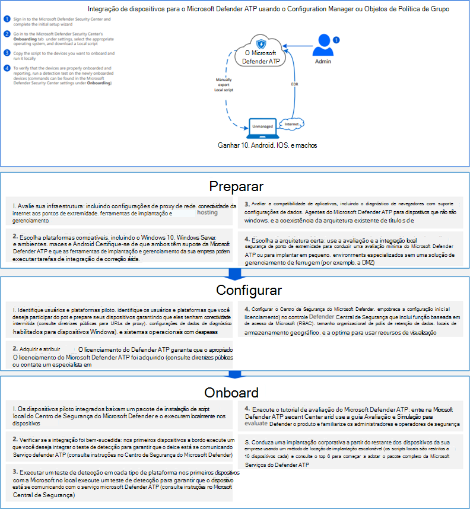

# <a name="onboard-windows-10-devices-using-a-local-script"></a><span data-ttu-id="b463a-104">Integrar dispositivos Windows 10 usando um script local</span><span class="sxs-lookup"><span data-stu-id="b463a-104">Onboard Windows 10 devices using a local script</span></span>

[!INCLUDE [Microsoft 365 Defender rebranding](../../includes/microsoft-defender.md)]

- [<span data-ttu-id="b463a-105">Microsoft 365 Defender</span><span class="sxs-lookup"><span data-stu-id="b463a-105">Microsoft 365 Defender</span></span>](https://go.microsoft.com/fwlink/?linkid=2118804)


><span data-ttu-id="b463a-106">Deseja experimentar o Defender para Ponto de Extremidade?</span><span class="sxs-lookup"><span data-stu-id="b463a-106">Want to experience Defender for Endpoint?</span></span> [<span data-ttu-id="b463a-107">Inscreva-se para uma avaliação gratuita.</span><span class="sxs-lookup"><span data-stu-id="b463a-107">Sign up for a free trial.</span></span>](https://www.microsoft.com/microsoft-365/windows/microsoft-defender-atp?ocid=docs-wdatp-configureendpointsscript-abovefoldlink)

<span data-ttu-id="b463a-108">Você também pode fazer a integração manual de dispositivos individuais no Defender for Endpoint.</span><span class="sxs-lookup"><span data-stu-id="b463a-108">You can also manually onboard individual devices to Defender for Endpoint.</span></span> <span data-ttu-id="b463a-109">Você pode querer fazer isso primeiro ao testar o serviço antes de se comprometer a integração de todos os dispositivos em sua rede.</span><span class="sxs-lookup"><span data-stu-id="b463a-109">You might want to do this first when testing the service before you commit to onboarding all devices in your network.</span></span>

> [!IMPORTANT]
> <span data-ttu-id="b463a-110">Esse script foi otimizado para uso em até 10 dispositivos.</span><span class="sxs-lookup"><span data-stu-id="b463a-110">This script has been optimized for use on up to 10 devices.</span></span>
>
> <span data-ttu-id="b463a-111">Para implantar em escala, use [outras opções de implantação.](configure-endpoints.md)</span><span class="sxs-lookup"><span data-stu-id="b463a-111">To deploy at scale, use [other deployment options](configure-endpoints.md).</span></span> <span data-ttu-id="b463a-112">Por exemplo, você pode implantar um script de integração em mais de 10 dispositivos em produção com o script disponível em dispositivos [Do Windows 10](configure-endpoints-gp.md)de integração usando a Política de Grupo .</span><span class="sxs-lookup"><span data-stu-id="b463a-112">For example, you can deploy an onboarding script to more than 10 devices in production with the script available in [Onboard Windows 10 devices using Group Policy](configure-endpoints-gp.md).</span></span>

## <a name="onboard-devices"></a><span data-ttu-id="b463a-113">Dispositivos de integração</span><span class="sxs-lookup"><span data-stu-id="b463a-113">Onboard devices</span></span> 

<span data-ttu-id="b463a-114">[](images/onboard-script.png#lightbox)</span><span class="sxs-lookup"><span data-stu-id="b463a-114">[](images/onboard-script.png#lightbox)</span></span>


<span data-ttu-id="b463a-115">Confira o [PDF ou](https://github.com/MicrosoftDocs/microsoft-365-docs/raw/public/microsoft-365/security/defender-endpoint/downloads/mdatp-deployment-strategy.pdf)  o  [Visio](https://github.com/MicrosoftDocs/microsoft-365-docs/raw/public/microsoft-365/security/defender-endpoint/downloads/mdatp-deployment-strategy.vsdx) para ver os vários caminhos na implantação do Defender para o Ponto de Extremidade.</span><span class="sxs-lookup"><span data-stu-id="b463a-115">Check out the [PDF](https://github.com/MicrosoftDocs/microsoft-365-docs/raw/public/microsoft-365/security/defender-endpoint/downloads/mdatp-deployment-strategy.pdf)  or  [Visio](https://github.com/MicrosoftDocs/microsoft-365-docs/raw/public/microsoft-365/security/defender-endpoint/downloads/mdatp-deployment-strategy.vsdx) to see the various paths in deploying Defender for Endpoint.</span></span> 


1.  <span data-ttu-id="b463a-116">Abra o arquivo .zip do pacote de configuração da GP (*WindowsDefenderATPOnboardingPackage.zip*) que você baixou do assistente de integração do serviço.</span><span class="sxs-lookup"><span data-stu-id="b463a-116">Open the GP configuration package .zip file (*WindowsDefenderATPOnboardingPackage.zip*) that you downloaded from the service onboarding wizard.</span></span> <span data-ttu-id="b463a-117">Você também pode obter o pacote do [Centro de Segurança do Microsoft Defender](https://securitycenter.windows.com/):</span><span class="sxs-lookup"><span data-stu-id="b463a-117">You can also get the package from [Microsoft Defender Security Center](https://securitycenter.windows.com/):</span></span>

    1. <span data-ttu-id="b463a-118">No painel de navegação, selecione **Configurações**  >  **Integração**.</span><span class="sxs-lookup"><span data-stu-id="b463a-118">In the navigation pane, select **Settings** > **Onboarding**.</span></span>

    1. <span data-ttu-id="b463a-119">Selecione Windows 10 como o sistema operacional.</span><span class="sxs-lookup"><span data-stu-id="b463a-119">Select Windows 10 as the operating system.</span></span>

    1. <span data-ttu-id="b463a-120">No campo **Método de Implantação,** selecione **Script Local**.</span><span class="sxs-lookup"><span data-stu-id="b463a-120">In the **Deployment method** field, select **Local Script**.</span></span>

    1. <span data-ttu-id="b463a-121">Clique **em Baixar pacote** e salve o arquivo .zip.</span><span class="sxs-lookup"><span data-stu-id="b463a-121">Click **Download package** and save the .zip file.</span></span>

  
2.  <span data-ttu-id="b463a-122">Extraia o conteúdo do pacote de configuração para um local no dispositivo que você deseja integrar (por exemplo, a Área de Trabalho).</span><span class="sxs-lookup"><span data-stu-id="b463a-122">Extract the contents of the configuration package to a location on the device you want to onboard (for example, the Desktop).</span></span> <span data-ttu-id="b463a-123">Você deve ter um arquivo chamado *WindowsDefenderATPOnboardingScript.cmd*.</span><span class="sxs-lookup"><span data-stu-id="b463a-123">You should have a file named *WindowsDefenderATPOnboardingScript.cmd*.</span></span>

3.  <span data-ttu-id="b463a-124">Abra um prompt de linha de comando elevada no dispositivo e execute o script:</span><span class="sxs-lookup"><span data-stu-id="b463a-124">Open an elevated command-line prompt on the device and run the script:</span></span>

    1.  <span data-ttu-id="b463a-125">Vá para **Iniciar** e digite **cmd**.</span><span class="sxs-lookup"><span data-stu-id="b463a-125">Go to **Start** and type **cmd**.</span></span>

    1.  <span data-ttu-id="b463a-126">Clique com o botão direito do mouse em **Prompt de Comando** e selecione **Executar como administrador**.</span><span class="sxs-lookup"><span data-stu-id="b463a-126">Right-click **Command prompt** and select **Run as administrator**.</span></span>

        

4.  <span data-ttu-id="b463a-128">Digite o local do arquivo de script.</span><span class="sxs-lookup"><span data-stu-id="b463a-128">Type the location of the script file.</span></span> <span data-ttu-id="b463a-129">Se você copiou o arquivo para a área de trabalho, *digite: %userprofile%\Desktop\WindowsDefenderATPOnboardingScript.cmd*</span><span class="sxs-lookup"><span data-stu-id="b463a-129">If you copied the file to the desktop, type: *%userprofile%\Desktop\WindowsDefenderATPOnboardingScript.cmd*</span></span>

5.  <span data-ttu-id="b463a-130">Pressione a **tecla Enter** ou clique em **OK**.</span><span class="sxs-lookup"><span data-stu-id="b463a-130">Press the **Enter** key or click **OK**.</span></span>

<span data-ttu-id="b463a-131">Para obter informações sobre como você pode validar manualmente se o dispositivo é compatível e relata corretamente os dados do sensor, consulte Solução de problemas de integração do Microsoft Defender para Ponto [de Extremidade.](troubleshoot-onboarding.md)</span><span class="sxs-lookup"><span data-stu-id="b463a-131">For information on how you can manually validate that the device is compliant and correctly reports sensor data see, [Troubleshoot Microsoft Defender for Endpoint onboarding issues](troubleshoot-onboarding.md).</span></span>


>[!TIP]
> <span data-ttu-id="b463a-132">Após a integração do dispositivo, você pode optar por executar um teste de detecção para verificar se um dispositivo está corretamente conectado ao serviço.</span><span class="sxs-lookup"><span data-stu-id="b463a-132">After onboarding the device, you can choose to run a detection test to verify that an device is properly onboarded to the service.</span></span> <span data-ttu-id="b463a-133">Para obter mais informações, [consulte Run a detection test on a newly onboarded Microsoft Defender for Endpoint endpoint endpoint endpoint](run-detection-test.md).</span><span class="sxs-lookup"><span data-stu-id="b463a-133">For more information, see [Run a detection test on a newly onboarded Microsoft Defender for Endpoint endpoint](run-detection-test.md).</span></span>

## <a name="configure-sample-collection-settings"></a><span data-ttu-id="b463a-134">Configurar configurações de coleção de exemplos</span><span class="sxs-lookup"><span data-stu-id="b463a-134">Configure sample collection settings</span></span>
<span data-ttu-id="b463a-135">Para cada dispositivo, você pode definir um valor de configuração para determinar se amostras podem ser coletadas do dispositivo quando uma solicitação é feita por meio do Centro de Segurança do Microsoft Defender para enviar um arquivo para análise profunda.</span><span class="sxs-lookup"><span data-stu-id="b463a-135">For each device, you can set a configuration value to state whether samples can be collected from the device when a request is made through Microsoft Defender Security Center to submit a file for deep analysis.</span></span>

<span data-ttu-id="b463a-136">Você pode configurar manualmente a configuração de compartilhamento de exemplo no dispositivo usando *regedit* ou criando e executando um *arquivo .reg.*</span><span class="sxs-lookup"><span data-stu-id="b463a-136">You can manually configure the sample sharing setting on the device by using *regedit* or creating and running a *.reg* file.</span></span>  

<span data-ttu-id="b463a-137">A configuração é definida por meio da seguinte entrada de chave do Registro:</span><span class="sxs-lookup"><span data-stu-id="b463a-137">The configuration is set through the following registry key entry:</span></span>

```console
Path: “HKLM\SOFTWARE\Policies\Microsoft\Windows Advanced Threat Protection”
Name: "AllowSampleCollection"
Value: 0 or 1
```
<span data-ttu-id="b463a-138">Onde:</span><span class="sxs-lookup"><span data-stu-id="b463a-138">Where:</span></span><br>
<span data-ttu-id="b463a-139">Tipo de nome é um D-WORD.</span><span class="sxs-lookup"><span data-stu-id="b463a-139">Name type is a D-WORD.</span></span> <br>
<span data-ttu-id="b463a-140">Os valores possíveis são:</span><span class="sxs-lookup"><span data-stu-id="b463a-140">Possible values are:</span></span>
- <span data-ttu-id="b463a-141">0 - não permite o compartilhamento de exemplo deste dispositivo</span><span class="sxs-lookup"><span data-stu-id="b463a-141">0 - doesn't allow sample sharing  from this device</span></span>
- <span data-ttu-id="b463a-142">1 - permite o compartilhamento de todos os tipos de arquivo deste dispositivo</span><span class="sxs-lookup"><span data-stu-id="b463a-142">1 - allows sharing of all file types from this device</span></span>

<span data-ttu-id="b463a-143">O valor padrão caso a chave do Registro não exista é 1.</span><span class="sxs-lookup"><span data-stu-id="b463a-143">The default value in case the registry key doesn’t exist is 1.</span></span>


## <a name="offboard-devices-using-a-local-script"></a><span data-ttu-id="b463a-144">Dispositivos offboard usando um script local</span><span class="sxs-lookup"><span data-stu-id="b463a-144">Offboard devices using a local script</span></span>
<span data-ttu-id="b463a-145">Por motivos de segurança, o pacote usado para dispositivos offboard expirará 30 dias após a data em que foi baixado.</span><span class="sxs-lookup"><span data-stu-id="b463a-145">For security reasons, the package used to Offboard devices will expire 30 days after the date it was downloaded.</span></span> <span data-ttu-id="b463a-146">Os pacotes de offboard expirados enviados para um dispositivo serão rejeitados.</span><span class="sxs-lookup"><span data-stu-id="b463a-146">Expired offboarding packages sent to an device will be rejected.</span></span> <span data-ttu-id="b463a-147">Ao baixar um pacote de offboard, você será notificado sobre a data de expiração dos pacotes e ele também será incluído no nome do pacote.</span><span class="sxs-lookup"><span data-stu-id="b463a-147">When downloading an offboarding package you will be notified of the packages expiry date and it will also be included in the package name.</span></span>

> [!NOTE]
> <span data-ttu-id="b463a-148">As políticas de integração e de offboard não devem ser implantadas no mesmo dispositivo ao mesmo tempo, caso contrário, isso causará colisões imprevisíveis.</span><span class="sxs-lookup"><span data-stu-id="b463a-148">Onboarding and offboarding policies must not be deployed on the same device at the same time, otherwise this will cause unpredictable collisions.</span></span>

1. <span data-ttu-id="b463a-149">Obter o pacote de offboarding do [Centro de Segurança do Microsoft Defender](https://securitycenter.windows.com/):</span><span class="sxs-lookup"><span data-stu-id="b463a-149">Get the offboarding package from [Microsoft Defender Security Center](https://securitycenter.windows.com/):</span></span>

    1. <span data-ttu-id="b463a-150">No painel de navegação, selecione **Configurações**  >  **offboarding**.</span><span class="sxs-lookup"><span data-stu-id="b463a-150">In the navigation pane, select **Settings** > **Offboarding**.</span></span>

    1. <span data-ttu-id="b463a-151">Selecione Windows 10 como o sistema operacional.</span><span class="sxs-lookup"><span data-stu-id="b463a-151">Select Windows 10 as the operating system.</span></span>

    1. <span data-ttu-id="b463a-152">No campo **Método de Implantação,** selecione **Script Local**.</span><span class="sxs-lookup"><span data-stu-id="b463a-152">In the **Deployment method** field, select **Local Script**.</span></span>

    1. <span data-ttu-id="b463a-153">Clique **em Baixar pacote** e salve o arquivo .zip.</span><span class="sxs-lookup"><span data-stu-id="b463a-153">Click **Download package** and save the .zip file.</span></span>

2. <span data-ttu-id="b463a-154">Extraia o conteúdo do arquivo .zip para um local compartilhado somente leitura que pode ser acessado pelos dispositivos.</span><span class="sxs-lookup"><span data-stu-id="b463a-154">Extract the contents of the .zip file to a shared, read-only location that can be accessed by the devices.</span></span> <span data-ttu-id="b463a-155">Você deve ter um arquivo chamado *WindowsDefenderATPOffboardingScript_valid_until_YYYY-MM-DD.cmd*.</span><span class="sxs-lookup"><span data-stu-id="b463a-155">You should have a file named *WindowsDefenderATPOffboardingScript_valid_until_YYYY-MM-DD.cmd*.</span></span>

3.  <span data-ttu-id="b463a-156">Abra um prompt de linha de comando elevada no dispositivo e execute o script:</span><span class="sxs-lookup"><span data-stu-id="b463a-156">Open an elevated command-line prompt on the device and run the script:</span></span>

    1.  <span data-ttu-id="b463a-157">Vá para **Iniciar** e digite **cmd**.</span><span class="sxs-lookup"><span data-stu-id="b463a-157">Go to **Start** and type **cmd**.</span></span>

    1.  <span data-ttu-id="b463a-158">Clique com o botão direito do mouse em **Prompt de Comando** e selecione **Executar como administrador**.</span><span class="sxs-lookup"><span data-stu-id="b463a-158">Right-click **Command prompt** and select **Run as administrator**.</span></span>

        

4.  <span data-ttu-id="b463a-160">Digite o local do arquivo de script.</span><span class="sxs-lookup"><span data-stu-id="b463a-160">Type the location of the script file.</span></span> <span data-ttu-id="b463a-161">Se você copiou o arquivo para a área de trabalho, *digite: %userprofile%\Desktop\WindowsDefenderATPOffboardingScript_valid_until_YYYY-MM-DD.cmd*</span><span class="sxs-lookup"><span data-stu-id="b463a-161">If you copied the file to the desktop, type: *%userprofile%\Desktop\WindowsDefenderATPOffboardingScript_valid_until_YYYY-MM-DD.cmd*</span></span>

5.  <span data-ttu-id="b463a-162">Pressione a **tecla Enter** ou clique em **OK**.</span><span class="sxs-lookup"><span data-stu-id="b463a-162">Press the **Enter** key or click **OK**.</span></span>

> [!IMPORTANT]
> <span data-ttu-id="b463a-163">O offboard faz com que o dispositivo pare de enviar dados do sensor para o portal, mas os dados do dispositivo, incluindo a referência a todos os alertas que ele teve, serão mantidos por até 6 meses.</span><span class="sxs-lookup"><span data-stu-id="b463a-163">Offboarding causes the device to stop sending sensor data to the portal but data from the device, including reference to any alerts it has had will be retained for up to 6 months.</span></span>


## <a name="monitor-device-configuration"></a><span data-ttu-id="b463a-164">Monitorar a configuração do dispositivo</span><span class="sxs-lookup"><span data-stu-id="b463a-164">Monitor device configuration</span></span>
<span data-ttu-id="b463a-165">Você pode seguir as diferentes etapas de verificação na solução [de](troubleshoot-onboarding.md) problemas de integração para verificar se o script foi concluído com êxito e se o agente está em execução.</span><span class="sxs-lookup"><span data-stu-id="b463a-165">You can follow the different verification steps in the [Troubleshoot onboarding issues](troubleshoot-onboarding.md) to verify that the script completed successfully and the agent is running.</span></span>

<span data-ttu-id="b463a-166">O monitoramento também pode ser feito diretamente no portal ou usando as diferentes ferramentas de implantação.</span><span class="sxs-lookup"><span data-stu-id="b463a-166">Monitoring can also be done directly on the portal, or by using the different deployment tools.</span></span>

### <a name="monitor-devices-using-the-portal"></a><span data-ttu-id="b463a-167">Monitorar dispositivos usando o portal</span><span class="sxs-lookup"><span data-stu-id="b463a-167">Monitor devices using the portal</span></span>
1. <span data-ttu-id="b463a-168">Vá para o Centro de Segurança do Microsoft Defender.</span><span class="sxs-lookup"><span data-stu-id="b463a-168">Go to Microsoft Defender Security Center.</span></span>

2. <span data-ttu-id="b463a-169">Clique **em Lista de dispositivos**.</span><span class="sxs-lookup"><span data-stu-id="b463a-169">Click **Devices list**.</span></span>

3. <span data-ttu-id="b463a-170">Verifique se os dispositivos estão aparecendo.</span><span class="sxs-lookup"><span data-stu-id="b463a-170">Verify that devices are appearing.</span></span>


## <a name="related-topics"></a><span data-ttu-id="b463a-171">Tópicos relacionados</span><span class="sxs-lookup"><span data-stu-id="b463a-171">Related topics</span></span>
- [<span data-ttu-id="b463a-172">Integração de dispositivos Windows 10 usando a Política de Grupo</span><span class="sxs-lookup"><span data-stu-id="b463a-172">Onboard Windows 10 devices using Group Policy</span></span>](configure-endpoints-gp.md)
- [<span data-ttu-id="b463a-173">Integração de dispositivos Windows 10 usando o Microsoft Endpoint Configuration Manager</span><span class="sxs-lookup"><span data-stu-id="b463a-173">Onboard Windows 10 devices using Microsoft Endpoint Configuration Manager</span></span>](configure-endpoints-sccm.md)
- [<span data-ttu-id="b463a-174">Integrar dispositivo Windows 10 usando as ferramentas de Gerenciamento de Dispositivo Móvel</span><span class="sxs-lookup"><span data-stu-id="b463a-174">Onboard Windows 10 devices using Mobile Device Management tools</span></span>](configure-endpoints-mdm.md)
- [<span data-ttu-id="b463a-175">Dispositivos integrados de VDI (Virtual Desktop Infrastructure) não persistente</span><span class="sxs-lookup"><span data-stu-id="b463a-175">Onboard non-persistent virtual desktop infrastructure (VDI) devices</span></span>](configure-endpoints-vdi.md)
- [<span data-ttu-id="b463a-176">Executar um teste de detecção em um dispositivo recém-integrado do Microsoft Defender para Ponto de Extremidade</span><span class="sxs-lookup"><span data-stu-id="b463a-176">Run a detection test on a newly onboarded Microsoft Defender for Endpoint device</span></span>](run-detection-test.md)
- [<span data-ttu-id="b463a-177">Solucionar problemas de integração do Microsoft Defender para pontos de extremidade</span><span class="sxs-lookup"><span data-stu-id="b463a-177">Troubleshoot Microsoft Defender for Endpoint onboarding issues</span></span>](troubleshoot-onboarding.md)
