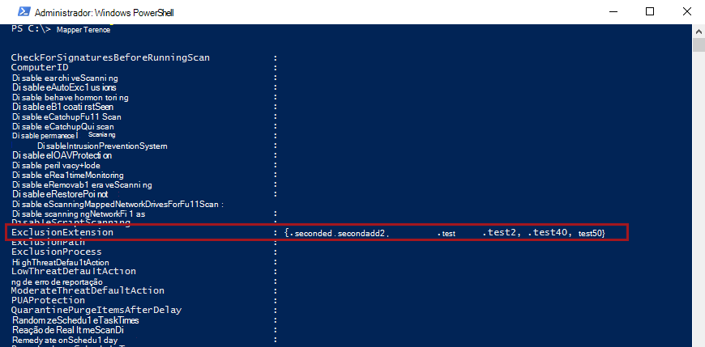
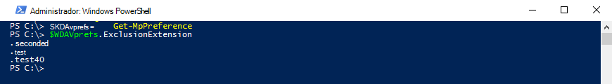

# <a name="configure-and-validate-exclusions-based-on-file-extension-and-folder-location"></a><span data-ttu-id="2d3b7-104">Configurar e validar exclusões com base na extensão de arquivo e no local da pasta</span><span class="sxs-lookup"><span data-stu-id="2d3b7-104">Configure and validate exclusions based on file extension and folder location</span></span>

[!INCLUDE [Microsoft 365 Defender rebranding](../../includes/microsoft-defender.md)]


<span data-ttu-id="2d3b7-105">**Aplica-se a:**</span><span class="sxs-lookup"><span data-stu-id="2d3b7-105">**Applies to:**</span></span>

- [<span data-ttu-id="2d3b7-106">Microsoft Defender para Ponto de Extremidade</span><span class="sxs-lookup"><span data-stu-id="2d3b7-106">Microsoft Defender for Endpoint</span></span>](/microsoft-365/security/defender-endpoint/)

> [!IMPORTANT]
> <span data-ttu-id="2d3b7-107">As exclusões do Microsoft Defender Antivírus não se aplicam a outros recursos do Microsoft Defender para Endpoint, incluindo a detecção e resposta do ponto de extremidade [(EDR),](/microsoft-365/security/defender-endpoint/overview-endpoint-detection-response)regras de redução de superfície de ataque [(ASR)](/microsoft-365/security/defender-endpoint/attack-surface-reduction)e acesso controlado a pastas [.](/microsoft-365/security/defender-endpoint/controlled-folders)</span><span class="sxs-lookup"><span data-stu-id="2d3b7-107">Microsoft Defender Antivirus exclusions don't apply to other Microsoft Defender for Endpoint capabilities, including [endpoint detection and response (EDR)](/microsoft-365/security/defender-endpoint/overview-endpoint-detection-response), [attack surface reduction (ASR) rules](/microsoft-365/security/defender-endpoint/attack-surface-reduction), and [controlled folder access](/microsoft-365/security/defender-endpoint/controlled-folders).</span></span> <span data-ttu-id="2d3b7-108">Os arquivos excluídos usando os métodos descritos neste artigo ainda podem disparar alertas de EDR e outras detecções.</span><span class="sxs-lookup"><span data-stu-id="2d3b7-108">Files that you exclude using the methods described in this article can still trigger EDR alerts and other detections.</span></span> <span data-ttu-id="2d3b7-109">Para excluir arquivos amplamente, adicione-os aos indicadores personalizados do Microsoft Defender for [Endpoint.](/microsoft-365/security/defender-endpoint/manage-indicators)</span><span class="sxs-lookup"><span data-stu-id="2d3b7-109">To exclude files broadly, add them to the Microsoft Defender for Endpoint [custom indicators](/microsoft-365/security/defender-endpoint/manage-indicators).</span></span>

## <a name="exclusion-lists"></a><span data-ttu-id="2d3b7-110">Listas de exclusão</span><span class="sxs-lookup"><span data-stu-id="2d3b7-110">Exclusion lists</span></span>

<span data-ttu-id="2d3b7-111">Você pode excluir determinados arquivos das verificações do Microsoft Defender Antivírus modificando listas de exclusão.</span><span class="sxs-lookup"><span data-stu-id="2d3b7-111">You can exclude certain files from Microsoft Defender Antivirus scans by modifying exclusion lists.</span></span> <span data-ttu-id="2d3b7-112">**Geralmente, não é necessário aplicar exclusões.**</span><span class="sxs-lookup"><span data-stu-id="2d3b7-112">**Generally, you shouldn't need to apply exclusions**.</span></span> <span data-ttu-id="2d3b7-113">O Microsoft Defender Antivírus inclui muitas exclusões automáticas com base em comportamentos conhecidos do sistema operacional e arquivos de gerenciamento típicos, como aqueles usados no gerenciamento empresarial, gerenciamento de banco de dados e outros cenários e situações empresariais.</span><span class="sxs-lookup"><span data-stu-id="2d3b7-113">Microsoft Defender Antivirus includes many automatic exclusions based on known operating system behaviors and typical management files, such as those used in enterprise management, database management, and other enterprise scenarios and situations.</span></span>

> [!NOTE]
> <span data-ttu-id="2d3b7-114">As exclusões também se aplicam a detecções de Aplicativos Potencialmente Indesejados (PUA).</span><span class="sxs-lookup"><span data-stu-id="2d3b7-114">Exclusions apply to Potentially Unwanted Apps (PUA) detections as well.</span></span>

> [!NOTE]
> <span data-ttu-id="2d3b7-115">As exclusões automáticas aplicam-se somente ao Windows Server 2016 e acima.</span><span class="sxs-lookup"><span data-stu-id="2d3b7-115">Automatic exclusions apply only to Windows Server 2016 and above.</span></span> <span data-ttu-id="2d3b7-116">Essas exclusões não são visíveis no aplicativo segurança do Windows e no PowerShell.</span><span class="sxs-lookup"><span data-stu-id="2d3b7-116">These exclusions are not visible in the Windows Security app and in PowerShell.</span></span>

<span data-ttu-id="2d3b7-117">Este artigo descreve como configurar listas de exclusão para os arquivos e pastas.</span><span class="sxs-lookup"><span data-stu-id="2d3b7-117">This article  describes how to configure exclusion lists for the files and folders.</span></span> <span data-ttu-id="2d3b7-118">Consulte [Recomendações para definir exclusões antes](configure-exclusions-microsoft-defender-antivirus.md#recommendations-for-defining-exclusions) de definir suas listas de exclusão.</span><span class="sxs-lookup"><span data-stu-id="2d3b7-118">See [Recommendations for defining exclusions](configure-exclusions-microsoft-defender-antivirus.md#recommendations-for-defining-exclusions) before defining your exclusion lists.</span></span>

| <span data-ttu-id="2d3b7-119">Exclusão</span><span class="sxs-lookup"><span data-stu-id="2d3b7-119">Exclusion</span></span> | <span data-ttu-id="2d3b7-120">Exemplos</span><span class="sxs-lookup"><span data-stu-id="2d3b7-120">Examples</span></span> | <span data-ttu-id="2d3b7-121">Lista de exclusões</span><span class="sxs-lookup"><span data-stu-id="2d3b7-121">Exclusion list</span></span> |
|:---|:---|:---|
|<span data-ttu-id="2d3b7-122">Qualquer arquivo com uma extensão específica</span><span class="sxs-lookup"><span data-stu-id="2d3b7-122">Any file with a specific extension</span></span> | <span data-ttu-id="2d3b7-123">Todos os arquivos com a extensão especificada, em qualquer lugar no computador.</span><span class="sxs-lookup"><span data-stu-id="2d3b7-123">All files with the specified extension, anywhere on the machine.</span></span> <p> <span data-ttu-id="2d3b7-124">Sintaxe válida: `.test` e `test`</span><span class="sxs-lookup"><span data-stu-id="2d3b7-124">Valid syntax: `.test` and `test`</span></span>  | <span data-ttu-id="2d3b7-125">Exclusões de extensão</span><span class="sxs-lookup"><span data-stu-id="2d3b7-125">Extension exclusions</span></span> |
|<span data-ttu-id="2d3b7-126">Qualquer arquivo em uma pasta específica</span><span class="sxs-lookup"><span data-stu-id="2d3b7-126">Any file under a specific folder</span></span> | <span data-ttu-id="2d3b7-127">Todos os arquivos na `c:\test\sample` pasta</span><span class="sxs-lookup"><span data-stu-id="2d3b7-127">All files under the `c:\test\sample` folder</span></span> | <span data-ttu-id="2d3b7-128">Exclusões de arquivos e pastas</span><span class="sxs-lookup"><span data-stu-id="2d3b7-128">File and folder exclusions</span></span> |
| <span data-ttu-id="2d3b7-129">Um arquivo específico em uma pasta específica</span><span class="sxs-lookup"><span data-stu-id="2d3b7-129">A specific file in a specific folder</span></span> | <span data-ttu-id="2d3b7-130">Somente o `c:\sample\sample.test` arquivo</span><span class="sxs-lookup"><span data-stu-id="2d3b7-130">The file `c:\sample\sample.test` only</span></span> | <span data-ttu-id="2d3b7-131">Exclusões de arquivos e pastas</span><span class="sxs-lookup"><span data-stu-id="2d3b7-131">File and folder exclusions</span></span> |
| <span data-ttu-id="2d3b7-132">Um processo específico</span><span class="sxs-lookup"><span data-stu-id="2d3b7-132">A specific process</span></span> | <span data-ttu-id="2d3b7-133">O arquivo executável `c:\test\process.exe`</span><span class="sxs-lookup"><span data-stu-id="2d3b7-133">The executable file `c:\test\process.exe`</span></span> | <span data-ttu-id="2d3b7-134">Exclusões de arquivos e pastas</span><span class="sxs-lookup"><span data-stu-id="2d3b7-134">File and folder exclusions</span></span> |

<span data-ttu-id="2d3b7-135">As listas de exclusão têm as seguintes características:</span><span class="sxs-lookup"><span data-stu-id="2d3b7-135">Exclusion lists have the following characteristics:</span></span>

- <span data-ttu-id="2d3b7-136">As exclusões de pastas se aplicam a todos os arquivos e pastas sob essa pasta, a menos que a subpasta seja um ponto de nova análise.</span><span class="sxs-lookup"><span data-stu-id="2d3b7-136">Folder exclusions apply to all files and folders under that folder, unless the subfolder is a reparse point.</span></span> <span data-ttu-id="2d3b7-137">As subpastas de ponto de repare devem ser excluídas separadamente.</span><span class="sxs-lookup"><span data-stu-id="2d3b7-137">Reparse point subfolders must be excluded separately.</span></span>
- <span data-ttu-id="2d3b7-138">Extensões de arquivo se aplicam a qualquer nome de arquivo com a extensão definida se um caminho ou pasta não for definido.</span><span class="sxs-lookup"><span data-stu-id="2d3b7-138">File extensions apply to any file name with the defined extension if a path or folder is not defined.</span></span>

> [!IMPORTANT]
> - <span data-ttu-id="2d3b7-139">O uso de caracteres curinga, como o asterisco ( ) alterará como as regras de \* exclusão são interpretadas.</span><span class="sxs-lookup"><span data-stu-id="2d3b7-139">Using wildcards such as the asterisk (\*) will alter how the exclusion rules are interpreted.</span></span> <span data-ttu-id="2d3b7-140">Consulte a [seção Usar curingas no nome](#use-wildcards-in-the-file-name-and-folder-path-or-extension-exclusion-lists) do arquivo e no caminho da pasta ou listas de exclusão de extensão para obter informações importantes sobre como os curingas funcionam.</span><span class="sxs-lookup"><span data-stu-id="2d3b7-140">See the [Use wildcards in the file name and folder path or extension exclusion lists](#use-wildcards-in-the-file-name-and-folder-path-or-extension-exclusion-lists) section for important information about how wildcards work.</span></span>
> - <span data-ttu-id="2d3b7-141">Não é possível excluir unidades de rede mapeadas.</span><span class="sxs-lookup"><span data-stu-id="2d3b7-141">You cannot exclude mapped network drives.</span></span> <span data-ttu-id="2d3b7-142">Você deve especificar o caminho de rede real.</span><span class="sxs-lookup"><span data-stu-id="2d3b7-142">You must specify the actual network path.</span></span>
> - <span data-ttu-id="2d3b7-143">Pastas que são pontos de nova análise criados após o início do serviço Microsoft Defender Antivírus e que foram adicionadas à lista de exclusão não serão incluídas.</span><span class="sxs-lookup"><span data-stu-id="2d3b7-143">Folders that are reparse points that are created after the Microsoft Defender Antivirus service starts and that have been added to the exclusion list will not be included.</span></span> <span data-ttu-id="2d3b7-144">Você deve reiniciar o serviço (reiniciando o Windows) para que novos pontos de nova análise sejam reconhecidos como um destino de exclusão válido.</span><span class="sxs-lookup"><span data-stu-id="2d3b7-144">You must restart the service (by restarting Windows) for new reparse points to be recognized as a valid exclusion target.</span></span>

<span data-ttu-id="2d3b7-145">Para excluir arquivos abertos por um processo específico, consulte [Configure and validate exclusions for files opened by processes](configure-process-opened-file-exclusions-microsoft-defender-antivirus.md).</span><span class="sxs-lookup"><span data-stu-id="2d3b7-145">To exclude files opened by a specific process, see [Configure and validate exclusions for files opened by processes](configure-process-opened-file-exclusions-microsoft-defender-antivirus.md).</span></span>

<span data-ttu-id="2d3b7-146">As exclusões se aplicam a [verificações agendadas,](scheduled-catch-up-scans-microsoft-defender-antivirus.md)verificações [sob demanda](run-scan-microsoft-defender-antivirus.md)e proteção em [tempo real.](configure-real-time-protection-microsoft-defender-antivirus.md)</span><span class="sxs-lookup"><span data-stu-id="2d3b7-146">The exclusions apply to [scheduled scans](scheduled-catch-up-scans-microsoft-defender-antivirus.md), [on-demand scans](run-scan-microsoft-defender-antivirus.md), and [real-time protection](configure-real-time-protection-microsoft-defender-antivirus.md).</span></span>

> [!IMPORTANT]
> <span data-ttu-id="2d3b7-147">As alterações de lista de exclusão feitas com a Política de **Grupo** serão mostrar nas listas no aplicativo [segurança do Windows](microsoft-defender-security-center-antivirus.md).</span><span class="sxs-lookup"><span data-stu-id="2d3b7-147">Exclusion list changes made with Group Policy **will show** in the lists in the [Windows Security app](microsoft-defender-security-center-antivirus.md).</span></span>
> <span data-ttu-id="2d3b7-148">As alterações feitas no aplicativo de Segurança do Windows **não aparecerão** nas listas de Política de Grupo.</span><span class="sxs-lookup"><span data-stu-id="2d3b7-148">Changes made in the Windows Security app **will not show** in the Group Policy lists.</span></span>

<span data-ttu-id="2d3b7-149">Por padrão, as alterações locais feitas nas listas (por usuários com privilégios de administrador, incluindo as alterações feitas com o PowerShell e o WMI) serão mescladas com as listas como definidas (e implantadas) pela Política de Grupo, Pelo Configuration Manager ou pelo Intune.</span><span class="sxs-lookup"><span data-stu-id="2d3b7-149">By default, local changes made to the lists (by users with administrator privileges, including changes made with PowerShell and WMI) will be merged with the lists as defined (and deployed) by Group Policy, Configuration Manager, or Intune.</span></span> <span data-ttu-id="2d3b7-150">As listas de Política de Grupo têm precedência quando há conflitos.</span><span class="sxs-lookup"><span data-stu-id="2d3b7-150">The Group Policy lists take precedence when there are conflicts.</span></span>

<span data-ttu-id="2d3b7-151">Você pode [configurar como listas de exclusões definidas local](configure-local-policy-overrides-microsoft-defender-antivirus.md#merge-lists) e globalmente são mescladas para permitir que as alterações locais substituam as configurações de implantação gerenciada.</span><span class="sxs-lookup"><span data-stu-id="2d3b7-151">You can [configure how locally and globally defined exclusions lists are merged](configure-local-policy-overrides-microsoft-defender-antivirus.md#merge-lists) to allow local changes to override managed deployment settings.</span></span>

## <a name="configure-the-list-of-exclusions-based-on-folder-name-or-file-extension"></a><span data-ttu-id="2d3b7-152">Configurar a lista de exclusões com base no nome da pasta ou extensão de arquivo</span><span class="sxs-lookup"><span data-stu-id="2d3b7-152">Configure the list of exclusions based on folder name or file extension</span></span>

### <a name="use-intune-to-configure-file-name-folder-or-file-extension-exclusions"></a><span data-ttu-id="2d3b7-153">Usar o Intune para configurar exclusões de nome de arquivo, pasta ou extensão de arquivo</span><span class="sxs-lookup"><span data-stu-id="2d3b7-153">Use Intune to configure file name, folder, or file extension exclusions</span></span>

<span data-ttu-id="2d3b7-154">Confira os seguintes artigos:</span><span class="sxs-lookup"><span data-stu-id="2d3b7-154">See the following articles:</span></span>
- [<span data-ttu-id="2d3b7-155">Configurar configurações de restrição de dispositivo no Microsoft Intune</span><span class="sxs-lookup"><span data-stu-id="2d3b7-155">Configure device restriction settings in Microsoft Intune</span></span>](/intune/device-restrictions-configure)
- [<span data-ttu-id="2d3b7-156">Configurações de restrição de dispositivo do Microsoft Defender Antivírus para Windows 10 no Intune</span><span class="sxs-lookup"><span data-stu-id="2d3b7-156">Microsoft Defender Antivirus device restriction settings for Windows 10 in Intune</span></span>](/intune/device-restrictions-windows-10#microsoft-defender-antivirus)

### <a name="use-configuration-manager-to-configure-file-name-folder-or-file-extension-exclusions"></a><span data-ttu-id="2d3b7-157">Use o Configuration Manager para configurar exclusões de nome de arquivo, pasta ou extensão de arquivo</span><span class="sxs-lookup"><span data-stu-id="2d3b7-157">Use Configuration Manager to configure file name, folder, or file extension exclusions</span></span>

<span data-ttu-id="2d3b7-158">Consulte [Como criar e implantar políticas antimalware: Configurações de](/configmgr/protect/deploy-use/endpoint-antimalware-policies#exclusion-settings) exclusão para obter detalhes sobre como configurar o Microsoft Endpoint Manager (branch atual).</span><span class="sxs-lookup"><span data-stu-id="2d3b7-158">See [How to create and deploy antimalware policies: Exclusion settings](/configmgr/protect/deploy-use/endpoint-antimalware-policies#exclusion-settings) for details on configuring Microsoft Endpoint Manager (current branch).</span></span>

### <a name="use-group-policy-to-configure-folder-or-file-extension-exclusions"></a><span data-ttu-id="2d3b7-159">Usar a Política de Grupo para configurar exclusões de pasta ou extensão de arquivo</span><span class="sxs-lookup"><span data-stu-id="2d3b7-159">Use Group Policy to configure folder or file extension exclusions</span></span>

>[!NOTE]
><span data-ttu-id="2d3b7-160">Se você especificar um caminho totalmente qualificado para um arquivo, somente esse arquivo será excluído.</span><span class="sxs-lookup"><span data-stu-id="2d3b7-160">If you specify a fully qualified path to a file, then only that file is excluded.</span></span> <span data-ttu-id="2d3b7-161">Se uma pasta for definida na exclusão, todos os arquivos e subdireções sob essa pasta serão excluídos.</span><span class="sxs-lookup"><span data-stu-id="2d3b7-161">If a folder is defined in the exclusion, then all files and subdirectories under that folder are excluded.</span></span>

1. <span data-ttu-id="2d3b7-162">No computador de gerenciamento de Política de Grupo, abra o Console de Gerenciamento de Política de [Grupo](/previous-versions/windows/it-pro/windows-server-2008-R2-and-2008/cc731212(v=ws.11)), clique com o botão direito do mouse no Objeto de Política de Grupo que você deseja configurar e clique em **Editar**.</span><span class="sxs-lookup"><span data-stu-id="2d3b7-162">On your Group Policy management computer, open the [Group Policy Management Console](/previous-versions/windows/it-pro/windows-server-2008-R2-and-2008/cc731212(v=ws.11)), right-click the Group Policy Object you want to configure and click **Edit**.</span></span>

2. <span data-ttu-id="2d3b7-163">No Editor **de Gerenciamento de Política de Grupo,** acesse **Configuração do** computador e selecione Modelos **administrativos.**</span><span class="sxs-lookup"><span data-stu-id="2d3b7-163">In the **Group Policy Management Editor** go to **Computer configuration** and select **Administrative templates**.</span></span>

3. <span data-ttu-id="2d3b7-164">Expanda a árvore para **componentes do Windows**  >  **Exclusões do Microsoft Defender**  >  **Antivírus.**</span><span class="sxs-lookup"><span data-stu-id="2d3b7-164">Expand the tree to **Windows components** > **Microsoft Defender Antivirus** > **Exclusions**.</span></span>

4. <span data-ttu-id="2d3b7-165">Abra a **configuração Exclusões de** Caminho para edição e adicione suas exclusões.</span><span class="sxs-lookup"><span data-stu-id="2d3b7-165">Open the **Path Exclusions** setting for editing, and add your exclusions.</span></span>

    1. <span data-ttu-id="2d3b7-166">De definir a opção como **Habilitado**.</span><span class="sxs-lookup"><span data-stu-id="2d3b7-166">Set the option to **Enabled**.</span></span>
    1. <span data-ttu-id="2d3b7-167">Na seção **Opções,** clique em **Mostrar**.</span><span class="sxs-lookup"><span data-stu-id="2d3b7-167">Under the **Options** section, click **Show**.</span></span>
    1. <span data-ttu-id="2d3b7-168">Especifique cada pasta em sua própria linha na **coluna Nome do** valor.</span><span class="sxs-lookup"><span data-stu-id="2d3b7-168">Specify each folder on its own line under the **Value name** column.</span></span>
    1. <span data-ttu-id="2d3b7-169">Se você estiver especificando um arquivo, certifique-se de inserir um caminho totalmente qualificado para o arquivo, incluindo a letra da unidade, o caminho da pasta, o nome do arquivo e a extensão.</span><span class="sxs-lookup"><span data-stu-id="2d3b7-169">If you are specifying a file, ensure that you enter a fully qualified path to the file, including the drive letter, folder path, file name, and extension.</span></span> <span data-ttu-id="2d3b7-170">Insira **0** na coluna **Valor.**</span><span class="sxs-lookup"><span data-stu-id="2d3b7-170">Enter **0** in the **Value** column.</span></span>

5. <span data-ttu-id="2d3b7-171">Escolha **OK**.</span><span class="sxs-lookup"><span data-stu-id="2d3b7-171">Choose **OK**.</span></span>

6. <span data-ttu-id="2d3b7-172">Abra a **configuração Exclusões de** Extensão para edição e adicione suas exclusões.</span><span class="sxs-lookup"><span data-stu-id="2d3b7-172">Open the **Extension Exclusions** setting for editing and add your exclusions.</span></span>

    1. <span data-ttu-id="2d3b7-173">De definir a opção como **Habilitado**.</span><span class="sxs-lookup"><span data-stu-id="2d3b7-173">Set the option to **Enabled**.</span></span>
    1. <span data-ttu-id="2d3b7-174">Na seção **Opções,** selecione **Mostrar**.</span><span class="sxs-lookup"><span data-stu-id="2d3b7-174">Under the **Options** section, select **Show**.</span></span>
    1. <span data-ttu-id="2d3b7-175">Insira cada extensão de arquivo em sua própria linha na **coluna Nome do** valor.</span><span class="sxs-lookup"><span data-stu-id="2d3b7-175">Enter each file extension on its own line under the **Value name** column.</span></span>  <span data-ttu-id="2d3b7-176">Insira **0** na coluna **Valor.**</span><span class="sxs-lookup"><span data-stu-id="2d3b7-176">Enter **0** in the **Value** column.</span></span>

7. <span data-ttu-id="2d3b7-177">Escolha **OK**.</span><span class="sxs-lookup"><span data-stu-id="2d3b7-177">Choose **OK**.</span></span>

<a id="ps"></a>

### <a name="use-powershell-cmdlets-to-configure-file-name-folder-or-file-extension-exclusions"></a><span data-ttu-id="2d3b7-178">Usar cmdlets do PowerShell para configurar exclusões de nome de arquivo, pasta ou extensão de arquivo</span><span class="sxs-lookup"><span data-stu-id="2d3b7-178">Use PowerShell cmdlets to configure file name, folder, or file extension exclusions</span></span>

<span data-ttu-id="2d3b7-179">Usar o PowerShell para adicionar ou remover exclusões para arquivos com base na extensão, local ou nome do arquivo requer o uso de uma combinação de três cmdlets e o parâmetro de lista de exclusão apropriado.</span><span class="sxs-lookup"><span data-stu-id="2d3b7-179">Using PowerShell to add or remove exclusions for files based on the extension, location, or file name requires using a combination of three cmdlets and the appropriate exclusion list parameter.</span></span> <span data-ttu-id="2d3b7-180">Os cmdlets estão todos no módulo [Defender](/powershell/module/defender/).</span><span class="sxs-lookup"><span data-stu-id="2d3b7-180">The cmdlets are all in the [Defender module](/powershell/module/defender/).</span></span>

<span data-ttu-id="2d3b7-181">O formato dos cmdlets é o seguinte:</span><span class="sxs-lookup"><span data-stu-id="2d3b7-181">The format for the cmdlets is as follows:</span></span>

```PowerShell
<cmdlet> -<exclusion list> "<item>"
```

<span data-ttu-id="2d3b7-182">Os seguintes são permitidos como `<cmdlet>` :</span><span class="sxs-lookup"><span data-stu-id="2d3b7-182">The following are allowed as the `<cmdlet>`:</span></span>

| <span data-ttu-id="2d3b7-183">Ação de configuração</span><span class="sxs-lookup"><span data-stu-id="2d3b7-183">Configuration action</span></span> | <span data-ttu-id="2d3b7-184">Cmdlet do PowerShell</span><span class="sxs-lookup"><span data-stu-id="2d3b7-184">PowerShell cmdlet</span></span> |
|:---|:---|
|<span data-ttu-id="2d3b7-185">Criar ou substituir a lista</span><span class="sxs-lookup"><span data-stu-id="2d3b7-185">Create or overwrite the list</span></span> | `Set-MpPreference` |
|<span data-ttu-id="2d3b7-186">Adicionar à lista</span><span class="sxs-lookup"><span data-stu-id="2d3b7-186">Add to the list</span></span> | `Add-MpPreference` |
|<span data-ttu-id="2d3b7-187">Remover item da lista</span><span class="sxs-lookup"><span data-stu-id="2d3b7-187">Remove item from the list</span></span> | `Remove-MpPreference` |

<span data-ttu-id="2d3b7-188">Os seguintes são permitidos como `<exclusion list>` :</span><span class="sxs-lookup"><span data-stu-id="2d3b7-188">The following are allowed as the `<exclusion list>`:</span></span>

| <span data-ttu-id="2d3b7-189">Tipo de exclusão</span><span class="sxs-lookup"><span data-stu-id="2d3b7-189">Exclusion type</span></span> | <span data-ttu-id="2d3b7-190">Parâmetro PowerShell</span><span class="sxs-lookup"><span data-stu-id="2d3b7-190">PowerShell parameter</span></span> |
|:---|:---|
| <span data-ttu-id="2d3b7-191">Todos os arquivos com uma extensão de arquivo especificada</span><span class="sxs-lookup"><span data-stu-id="2d3b7-191">All files with a specified file extension</span></span> | `-ExclusionExtension` |
| <span data-ttu-id="2d3b7-192">Todos os arquivos em uma pasta (incluindo arquivos em subdireções) ou um arquivo específico</span><span class="sxs-lookup"><span data-stu-id="2d3b7-192">All files under a folder (including files in subdirectories), or a specific file</span></span> | `-ExclusionPath` |

> [!IMPORTANT]
> <span data-ttu-id="2d3b7-193">Se você tiver criado uma lista, com ou , usando o cmdlet novamente substituirá `Set-MpPreference` `Add-MpPreference` a lista `Set-MpPreference` existente.</span><span class="sxs-lookup"><span data-stu-id="2d3b7-193">If you have created a list, either with `Set-MpPreference` or `Add-MpPreference`, using the `Set-MpPreference` cmdlet again will overwrite the existing list.</span></span>

<span data-ttu-id="2d3b7-194">Por exemplo, o trecho de código a seguir faria com que as verificações do Microsoft Defender Antivírus excluisse qualquer arquivo com a `.test` extensão de arquivo:</span><span class="sxs-lookup"><span data-stu-id="2d3b7-194">For example, the following code snippet would cause Microsoft Defender Antivirus scans to exclude any file with the `.test` file extension:</span></span>

```PowerShell
Add-MpPreference -ExclusionExtension ".test"
```

<span data-ttu-id="2d3b7-195">Para obter mais informações, [consulte Usar cmdlets](use-powershell-cmdlets-microsoft-defender-antivirus.md) do PowerShell para configurar e executar os [cmdlets](/powershell/module/defender/)do Microsoft Defender Antivírus e do Defender.</span><span class="sxs-lookup"><span data-stu-id="2d3b7-195">For more information, see [Use PowerShell cmdlets to configure and run Microsoft Defender Antivirus](use-powershell-cmdlets-microsoft-defender-antivirus.md) and [Defender cmdlets](/powershell/module/defender/).</span></span>

### <a name="use-windows-management-instruction-wmi-to-configure-file-name-folder-or-file-extension-exclusions"></a><span data-ttu-id="2d3b7-196">Use a Instrução de Gerenciamento do Windows (WMI) para configurar exclusões de nome de arquivo, pasta ou extensão de arquivo</span><span class="sxs-lookup"><span data-stu-id="2d3b7-196">Use Windows Management Instruction (WMI) to configure file name, folder, or file extension exclusions</span></span>

<span data-ttu-id="2d3b7-197">Use os [ **métodos Definir,** **Adicionar** e **Remover** da classe **MSFT_MpPreference**](/previous-versions/windows/desktop/legacy/dn455323(v=vs.85)) para as seguintes propriedades:</span><span class="sxs-lookup"><span data-stu-id="2d3b7-197">Use the [**Set**, **Add**, and **Remove** methods of the **MSFT_MpPreference**](/previous-versions/windows/desktop/legacy/dn455323(v=vs.85)) class for the following properties:</span></span>

```WMI
ExclusionExtension
ExclusionPath
```

<span data-ttu-id="2d3b7-198">O uso de **Set,** **Add** e **Remove é** análogo a suas contrapartes no PowerShell: , `Set-MpPreference` e `Add-MpPreference` `Remove-MpPreference` .</span><span class="sxs-lookup"><span data-stu-id="2d3b7-198">The use of **Set**, **Add**, and **Remove** is analogous to their counterparts in PowerShell: `Set-MpPreference`, `Add-MpPreference`, and `Remove-MpPreference`.</span></span>

<span data-ttu-id="2d3b7-199">Para obter mais informações, [consulte Windows Defender APIs WMIv2](/previous-versions/windows/desktop/defender/windows-defender-wmiv2-apis-portal).</span><span class="sxs-lookup"><span data-stu-id="2d3b7-199">For more information, see [Windows Defender WMIv2 APIs](/previous-versions/windows/desktop/defender/windows-defender-wmiv2-apis-portal).</span></span>

<a id="man-tools"></a>

### <a name="use-the-windows-security-app-to-configure-file-name-folder-or-file-extension-exclusions"></a><span data-ttu-id="2d3b7-200">Use o aplicativo segurança do Windows para configurar exclusões de nome de arquivo, pasta ou extensão de arquivo</span><span class="sxs-lookup"><span data-stu-id="2d3b7-200">Use the Windows Security app to configure file name, folder, or file extension exclusions</span></span>

<span data-ttu-id="2d3b7-201">Consulte [Adicionar exclusões no aplicativo segurança do Windows](microsoft-defender-security-center-antivirus.md) para obter instruções.</span><span class="sxs-lookup"><span data-stu-id="2d3b7-201">See [Add exclusions in the Windows Security app](microsoft-defender-security-center-antivirus.md) for instructions.</span></span>

<a id="wildcards"></a>

## <a name="use-wildcards-in-the-file-name-and-folder-path-or-extension-exclusion-lists"></a><span data-ttu-id="2d3b7-202">Usar caracteres curinga nas listas de exclusão de nome de arquivo e de pasta ou extensão</span><span class="sxs-lookup"><span data-stu-id="2d3b7-202">Use wildcards in the file name and folder path or extension exclusion lists</span></span>

<span data-ttu-id="2d3b7-203">Você pode usar o asterisco , o ponto de interrogação ou as variáveis de ambiente (como ) como `*` `?` caracteres curinga ao definir itens na lista de exclusão de nome de arquivo ou caminho `%ALLUSERSPROFILE%` da pasta.</span><span class="sxs-lookup"><span data-stu-id="2d3b7-203">You can use the asterisk `*`, question mark `?`, or environment variables (such as `%ALLUSERSPROFILE%`) as wildcards when defining items in the file name or folder path exclusion list.</span></span> <span data-ttu-id="2d3b7-204">A maneira como esses caracteres curinga são interpretados difere do uso normal em outros aplicativos e idiomas.</span><span class="sxs-lookup"><span data-stu-id="2d3b7-204">The way in which these wildcards are interpreted differs from their usual usage in other apps and languages.</span></span> <span data-ttu-id="2d3b7-205">Leia esta seção para entender suas limitações específicas.</span><span class="sxs-lookup"><span data-stu-id="2d3b7-205">Make sure to read this section to understand their specific limitations.</span></span>

> [!IMPORTANT]
> <span data-ttu-id="2d3b7-206">Há limitações principais e cenários de uso para esses caracteres curinga:</span><span class="sxs-lookup"><span data-stu-id="2d3b7-206">There are key limitations and usage scenarios for these wildcards:</span></span>
> - <span data-ttu-id="2d3b7-207">O uso de variáveis de ambiente é limitado a variáveis de máquina e a processos em execução como uma conta NT AUTHORITY\SYSTEM.</span><span class="sxs-lookup"><span data-stu-id="2d3b7-207">Environment variable usage is limited to machine variables and those applicable to processes running as an NT AUTHORITY\SYSTEM account.</span></span>
> - <span data-ttu-id="2d3b7-208">Não é possível usar um curinga no lugar de uma letra de unidade.</span><span class="sxs-lookup"><span data-stu-id="2d3b7-208">You cannot use a wildcard in place of a drive letter.</span></span>
> - <span data-ttu-id="2d3b7-209">Um asterisco em uma exclusão de pasta `*` permanece no local para uma única pasta.</span><span class="sxs-lookup"><span data-stu-id="2d3b7-209">An asterisk `*` in a folder exclusion stands in place for a single folder.</span></span> <span data-ttu-id="2d3b7-210">Use várias instâncias de para indicar várias pastas `\*\` aninhadas com nomes não especificados.</span><span class="sxs-lookup"><span data-stu-id="2d3b7-210">Use multiple instances of `\*\` to indicate multiple nested folders with unspecified names.</span></span>

<span data-ttu-id="2d3b7-211">A tabela a seguir descreve como os curingas podem ser usados e fornece alguns exemplos.</span><span class="sxs-lookup"><span data-stu-id="2d3b7-211">The following table describes how the wildcards can be used and provides some examples.</span></span>


|<span data-ttu-id="2d3b7-212">Curinga</span><span class="sxs-lookup"><span data-stu-id="2d3b7-212">Wildcard</span></span>  |<span data-ttu-id="2d3b7-213">Exemplos</span><span class="sxs-lookup"><span data-stu-id="2d3b7-213">Examples</span></span>  |
|:---------|:---------|
|<span data-ttu-id="2d3b7-214">`*` (asterisco)</span><span class="sxs-lookup"><span data-stu-id="2d3b7-214">`*` (asterisk)</span></span> <p> <span data-ttu-id="2d3b7-215">Em **inclusões** de nome de arquivo e extensão de arquivo, o asterisco substitui qualquer número de caracteres e só se aplica a arquivos na última pasta definida no argumento.</span><span class="sxs-lookup"><span data-stu-id="2d3b7-215">In **file name and file extension inclusions**, the asterisk replaces any number of characters, and only applies to files in the last folder defined in the argument.</span></span> <p> <span data-ttu-id="2d3b7-216">Em **exclusões de pastas,** o asterisco substitui uma única pasta.</span><span class="sxs-lookup"><span data-stu-id="2d3b7-216">In **folder exclusions**, the asterisk replaces a single folder.</span></span> <span data-ttu-id="2d3b7-217">Use vários `*` com barras de pasta para indicar várias pastas `\` aninhadas.</span><span class="sxs-lookup"><span data-stu-id="2d3b7-217">Use multiple `*` with folder slashes `\` to indicate multiple nested folders.</span></span> <span data-ttu-id="2d3b7-218">Depois de corresponder ao número de pastas nomeadas e com cartão curinga, todas as subpastas também são incluídas.</span><span class="sxs-lookup"><span data-stu-id="2d3b7-218">After matching the number of wild carded and named folders, all subfolders are also included.</span></span>   | <span data-ttu-id="2d3b7-219">`C:\MyData\*.txt` inclui `C:\MyData\notes.txt`</span><span class="sxs-lookup"><span data-stu-id="2d3b7-219">`C:\MyData\*.txt` includes `C:\MyData\notes.txt`</span></span> <p> <span data-ttu-id="2d3b7-220">`C:\somepath\*\Data` inclui qualquer arquivo em `C:\somepath\Archives\Data` e suas subpastas e `C:\somepath\Authorized\Data` suas subpastas</span><span class="sxs-lookup"><span data-stu-id="2d3b7-220">`C:\somepath\*\Data` includes any file in `C:\somepath\Archives\Data` and its subfolders, and `C:\somepath\Authorized\Data` and its subfolders</span></span> <p> <span data-ttu-id="2d3b7-221">`C:\Serv\*\*\Backup` inclui qualquer arquivo em `C:\Serv\Primary\Denied\Backup` e suas subpastas `C:\Serv\Secondary\Allowed\Backup` e suas subpastas</span><span class="sxs-lookup"><span data-stu-id="2d3b7-221">`C:\Serv\*\*\Backup` includes any file in `C:\Serv\Primary\Denied\Backup` and its subfolders and `C:\Serv\Secondary\Allowed\Backup` and its subfolders</span></span>     |
|<span data-ttu-id="2d3b7-222">`?` (ponto de interrogação)</span><span class="sxs-lookup"><span data-stu-id="2d3b7-222">`?` (question mark)</span></span>  <p> <span data-ttu-id="2d3b7-223">Em **inclusões de nome** de arquivo e extensão de arquivo, o ponto de interrogação substitui um único caractere e só se aplica a arquivos na última pasta definida no argumento.</span><span class="sxs-lookup"><span data-stu-id="2d3b7-223">In **file name and file extension inclusions**, the question mark replaces a single character, and only applies to files in the last folder defined in the argument.</span></span> <p> <span data-ttu-id="2d3b7-224">Nas **exclusões de pastas,** o ponto de interrogação substitui um único caractere em um nome de pasta.</span><span class="sxs-lookup"><span data-stu-id="2d3b7-224">In **folder exclusions**, the question mark replaces a single character in a folder name.</span></span> <span data-ttu-id="2d3b7-225">Depois de corresponder ao número de pastas nomeadas e com cartão curinga, todas as subpastas também são incluídas.</span><span class="sxs-lookup"><span data-stu-id="2d3b7-225">After matching the number of wild carded and named folders, all subfolders are also included.</span></span>   |<span data-ttu-id="2d3b7-226">`C:\MyData\my?.zip` inclui `C:\MyData\my1.zip`</span><span class="sxs-lookup"><span data-stu-id="2d3b7-226">`C:\MyData\my?.zip` includes `C:\MyData\my1.zip`</span></span> <p> <span data-ttu-id="2d3b7-227">`C:\somepath\?\Data` inclui qualquer arquivo em `C:\somepath\P\Data` e suas subpastas</span><span class="sxs-lookup"><span data-stu-id="2d3b7-227">`C:\somepath\?\Data` includes any file in `C:\somepath\P\Data` and its subfolders</span></span>  <p> <span data-ttu-id="2d3b7-228">`C:\somepath\test0?\Data` incluiria qualquer arquivo em `C:\somepath\test01\Data` e suas subpastas</span><span class="sxs-lookup"><span data-stu-id="2d3b7-228">`C:\somepath\test0?\Data` would include any file in `C:\somepath\test01\Data` and its subfolders</span></span>          |
|<span data-ttu-id="2d3b7-229">Variáveis de ambiente</span><span class="sxs-lookup"><span data-stu-id="2d3b7-229">Environment variables</span></span> <p> <span data-ttu-id="2d3b7-230">A variável definida é preenchida como um caminho quando a exclusão é avaliada.</span><span class="sxs-lookup"><span data-stu-id="2d3b7-230">The defined variable is populated as a path when the exclusion is evaluated.</span></span>          |<span data-ttu-id="2d3b7-231">`%ALLUSERSPROFILE%\CustomLogFiles` incluiria `C:\ProgramData\CustomLogFiles\Folder1\file1.txt`</span><span class="sxs-lookup"><span data-stu-id="2d3b7-231">`%ALLUSERSPROFILE%\CustomLogFiles` would include `C:\ProgramData\CustomLogFiles\Folder1\file1.txt`</span></span>         |
        

> [!IMPORTANT]
> <span data-ttu-id="2d3b7-232">Se você misturar um argumento de exclusão de arquivo com um argumento de exclusão de pasta, as regras serão paradas na combinação de argumentos de arquivo na pasta coincidente e não procurarão por combinações de arquivo em subpastas.</span><span class="sxs-lookup"><span data-stu-id="2d3b7-232">If you mix a file exclusion argument with a folder exclusion argument, the rules will stop at the file argument match in the matched folder, and will not look for file matches in any subfolders.</span></span>
> <span data-ttu-id="2d3b7-233">Por exemplo, você pode excluir todos os arquivos que começam com "date" nas pastas `c:\data\final\marked` e usando o argumento rule `c:\data\review\marked` `c:\data\*\marked\date*` .</span><span class="sxs-lookup"><span data-stu-id="2d3b7-233">For example, you can exclude all files that start with "date" in the folders `c:\data\final\marked` and `c:\data\review\marked` by using the rule argument `c:\data\*\marked\date*`.</span></span>
> <span data-ttu-id="2d3b7-234">Esse argumento, no entanto, não corresponderá a nenhum arquivo em subpastas em `c:\data\final\marked` ou `c:\data\review\marked` .</span><span class="sxs-lookup"><span data-stu-id="2d3b7-234">This argument, however, will not match any files in subfolders under `c:\data\final\marked` or `c:\data\review\marked`.</span></span>

<a id="review"></a>

### <a name="system-environment-variables"></a><span data-ttu-id="2d3b7-235">Variáveis de ambiente do sistema</span><span class="sxs-lookup"><span data-stu-id="2d3b7-235">System environment variables</span></span>

<span data-ttu-id="2d3b7-236">A tabela a seguir lista e descreve as variáveis do ambiente de conta do sistema.</span><span class="sxs-lookup"><span data-stu-id="2d3b7-236">The following table lists and describes the system account environment variables.</span></span> 

| <span data-ttu-id="2d3b7-237">Esta variável de ambiente do sistema...</span><span class="sxs-lookup"><span data-stu-id="2d3b7-237">This system environment variable...</span></span> | <span data-ttu-id="2d3b7-238">Redirecionamentos para isso</span><span class="sxs-lookup"><span data-stu-id="2d3b7-238">Redirects to this</span></span> |
|:--|:--|
| `%APPDATA%`| `C:\Users\UserName.DomainName\AppData\Roaming` |
| `%APPDATA%\Microsoft\Internet Explorer\Quick Launch` | `C:\Windows\System32\config\systemprofile\AppData\Roaming\Microsoft\Internet Explorer\Quick Launch` |
| `%APPDATA%\Microsoft\Windows\Start Menu` | `C:\Windows\System32\config\systemprofile\AppData\Roaming\Microsoft\Windows\Start Menu` |
| `%APPDATA%\Microsoft\Windows\Start Menu\Programs` | `C:\Windows\System32\config\systemprofile\AppData\Roaming\Microsoft\Windows\Start Menu\Programs` |
| `%LOCALAPPDATA%` | `C:\Windows\System32\config\systemprofile\AppData\Local` |
| `%ProgramData%` | `C:\ProgramData` |
| `%ProgramFiles%` | `C:\Program Files` |
| `%ProgramFiles%\Common Files` | `C:\Program Files\Common Files` |
| `%ProgramFiles%\Windows Sidebar\Gadgets` | `C:\Program Files\Windows Sidebar\Gadgets` |
| `%ProgramFiles%\Common Files` | `C:\Program Files\Common Files` |
| `%ProgramFiles(x86)%` | `C:\Program Files (x86)` |
| `%ProgramFiles(x86)%\Common Files` | `C:\Program Files (x86)\Common Files` |
| `%SystemDrive%` | `C:` |
| `%SystemDrive%\Program Files` | `C:\Program Files` |
| `%SystemDrive%\Program Files (x86)` | `C:\Program Files (x86)` |
| `%SystemDrive%\Users` | `C:\Users` |
| `%SystemDrive%\Users\Public` | `C:\Users\Public` |
| `%SystemRoot%` | `C:\Windows` |
| `%windir%` | `C:\Windows` |
| `%windir%\Fonts` | `C:\Windows\Fonts` |
| `%windir%\Resources` | `C:\Windows\Resources` |
| `%windir%\resources\0409` | `C:\Windows\resources\0409` |
| `%windir%\system32` | `C:\Windows\System32` |
| `%ALLUSERSPROFILE%` | `C:\ProgramData` |
| `%ALLUSERSPROFILE%\Application Data` | `C:\ProgramData\Application Data` |
| `%ALLUSERSPROFILE%\Documents` | `C:\ProgramData\Documents` |
| `%ALLUSERSPROFILE%\Documents\My Music\Sample Music` | `C:\ProgramData\Documents\My Music\Sample Music` |
| `%ALLUSERSPROFILE%\Documents\My Music` | `C:\ProgramData\Documents\My Music` |
| `%ALLUSERSPROFILE%\Documents\My Pictures` | `C:\ProgramData\Documents\My Pictures` |
| `%ALLUSERSPROFILE%\Documents\My Pictures\Sample Pictures` | `C:\ProgramData\Documents\My Pictures\Sample Pictures` |
| `%ALLUSERSPROFILE%\Documents\My Videos` | `C:\ProgramData\Documents\My Videos` |
| `%ALLUSERSPROFILE%\Microsoft\Windows\DeviceMetadataStore` | `C:\ProgramData\Microsoft\Windows\DeviceMetadataStore` |
| `%ALLUSERSPROFILE%\Microsoft\Windows\GameExplorer` | `C:\ProgramData\Microsoft\Windows\GameExplorer` |
| `%ALLUSERSPROFILE%\Microsoft\Windows\Ringtones` | `C:\ProgramData\Microsoft\Windows\Ringtones` |
| `%ALLUSERSPROFILE%\Microsoft\Windows\Start Menu` | `C:\ProgramData\Microsoft\Windows\Start Menu` |
| `%ALLUSERSPROFILE%\Microsoft\Windows\Start Menu\Programs` | `C:\ProgramData\Microsoft\Windows\Start Menu\Programs` |
| `%ALLUSERSPROFILE%\Microsoft\Windows\Start Menu\Programs\Administrative Tools` | `C:\ProgramData\Microsoft\Windows\Start Menu\Programs\Administrative Tools` |
| `%ALLUSERSPROFILE%\Microsoft\Windows\Start Menu\Programs\StartUp` | `C:\ProgramData\Microsoft\Windows\Start Menu\Programs\StartUp` |
| `%ALLUSERSPROFILE%\Microsoft\Windows\Templates` | `C:\ProgramData\Microsoft\Windows\Templates` |
| `%ALLUSERSPROFILE%\Start Menu` | `C:\ProgramData\Start Menu` |
| `%ALLUSERSPROFILE%\Start Menu\Programs` | <span data-ttu-id="2d3b7-239">C:\ProgramData\Menu Iniciar\Programas</span><span class="sxs-lookup"><span data-stu-id="2d3b7-239">C:\ProgramData\Start Menu\Programs</span></span> |
| `%ALLUSERSPROFILE%\Start Menu\Programs\Administrative Tools` | `C:\ProgramData\Start Menu\Programs\Administrative Tools` | 
| `%ALLUSERSPROFILE%\Templates` | `C:\ProgramData\Templates` |
| `%LOCALAPPDATA%\Microsoft\Windows\ConnectedSearch\Templates` | `C:\Windows\System32\config\systemprofile\AppData\Local\Microsoft\Windows\ConnectedSearch\Templates` |
| `%LOCALAPPDATA%\Microsoft\Windows\History` | `C:\Windows\System32\config\systemprofile\AppData\Local\Microsoft\Windows\History` |
| `%PUBLIC%` | `C:\Users\Public` |
| `%PUBLIC%\AccountPictures` | `C:\Users\Public\AccountPictures` |
| `%PUBLIC%\Desktop` | `C:\Users\Public\Desktop` |
| `%PUBLIC%\Documents` | `C:\Users\Public\Documents` |
| `%PUBLIC%\Downloads` | `C:\Users\Public\Downloads` |
| `%PUBLIC%\Music\Sample Music` | `C:\Users\Public\Music\Sample Music` |
| `%PUBLIC%\Music\Sample Playlists` | `C:\Users\Public\Music\Sample Playlists` |
| `%PUBLIC%\Pictures\Sample Pictures` | `C:\Users\Public\Pictures\Sample Pictures` |
| `%PUBLIC%\RecordedTV.library-ms` | `C:\Users\Public\RecordedTV.library-ms` |
| `%PUBLIC%\Videos` | `C:\Users\Public\Videos` |
| `%PUBLIC%\Videos\Sample Videos` | `C:\Users\Public\Videos\Sample Videos` | 
| `%USERPROFILE%` | `C:\Windows\System32\config\systemprofile` |
| `%USERPROFILE%\AppData\Local` | `C:\Windows\System32\config\systemprofile\AppData\Local` |
| `%USERPROFILE%\AppData\LocalLow` | `C:\Windows\System32\config\systemprofile\AppData\LocalLow` |
| `%USERPROFILE%\AppData\Roaming` | `C:\Windows\System32\config\systemprofile\AppData\Roaming` |


## <a name="review-the-list-of-exclusions"></a><span data-ttu-id="2d3b7-240">Revisar a lista de exclusões</span><span class="sxs-lookup"><span data-stu-id="2d3b7-240">Review the list of exclusions</span></span>

<span data-ttu-id="2d3b7-241">Você pode recuperar os itens na lista de exclusão usando um dos seguintes métodos:</span><span class="sxs-lookup"><span data-stu-id="2d3b7-241">You can retrieve the items in the exclusion list using one of the following methods:</span></span>
- [<span data-ttu-id="2d3b7-242">Intune</span><span class="sxs-lookup"><span data-stu-id="2d3b7-242">Intune</span></span>](/intune/deploy-use/help-secure-windows-pcs-with-endpoint-protection-for-microsoft-intune)
- [<span data-ttu-id="2d3b7-243">Gerenciador de Configuração do Microsoft Endpoint</span><span class="sxs-lookup"><span data-stu-id="2d3b7-243">Microsoft Endpoint Configuration Manager</span></span>](/configmgr/protect/deploy-use/endpoint-antimalware-policies)
- <span data-ttu-id="2d3b7-244">MpCmdRun</span><span class="sxs-lookup"><span data-stu-id="2d3b7-244">MpCmdRun</span></span>
- <span data-ttu-id="2d3b7-245">PowerShell</span><span class="sxs-lookup"><span data-stu-id="2d3b7-245">PowerShell</span></span>
- [<span data-ttu-id="2d3b7-246">Aplicativo de Segurança do Windows</span><span class="sxs-lookup"><span data-stu-id="2d3b7-246">Windows Security app</span></span>](microsoft-defender-security-center-antivirus.md)

>[!IMPORTANT]
><span data-ttu-id="2d3b7-247">As alterações de lista de exclusão feitas com a Política de **Grupo** serão mostrar nas listas no aplicativo [segurança do Windows](microsoft-defender-security-center-antivirus.md).</span><span class="sxs-lookup"><span data-stu-id="2d3b7-247">Exclusion list changes made with Group Policy **will show** in the lists in the [Windows Security app](microsoft-defender-security-center-antivirus.md).</span></span>
>
><span data-ttu-id="2d3b7-248">As alterações feitas no aplicativo de Segurança do Windows **não aparecerão** nas listas de Política de Grupo.</span><span class="sxs-lookup"><span data-stu-id="2d3b7-248">Changes made in the Windows Security app **will not show** in the Group Policy lists.</span></span>

<span data-ttu-id="2d3b7-249">Se você usar o PowerShell, poderá recuperar a lista de duas maneiras:</span><span class="sxs-lookup"><span data-stu-id="2d3b7-249">If you use PowerShell, you can retrieve the list in two ways:</span></span>

- <span data-ttu-id="2d3b7-250">Recupere o status de todas as preferências do Microsoft Defender Antivírus.</span><span class="sxs-lookup"><span data-stu-id="2d3b7-250">Retrieve the status of all Microsoft Defender Antivirus preferences.</span></span> <span data-ttu-id="2d3b7-251">Cada lista é exibida em linhas separadas, mas os itens em cada lista são combinados na mesma linha.</span><span class="sxs-lookup"><span data-stu-id="2d3b7-251">Each list is displayed on separate lines, but the items within each list are combined into the same line.</span></span>
- <span data-ttu-id="2d3b7-252">Escreva o status de todas as preferências em uma variável e use essa variável para chamar apenas a lista específica em que você está interessado.</span><span class="sxs-lookup"><span data-stu-id="2d3b7-252">Write the status of all preferences to a variable, and use that variable to only call the specific list you are interested in.</span></span> <span data-ttu-id="2d3b7-253">Cada uso é `Add-MpPreference` gravado em uma nova linha.</span><span class="sxs-lookup"><span data-stu-id="2d3b7-253">Each use of `Add-MpPreference` is written to a new line.</span></span>

### <a name="validate-the-exclusion-list-by-using-mpcmdrun"></a><span data-ttu-id="2d3b7-254">Validar a lista de exclusão usando MpCmdRun</span><span class="sxs-lookup"><span data-stu-id="2d3b7-254">Validate the exclusion list by using MpCmdRun</span></span>

<span data-ttu-id="2d3b7-255">Para verificar exclusões com a ferramenta [de linha de ](./command-line-arguments-microsoft-defender-antivirus.md?branch=v-anbic-wdav-new-mpcmdrun-options)comando mpcmdrun.exe, use o seguinte comando:</span><span class="sxs-lookup"><span data-stu-id="2d3b7-255">To check exclusions with the dedicated [command-line tool mpcmdrun.exe](./command-line-arguments-microsoft-defender-antivirus.md?branch=v-anbic-wdav-new-mpcmdrun-options), use the following command:</span></span>

```DOS
Start, CMD (Run as admin)
cd "%programdata%\microsoft\windows defender\platform"
cd 4.18.1812.3 (Where 4.18.1812.3 is this month's MDAV "Platform Update".)
MpCmdRun.exe -CheckExclusion -path <path>
```

>[!NOTE]
><span data-ttu-id="2d3b7-256">Verificar exclusões com MpCmdRun requer o Microsoft Defender Antivírus CAMP versão 4.18.1812.3 (lançado em dezembro de 2018) ou posterior.</span><span class="sxs-lookup"><span data-stu-id="2d3b7-256">Checking exclusions with MpCmdRun requires Microsoft Defender Antivirus CAMP version 4.18.1812.3 (released in December 2018) or later.</span></span>

### <a name="review-the-list-of-exclusions-alongside-all-other-microsoft-defender-antivirus-preferences-by-using-powershell"></a><span data-ttu-id="2d3b7-257">Revise a lista de exclusões juntamente com todas as outras preferências do Microsoft Defender Antivírus usando o PowerShell</span><span class="sxs-lookup"><span data-stu-id="2d3b7-257">Review the list of exclusions alongside all other Microsoft Defender Antivirus preferences by using PowerShell</span></span>

<span data-ttu-id="2d3b7-258">Use o seguinte cmdlet:</span><span class="sxs-lookup"><span data-stu-id="2d3b7-258">Use the following cmdlet:</span></span>

```PowerShell
Get-MpPreference
```

<span data-ttu-id="2d3b7-259">No exemplo a seguir, os itens contidos na `ExclusionExtension` lista são realçados:</span><span class="sxs-lookup"><span data-stu-id="2d3b7-259">In the following example, the items contained in the `ExclusionExtension` list are highlighted:</span></span>



<span data-ttu-id="2d3b7-261">Para obter mais informações, [consulte Usar cmdlets](use-powershell-cmdlets-microsoft-defender-antivirus.md) do PowerShell para configurar e executar os [cmdlets](/powershell/module/defender/)do Microsoft Defender Antivírus e do Defender.</span><span class="sxs-lookup"><span data-stu-id="2d3b7-261">For more information, see [Use PowerShell cmdlets to configure and run Microsoft Defender Antivirus](use-powershell-cmdlets-microsoft-defender-antivirus.md) and [Defender cmdlets](/powershell/module/defender/).</span></span>

### <a name="retrieve-a-specific-exclusions-list-by-using-powershell"></a><span data-ttu-id="2d3b7-262">Recuperar uma lista de exclusões específica usando o PowerShell</span><span class="sxs-lookup"><span data-stu-id="2d3b7-262">Retrieve a specific exclusions list by using PowerShell</span></span>

<span data-ttu-id="2d3b7-263">Use o seguinte trecho de código (insira cada linha como um comando separado); substitua **WDAVprefs** por qualquer rótulo que você deseja nomear a variável:</span><span class="sxs-lookup"><span data-stu-id="2d3b7-263">Use the following code snippet (enter each line as a separate command); replace **WDAVprefs** with whatever label you want to name the variable:</span></span>

```PowerShell
$WDAVprefs = Get-MpPreference
$WDAVprefs.ExclusionExtension
$WDAVprefs.ExclusionPath
```

<span data-ttu-id="2d3b7-264">No exemplo a seguir, a lista é dividida em novas linhas para cada uso do `Add-MpPreference` cmdlet:</span><span class="sxs-lookup"><span data-stu-id="2d3b7-264">In the following example, the list is split into new lines for each use of the `Add-MpPreference` cmdlet:</span></span>



<span data-ttu-id="2d3b7-266">Para obter mais informações, [consulte Usar cmdlets](use-powershell-cmdlets-microsoft-defender-antivirus.md) do PowerShell para configurar e executar os [cmdlets](/powershell/module/defender/)do Microsoft Defender Antivírus e do Defender.</span><span class="sxs-lookup"><span data-stu-id="2d3b7-266">For more information, see [Use PowerShell cmdlets to configure and run Microsoft Defender Antivirus](use-powershell-cmdlets-microsoft-defender-antivirus.md) and [Defender cmdlets](/powershell/module/defender/).</span></span>

<a id="validate"></a>

## <a name="validate-exclusions-lists-with-the-eicar-test-file"></a><span data-ttu-id="2d3b7-267">Validar listas de exclusões com o arquivo de teste EICAR</span><span class="sxs-lookup"><span data-stu-id="2d3b7-267">Validate exclusions lists with the EICAR test file</span></span>

<span data-ttu-id="2d3b7-268">Você pode validar que suas listas de exclusão estão funcionando usando o PowerShell com `Invoke-WebRequest` o cmdlet ou a classe .NET WebClient para baixar um arquivo de teste.</span><span class="sxs-lookup"><span data-stu-id="2d3b7-268">You can validate that your exclusion lists are working by using PowerShell with either the `Invoke-WebRequest` cmdlet or the .NET WebClient class to download a test file.</span></span>

<span data-ttu-id="2d3b7-269">No trecho a seguir do PowerShell, *substitua* test.txtpor um arquivo que esteja em conformidade com suas regras de exclusão.</span><span class="sxs-lookup"><span data-stu-id="2d3b7-269">In the following PowerShell snippet, replace *test.txt* with a file that conforms to your exclusion rules.</span></span> <span data-ttu-id="2d3b7-270">Por exemplo, se você excluiu a `.testing` extensão, substitua `test.txt` por `test.testing` .</span><span class="sxs-lookup"><span data-stu-id="2d3b7-270">For example, if you have excluded the `.testing` extension, replace `test.txt` with `test.testing`.</span></span> <span data-ttu-id="2d3b7-271">Se você estiver testando um caminho, certifique-se de executar o cmdlet nesse caminho.</span><span class="sxs-lookup"><span data-stu-id="2d3b7-271">If you are testing a path, ensure you run the cmdlet within that path.</span></span>

```PowerShell
Invoke-WebRequest "http://www.eicar.org/download/eicar.com.txt" -OutFile "test.txt"
```

<span data-ttu-id="2d3b7-272">Se o Microsoft Defender Antivírus relata malware, a regra não está funcionando.</span><span class="sxs-lookup"><span data-stu-id="2d3b7-272">If Microsoft Defender Antivirus reports malware, then the rule is not working.</span></span> <span data-ttu-id="2d3b7-273">Se não houver nenhum relatório de malware e o arquivo baixado existir, a exclusão está funcionando.</span><span class="sxs-lookup"><span data-stu-id="2d3b7-273">If there is no report of malware and the downloaded file exists, then the exclusion is working.</span></span> <span data-ttu-id="2d3b7-274">Você pode abrir o arquivo para confirmar que o conteúdo é igual ao descrito no site do arquivo de teste [EICAR.](http://www.eicar.org/86-0-Intended-use.html)</span><span class="sxs-lookup"><span data-stu-id="2d3b7-274">You can open the file to confirm the contents are the same as what is described on the [EICAR test file website](http://www.eicar.org/86-0-Intended-use.html).</span></span>

<span data-ttu-id="2d3b7-275">Você também pode usar o código do PowerShell a seguir, que chama a classe .NET WebClient para baixar o arquivo de teste - como com o cmdlet; substitua oc:\test.txtpor um arquivo que esteja em conformidade com a regra que você está `Invoke-WebRequest` validando: </span><span class="sxs-lookup"><span data-stu-id="2d3b7-275">You can also use the following PowerShell code, which calls the .NET WebClient class to download the test file - as with the `Invoke-WebRequest` cmdlet; replace *c:\test.txt* with a file that conforms to the rule you are validating:</span></span>

```PowerShell
$client = new-object System.Net.WebClient
$client.DownloadFile("http://www.eicar.org/download/eicar.com.txt","c:\test.txt")
```

<span data-ttu-id="2d3b7-276">Se você não tiver acesso à Internet, poderá criar seu próprio arquivo de teste EICAR escrevendo a cadeia de caracteres EICAR em um novo arquivo de texto com o seguinte comando do PowerShell:</span><span class="sxs-lookup"><span data-stu-id="2d3b7-276">If you do not have Internet access, you can create your own EICAR test file by writing the EICAR string to a new text file with the following PowerShell command:</span></span>

```PowerShell
[io.file]::WriteAllText("test.txt",'X5O!P%@AP[4\PZX54(P^)7CC)7}$EICAR-STANDARD-ANTIVIRUS-TEST-FILE!$H+H*')
```

<span data-ttu-id="2d3b7-277">Você também pode copiar a cadeia de caracteres em um arquivo de texto em branco e tentar salvá-la com o nome do arquivo ou na pasta que você está tentando excluir.</span><span class="sxs-lookup"><span data-stu-id="2d3b7-277">You can also copy the string into a blank text file and attempt to save it with the file name or in the folder you are attempting to exclude.</span></span>

## <a name="related-topics"></a><span data-ttu-id="2d3b7-278">Tópicos relacionados</span><span class="sxs-lookup"><span data-stu-id="2d3b7-278">Related topics</span></span>

- [<span data-ttu-id="2d3b7-279">Configurar e validar exclusões em verificações do Microsoft Defender Antivírus</span><span class="sxs-lookup"><span data-stu-id="2d3b7-279">Configure and validate exclusions in Microsoft Defender Antivirus scans</span></span>](configure-exclusions-microsoft-defender-antivirus.md)
- [<span data-ttu-id="2d3b7-280">Configurar e validar exclusões para arquivos abertos por processos</span><span class="sxs-lookup"><span data-stu-id="2d3b7-280">Configure and validate exclusions for files opened by processes</span></span>](configure-process-opened-file-exclusions-microsoft-defender-antivirus.md)
- [<span data-ttu-id="2d3b7-281">Configurar exclusões do Microsoft Defender Antivírus no Windows Server</span><span class="sxs-lookup"><span data-stu-id="2d3b7-281">Configure Microsoft Defender Antivirus exclusions on Windows Server</span></span>](configure-server-exclusions-microsoft-defender-antivirus.md)
- [<span data-ttu-id="2d3b7-282">Erros comuns a evitar ao definir exclusões</span><span class="sxs-lookup"><span data-stu-id="2d3b7-282">Common mistakes to avoid when defining exclusions</span></span>](common-exclusion-mistakes-microsoft-defender-antivirus.md)
