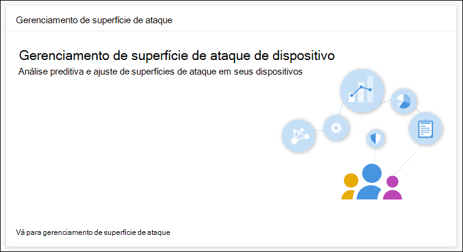
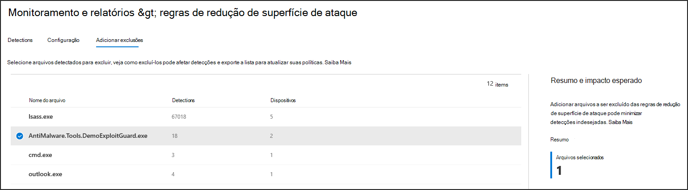

# Otimizar a implantação e as detecções de regras ASR

[!INCLUDE [Microsoft 365 Defender rebranding](../../includes/microsoft-defender.md)]

**Aplica-se a:**
- [Microsoft Defender para Ponto de Extremidade](https://go.microsoft.com/fwlink/p/?linkid=2154037)
- [Microsoft 365 Defender](https://go.microsoft.com/fwlink/?linkid=2118804)

> Deseja experimentar o Defender para Ponto de Extremidade? [Inscreva-se para uma avaliação gratuita](https://www.microsoft.com/en-us/WindowsForBusiness/windows-atp?ocid=docs-wdatp-onboardconfigure-abovefoldlink).

As regras de redução de superfície de ataque [(ASR)](./attack-surface-reduction.md) identificam e impedem explorações típicas de malware. Eles controlam quando e como um código potencialmente mal-intencionado pode ser executado. Por exemplo, eles podem impedir que JavaScript ou VBScript iniciar um executável baixado, bloquear chamadas de API Win32 de macros do Office e bloquear processos executados a partir de unidades USB.

 
*Cartão de gerenciamento de superfície de ataque*

O *cartão de gerenciamento de* superfície de ataque é um ponto de entrada para ferramentas no Centro de segurança do Microsoft 365 que você pode usar para:

* Entenda como as regras ASR são implantadas atualmente em sua organização.
* Revise as detecções asR e identifique possíveis detecções incorretas.
* Analise o impacto das exclusões e gere a lista de caminhos de arquivo a ser excluído.

Selecione **Ir para atacar o gerenciamento** de superfície Monitoramento & relatórios > regras de redução de superfície de ataque > Adicionar  >  **exclusões**. A partir daí, você pode navegar até outras seções do Centro de segurança do Microsoft 365.

 
A guia Adicionar exclusões na página Regras de redução de superfície de ataque no Centro de *segurança do Microsoft 365*

> [!NOTE]
> Para acessar o Centro de segurança do Microsoft 365, você precisa de uma licença do Microsoft 365 E3 ou E5 e uma conta que tenha determinadas funções no Azure Active Directory. [Leia sobre licenças e permissões necessárias.](https://docs.microsoft.com/office365/securitycompliance/microsoft-security-and-compliance#required-licenses-and-permissions)

Para obter mais informações sobre a implantação de regras ASR no Centro de segurança do Microsoft 365, consulte [Monitor and manage ASR rule deployment and detections](https://docs.microsoft.com/office365/securitycompliance/monitor-devices#monitor-and-manage-asr-rule-deployment-and-detections).

**Tópicos relacionados**

* [Verifique se seus dispositivos estão configurados corretamente](configure-machines.md)
* [Obter dispositivos conectados ao Microsoft Defender para Ponto de Extremidade](configure-machines-onboarding.md)
* [Monitorar a conformidade com a linha de base de segurança do Microsoft Defender for Endpoint](configure-machines-security-baseline.md)
